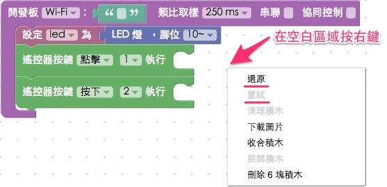
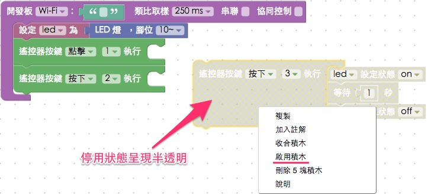
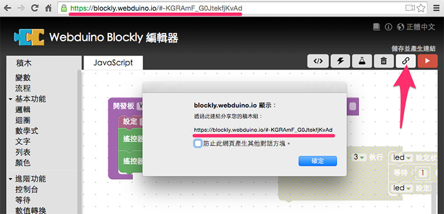
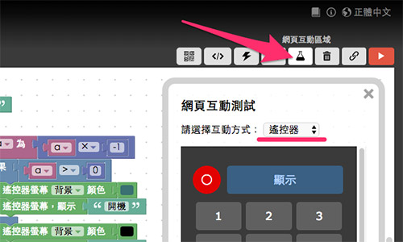

<!-- @@master  = ../../_layout.html-->

<!-- @@block  =  meta-->

<title>Webduino Blockly 的十個操作密技 :::: Webduino = Web × Arduino</title>

<meta name="description" content="自從 Webduino Blockly 推出以來，受到許多使用者的喜愛，不少熱情的使用者提供了相當實用的改善建議，這篇集合了十個 Webduino Blockly 密技，幫助大家在操作上可以更加得心應手！">

<meta itemprop="description" content="自從 Webduino Blockly 推出以來，受到許多使用者的喜愛，不少熱情的使用者提供了相當實用的改善建議，這篇集合了十個 Webduino Blockly 密技，幫助大家在操作上可以更加得心應手！">

<meta property="og:description" content="自從 Webduino Blockly 推出以來，受到許多使用者的喜愛，不少熱情的使用者提供了相當實用的改善建議，這篇集合了十個 Webduino Blockly 密技，幫助大家在操作上可以更加得心應手！">

<meta property="og:title" content="Webduino Blockly 的十個操作密技" >

<meta property="og:url" content="https://webduino.io/tutorials/info-11-feature.html">

<meta property="og:image" content="https://webduino.io/img/tutorials/info-11-01s.jpg">

<meta itemprop="image" content="https://webduino.io/img/tutorials/info-11-01s.jpg">

<include src="../_include-tutorials.html"></include>

<!-- @@close-->

<!-- @@block  =  preAndNext-->

<include src="../_include-tutorials-content.html"></include>

<!-- @@close-->

<!-- @@block  =  tutorials-->
# Webduino Blockly 的十個操作密技

自從 Webduino Blockly 推出以來，受到許多使用者的喜愛，加上不少的熱情使用者，提供了我們很多寶貴又實用的改善建議，因此，這篇集合了十個 Webduino Blockly 密技，除了展示一些過去所沒有的功能，更提供了一些大家所不知道但又超好用的技巧，幫助大家在操作上可以更加得心應手！

## 1. 熱鍵 ( 還原、重試、剪下、複製、貼上 )

在過去我們都有遇過一些情形：「積木刪除了無法還原」「想要快速的複製與貼上積木」...等，現在我們除了可以**按下滑鼠右鍵**來選擇還原、重試與複製，也可以使用鍵盤的快速鍵：**ctrl + z**、**ctrl + shift + z**、**ctrl + x**、**ctrl + c** 與 **ctrl + v** ( Mac 作業系統改為 command )，快速實現這些常用的功能。

## 2. 暫時停用

在開發的當下，編輯畫面中可能會充斥許多不同功能的積木，有時候為了測試，非得忍痛把一些積木刪除，但其實我們可以選擇另外一種做法：「停用」，在暫時不想作用的積木，按下滑鼠右鍵，就可以看到「**停用積木**」的選單，點選下去後積木就會變成半透明的停用狀態，如此一來在執行的時候就不會發生作用，開發當下也不用把積木刪除，要啟用的話也只要按右鍵，選擇「啟用積木」就可以。

## 3. 存檔與分享

如果要將目前開發的檔案儲存，可以點選右上角的「鎖鏈」( 連結 ) 符號，點選後會為我們**產生一組網址代碼**，將這個網址儲存下來，下次再打開就會是當前的開發畫面，我們甚至也可以將這個網址連結分享給別人。

## 4. 將積木下載為圖片

在編輯畫面按下滑鼠右鍵，可以看到「下載圖片」的選項，點選後就會將畫面裡的積木組成，**下載為 png 圖片**，方便用於各種印刷品或教學使用。

## 5. 快速複製程式碼

Webduino Blockly 最大的特色，就是**可以產生標準的 JavaScript**，點選 JavaScript 頁籤，將滑鼠移到上方「複製」的圖示，點選後就會將下面產生的程式碼全部複製起來，就可以貼到自己任何一個網頁裡頭去使用。

## 6. 網頁互動功能

點選 Webduino Blockly 右上方的「燒瓶」圖示，可以開啟「**網頁互動測試**」的內崁視窗，這個視窗裡面包含了幾組預設網頁，每一組預設的網頁操控功能，都對應到左側的「網頁互動」積木，裏頭甚至有一個設計完整「遙控器」，可以利用它來做出各種不同的應用。

## 7. 快速查看裝置狀態

點選在右上角「閃電」的圖示，會出現一個輸入欄位，在裡頭填入裝置的 device 名稱，當閃電變成綠色，就表示裝置是上線的狀態，當閃電變成紅色，就表示裝置斷線了。

## 8. 網頁程式編輯器

當我們用積木完成一系列程式後，可以點選右上角程式編輯的圖案，就可以打開網頁程式編輯器，在程式編輯器裡可以進行完整的程式碼編輯，對於進階的使用者相當的便利。

## 9. 完美支援行動裝置

打開網頁程式編輯器之後，可以透過左上角 share 的功能，選擇「output」，掃描 qrcode，就可以將自己設計的畫面與程式，在行動裝置上完整運行與操作。( 如果看不到 share，可按下 ctrl + s，就會出現 share 按鈕，如果最上方出現警告的紅色提示，關閉編輯器再度打開就可以 )

## 10.完美支援 NodeJS

在 Webduino Blockly 產生的程式碼，不僅可以跑在網頁前端或行動裝置上，更可以運行在 NodeJS 的環境，只要先引入對應的 Package，就可以讓 Webduino 在後端背景環境執行。

以上就是 Webduino blockly 的十個秘技，相信只要有了這些技巧與功能的輔助，人人都可以是物聯網的開發高手喔！

<!-- @@close-->