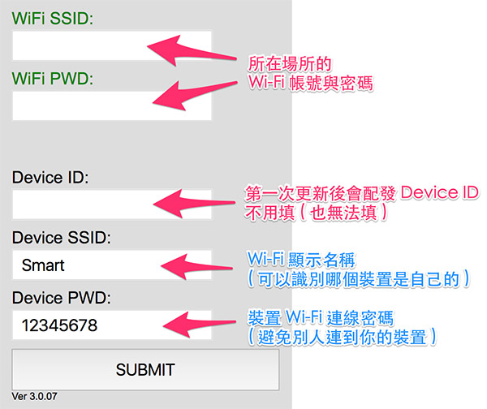
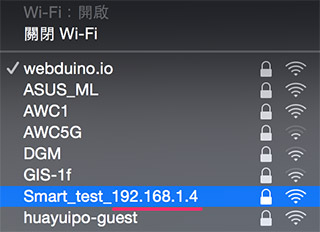
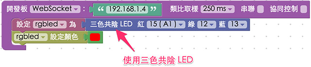
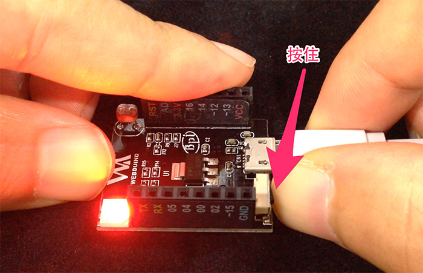

<!-- @@master  = ../../_layout.html-->

<!-- @@block  =  meta-->

<title>Webduino Smart 初始化設定 :::: Webduino = Web × Arduino</title>

<meta name="description" content="使用 Webduino Smart 之前，最重要的就是進行初始化設定，初始化設定的目的在於讓 Webduino 開發板可以自動上網 ( Internet )，或是在區域網路透過 WebScoket 連線，有了初始化設定，我們也能夠自訂開發板的顯示名稱和密碼，更可以連上 internet 進行遠端更新。">

<meta itemprop="description" content="使用 Webduino Smart 之前，最重要的就是進行初始化設定，初始化設定的目的在於讓 Webduino 開發板可以自動上網 ( Internet )，或是在區域網路透過 WebScoket 連線，有了初始化設定，我們也能夠自訂開發板的顯示名稱和密碼，更可以連上 internet 進行遠端更新。">

<meta property="og:description" content="使用 Webduino Smart 之前，最重要的就是進行初始化設定，初始化設定的目的在於讓 Webduino 開發板可以自動上網 ( Internet )，或是在區域網路透過 WebScoket 連線，有了初始化設定，我們也能夠自訂開發板的顯示名稱和密碼，更可以連上 internet 進行遠端更新。">

<meta property="og:title" content="Webduino Smart 初始化設定" >

<meta property="og:url" content="https://webduino.io/tutorials/smart-02-setup.html">

<meta property="og:image" content="https://webduino.io/img/tutorials/smart-02-setup-s.jpg">

<meta itemprop="image" content="https://webduino.io/img/tutorials/smart-02-setup-s.jpg">

<include src="../_include-tutorials.html"></include>

<!-- @@close-->

<!-- @@block  =  preAndNext-->

<include src="../_include-tutorials-content.html"></include>

<!-- @@close-->

<!-- @@block  =  tutorials-->
# Webduino Smart 初始化設定

使用 Webduino Smart 之前，最重要的就是進行初始化設定，初始化設定的目的在於讓 Webduino 開發板可以自動上網 ( Internet )，或是在區域網路透過 WebScoket 連線，有了初始化設定，我們也能夠自訂開發板的顯示名稱和密碼，更可以連上 internet 進行遠端更新。

## 步驟一、接上電源，輸入 Wi-Fi 帳號密碼連線

和馬克一號與 Fly 同樣的第一步驟，就是設定 Wi-Fi 的帳號密碼，不過不同的是，設定完帳號密碼後，我們就可以讓 Smart 純粹透過 WebSocket 走區域網路連線，不需要連到外部的網路環境也能運作，如果想要連線到外部網路環境 ( Internet )，也因為設定了 Wi-Fi 帳密，就可以順利連接到網際網路了。

第一步就是接上電源，這時候在具備 Wi-Fi 功能的電腦、筆電或行動裝置的 Wi-Fi 搜尋裡，就可以看到有個名為「Smart」的裝置。( 此時開發板會閃紅燈，接著紅燈亮著不閃，這是正常的狀況，因為開發板尚未連線至區域網路 )

點選後輸入預設**密碼 12345678**，進行連線。 

 

## 步驟二、設定 Wi-Fi 帳號密碼與顯示名稱

連線後打開瀏覽器 ( 建議使用 Chrome )，**網址列輸入 192.168.4.1**，就可以連線到 Smart 開發板的設定畫面，上面除了「一定要」設定的**所在場所的 Wi-Fi SSID 與 PWD**，接著也可以設定裝置在 Wi-Fi 搜尋中所顯示的名稱。

設定完成後就可以按下 SUBMIT 儲存，出現 SAVE OK 的字樣表示儲存成功。

 

## 步驟三、獲得區域網路 IP

設定儲存完成後，移除開發板電源，重新接上開發板電源，這時開發板會開始閃紅燈，和區域網路連線後就會亮起綠燈，一秒後綠燈會消失 ( 若紅燈持續閃爍或亮紅燈，請返回步驟一重新設定 )，此時我們可以在電腦或行動裝置的 Wi-Fi 搜尋裡，看到「**Smart_我們自訂的名稱_192.168.XXX.XXX**」，記下後面這個 IP 數字，透過這個 IP 我們就可以用 WebSocket 來連線控制了。

 

## 步驟四、打開 Webduino Blockly 進行測試

打開 Webudino Blockly ( [http://webduino.io](http://webduino.io)，因為我們使用 WebSocket 連線，**網址開頭必須為 http 不能是 https**，要特別注意！)，放入開發板的積木，下拉選單選擇 WebSocket，然後填入剛剛的 IP。

接著放入三色 LED 燈的積木 ( 使用**三色共陰** )，紅色設定 15，綠色 12，藍色 13，然後設定三色 LED 燈的顏色為紅色。

點選執行，就可以看到 Smart 開發板上頭的三色燈發出紅色光了。( 解答：[https://goo.gl/ELBEzW](https://goo.gl/ELBEzW) )

 

## 步驟五、連線 Internet 更新韌體

Webduino Smart 有個很方便的特色功能，當我們透過步驟一到步驟三初始化設定成功後，就可以連上 Internet 進行遠端更新，方便大家獲取最新的韌體功能，更新的方式很簡單，在步驟三接上電源後，**按住 Micro USB 旁的微型按鈕開關 ( 按住不放 )**。

按住**直到三色燈亮起藍色 ( 表示開始下載更新 )，這時就可以放開手讓開發板更新**，更新完成後藍色燈會熄滅，接著閃紅色燈進行連線，綠色燈亮起一了後熄滅，表示我們可以重新開始控制開發板。

<!-- @@close-->