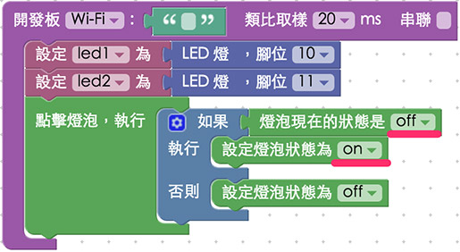
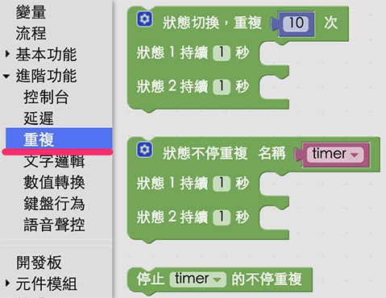

<!-- @@master  = ../../_layout.html-->

<!-- @@block  =  meta-->

<title>教學範例 2：兩顆 LED 交互閃爍 :::: Webduino = Web × Arduino</title>

<meta name="description" content="熟悉了第一個 webduino 的範例之後，接下來就要做點延伸的應用，在這個範例裡頭，將會利用點選燈泡圖片，操控兩顆 LED 燈，做出兩顆 LED 燈交互閃動的效果。">

<meta itemprop="description" content="熟悉了第一個 webduino 的範例之後，接下來就要做點延伸的應用，在這個範例裡頭，將會利用點選燈泡圖片，操控兩顆 LED 燈，做出兩顆 LED 燈交互閃動的效果。">

<meta property="og:description" content="熟悉了第一個 webduino 的範例之後，接下來就要做點延伸的應用，在這個範例裡頭，將會利用點選燈泡圖片，操控兩顆 LED 燈，做出兩顆 LED 燈交互閃動的效果。">

<meta property="og:title" content="教學範例 2：兩顆 LED 交互閃爍" >

<meta property="og:url" content="https://webduino.io/tutorials/tutorial-02-2led.html">

<meta property="og:image" content="https://webduino.io/img/tutorials/tutorial-02-01s.jpg">

<meta itemprop="image" content="https://webduino.io/img/tutorials/tutorial-02-01s.jpg">

<include src="../_include-tutorials.html"></include>

<!-- @@close-->

<!-- @@block  =  preAndNext-->

<include src="../_include-tutorials-content.html"></include>

<!-- @@close-->

<!-- @@block  =  tutorials-->
# 教學範例 2：兩顆 LED 交互閃爍

熟悉了 [第一個範例](tutorial-01-led.html) 之後，接下來就要做點延伸的應用，在這個範例裡頭，將會利用點選燈泡圖片，操控兩顆 LED 燈，做出兩顆 LED 燈交互閃動的效果。

## 教學影片

影片對應範例：[https://blockly.webduino.io/?&page=tutorials/led-4](https://blockly.webduino.io/?&page=tutorials/led-4)  

<iframe class="youtube" src="https://www.youtube.com/embed/X3s_WoOVyxk" frameborder="0" allowfullscreen></iframe>

## 接線與實作

因為我們這次有使用到兩顆 LED 燈，所以必須要使用麵包板來進行，將一顆 LED 燈長腳接在 11，另外一顆 LED 燈長腳接在 10，兩顆 LED 燈共用一個 GND ( 地線 )。

接線示意圖：

實際接線照片：

## Webduino Blockly 操作解析

打開 Webduino Blockly 編輯工具 ( [https://blockly.webduino.io](https://blockly.webduino.io) )，因為這個範例也會點選網頁「燈泡圖案」來控制，所以要先點選右上方「網頁互動測試」的按鈕，打開內嵌測試的網頁，用下拉選單選擇「點擊燈泡」，就會出現讓我們可以點選燈泡的網頁。

在編輯畫面放入開發板，填入對應的 Webduino 開發板名稱，在開發板內放入兩個 LED，分別設定 10 與 11 腳位，也分別設定名稱為 led1 和 led2，完成後接著擺上「點擊燈泡就執行」的積木。

和 [第一個範例](tutorial-01-led.html) 的作法類似，點下燈泡圖片之後，就要進行邏輯的判斷，所以這裡我們就先把邏輯積木放進去，並且判斷「如果燈泡是 off」，就把燈泡 on，反之就把燈泡 off 起來。

再來先看到打開燈泡時要做什麼事情，這裏將用到「進階功能」裡的「重複」積木，重複的積木除了可以指定重複次數，更可以設定一個變數來做「不斷重複」，同時可以停止這個變數的不斷重複。

把不斷重複的積木放進畫面中，計時器的名稱就用預設的 timer，在第一個狀態內放入 led1 on 和 led2 off 的積木，第二個狀態內放入 led1 off 和 led2 on 的積木，時間都設定為 0.5 秒，如此一來當燈泡圖片亮起，兩顆 LED 燈就會交互閃爍。( 如果需要更多狀態，就可以點選藍色小齒輪新增，做法和邏輯的積木類似 )

既然有開始就一定會有停止，所以當燈泡圖片熄滅時，就把計時器 timer 停止，同時把 led1 和 led2 的狀態都設為 off。

完成後，確認開發板上線 ( 點選「[檢查連線狀態](https://webduino.io/device.html)」查詢 )，點選紅色的執行按鈕，就可以開始。

點擊內嵌網頁裡的燈泡圖片，就可以讓兩顆 LED 交互閃爍或是停止，然而我們也可以點選「JavaScript 頁籤」，就可以看到完整的程式碼邏輯，同時也可以複製這些代碼，貼到自己的網頁原始碼當中，就可以在自己的網頁裡實現一模一樣的行為囉！
( 解答：[https://blockly.webduino.io/#-K4q6FT6L5mx8WZ5NuJW](https://blockly.webduino.io/#-K4q6FT6L5mx8WZ5NuJW) )

## 程式碼解析 ( [看完整程式碼](http://bin.webduino.io/harol/edit?html,css,js,output)、[檢查連線狀態](https://webduino.io/device.html) )

HTML 的 header 引入 `webduino-all.min.js`，目的在讓瀏覽器可以支援 WebComponents 以及 Webduino 所有的元件，如果是用 Blockly 編輯工具產生的程式碼，則要額外引入 `webduino-blockly.js`。

	
	

接著看到 HTML 的 body 裡頭，放入一個 id 為 demo-area-02-light 的圖片區域，裡面含有兩張分別是亮起的燈泡與不亮的燈泡圖片，目的在於點選的時候，圖片也會從不亮的燈泡轉變為亮起的燈泡。

	

	  
	  
	

控制燈泡圖片亮暗的是使用 CSS 的方式，用圖片顯示的切換 `display:none;` 來達到相關效果，下面是 CSS 的程式碼。

	#demo-area-02-light img{
	  height:200px;
	  display:none;
	}
	#demo-area-02-light.on #demo-area-02-on{
	  display:inline-block;
	}
	#demo-area-02-light.off #demo-area-02-off{
	  display:inline-block;
	}

重點看到 javascript 的部分，因為有兩顆 LED 燈，所以分別用 led1 和 led2 兩個變數來表示，然後計時器的變數為 timer，燈泡是 light，比較特別的是這裡使用了 JS6 的 `Promise`來作為計時器使用，這可以幫助我們確認當該狀態確定完成後，才會繼續執行，此外裏頭又用了 `setTimeout` 這個延遲執行的方法，做成一個不斷循環重複的指令，而停止的時候，只需要用 `clearTimeout` 就可以停下來了。

	var led1;
	var led2;
	var timer;
	var light;

	boardReady('', function (board) {
	  board.samplingInterval = 20;
	  led1 = getLed(board, 10);
	  led2 = getLed(board, 11);
	  light = document.getElementById("demo-area-02-light");

	  light.addEventListener("click",function(){
	    if (light.className == "off") {
	      light.className = "on";
	      var repeat = function(){
	        var time;
	        var repeatDelay = function(time){
	          return new Promise(function(resolve){
	            timer = setTimeout(resolve,time);
	          });
	        };
	        var repeatPromise = function(){
	          repeatDelay(1).then(function(){
	              led1.on();
	        led2.off();
	            return repeatDelay(500);
	          }).then(function(){
	              led1.off();
	        led2.on();
	            return repeatDelay(500);
	          }).then(function(){
	              repeatPromise();
	          });
	        };
	        repeatPromise();
	      };
	      repeat();
	    } else {
	      light.className = "off";
	      clearTimeout(timer);
	      led1.off();
	      led2.off();
	    }
	  });
	});

以上就是點選圖片控制兩顆 LED 燈交互閃爍的範例。  
完整程式碼：[http://bin.webduino.io/harol/edit?html,css,js,output](http://bin.webduino.io/harol/edit?html,css,js,output)  
解答：[https://blockly.webduino.io/#-K4q6FT6L5mx8WZ5NuJW](https://blockly.webduino.io/#-K4q6FT6L5mx8WZ5NuJW)

## 兩顆 LED 的延伸教學：

[Webduino Blockly 課程 1-3：控制兩顆 LED 燈](https://blockly.webduino.io/?lang=zh-hant&page=tutorials/led-3#-JvMuD8cPViCJFD4VRSr)  
[Webduino Blockly 課程 1-4：兩顆 LED 燈交互閃爍](https://blockly.webduino.io/?lang=zh-hant&page=tutorials/led-4#-JvMuhwaEGs7oMUz-bpm)

<!-- @@close-->