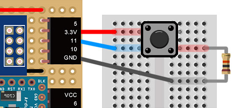
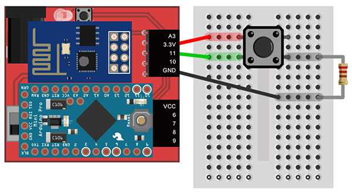
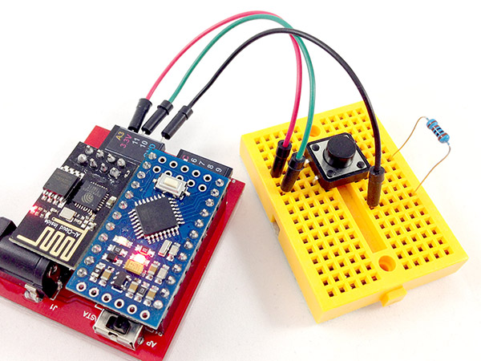
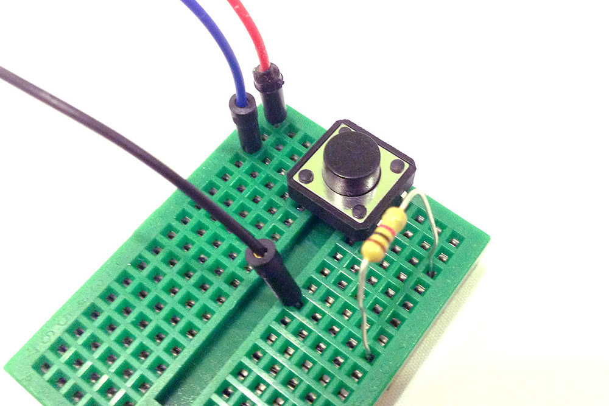
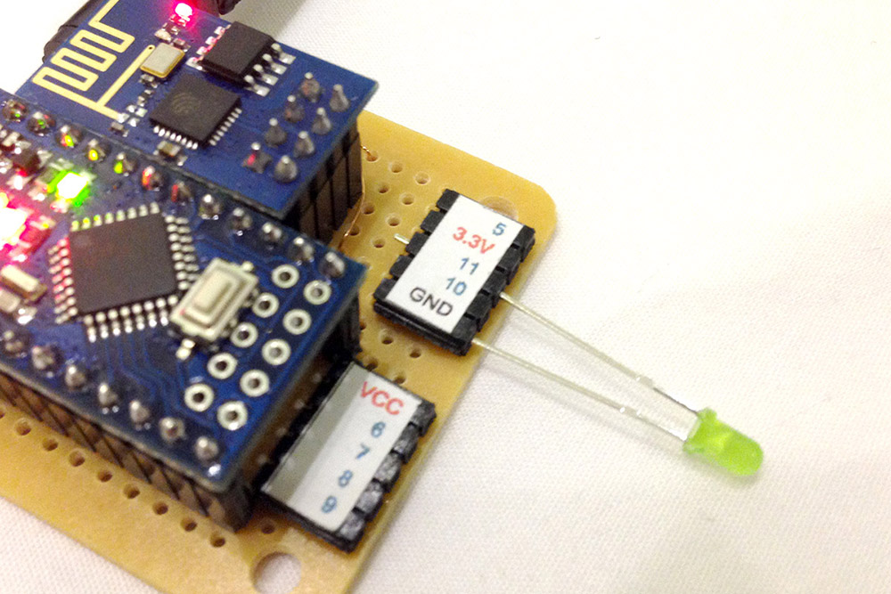
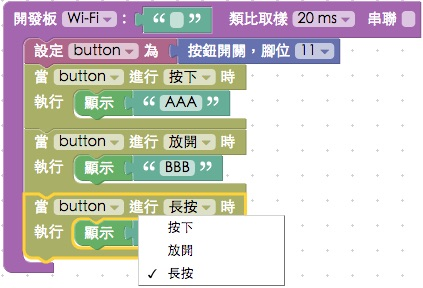

<!-- @@master  = ../../_layout.html-->

<!-- @@block  =  meta-->

<title>教學範例 9：按鈕開關 :::: Webduino = Web × Arduino</title>

<meta name="description" content="開關是日常生活中很常見的電子零件，藉由開和關的訊號，可以控制各種不同的家電，這個範例將會展示，如何藉由獲得按鈕開關的訊號，並且進一步由訊號來控制網頁裡的圖片或 LED 燈的明暗。">

<meta itemprop="description" content="開關是日常生活中很常見的電子零件，藉由開和關的訊號，可以控制各種不同的家電，這個範例將會展示，如何藉由獲得按鈕開關的訊號，並且進一步由訊號來控制網頁裡的圖片或 LED 燈的明暗。">

<meta property="og:description" content="開關是日常生活中很常見的電子零件，藉由開和關的訊號，可以控制各種不同的家電，這個範例將會展示，如何藉由獲得按鈕開關的訊號，並且進一步由訊號來控制網頁裡的圖片或 LED 燈的明暗。">

<link rel="canonical" href="https://tutorials.webduino.io/zh-tw/docs/basic/component/button.html">

<meta property="og:title" content="教學範例 9：按鈕開關" >

<meta property="og:url" content="https://webduino.io/tutorials/tutorial-09-button-led.html">

<meta property="og:image" content="https://webduino.io/img/tutorials/tutorial-09-01s.jpg">

<meta itemprop="image" content="https://webduino.io/img/tutorials/tutorial-09-01s.jpg">

<include src="../_include-tutorials.html"></include>

<!-- @@close-->

<!-- @@block  =  preAndNext-->

<include src="../_include-tutorials-content.html"></include>

<!-- @@close-->

<!-- @@block  =  tutorials-->
# 教學範例 9：按鈕開關

開關是日常生活中很常見的電子零件，藉由開和關的訊號，可以控制各種不同的家電，這個範例將會展示，如何藉由獲得按鈕開關的訊號，並且進一步由訊號來控制網頁裡的圖片或 LED 燈的明暗。

	按鈕開關相關套件：<a href="https://webduino.io/buy/webduino-package-plus.html" target="_blank">Webduino 基本套件 Plus ( 支援馬克 1 號、Fly )</a>
	Webduino 開發板：<a href="https://webduino.io/buy/component-webduino-v1.html" target="_blank">Webduino 馬克一號</a>、<a href="https://webduino.io/buy/component-webduino-fly.html" target="_blank">Webduino Fly</a>、<a href="https://webduino.io/buy/component-webduino-uno-fly.html" target="_blank">Webduino Fly + Arduino UNO</a>

## 範例影片展示

影片對應範例：[https://blockly.webduino.io/?page=tutorials/button-1](https://blockly.webduino.io/?page=tutorials/button-1) 

<iframe class="youtube" src="https://www.youtube.com/embed/Y2I42DsAov8" frameborder="0" allowfullscreen></iframe>

## 接線與實作

按鈕開關是一個很常見的元件，當我們進行點壓的時候，按鈕上的四隻腳會呈現全部通路的情形，為了避免有短路的發生，所以我們要接一顆電阻進行保護，下圖是按鈕開關的原理圖。

按鈕開關的接法剛好利用麵包板中間斷路的設計，將四隻腳兩兩成對橫跨兩邊，如此一來按下開關就會四隻腳通路，然後在接 GND 的一側用電阻連接 ( 這種方式稱作下拉電阻，如果接在正電的一側稱之上拉電組 )

馬克一號接線示意圖：

Fly 接線示意圖：

實際接線照片：

	按鈕開關相關套件：<a href="https://webduino.io/buy/webduino-package-plus.html" target="_blank">Webduino 基本套件 Plus ( 支援馬克 1 號、Fly )</a>
	Webduino 開發板：<a href="https://webduino.io/buy/component-webduino-v1.html" target="_blank">Webduino 馬克一號</a>、<a href="https://webduino.io/buy/component-webduino-fly.html" target="_blank">Webduino Fly</a>、<a href="https://webduino.io/buy/component-webduino-uno-fly.html" target="_blank">Webduino Fly + Arduino UNO</a>

## Webduino Blockly 操作解析

打開 Webduino Blockly 編輯工具 ( [https://blockly.webduino.io](https://blockly.webduino.io) )，因為這個範例會用網頁「顯示文字」來根據開關的狀態，顯示不同的文字，所以要先點選右上方「網頁互動測試」的按鈕，打開內嵌測試的網頁，用下拉選單選擇「顯示文字」。

把開發板放到編輯畫面裡，填入對應的 Webduino 開發板名稱，開發板內放入按鈕積木，名稱設定為 button，腳位設定為 11，接著放入三個按鈕的動作，分別是按下、放開和長按，並且讓不同的動作會顯示不同的文字。

完成後，確認開發板上線 ( 點選「[檢查連線狀態](https://webduino.io/device.html)」查詢 )，點選紅色的執行按鈕就可以按按看按鈕開關，就會看到顯示文字顯示出對應的文字了。
( 解答：[https://blockly.webduino.io/#-K7EhniKOnrgyWt18E4t](https://blockly.webduino.io/#-K7EhniKOnrgyWt18E4t) )

## 程式碼解析 ( [完整程式碼](http://bin.webduino.io/vaku/edit?html,css,js,output)、[檢查連線狀態](https://webduino.io/device.html) )

HTML 的 header 引入 `webduino-all.min.js`，目的在讓瀏覽器可以支援 WebComponents 以及 Webduino 所有的元件，如果是用 Blockly 編輯工具產生的程式碼，則要額外引入 `webduino-blockly.js`。

	
	

HTML 裡頭有一個 span，負責顯示文字。

	123

JavaScript 可以看到 button 具有一個 on 的事件，裡面第一個參數就是按鈕開關的動作，pressed 是按下，released 是放開，longPress 則是長按，第二個參數是回呼函式，把要做什麼事情寫在這邊就可以。

	var button;

	boardReady('', function (board) {
	  board.samplingInterval = 20;
	  button = getButton(board, 11);
	  button.on("pressed",function(){
	    console.log("pressed");
	      window.alert('AAA');
	  });
	  button.on("released",function(){
	    console.log("released");
	      window.alert('BBB');
	  });
	  button.on("longPress",function(){
	    console.log("longPress");
	      window.alert('CCC');
	  });
	});

以上就是利用按鈕開關的按下、放開與長按，來改變網頁裡面的顯示文字。  
完整程式碼：[http://bin.webduino.io/vaku/edit?html,css,js,output](http://bin.webduino.io/vaku/edit?html,css,js,output)  
解答：[https://blockly.webduino.io/#-K7EhniKOnrgyWt18E4t](https://blockly.webduino.io/#-K7EhniKOnrgyWt18E4t)

## 按鈕開關的延伸教學：

[Webduino Blockly 課程 4-2：點擊按鈕開關增加數字](https://blockly.webduino.io/?lang=zh-hant&page=tutorials/button-2#-JvWu7mS_OoeRvE-m6mD)  
[Webduino Blockly 課程 4-3：點擊按鈕開關改變圖片位置](https://blockly.webduino.io/?lang=zh-hant&page=tutorials/button-3#-JvWuaeLK-rrGi66lVIM)  
[Webduino Blockly 課程 4-4：點擊按鈕開關玩賽跑小遊戲](https://blockly.webduino.io/?lang=zh-hant&page=tutorials/button-4#-JvY90I0qUoJR2yi34lj)  
[Webduino Blockly 課程 4-4：點擊按鈕開關玩賽跑小遊戲](https://blockly.webduino.io/?lang=zh-hant&page=tutorials/button-4#-JvY90I0qUoJR2yi34lj) 
[Webduino Blockly 課程 4-5：點擊按鈕開關控制 Youtube](https://blockly.webduino.io/?lang=zh-hant&page=tutorials/button-5#-JxJpqetsCxULbi4Iier) 

	按鈕開關相關套件：<a href="https://webduino.io/buy/webduino-package-plus.html" target="_blank">Webduino 基本套件 Plus ( 支援馬克 1 號、Fly )</a>
	Webduino 開發板：<a href="https://webduino.io/buy/component-webduino-v1.html" target="_blank">Webduino 馬克一號</a>、<a href="https://webduino.io/buy/component-webduino-fly.html" target="_blank">Webduino Fly</a>、<a href="https://webduino.io/buy/component-webduino-uno-fly.html" target="_blank">Webduino Fly + Arduino UNO</a>

<!-- @@close-->