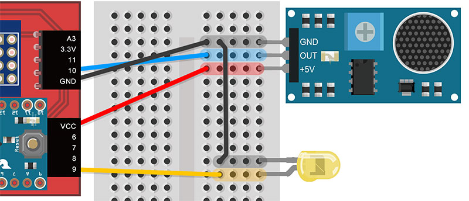
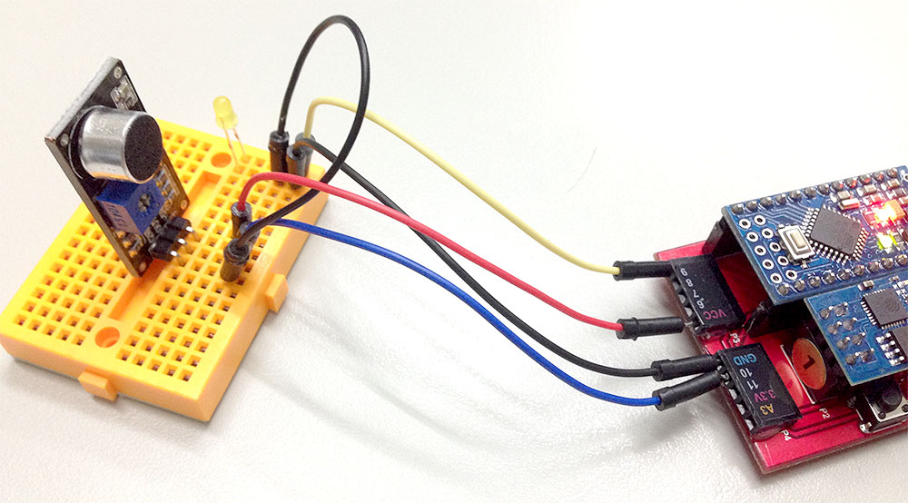

<!-- @@master  = ../../_layout.html-->

<!-- @@block  =  meta-->

<title>範例教學 12：聲音偵測點亮 LED 與網頁燈泡 :::: Webduino = Web × Arduino</title>

<meta name="description" content="聲音偵測傳感器類似一個微型的麥克風，不過它的功能並不如麥克風一般的強大，主要作用為偵測是否有聲音，在聲音偵測傳感器上頭有一個小型的十字旋鈕，可以用螺絲起子旋轉調整零敏度，靈敏度如果太高，可能連同一些風吹草動的聲音都會偵測到，靈敏度過低可能拍手拍得再大聲都偵測不到。">

<meta itemprop="description" content="聲音偵測傳感器類似一個微型的麥克風，不過它的功能並不如麥克風一般的強大，主要作用為偵測是否有聲音，在聲音偵測傳感器上頭有一個小型的十字旋鈕，可以用螺絲起子旋轉調整零敏度，靈敏度如果太高，可能連同一些風吹草動的聲音都會偵測到，靈敏度過低可能拍手拍得再大聲都偵測不到。">

<meta property="og:description" content="聲音偵測傳感器類似一個微型的麥克風，不過它的功能並不如麥克風一般的強大，主要作用為偵測是否有聲音，在聲音偵測傳感器上頭有一個小型的十字旋鈕，可以用螺絲起子旋轉調整零敏度，靈敏度如果太高，可能連同一些風吹草動的聲音都會偵測到，靈敏度過低可能拍手拍得再大聲都偵測不到。">

<meta property="og:title" content="範例教學 12：聲音偵測點亮 LED 與網頁燈泡" >

<meta property="og:url" content="http://webduino.io/tutorials/tutorial-12-sound-sensor.html">

<meta property="og:image" content="http://webduino.io/img/tutorials/tutorial-12-01s.jpg">

<meta itemprop="image" content="http://webduino.io/img/tutorials/tutorial-12-01s.jpg">

<include src="../_include-tutorials.html"></include>

<!-- @@close-->

<!-- @@block  =  tutorials-->

#範例教學 12：聲音偵測點亮 LED 與網頁燈泡

聲音偵測傳感器類似一個微型的麥克風，不過它的功能並不如麥克風一般的強大，主要作用為偵測是否有聲音，在聲音偵測傳感器上頭有一個小型的十字旋鈕，可以用螺絲起子旋轉調整零敏度，靈敏度如果太高，可能連同一些風吹草動的聲音都會偵測到，靈敏度過低可能拍手拍得再大聲都偵測不到，而且由於聲音傳感器本身有傳輸的時間差，因此在接收到聲音後也會有些微的延遲現象。

 

這個範例將會利用聲音偵測傳感器，當偵測到有聲音，就自動點亮 LED 燈，同時也會點亮網頁裡頭的燈泡。

##範例影片展示

<iframe class="youtube" src="https://www.youtube.com/embed/ljSZQkpIOh8" frameborder="0" allowfullscreen></iframe>

##接線與實作

- ###1. 聲音偵測傳感器與 LED 燈

	溫濕度傳感器適用的開發板為「[Webduino 開發板馬克 1 號](../buy/component-webduino-v1.html)」，如果是使用[基礎教育版的 Webduino 開發板](../buy/component-webduino-o.html)可能會無法使用。

	 

	首先把聲音偵測傳感器和 LED 燈接在麵包板上，聲音偵測傳感器的 +5V 接在開發板的 VCC，GND 接在 GND，Out 則接在 10 的腳位，然後再用電線將 GND 引出給 LED 的短腳使用，LED 的長腳接在 9 的腳位。

	

- ###2. 完成後的實際長相

	

	

##範例解析 ([快速體驗](http://webduinoio.github.io/samples/content/sound-led/index.html)、[jsbin 範例](http://jsbin.com/yohuho/11/edit?html,js,output)、[檢查連線狀態](http://webduino.io/device.html))

在 head 的位置引入相對應的 javascript 以及 WebComponents，這裏我們用到了兩個元件的 WebComponents，分別是 `wa-sound.html` 和 `wa-led.html`。

	
	<link rel='import' href='http://webduino.io/components/webduino/web-arduino.html' />
	<link rel='import' href='http://webduino.io/components/webduino/wa-sound.html' />
	<link rel='import' href='http://webduino.io/components/webduino/wa-led.html' />

接著就是在 body 裡頭放入必要的元素，除了 board 之外，多放上一個燈泡的區域，裡頭有兩張燈泡明暗的圖片，在聲音傳感器偵測到聲音觸發時，就會進行燈泡明暗的切換。

	

	  </img>
	  </img>
	

	<web-arduino id='board' device="你的 device 名稱">
	  <wa-sound id='sound' pin='10'></wa-sound>
	  <wa-led id='led' pin='9'></wa-led>
	</web-arduino>

燈泡的切換主要由下列的這段 CSS 來控制。

	#light img{
	  width:100%;
	  display:none;
	  max-width:300px;
	}
	#light.off img:first-child{
	  display:inline-block;
	}
	#light.on img:last-child{
	  display:inline-block;
	}

最後就是 javascript 的部分，這邊我們用到了兩個 sound 元件的 API：`detected` 和 `ended`，這兩個 API 其實觸發的時間點有時候是很接近的，因為 detected 表示偵測到有聲音，ended 表示聲音結束，除非是連續的聲音，如果只有發出一聲或兩聲，聲音間隔也會被當作 ended，所以這裏額外新增一個計時器，利用 setTimeout 來做延遲，才可以偵測拍手的聲音。

	window.addEventListener('WebComponentsReady', function () {
	  var board = document.getElementById('board');
	  
	  board.on('ready',function ready() {
	    var  sound = document.getElementById('sound'),
	      led = document.getElementById('led'),
	      light = document.getElementById('light'),
	      timer;
	      led.off();
	      light.className = 'off';
	    
	      sound.on('detected', function () {
	        clearTimeout(timer);
	        led.on();
	        light.className = 'on';
	      });
	      
	      sound.on('ended', function () {
	        timer = setTimeout(function(){
	          led.off();
	          light.className = 'off';
	        },1000);
	      });  
	    
	  });
	   
	}, false);

如果還有不清楚的，不妨利用這個 [快速體驗](http://webduinoio.github.io/samples/content/sound-led/index.html)，輸入 device 號碼，拍拍手，看看燈泡與 LED 會不會一起發亮。

<!-- @@close-->