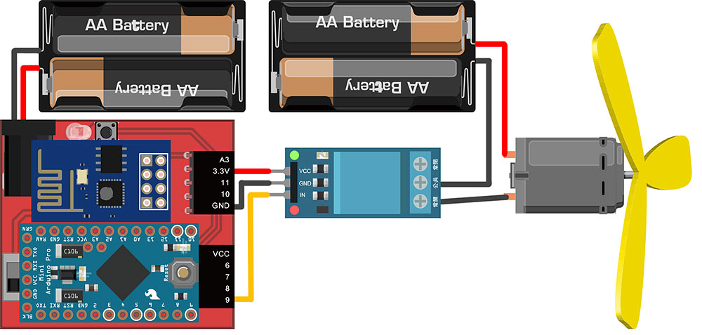
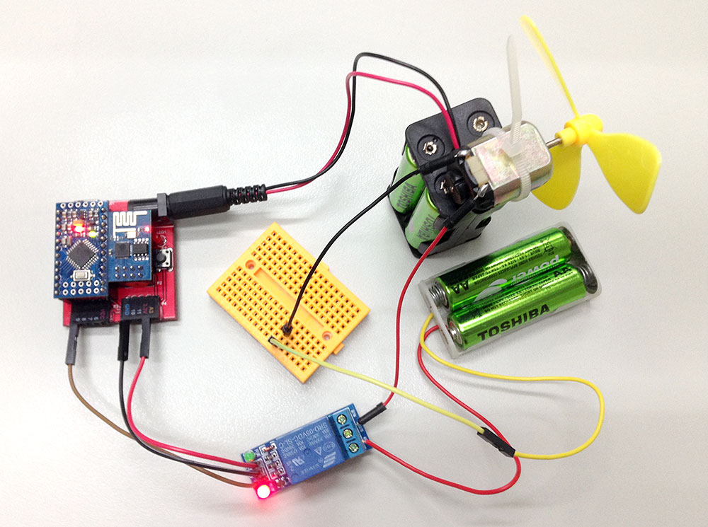
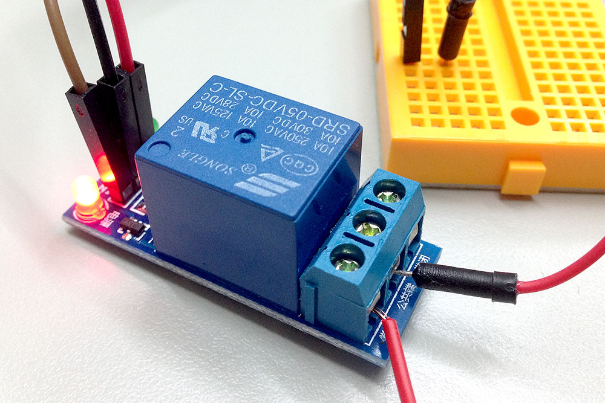
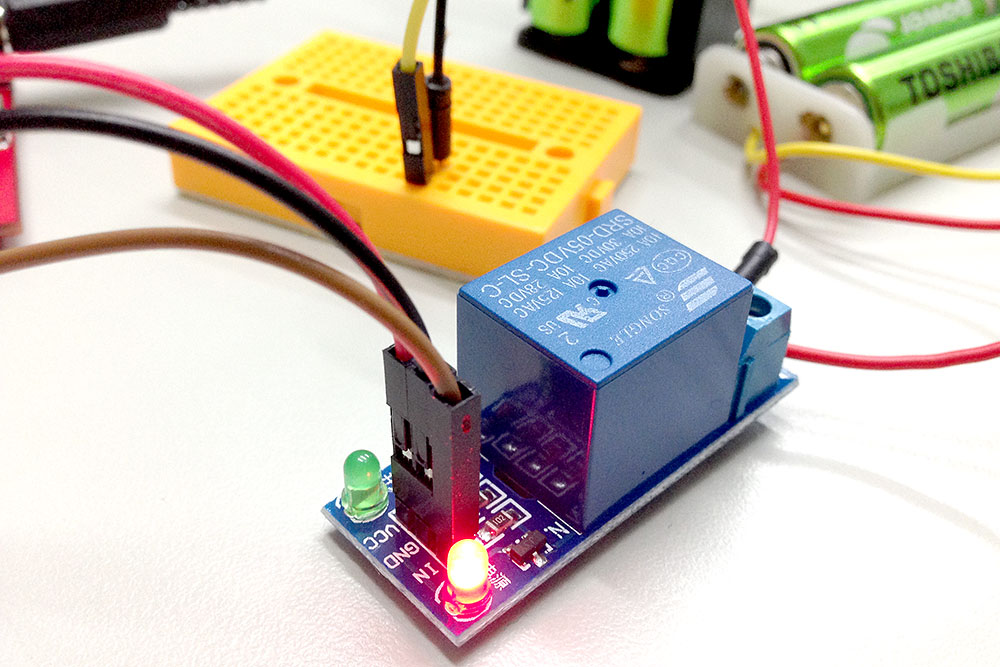
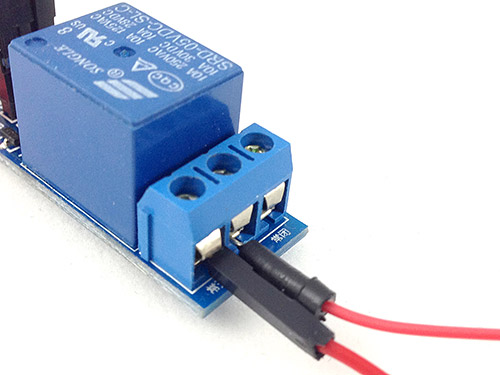
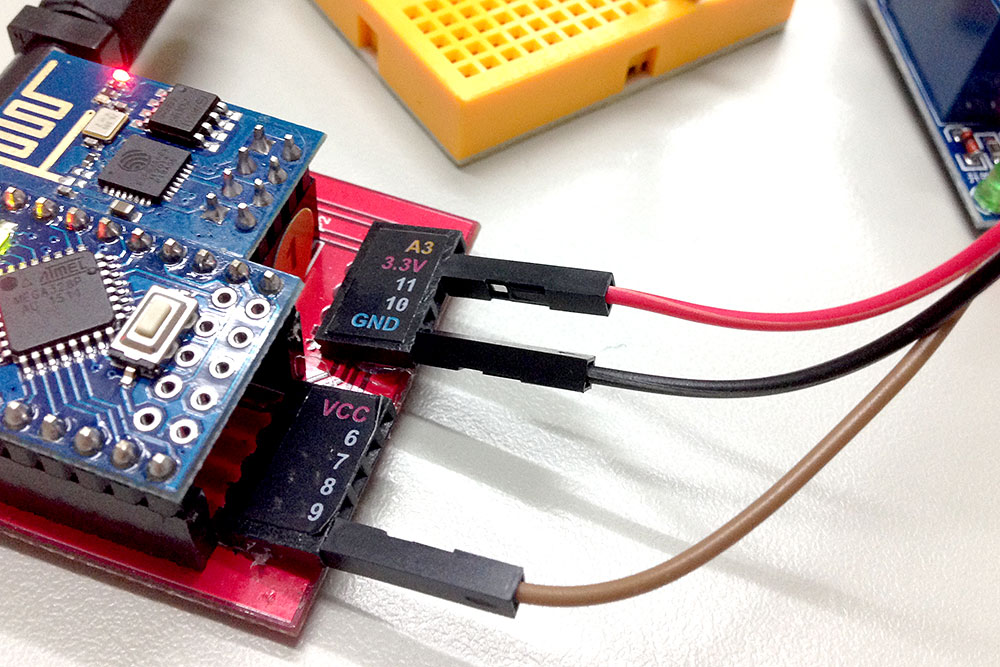
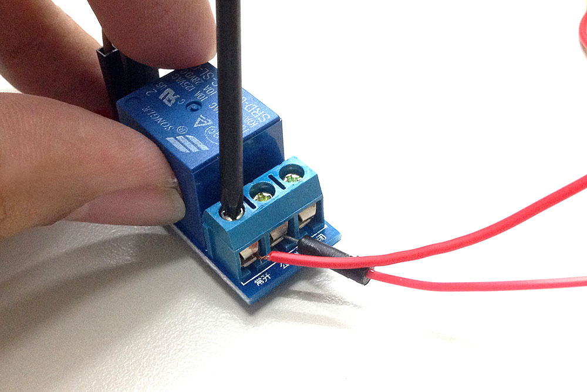
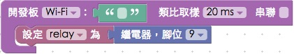
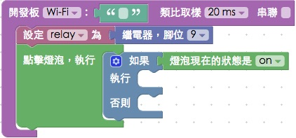

<!-- @@master  = ../../_layout.html-->

<!-- @@block  =  meta-->

<title>教學範例 14：繼電器控制風扇旋轉 :::: Webduino = Web × Arduino</title>

<meta name="description" content="繼電器是一種電子控制器件，它具有控制系統和被控制系統，通常應用於自動控制電路中，是用較小的電流去控制較大電流的一種「自動開關」，在電路中起著自動調節、安全保護、轉換電路等作用，當我們開始用 Webduino 控制繼電器，就可以非常簡單的做出利用網頁控制的智慧插座或自動開關。">

<meta itemprop="description" content="繼電器是一種電子控制器件，它具有控制系統和被控制系統，通常應用於自動控制電路中，是用較小的電流去控制較大電流的一種「自動開關」，在電路中起著自動調節、安全保護、轉換電路等作用，當我們開始用 Webduino 控制繼電器，就可以非常簡單的做出利用網頁控制的智慧插座或自動開關。">

<meta property="og:description" content="繼電器是一種電子控制器件，它具有控制系統和被控制系統，通常應用於自動控制電路中，是用較小的電流去控制較大電流的一種「自動開關」，在電路中起著自動調節、安全保護、轉換電路等作用，當我們開始用 Webduino 控制繼電器，就可以非常簡單的做出利用網頁控制的智慧插座或自動開關。">

<meta property="og:title" content="教學範例 14：繼電器控制風扇旋轉" >

<meta property="og:url" content="https://webduino.io/tutorials/tutorial-14-relay.html">

<meta property="og:image" content="https://webduino.io/img/tutorials/tutorial-14-01s.jpg">

<meta itemprop="image" content="https://webduino.io/img/tutorials/tutorial-14-01s.jpg">

<include src="../_include-tutorials.html"></include>

<!-- @@close-->

<!-- @@block  =  tutorials-->

# 教學範例 14：繼電器控制風扇旋轉

繼電器是一種電子控制器件，它具有控制系統和被控制系統，通常應用於自動控制電路中，是用較小的電流去控制較大電流的一種「自動開關」，在電路中起著自動調節、安全保護、轉換電路等作用，當我們開始用 Webduino 控制繼電器，就可以非常簡單的做出利用網頁控制的智慧插座或自動開關。

## 範例影片展示

<iframe class="youtube" src="https://www.youtube.com/embed/Z3x_qW7fXzM" frameborder="0" allowfullscreen></iframe>

## 接線與實作

開始接線前，先認識一下繼電器，繼電器的內部構造有一個電磁鐵，在沒有訊號提供時，內部的簧片會在上方，這時候「常閉」與「公共端」是通路，「常開」和「公共端」是斷路，當電磁鐵透過訊號通電，就會將內部的簧片往下吸附，此時「常閉」與「公共端」變成斷路，「常開」和「公共端」變成通路，藉由這個方式，我們就可以很容易的控制電器用品的開和關。

因為是用小電流控制大電流，所以在這個範例會用到兩組電源，其中一組電源提供 Webduino 開發板使用，另外一組電源則是供應繼電器使用，在繼電器上頭有紅燈綠燈的一側，具有三個腳位，將 VCC 接在 Webduino 3.3V 的腳位，GND 接在 GND 的腳位，IN 接在 9 的位置，繼電器的另外一側需要用十字螺絲起子來接線 ( 因為這一側通常會接大電流的電器 )，將風扇的其中一條電線接在繼電器的「常開」，另外一條電線和電源接上，而電源的另外一條線則接在繼電器的「公共端」。

繼電器的大電流一端的接線，利用十字螺絲起子，將電線旋緊。

實際接線照片：

斷路時繼電器會亮紅色的燈，通路時會亮綠色的燈。

## Webduino Blockly 操作解析

打開 Webduino Blockly 編輯工具 ( [http://blockly.webduino.io](http://blockly.webduino.io) )，因為這個範例會用網頁「點擊燈泡」來作為繼電器的開關，所以要先點選右上方「網頁互動測試」的按鈕，打開內嵌測試的網頁，用下拉選單選擇「點擊燈泡」。

把開發板放到編輯畫面裡，填入對應的 Webduino 開發板名稱，開發板內放入繼電器積木，名稱設定為 relay，腳位設定為 9。

接著放入點擊燈泡的積木，裏頭放入邏輯積木，如果燈泡是亮，就執行某些動作，如果燈泡是滅，就執行另外的動作。

如果燈泡是亮，點擊時就會關閉繼電器和燈泡圖片，反之就是打開繼電器和燈泡圖片。

完成後，確認開發板上線 ( 點選「[檢查連線狀態](https://webduino.io/device.html)」查詢 )，點選紅色的執行按鈕，就可以用網頁上的燈泡作為繼電器的開關，控制風扇的運轉了。( 解答：[http://blockly.webduino.io/#-K7AhYxEGXf0cAfMTzqW](http://blockly.webduino.io/#-K7AhYxEGXf0cAfMTzqW) )

## 程式碼解析 ( [完整程式碼](http://bin.webduino.io/tecig/edit?html,css,js,output)、[檢查連線狀態](https://webduino.io/device.html) )

HTML 的 header 引入 `webduino-all.min.js`，目的在讓瀏覽器可以支援 WebComponents 以及 Webduino 所有的元件，如果是用 Blockly 編輯工具產生的程式碼，則要額外引入 `webduino-blockly.js`。

	
	

接著看到 HTML 的 body 裡頭，放入一個 id 為 demo-area-02-light 的圖片區域，裡面含有兩張分別是亮起的燈泡與不亮的燈泡圖片，目的在於點選的時候，圖片也會從不亮的燈泡轉變為亮起的燈泡。

	

	  
	  
	

控制燈泡圖片亮暗的是使用 CSS 的方式，用圖片顯示的切換 display:none; 來達到相關效果，下面是 CSS 的程式碼。

	#demo-area-02-light img{
	  height:200px;
	  display:none;
	}
	#demo-area-02-light.on #demo-area-02-on{
	  display:inline-block;
	}
	#demo-area-02-light.off #demo-area-02-off{
	  display:inline-block;
	}

從 JavaScript 可以看到，其實繼電器和 LED 燈非常類似，只是用 on 和 off 作為開和關使用，控制燈泡圖片就也只是用了 `className` 的切換而已。

	var relay;

	boardReady('', function (board) {
	  board.samplingInterval = 20;
	  relay = getRelay(board, 9);
	  document.getElementById("demo-area-02-light").addEventListener("click",function(){
	    if (document.getElementById("demo-area-02-light").className == "on") {
	      document.getElementById("demo-area-02-light").className = "off";
	      relay.off();
	    } else {
	      document.getElementById("demo-area-02-light").className = "on";
	      relay.on();
	    }
	  });
	});

以上就是利用網頁的燈泡圖片，來控制繼電器的開關，進一步控制電器。  
完整程式碼：[http://bin.webduino.io/tecig/edit?html,css,js,output](http://bin.webduino.io/tecig/edit?html,css,js,output)  
解答：[http://blockly.webduino.io/#-K7AhYxEGXf0cAfMTzqW](http://blockly.webduino.io/#-K7AhYxEGXf0cAfMTzqW)

## 繼電器的延伸教學：

[Webduino Blockly 課程 11-1：控制繼電器](http://blockly.webduino.io/?lang=zh-hant&page=tutorials/relay-1#-K-WQYB34rMa4f2GgSam)  

<!-- @@close-->