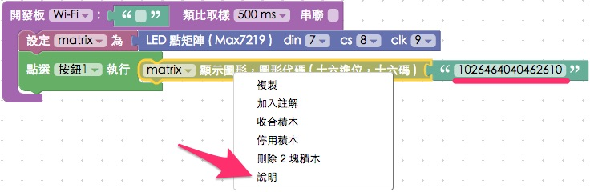
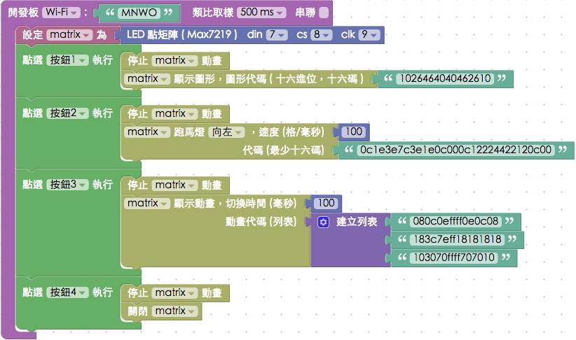

<!-- @@master  = ../../_layout.html-->

<!-- @@block  =  meta-->

<title>教學範例 18：LED 點矩陣顯示圖形 :::: Webduino = Web × Arduino</title>

<meta name="description" content="LED 點矩陣顧名思義，就是用許多 LED 燈所組成的元件，最常見到的就是在火車、公車...等大眾運輸裡常見的文字跑馬燈，在這個單位裡頭將會使用 8 × 8 的 LED 點矩陣，型號為 MAX7219，因此可以做出 8 × 8 的圖形或是文字。">

<meta itemprop="description" content="LED 點矩陣顧名思義，就是用許多 LED 燈所組成的元件，最常見到的就是在火車、公車...等大眾運輸裡常見的文字跑馬燈，在這個單位裡頭將會使用 8 × 8 的 LED 點矩陣，型號為 MAX7219，因此可以做出 8 × 8 的圖形或是文字。">

<meta property="og:description" content="LED 點矩陣顧名思義，就是用許多 LED 燈所組成的元件，最常見到的就是在火車、公車...等大眾運輸裡常見的文字跑馬燈，在這個單位裡頭將會使用 8 × 8 的 LED 點矩陣，型號為 MAX7219，因此可以做出 8 × 8 的圖形或是文字。">

<meta property="og:title" content="教學範例 18：LED 點矩陣顯示圖形" >

<meta property="og:url" content="https://webduino.io/tutorials/tutorial-18-max7219.html">

<meta property="og:image" content="https://webduino.io/img/tutorials/tutorial-18-01s.jpg">

<meta itemprop="image" content="https://webduino.io/img/tutorials/tutorial-18-01s.jpg">

<include src="../_include-tutorials.html"></include>

<!-- @@close-->

<!-- @@block  =  preAndNext-->

<include src="../_include-tutorials-content.html"></include>

<!-- @@close-->

<!-- @@block  =  tutorials-->

# 教學範例 18：LED 點矩陣顯示圖形

LED 點矩陣顧名思義，就是用許多 LED 燈所組成的元件，最常見到的就是在火車、公車...等大眾運輸裡常見的文字跑馬燈，在這個單位裡頭將會使用 8 × 8 的 LED 點矩陣，型號為 MAX7219，因此可以做出 8 × 8 的圖形或是文字。

## 範例影片展示

<iframe class="youtube" src="https://www.youtube.com/embed/nY5zBP7BLdo" frameborder="0" allowfullscreen></iframe>

## 接線與實作

MAX7219 LED 點矩陣有五支接腳，分別是 VCC、GND、D in ( Dout )、CS ( 晶片選擇 ) 和 CLK ( 時脈 )，在這裡把 D in 接 7、CS 接 8，CLK 接 9，VCC 要接 VCC 的位置 ( 不要接 3.3V 怕電壓不夠 )。

實際接線照片：

## Webduino Blockly 操作解析

打開 Webduino Blockly 編輯工具 ( [https://blockly.webduino.io](https://blockly.webduino.io) )，因為這個範例會用讓我們點擊網頁「按鈕」來用 LED 點矩陣顯示不同的圖案或動畫，所以要先點選右上方「網頁互動測試」的按鈕，打開內嵌測試的網頁，用下拉選單選擇「按鈕行為」。 ( 請參考：[韌體檔案燒錄教學](https://webduino.io/tutorials/info-07-arduino-ino.html)，選擇有 MaxMatrix 檔名的韌體 )

把開發板放到編輯畫面裡，填入對應的 Webduino 開發板名稱，開發板內放入 LED 點矩陣的積木，名稱設定為 matrix，腳位設定為 7、8、9。

放入點擊按鈕 1 的積木，讓點擊按鈕 1 的時候，matrix 會顯示圖形，在 LED 點矩陣裡顯示的圖形是由「**八組兩兩成對十六進位代碼組成 ( 共十六碼，可以更多，但須兩兩字母或數字成對 )**」，如果要由圖形產生代碼，可以**在積木上按「右鍵」，選擇「說明」**，就會開啟代碼產生器網頁 ( [http://webduinoio.github.io/demo/max7219/](http://webduinoio.github.io/demo/max7219/) )。

在代碼產生網頁裡，我們可以直接用滑鼠點選畫圖，或直接用下拉選單產生預設文字、數字或圖形，完成後點選「複製」，就可以將代碼複製起來，再貼回 Blockly 編輯工具即可，此外，代碼產生網頁還可以直接和你的裝置互動，在最上方 Board 的地方輸入裝置的 device ID，你畫的圖形就會直接出現在 LED 點矩陣裡。( 可以參考這段影片：[https://www.youtube.com/watch?v=U3jEqpWve8I](https://www.youtube.com/watch?v=U3jEqpWve8I) )

再來設定按鈕 2 的動作，這裏使用「跑馬燈」的積木，可以讓我們設定的圖案往左跑或是往右跑，比較特別的是，對於 LED 點矩陣來說，因為代碼是可以超過十六個字母或數字 ( **須符合十六進位，並兩兩成對** )，所以我們可以畫出很長的一串圖形，透過 LED 點矩陣實現跑馬燈。( 例如可以複製這段代碼，貼到 Blockly 裡執行看看會如何：「0c1e3e7c3e1e0c000c12224422120c00」 )

在執行之前有個很重要的動作要先做，因為跑馬燈使用了動畫效果，所以在切換按鈕時，要先把動畫停止下來，這時候可以再按按鈕之前都先加入「停止動畫」的積木，避免動畫重疊播放。

因為剛剛跑馬燈只能往左或往右，如果要做各種圖形組合的動畫，就需要用「列表」來製作，這裏第三個按鈕我們用「列表」來播動畫，然後第四個按鈕就把 LED 點矩陣關起來。

完成後，確認開發板上線 ( 點選「[檢查連線狀態](https://webduino.io/device.html)」查詢 )，點選紅色的執行按鈕，點擊不同的按鈕，LED 點矩陣就會出現不同的圖案或動畫了。( 解答：[https://blockly.webduino.io/#-K7z4OcyEOftPgFGh5PR](https://blockly.webduino.io/#-K7z4OcyEOftPgFGh5PR)

##範例解析 ( [完整程式碼](http://bin.webduino.io/xoma/7/edit?html,css,js,output)、[檢查連線狀態](https://webduino.io/device.html) )

HTML 的 header 引入 `webduino-all.min.js`，目的在讓瀏覽器可以支援 WebComponents 以及 Webduino 所有的元件，如果是用 Blockly 編輯工具產生的程式碼，則要額外引入 `webduino-blockly.js`。

	
	

HTML 裏頭放了五顆按鈕，大小樣式大家就可以自行去做設定。

	<button id="demo-area-05-btn1" class="db5">按鈕 1</button>
	<button id="demo-area-05-btn2" class="db5">按鈕 2</button>
	<button id="demo-area-05-btn3" class="db5">按鈕 3</button>
	<button id="demo-area-05-btn4" class="db5">按鈕 4</button>
	<button id="demo-area-05-btn5" class="db5">按鈕 5</button>

JavaScript 的部分，停止動畫的方法是`animateStop()`，顯示圖案的方法是`on`，動畫則是用`animate`來播放一個陣列，這個陣列裡面就是我們剛剛填入的代碼，例如：`['080c0effff0e0c08', '183c7eff18181818', '103070ffff707010']`，至於跑馬燈的部分，這裏利用`split`、`splice`和`push`這些處理陣列數值的 JavaScript 做一些手腳，也就是把一段超過 16 的字母或數字的代碼，轉換成陣列的形式呈現，再用`animate`播放，就會變成跑馬燈的效果了。

	var matrix;

	boardReady('', function (board) {
	  board.samplingInterval = 500;
	  matrix = getMax7219(board, 7, 8, 9);
	  document.getElementById("demo-area-05-btn1").addEventListener("click",function(){
	    matrix.animateStop();
	    matrix.on('1026464040462610');
	  });
	  document.getElementById("demo-area-05-btn2").addEventListener("click",function(){
	    matrix.animateStop();
	    var a = '0c1e3e7c3e1e0c000c12224422120c00';
	    var b = a.split("");
	    var d = [];
	    for(var i=0; i<a.length/2; i++){
	      aa(i);
	    }
	    function aa(j){
	      var c=b.splice(0,2);
	      b.push(c[0],c[1]);
	      d[j] = b.join("");
	    }
	    console.log(d);
	    matrix.animate(d,100);
	  });
	  document.getElementById("demo-area-05-btn3").addEventListener("click",function(){
	    matrix.animateStop();
	    var varData = ['080c0effff0e0c08', '183c7eff18181818', '103070ffff707010'];
	    matrix.animate(varData,100);
	  });
	  document.getElementById("demo-area-05-btn4").addEventListener("click",function(){
	    matrix.off();
	  });
	});

以上就是利用 LED 點矩陣，點擊不同的網頁按鈕，顯示圖形或是動畫。   
完整程式碼：[http://bin.webduino.io/xoma/7/edit?html,css,js,output](http://bin.webduino.io/xoma/7/edit?html,css,js,output)  
解答：[https://blockly.webduino.io/#-K7z4OcyEOftPgFGh5PR](https://blockly.webduino.io/#-K7z4OcyEOftPgFGh5PR)

## LED 點矩陣的延伸教學：

[Webduino Blockly 課程 13-1：點矩陣顯示圖形](https://blockly.webduino.io/?lang=zh-hant&page=tutorials/max7219-1#-K0opTxaF_E2ncQkc6JC)  
[Webduino Blockly 課程 13-2：點矩陣製作動畫](https://blockly.webduino.io/?lang=zh-hant&page=tutorials/max7219-2#-K0os-k9zK8b2uN9iOMK)  
[Webduino Blockly 課程 13-3：點矩陣跑馬燈效果](https://blockly.webduino.io/?lang=zh-hant&page=tutorials/max7219-3#-K0ou2rmQYkM46jiooWV)    
[Webduino Blockly 課程 13-4：點選按鈕切換點矩陣效果](https://blockly.webduino.io/?lang=zh-hant&page=tutorials/max7219-4#-K0p0BGifwqYvndb35GK)    
[Webduino Blockly 課程 13-5：利用超音波傳感器改變點矩陣圖形](https://blockly.webduino.io/?lang=zh-hant&page=tutorials/max7219-5#-K0p4uO2W-zcVOU7FF0A)  

<!-- @@close-->