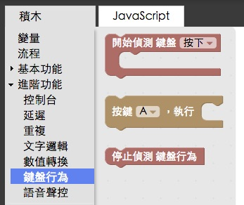
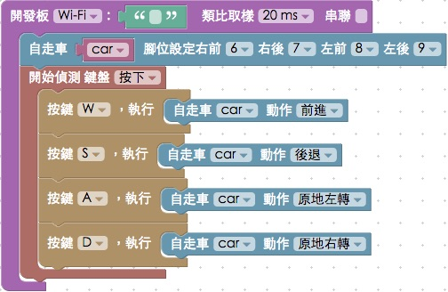
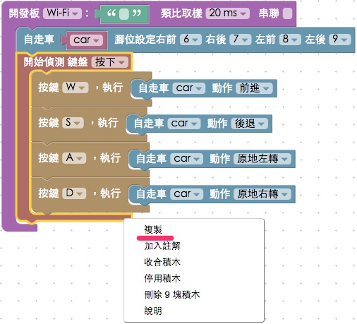
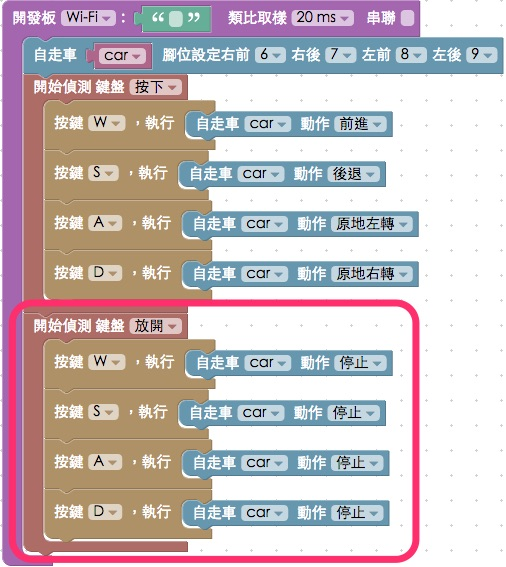

<!-- @@master  = ../../_layout.html-->

<!-- @@block  =  meta-->

<title>教學範例 21：鍵盤操控自走車 :::: Webduino = Web × Arduino</title>

<meta name="description" content="Webduino 公仔自走車是 Webduino 自主研發的產品，使用 Webduino 馬克 1 號開發板控制，不僅可以設定行進的模式，更可以接上超音波傳感器讓車子自動閃避障礙物，在這個範例我們會實作設定電腦的鍵盤行為，透過敲打鍵盤讓車子移動。">

<meta itemprop="description" content="Webduino 公仔自走車是 Webduino 自主研發的產品，使用 Webduino 馬克 1 號開發板控制，不僅可以設定行進的模式，更可以接上超音波傳感器讓車子自動閃避障礙物，在這個範例我們會實作設定電腦的鍵盤行為，透過敲打鍵盤讓車子移動。">

<meta property="og:description" content="Webduino 公仔自走車是 Webduino 自主研發的產品，使用 Webduino 馬克 1 號開發板控制，不僅可以設定行進的模式，更可以接上超音波傳感器讓車子自動閃避障礙物，在這個範例我們會實作設定電腦的鍵盤行為，透過敲打鍵盤讓車子移動。">

<meta property="og:title" content="教學範例 21：鍵盤操控自走車" >

<meta property="og:url" content="https://webduino.io/tutorials/tutorial-21-toycar.html">

<meta property="og:image" content="https://webduino.io/img/tutorials/tutorial-21-01s.jpg">

<meta itemprop="image" content="https://webduino.io/img/tutorials/tutorial-21-01s.jpg">

<include src="../_include-tutorials.html"></include>

<!-- @@close-->

<!-- @@block  =  preAndNext-->

<include src="../_include-tutorials-content.html"></include>

<!-- @@close-->

<!-- @@block  =  tutorials-->

# 教學範例 21：鍵盤操控自走車

Webduino 公仔自走車是 Webduino 自主研發的產品，使用 Webduino 馬克 1 號開發板控制，不僅可以設定行進的模式，更可以接上超音波傳感器讓車子自動閃避障礙物，在這個範例我們會實作設定電腦的鍵盤行為，透過敲打鍵盤讓車子移動。

## 範例影片展示

<iframe class="youtube" src="https://www.youtube.com/embed/0JT1KAHkMsk" frameborder="0" allowfullscreen></iframe>

## 接線與實作

要操控自走車，首先就是要組裝自走車，先來看一下自走車包含哪些組件，組件分別有：自走車底版 ( 3D 列印 )、左右各一顆輪子與馬達、開關、電池盒、馬達驅動板、超音波傳感器和 Webduino 開發板，由於主要的機構都已經焊接完成，組裝上變得相當簡單，只需要幾個步驟即可完成。

首先把電池放到電池盒內 ( 需要四顆三號電池 )，然後將電池盒放到車子上。

接著把 Webduino 開發板放到前方的插槽裡。

放妥開發板後，先把超音波傳感器插在開發板的左側排插，Trig 11，Echo 10。

接著把馬達驅動板插在右側排插，注意會把 3.3V、 6、7、8、9 的腳位接滿，然後在 3.3V 的插孔處繪圖出一支腳，這支腳已經用電線聯結出來，所以是正常的不需理會。

到這邊已經組裝完成，打開自走車的電源，就可以開始嘗試操控自走車了。

最終長相：

## Webduino Blockly 操作解析

打開 Webduino Blockly 編輯工具 ( [https://blockly.webduino.io](https://blockly.webduino.io) )，因為這個範例會用「玩具應用」裡的「自走車(2)」來對自走車進行操控。

把開發板放到編輯畫面裡，填入對應的 Webduino 開發板名稱，開發板內放入自走車的積木，名稱設定為 car，腳位設定為 6、7、8、9 ( 這是 Webduino 自走車出場的腳位順序 )。

因為要用鍵盤操控，所以要使用「進階功能」的「鍵盤行為」積木。

首先放入偵測鍵盤「按下」的積木，在裡面放入偵測按下 W ( 可以用下拉選單選擇按鍵 )，這表示當 W 按下時，就會做自走車前進的動作。

接著放入後退、原地左轉、原地右轉的積木。

完成後我們把「偵測鍵盤按下」的這一整塊積木，按右鍵選擇複製，就會產生一塊新的積木 ( 包含肚子裡的積木也會一併複製 )。

然後將偵測鍵盤行為改成「放開」，並把所有車子的動作改成「停止」，也就是當我們手指離開這個按鍵，就會觸發車子停止的動作。

做好之後，確認開發板上線 ( 點選「[檢查連線狀態](https://webduino.io/device.html)」查詢 )，點選紅色的執行按鈕，就可以開始用鍵盤操控自走車了。( 解答：[https://blockly.webduino.io/#-K83d4dTF91eCJ6NZ0rQ](https://blockly.webduino.io/#-K83d4dTF91eCJ6NZ0rQ) )

##範例解析 ( [完整程式碼](http://bin.webduino.io/pufa/edit?html,js,output)、[檢查連線狀態](https://webduino.io/device.html) )

HTML 的 header 引入 `webduino-all.min.js`，目的在讓瀏覽器可以支援 WebComponents 以及 Webduino 所有的元件，如果是用 Blockly 編輯工具產生的程式碼，則要額外引入 `webduino-blockly.js`。

	
	

JavaScript 因為比較長，所以這邊我們分成三個部分來看，先看到最外層`boardReady`的部分，這是指開發板上線之後要做的事情，下面會繼續介紹寫在裡面的程式碼。

	var car;

	boardReady('', function (board) {
	  board.samplingInterval = 20;
	  //待會要執行的事情會寫在這邊
	});

第一部分是車子的行為操控，很有趣的地方是這裏用了`getLed`的方式來控制腳位，為什麼跟 LED 有關係呢？因為對於車子來說，例如 6 號腳是高電位右邊馬達會正轉，7 號腳高電位右邊馬達會反轉，如果左右馬達同時正轉，車子就會往前走，左右馬達同時反轉，車子就會往後走，當左右馬達轉向相反，車子就會原地自轉，依此類推，所以這裡就設定了很多組車子的動作，例如：`goFront`、`goBack`...等。

	car = {};

	car.rightFront_ = getLed(board, 6);
	car.rightBack_ = getLed(board, 7);
	car.leftFront_ = getLed(board, 8);
	car.leftBack_ = getLed(board, 9);

	car.goFront_ = function(){
	  car.rightFront_.on();
	  car.rightBack_.off();
	  car.leftFront_.on();
	  car.leftBack_.off();
	};
	car.goBack_ = function(){
	  car.rightFront_.off();
	  car.rightBack_.on();
	  car.leftFront_.off();
	  car.leftBack_.on();
	};
	car.goRight_ = function(){
	  car.rightFront_.on();
	  car.rightBack_.off();
	  car.leftFront_.off();
	  car.leftBack_.off();
	};
	car.goLeft_ = function(){
	  car.rightFront_.off();
	  car.rightBack_.off();
	  car.leftFront_.on();
	  car.leftBack_.off();
	};
	car.turnRight_ = function(){
	  car.rightFront_.off();
	  car.rightBack_.on();
	  car.leftFront_.on();
	  car.leftBack_.off();
	};
	car.turnLeft_ = function(){
	  car.rightFront_.on();
	  car.rightBack_.off();
	  car.leftFront_.off();
	  car.leftBack_.on();
	};
	car.backLeft_ = function(){
	  car.rightFront_.off();
	  car.rightBack_.off();
	  car.leftFront_.off();
	  car.leftBack_.on();
	};
	car.backRight_ = function(){
	  car.rightFront_.off();
	  car.rightBack_.on();
	  car.leftFront_.off();
	  car.leftBack_.off();
	};
	car.stop_ = function(){
	  car.rightFront_.off();
	  car.rightBack_.off();
	  car.leftFront_.off();
	  car.leftBack_.off();
	};

再來的這一段是鍵盤行為的操控，每個鍵盤按鍵，在 JavaScript 裡面都有對應的`keyCode`，利用`switch`就可以判斷不同的`keyCode`就做不同的事情，不過在右側有數字鍵和右側沒有數字鍵的鍵盤、或 Mac 作業系統裡，部分 KeyCode 會不同 ( 例如上下左右 )，不過如果是字母，基本上都會是相同的，所以建議先從字母鍵盤著手。

	document.onkeydown = function(e){
	  console.log(e.keyCode);
	  switch(e.keyCode){
	    case 87:
	      car.goFront_();
	    break;
	    case 83:
	      car.goBack_();
	    break;
	    case 65:
	      car.turnLeft_();
	    break;
	    case 68:
	      car.turnRight_();
	    break;
	  }
	};
	document.onkeyup = function(e2){
	  console.log(e2.keyCode);
	  switch(e2.keyCode){
	    case 87:
	      car.stop_();
	    break;
	    case 83:
	      car.stop_();
	    break;
	    case 65:
	      car.stop_();
	    break;
	    case 68:
	      car.stop_();
	    break;
	  }
	};

以上就是利用鍵盤來控制自走車的 Blockly 和程式碼簡介。   
完整程式碼：[http://bin.webduino.io/pufa/edit?html,js,output](http://bin.webduino.io/pufa/edit?html,js,output)  
解答：[https://blockly.webduino.io/#-K83d4dTF91eCJ6NZ0rQ](https://blockly.webduino.io/#-K83d4dTF91eCJ6NZ0rQ)

## RFID 的延伸教學：

[Webduino Blockly 課程：操控自走車](https://blockly.webduino.io/?lang=zh-hant#-JzjA7kAmAKmiCjWgxAu)  
[Webduino Blockly 課程：超音波避障自走車](https://blockly.webduino.io/?lang=zh-hant#-JzjArZQxBWPbq7wpuCM)  
[Webduino Blockly 課程：語音聲控自走車](https://blockly.webduino.io/?lang=zh-hant#-JzjAQjf2HuWFSrg4ocj)     

<!-- @@close-->