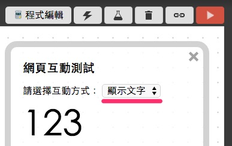
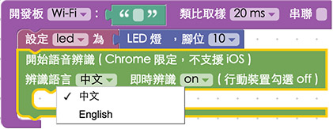
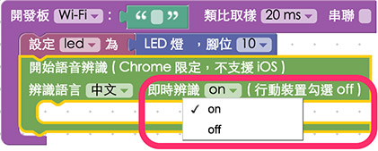
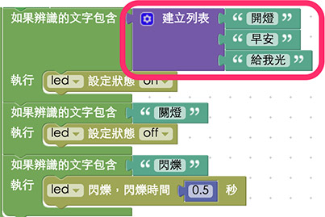

<!-- @@master  = ../../_layout.html-->

<!-- @@block  =  meta-->

<title>教學範例 22：語音聲控 LED 燈 :::: Webduino = Web × Arduino</title>

<meta name="description" content="因為 Webduino 可以使用瀏覽器 Chrome 來操控各種電子零件，因此 Chrome 具備的功能也都能夠順利成章的使用，在這個範例裡面我們將會使用 Chrome 內建的 Speech API，透過 Google 的語音辨識功能，輕鬆實現語音聲控 LED 燈的效果。">

<meta itemprop="description" content="因為 Webduino 可以使用瀏覽器 Chrome 來操控各種電子零件，因此 Chrome 具備的功能也都能夠順利成章的使用，在這個範例裡面我們將會使用 Chrome 內建的 Speech API，透過 Google 的語音辨識功能，輕鬆實現語音聲控 LED 燈的效果。">

<meta property="og:description" content="因為 Webduino 可以使用瀏覽器 Chrome 來操控各種電子零件，因此 Chrome 具備的功能也都能夠順利成章的使用，在這個範例裡面我們將會使用 Chrome 內建的 Speech API，透過 Google 的語音辨識功能，輕鬆實現語音聲控 LED 燈的效果。">

<meta property="og:title" content="教學範例 22：語音聲控 LED 燈" >

<meta property="og:url" content="https://webduino.io/tutorials/tutorial-22-speech-led.html">

<meta property="og:image" content="https://webduino.io/img/tutorials/tutorial-22-01s.jpg">

<meta itemprop="image" content="https://webduino.io/img/tutorials/tutorial-22-01s.jpg">

<include src="../_include-tutorials.html"></include>

<!-- @@close-->

<!-- @@block  =  preAndNext-->

<include src="../_include-tutorials-content.html"></include>

<!-- @@close-->

<!-- @@block  =  tutorials-->

# 教學範例 22：語音聲控 LED 燈

因為 Webduino 可以使用瀏覽器 Chrome 來操控各種電子零件，因此 Chrome 具備的功能也都能夠順利成章的使用，在這個範例裡面我們將會使用 Chrome 內建的 Speech API，透過 Google 的語音辨識功能，輕鬆實現語音聲控 LED 燈的效果 ( 同樣的方式也可以應用在繼電器上，就可以變成語音聲控電燈泡、門鎖或家電 )。

## 範例影片展示

<iframe class="youtube" src="https://www.youtube.com/embed/FXoe5k6_iQo" frameborder="0" allowfullscreen></iframe>

## 接線與實作

因為這個範例只需要用到一顆 LED 燈，所以接線方式很簡單，首先，LED 燈有「長短腳」之分，長腳接「高電位」( 帶有數字的腳位 )，短腳接「低電位」( GND、接地 )，因此我們只要直接將 LED 插到腳位上即可，或使用麵包板與麵包線外接出來，在這裡**長腳接 10，短腳接 GND**。

接線示意圖：

實際接線照片：

## Webduino Blockly 操作解析

打開 Webduino Blockly 編輯工具 ( [http://blockly.webduino.io](http://blockly.webduino.io) )，因為這個範例會「先」用網頁「顯示文字」來顯示我們語音辨識出來的文字，所以要先點選右上方「網頁互動測試」的按鈕，打開內嵌測試的網頁，用下拉選單選擇「顯示文字」。

把開發板放到編輯畫面裡，填入對應的 Webduino 開發板名稱，開發板內放入 LED 的積木，名稱設定為 led，腳位設定 10。

如果要使用語音聲控，點選左側「進階功能」的選項，選擇「語音聲控」，裡面就會有對應的積木。

我們把「開始語音辨識」的積木放到開發板內，要注意的是，如果選擇「中文」語音，就只能辨識中文，不然會把念出來的英文，辨識為很奇怪的中文 ( 例如 good 可能會辨識成「固的」 )，如果要講英文，就選擇「English」。

語音辨識積木的第二個選項：「即時辨識」，如果選擇「on」，表示我們講的每個字都會即時辨識出來，如果選擇「off」，則會在一段話停頓的時候 ( 由系統自動判斷何時叫做停頓 )，才會辨識一整段話出來，因此如果是使用「電腦」版本的瀏覽器，建議使用即時辨識，這樣語音聲控的效果會更好，不過**如果是行動裝置，即時辨識一定要設定為「off」( 行動裝置預設值 )，而且也只有 Android 手機才能使用，要特別注意！**

接著先放入「顯示文字」的積木來顯示辨識文字，這樣才可以看到我們講出來的文字是什麼。

然後放入「如果辨識的文字是什麼，就執行什麼」的積木，把我們的語音命令寫在裡面，這個範例表示我們講「開燈」LED 就會亮，「關燈」就會熄滅，「閃爍」就會開始閃爍。

如果要可以支援多種指令，我們可以利用「列表」的方式，把各個指令列出來就可以了。

確認開發板上線 ( 點選「[檢查連線狀態](https://webduino.io/device.html)」查詢 )，點選紅色的執行按鈕，基本上會彈出一個是否允許啟用麥克風的選項，點選「允許」。

接著就可以開始講話，用語音聲控 LED 燈了。( 解答：[http://blockly.webduino.io/#-K8jMTLqExEaa7YlqKCN](http://blockly.webduino.io/#-K8jMTLqExEaa7YlqKCN) )

##範例解析 ( [完整程式碼](http://bin.webduino.io/fexic/edit?html,js,output)、[檢查連線狀態](https://webduino.io/device.html) )

HTML 的 header 引入 `webduino-all.min.js`，目的在讓瀏覽器可以支援 WebComponents 以及 Webduino 所有的元件，如果是用 Blockly 編輯工具產生的程式碼，則要額外引入 `webduino-blockly.js`。

	
	

HTML 裏頭只有一個 span，用來顯示 RFID 磁卡或磁扣的識別碼。

	123

JavaScript 最主要用了`webkitSpeechRecognition()`這個 Chrome 內建語音辨識的物件，根據不同的屬性，例如`continuous`、`interimResults`和`lang`就可以針對語音辨識做一些設定，而語音辨識會回傳一個`onresult`的屬性，裡面就會有辨識出來的文字，而我們便將判斷式寫在裡頭，判斷如果有我們的指令文字，就會執行某些動作。

	var led;

	boardReady('', function (board) {
	  board.samplingInterval = 20;
	  led = getLed(board, 10);
	  function speechRecognition(){
	    if (!("webkitSpeechRecognition" in window)) {
	      alert("本瀏覽器不支援語音辨識，請更換瀏覽器！(Chrome 25 版以上才支援語音辨識)");
	    } else{
	      window._recognition = new webkitSpeechRecognition();
	      window._recognition.continuous = true;
	      window._recognition.interimResults = true;
	      window._recognition.lang = "cmn-Hant-TW";

	      window._recognition.onstart = function() {
	        console.log("Start recognize...");
	      };

	      window._recognition.onend = function() {
	        console.log("Stop recognize");
	      };

	      window._recognition.onresult = function(event,result) {
	        result = {};
	        result.resultLength = event.results.length-1;
	        result.resultTranscript = event.results[result.resultLength][0].transcript;
	        if(event.results[result.resultLength].isFinal===false){
	          console.log(result.resultTranscript);
	            document.getElementById("demo-area-01-show").innerHTML = result.resultTranscript;
	    if(result.resultTranscript.indexOf("開燈")!==-1){
	              led.on();
	          }
	    if(result.resultTranscript.indexOf("關燈")!==-1){
	              led.off();
	          }
	    if(result.resultTranscript.indexOf("閃爍")!==-1){
	              led.blink(0.5*1000);
	          }
	                }else if(event.results[result.resultLength].isFinal===true){
	          console.log("final");
	        }
	      };
	      window._recognition.start();
	    }
	  }
	  speechRecognition();
	});

以上就是利用鍵盤來控制自走車的 Blockly 和程式碼簡介。   
完整程式碼：[http://bin.webduino.io/fexic/edit?html,js,output](http://bin.webduino.io/fexic/edit?html,js,output)  
解答：[http://blockly.webduino.io/#-K8jMTLqExEaa7YlqKCN](http://blockly.webduino.io/#-K8jMTLqExEaa7YlqKCN)

<!-- @@close-->