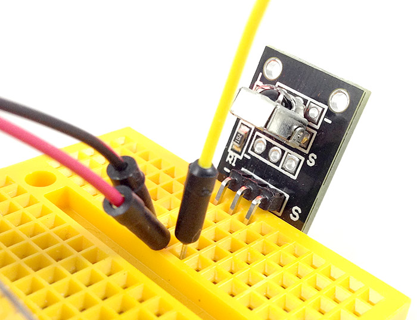
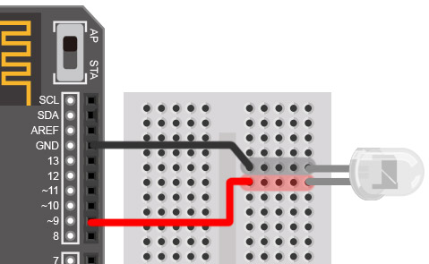
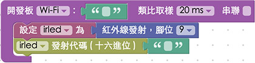

<!-- @@master  = ../../_layout.html-->

<!-- @@block  =  meta-->

<title>教學範例 24：紅外線發射與接收 :::: Webduino = Web × Arduino</title>

<meta name="description" content="紅外線發射與接收，常見於我們日常生活的電器用品，舉凡電視機、冷氣機、遙控電風扇、玩具...等，只要有「遙控器」的電器，大多都是利用紅外線發射與接收的原理，這篇教學將會介紹如何透過 Webduino，時做出可以偵測遙控器紅外線訊號，以及發送紅外線訊號的實際案例。">

<meta itemprop="description" content="紅外線發射與接收，常見於我們日常生活的電器用品，舉凡電視機、冷氣機、遙控電風扇、玩具...等，只要有「遙控器」的電器，大多都是利用紅外線發射與接收的原理，這篇教學將會介紹如何透過 Webduino，時做出可以偵測遙控器紅外線訊號，以及發送紅外線訊號的實際案例。">

<meta property="og:description" content="紅外線發射與接收，常見於我們日常生活的電器用品，舉凡電視機、冷氣機、遙控電風扇、玩具...等，只要有「遙控器」的電器，大多都是利用紅外線發射與接收的原理，這篇教學將會介紹如何透過 Webduino，時做出可以偵測遙控器紅外線訊號，以及發送紅外線訊號的實際案例。">

<meta property="og:title" content="教學範例 24：紅外線發射與接收" >

<meta property="og:url" content="https://webduino.io/tutorials/tutorial-24-ir.html">

<meta property="og:image" content="https://webduino.io/img/tutorials/tutorial-24-01s.jpg">

<meta itemprop="image" content="https://webduino.io/img/tutorials/tutorial-24-01s.jpg">

<include src="../_include-tutorials.html"></include>

<!-- @@close-->

<!-- @@block  =  preAndNext-->

<include src="../_include-tutorials-content.html"></include>

<!-- @@close-->

<!-- @@block  =  tutorials-->

# 教學範例 24：紅外線發射與接收

紅外線發射與接收，常見於我們日常生活的電器用品，舉凡電視機、冷氣機、遙控電風扇、玩具...等，只要有「遙控器」的電器，大多都是利用紅外線發射與接收的原理，這篇教學將會介紹如何透過 Webduino，時做出可以偵測遙控器紅外線訊號，以及發送紅外線訊號的實際案例。

## 範例影片展示

影片對應範例：[http://blockly.webduino.io/?&page=tutorials/irrecv-1](http://blockly.webduino.io/?&page=tutorials/irrecv-1)  

<iframe class="youtube" src="https://www.youtube.com/embed/lfN0D4198CM" frameborder="0" allowfullscreen></iframe>

## 接線與實作

將紅外線接收器上頭靠近「-」的腳接上 GND，中間的腳是 3.3V，靠近「S」的腳接到 10 的腳位，由於 Arduino 本身對於紅外線訊號的處理只有「一個」振盪器，所以發射與接收紅外線的事件會同時發生，因此，**無法在同一塊 Arduino 上頭，同時使用紅外線接收器與發射器**，如果要測試發射訊號，可以用紅外線接收器，接收家裡的電視機遙控器訊號，然後用紅外線發射器發送給電視機，就可以了。

紅外線接收器，接線示意圖：

紅外線接收器實際接線照片：

紅外線發射器的長相就很類似一個大顆的 LED 燈，不注意的話還會用錯，如果我們使用**紅外線發射器，一定得使用 9 號腳位**，因為該腳位就是具備振盪器功能的腳位，才能發出紅外線訊號使用的方波，接別的腳位是無效的，所以這裡將長腳接在 9 號，短腳接在 GND。

紅外線發射器，接線示意圖：

## Webduino Blockly 操作解析

打開 Webduino Blockly 編輯工具 ( [http://blockly.webduino.io](http://blockly.webduino.io) )，因為這個範例會「先」用網頁「顯示文字」來顯示紅外線接收器接收到的的訊號，所以要先點選右上方「網頁互動測試」的按鈕，打開內嵌測試的網頁，用下拉選單選擇「顯示文字」，此外，記得要先燒錄紅外線發射與接收的韌體檔喔！ ( 請參考：[韌體檔案燒錄教學](https://webduino.io/tutorials/info-07-arduino-ino.html) )

把開發板放到編輯畫面裡，填入對應的 Webduino 開發板名稱，開發板內放入紅外線接收器的積木，名稱設定為 irrecv，腳位設定為 10。

放入「開始偵測」以及「顯示」的積木，在偵測的時候將訊號顯示在網頁裡。

如果是紅外線發射，就要使用紅外線發射的積木，名稱為 irled，同時腳位也要改成 9。

更進一步，我們也可以利用網頁的按鈕，發送不同的紅外線訊號，透過這個方式，我們就可以將電視遙控器的按鍵完全做成網頁版本了。

確認開發板上線 ( 點選「[檢查連線狀態](https://webduino.io/device.html)」查詢 )，點選紅色的執行按鈕，就可以開始接收紅外線訊號，或是開始發送紅外線訊號了。  
( 解答：[http://blockly.webduino.io/#-KB1oJMYKqVBeKrMmQGn](http://blockly.webduino.io/#-KB1oJMYKqVBeKrMmQGn) )

##範例解析 ( [完整程式碼](http://bin.webduino.io/jiguh/edit?html,css,js,output)、[檢查連線狀態](https://webduino.io/device.html) )

HTML 的 header 引入 `webduino-all.min.js`，目的在讓瀏覽器可以支援 WebComponents 以及 Webduino 所有的元件，如果是用 Blockly 編輯工具產生的程式碼，則要額外引入 `webduino-blockly.js`。

	
	

如果是用紅外線接收器，HTML 裏頭只有一個 span，用來顯示三軸加速度計的數值，也因為只有一個 span，我們才需要使用「建立字串」的積木 ( 如果會寫程式，這部分也可以用五個 span 來取代 )。

	123

如果是用紅外線發射器，HTML 裏頭就會是一些按鈕。

	<button id="demo-area-05-btn1" class="db5">按鈕 1</button>
	<button id="demo-area-05-btn2" class="db5">按鈕 2</button>
	<button id="demo-area-05-btn3" class="db5">按鈕 3</button>
	<button id="demo-area-05-btn4" class="db5">按鈕 4</button>
	<button id="demo-area-05-btn5" class="db5">按鈕 5</button>

紅外線接收器的 JavaScript 最主要用了`on`這個方法，裡面會有一個函式，帶有一個參數，這五個參數就是紅外線接收器接收到的訊號數值，利用`innerHTML`與字串的相加，我們就可以把這個數值，顯示在 span 裏頭了。

	var irrecv;

	boardReady('', function (board) {
	  board.samplingInterval = 20;
	  irrecv = getIRRecv(board, 10);
	  irrecv.on(function(val){
	    irrecv.onVal = val;
	    document.getElementById("demo-area-01-show").innerHTML = irrecv.onVal;
	  },function(){});
	});

如果是紅外線發射器的 JavaScript ，就會使用`send`方法來傳送訊號，將訊號寫在後面就可以發送出去了。

	var irled;

	boardReady('', function (board) {
	  board.samplingInterval = 20;
	  irled = getIRLed(board, "ffffffff");
	  document.getElementById("demo-area-05-btn1").addEventListener("click",function(){
	    irled.send("ffffffff");
	  });
	  document.getElementById("demo-area-05-btn2").addEventListener("click",function(){
	    irled.send("ffffffff");
	  });
	  document.getElementById("demo-area-05-btn3").addEventListener("click",function(){
	    irled.send("ffffffff");
	  });
	  document.getElementById("demo-area-05-btn4").addEventListener("click",function(){
	    irled.send("ffffffff");
	  });
	  document.getElementById("demo-area-05-btn5").addEventListener("click",function(){
	    irled.send("ffffffff");
	  });
	});

以上就是控制紅外線發射器與接收器和程式碼簡介。   
完整程式碼：[http://bin.webduino.io/jiguh/edit?html,css,js,output](http://bin.webduino.io/jiguh/edit?html,css,js,output)  
解答：[http://blockly.webduino.io/#-KB1oJMYKqVBeKrMmQGn](http://blockly.webduino.io/#-KB1oJMYKqVBeKrMmQGn)

## 紅外線發射與接收的延伸教學：

[Webduino Blockly 課程 15-1：接收紅外線訊號](http://blockly.webduino.io/?lang=zh-hant&page=tutorials/irrecv-1#-K0qf8JH7bENOyJgc25r)  
[Webduino Blockly 課程 15-2：接收紅外線訊號改變區域顏色](http://blockly.webduino.io/?lang=zh-hant&page=tutorials/irrecv-2#-K0qhamTHkjMc9nZg4rc)  
[Webduino Blockly 課程 15-3：紅外線遙控 youtube 播放](http://blockly.webduino.io/?lang=zh-hant&page=tutorials/irrecv-3#-K0qllY_jNznqTDWliZ4)  

<!-- @@close-->