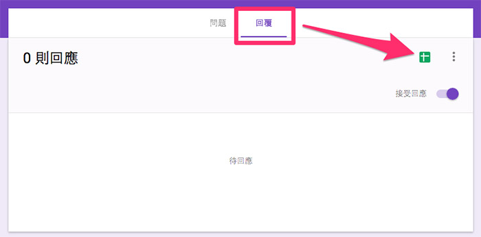
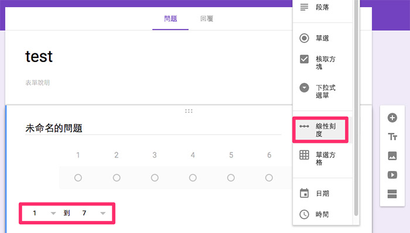
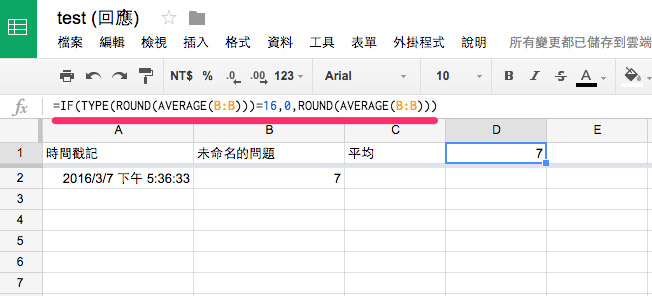
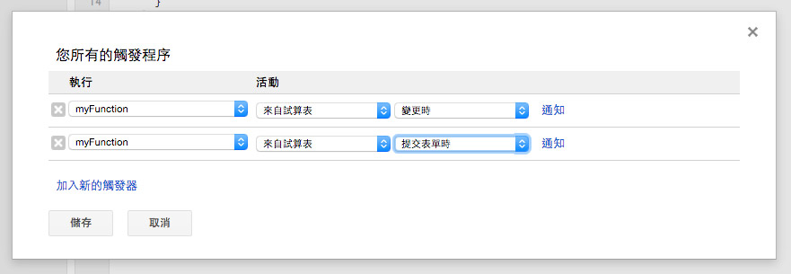

<!-- @@master  = ../../_layout.html-->

<!-- @@block  =  meta-->

<title>教學範例 26：使用 Google 試算表控制 LED :::: Webduino = Web × Arduino</title>

<meta name="description" content="Google 試算表 ( Google Spreadsheet ) 是目前最方便的線上試算表，除了試算表功能一應俱全，更可以和 Google 表單搭配，變成一個簡單的問卷統計資料庫，在這個範例中，我們會填寫 Google 問卷，接著把問卷的統計數字平均並四捨五入成整數，再讓平均的分數透過 LED 的數量顯示出來。">

<meta itemprop="description" content="Google 試算表 ( Google Spreadsheet ) 是目前最方便的線上試算表，除了試算表功能一應俱全，更可以和 Google 表單搭配，變成一個簡單的問卷統計資料庫，在這個範例中，我們會填寫 Google 問卷，接著把問卷的統計數字平均並四捨五入成整數，再讓平均的分數透過 LED 的數量顯示出來。">

<meta property="og:description" content="Google 試算表 ( Google Spreadsheet ) 是目前最方便的線上試算表，除了試算表功能一應俱全，更可以和 Google 表單搭配，變成一個簡單的問卷統計資料庫，在這個範例中，我們會填寫 Google 問卷，接著把問卷的統計數字平均並四捨五入成整數，再讓平均的分數透過 LED 的數量顯示出來。">

<meta property="og:title" content="教學範例 26：使用 Google 試算表控制 LED" >

<meta property="og:url" content="https://webduino.io/tutorials/tutorial-26-google-sheet.html">

<meta property="og:image" content="https://webduino.io/img/tutorials/tutorial-26-01s.jpg">

<meta itemprop="image" content="https://webduino.io/img/tutorials/tutorial-26-01s.jpg">

<include src="../_include-tutorials.html"></include>

<!-- @@close-->

<!-- @@block  =  preAndNext-->

<include src="../_include-tutorials-content.html"></include>

<!-- @@close-->

<!-- @@block  =  tutorials-->

# 教學範例 26：使用 Google 試算表控制 LED

Google 試算表 ( Google Spreadsheet ) 是目前最方便的線上試算表，除了試算表功能一應俱全，更可以和 Google 表單搭配，變成一個簡單的問卷統計資料庫，在這個範例中，我們會填寫 Google 問卷，接著把問卷的統計數字平均並四捨五入成整數，再讓平均的分數透過 LED 的數量顯示出來。

## 範例影片展示

<iframe class="youtube" src="https://www.youtube.com/embed/mpwSAFwlL_0" frameborder="0" allowfullscreen></iframe>

## 接線與實作

這個範例只會用到 LED 燈，但因為評比分數有七分，所以會接到 7 顆 LED 燈，將 LED 燈利用麵包板與單心線，長腳分別接到 7、8、9、10、11、12、13，然後短腳和 GND 連接。

接線示意圖：

實際接線照片：

## 操作解析

因為要使用 Google 表單，所以要先註冊 Google 的帳號，開啟雲端硬碟的功能，在裡面就可以開啟新資料夾，或者直接在根目錄新增「Google 表單」。( 範例中建立了一個名為 test 的資料夾 )

打開表單，輸入表單名稱，這個名稱將會對應到同樣名稱的試算表，完成後選擇「回覆」標籤，點選「在 Google 試算表中查看回應」，就會自動幫我們建立一份對應的 Google 試算表。

完成後切回「問題」標籤，在這邊可以新增一些問卷的問題，我們新增一個「線性刻度」的單選題，設定 1 到 7 分，在使用者填妥送出後，Google 試算表內就會記錄該使用者對應的分數。

點選右上角眼睛形狀的圖示「預覽」，就可以打開這份表單，我們可以先嘗試填寫，先選擇七分，然後按下「提交」送出。

送出之後，回到 Google 雲端硬碟，也就是剛剛建立表單的資料夾，把對應的 Google 試算表打開。

打開後會看到第一列是「時間戳記」，表示使用者填寫表單的時間，第二列是分數。

為了要計算平均，我們在第三列的第一欄 ( C1 ) 寫上「平均」，將平均數計算在第四列第一欄 ( D1 )。

計算的公式如下：

	=IF(TYPE(ROUND(AVERAGE(B:B)))=16,0,ROUND(AVERAGE(B:B)))

接著我們會把開發板對應的 Device 填寫在第五列第一欄 ( E1 ) 的地方，這樣就可以讓對應的開發板進行燈號顯示。

前面這些步驟完成後，再來就是**最重要**的部分，選擇「工具」，選擇「指令碼編輯器」，就會打開一份屬於這個試算表的指令碼工具，我們在中間編輯區域，輸入以下這段程式碼，這段程式碼表示開發板會依據平均值數字，讓對應數量的 LED 燈亮起來。

	function myFunction() {
	  var sheet = SpreadsheetApp.getActiveSheet();
	  var device = sheet.getRange('E1').getValue();
	  var a = sheet.getRange('D1').getValue();
	  led(device,a);
	}

	function led(d,r){
	  for(var i=7; i<=13; i++){
	    setPin(d,i,0);
	    if(i==13){
	      for(var j=0; j<r; j++){
	        setPin(d,13-j,1);
	      }
	    }
	  }
	}

	function setPin(id,pin,state){
	   var response = UrlFetchApp.fetch("http://webduino.tw/iot/"+id+"/set/"+pin+"/"+state);
	}

輸入完成後，點選「資源」，選擇「您所有的觸發程序」，這邊會要求要先輸入新的專案名稱，就輸入並按下確定。(過程中如果遇到需要「授權」，按下確定授權就可以 ) 接著點選「尚未建立觸發程序，按一下這裡來新增觸發程序」。

這邊可以選擇讓我們的程式，在試算表在「變更時」觸發，以及在「提交表單時」觸發，如此一來，當使用者填寫完表單送出後，就會觸發程式。

進行到這一步，在第五列第一欄 ( E1 ) 的地方填入開發板的 device 名稱，確認開發板上線之後 ( 可透過 https://webduino.io/device.html )，填寫表單並送出，就會看到對應數量的 LED 亮起了。

<!-- @@close-->