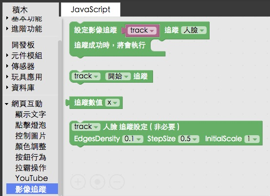

<!-- @@master  = ../../_layout.html-->

<!-- @@block  =  meta-->

<title>教學範例 27：人臉追蹤點亮 LED 燈 :::: Webduino = Web × Arduino</title>

<meta name="description" content="隨著瀏覽器的效能越來越強大，我們開始可以透過許多的網頁技術，實現我們長久以來的想像，在這個範例中，將會使用網路攝影機，進行人臉追蹤，根據人臉的位置，來點亮 LED 燈。">

<meta itemprop="description" content="隨著瀏覽器的效能越來越強大，我們開始可以透過許多的網頁技術，實現我們長久以來的想像，在這個範例中，將會使用網路攝影機，進行人臉追蹤，根據人臉的位置，來點亮 LED 燈。">

<meta property="og:description" content="隨著瀏覽器的效能越來越強大，我們開始可以透過許多的網頁技術，實現我們長久以來的想像，在這個範例中，將會使用網路攝影機，進行人臉追蹤，根據人臉的位置，來點亮 LED 燈。">

<meta property="og:title" content="教學範例 27：人臉追蹤點亮 LED 燈" >

<meta property="og:url" content="https://webduino.io/tutorials/tutorial-27-tracking-face.html">

<meta property="og:image" content="https://webduino.io/img/tutorials/tutorial-27-01s.jpg">

<meta itemprop="image" content="https://webduino.io/img/tutorials/tutorial-27-01s.jpg">

<include src="../_include-tutorials.html"></include>

<!-- @@close-->

<!-- @@block  =  preAndNext-->

<include src="../_include-tutorials-content.html"></include>

<!-- @@close-->

<!-- @@block  =  tutorials-->

# 教學範例 27：人臉追蹤點亮 LED 燈

隨著瀏覽器的效能越來越強大，我們開始可以透過許多的網頁技術，實現我們長久以來的想像，在這個範例中，將會使用網路攝影機，進行人臉追蹤，根據人臉的位置，來點亮 LED 燈。

## 範例影片展示

<iframe class="youtube" src="https://www.youtube.com/embed/GxOh2Gv9GJA" frameborder="0" allowfullscreen></iframe>

## 接線與實作

因為這個範例只需要用到一顆 LED 燈，所以接線方式很簡單，首先，LED 燈有「長短腳」之分，長腳接「高電位」( 帶有數字的腳位 )，短腳接「低電位」( GND、接地 )，因此我們只要直接將 LED 插到腳位上即可，或使用麵包板與麵包線外接出來，在這裡**長腳接 10，短腳接 GND**。

接線示意圖：

實際接線照片：

## Webduino Blockly 操作解析

打開 Webduino Blockly 編輯工具 ( [https://blockly.webduino.io](https://blockly.webduino.io) )，因為這個範例會用網頁「影像追蹤」來顯示攝影機的影像，所以要先點選右上方「網頁互動測試」的按鈕，打開內嵌測試的網頁，用下拉選單選擇「影像追蹤」。

把開發板放到編輯畫面裡，填入對應的 Webduino 開發板名稱，開發板內放入 LED 的積木，名稱設定為 led，腳位設定 10。

如果要使用影像追蹤，點選左側「進階功能」的選項，選擇「影像追蹤」，裡面就會有對應的積木。

首先要放入影像追蹤模組，這邊我們會先設定要使用「人臉追蹤」還是「顏色追蹤」，範例將使用「人臉追蹤」，選擇好了之後，就要來設定追蹤成功的動作。

在執行動作內放入邏輯判斷的積木，判斷如果人臉的 X 座標數值大於 100 的時候，就讓 LED 燈亮起，反之小於 100 就讓 LED 燈熄滅。

點選下拉選單，可以看到除了追蹤 X 座標外，還可以追蹤 Y 座標、寬度、高度與 total 數量，如果是顏色追蹤，也可以選擇追蹤出來的顏色色彩。

放入開始追蹤的積木，確認開發板上線 ( 點選「[檢查連線狀態](https://webduino.io/device.html)」查詢 )，點選紅色的執行按鈕，右邊的網頁就會出現攝影機的影像，就可以開始追蹤了。

如果發現沒有反應，因為瀏覽器有安全性限至 ( 要啟用網路攝影機會有隱私及安全性問題 )，解決的方法就是把網址改成 https 開頭，就可以順利執行。

如果想知道追蹤數值，我們可以利用「進階功能」的「控制台顯示」，利用控制台 ( console ) 來顯示追蹤數值，因為要使用瀏覽器的控制台，我們就要把控制台打開，在 windows 可以按 F12，Mac 可以按 option + command + i，。

到這邊，基本上就已經可以使用人臉影像追蹤囉。( 解答：[https://blockly.webduino.io/#-KCTXIwqV8sEumJODx8D](https://blockly.webduino.io/#-KCTXIwqV8sEumJODx8D) )

##範例解析 ( [完整程式碼](https://bin.webduino.io/famar/1/edit?html,css,js,output)、[檢查連線狀態](https://webduino.io/device.html) )

HTML 的 header 引入 `webduino-all.min.js`，目的在讓瀏覽器可以支援 WebComponents 以及 Webduino 所有的元件，如果是用 Blockly 編輯工具產生的程式碼，則要額外引入 `webduino-blockly.js`。

	
	

除了上面兩支 JS，這裏我們還用了兩支 Open Source 的程式：tracking-min.js、face-min.js，用同樣的方法引入之後才可以使用人臉影像追蹤的功能

	
	

HTML 裏頭有一個 video 和 canvas，兩個的大小一樣，目的是用 video 顯示影像，然後用 canvas 分析影像並判斷人臉，然後用紅色方框將人臉框住。

	

	  <video id="demo-area-08-video" preload="" autoplay="" loop="" muted="" controls=""></video>
	  <canvas id="demo-area-08-canvas"></canvas>
	

CSS 的部分主要就是制定 video 與 canvas 的大小。

	#demo-area-08-content {
	  position: relative;
	  width: 100%;
	  max-width: 300px;
	  height: 200px;
	}

	#demo-area-08-video {
	  top: 0;
	  left: 0;
	  position: absolute;
	  width: 100%;
	  height: 100%;
	}

	#demo-area-08-canvas {
	  top: 0;
	  left: 0;
	  position: absolute;
	  width: 100%;
	  height: 100%;
	}

JavaScript 比較多一些，主要是使用 tracking 相關的方法，當中也有一些設定：`setInitialScale`、`setStepSize`、`setEdgesDensity`，分別代表取向的尺度、頻率和深度，當然如果設定的太精細，電腦就要耗費相對多的效能處理，反之如果追求速度，就可以設定的粗糙一些，但相對追蹤出來的準確度就會降低。( 詳細可以參考：[https://trackingjs.com/](https://trackingjs.com/) )  

如果要設定邊框顏色，可以從`strokeStyle`修改，預設的是紅色 #f00，然後這邊判斷就只是很簡單的 if 和 else，針對 data 的 x 屬性來判斷 ( 人臉追蹤預設會有 x、y、width、height 和 total，顏色追蹤則沒有 total，改成 color )

	var led;
	var track;

	boardReady('', function (board) {
	  board.samplingInterval = 20;
	  led = getLed(board, 10);
	  track = {};
	  track.canvas = document.getElementById("demo-area-08-canvas");
	  track.context = track.canvas.getContext("2d");
	  track.myTracker = new tracking.ObjectTracker("face");
	  track.myTracker.setInitialScale(4);
	  track.myTracker.setStepSize(0.5);
	  track.myTracker.setEdgesDensity(0.1);

	  track.myTracker.on("track", function(event) {
	    if (event.data.length === 0) {
	      track.context.clearRect(0, 0, track.canvas.width, track.canvas.height);
	    } else {
	      track.context.clearRect(0, 0, track.canvas.width, track.canvas.height);
	      event.data.forEach(function(data) {
	        console.log(data.x);
	    if (data.x > 100) {
	      led.on();
	    } else {
	      led.off();
	    }
	        if(data.color){
	          track.context.strokeStyle = track.storkColor[data.color];
	        }else{
	          track.context.strokeStyle = "#f00";
	        }
	        track.context.lineWidth = 5;
	        track.context.strokeRect(data.x, data.y, data.width, data.height-30);
	        track.context.font = "11px Helvetica";
	        track.context.fillStyle = "#fff";
	      });
	    }
	  });
	  track.trackerTask = tracking.track("#demo-area-08-video", track.myTracker, {
	    camera: true
	  });

	  track.context.clearRect(0, 0, track.canvas.width, track.canvas.height);
	  track.trackerTask.run();
	});

以上就是人臉影像追蹤的 Blockly 和程式碼簡介。   
完整程式碼：[https://bin.webduino.io/famar/1/edit?html,css,js,output](https://bin.webduino.io/famar/1/edit?html,css,js,output)  
解答：[https://blockly.webduino.io/#-KCTXIwqV8sEumJODx8D](https://blockly.webduino.io/#-KCTXIwqV8sEumJODx8D)

<!-- @@close-->