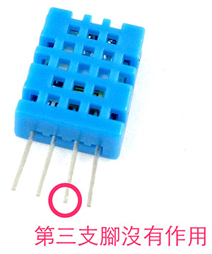
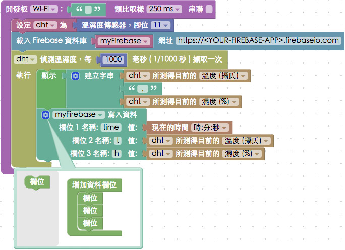

<!-- @@master  = ../../_layout.html-->

<!-- @@block  =  meta-->

<title>教學範例 29：使用 Firebase 資料庫記錄溫濕度 :::: Webduino = Web × Arduino</title>

<meta name="description" content="當我們會使用溫濕度傳感器獲取環境溫濕度之後，下一步一定是想要把溫濕度的數值儲存起來，這時候我們就要使用資料庫來記錄，但資料庫也不是每個人都會的，所以這邊我們將會使用 Google 的雲端資料庫服務：Firebase，透過 Webduino Blockly，我們就可以非常輕鬆的將溫濕度數值，存入雲端資料庫。">

<meta itemprop="description" content="當我們會使用溫濕度傳感器獲取環境溫濕度之後，下一步一定是想要把溫濕度的數值儲存起來，這時候我們就要使用資料庫來記錄，但資料庫也不是每個人都會的，所以這邊我們將會使用 Google 的雲端資料庫服務：Firebase，透過 Webduino Blockly，我們就可以非常輕鬆的將溫濕度數值，存入雲端資料庫。">

<meta property="og:description" content="當我們會使用溫濕度傳感器獲取環境溫濕度之後，下一步一定是想要把溫濕度的數值儲存起來，這時候我們就要使用資料庫來記錄，但資料庫也不是每個人都會的，所以這邊我們將會使用 Google 的雲端資料庫服務：Firebase，透過 Webduino Blockly，我們就可以非常輕鬆的將溫濕度數值，存入雲端資料庫。">

<meta property="og:title" content="教學範例 29：使用 Firebase 資料庫記錄溫濕度" >

<meta property="og:url" content="https://webduino.io/tutorials/tutorial-29-firebase-dht.html">

<meta property="og:image" content="https://webduino.io/img/tutorials/tutorial-29-01s.jpg">

<meta itemprop="image" content="https://webduino.io/img/tutorials/tutorial-29-01s.jpg">

<include src="../_include-tutorials.html"></include>

<!-- @@close-->

<!-- @@block  =  preAndNext-->

<include src="../_include-tutorials-content.html"></include>

<!-- @@close-->

<!-- @@block  =  tutorials-->

# 教學範例 29：使用 Firebase 資料庫記錄溫濕度

當我們會使用溫濕度傳感器獲取環境溫濕度之後，下一步一定是想要把溫濕度的數值儲存起來，這時候我們就要使用資料庫來記錄，但資料庫也不是每個人都會的，所以這邊我們將會使用 Google 的雲端資料庫服務：Firebase，透過 Webduino Blockly，我們就可以非常輕鬆的將溫濕度數值，存入雲端資料庫。

	溫濕度傳感器：<a href="https://webduino.io/buy/webduino-expansion-s.html" target="_blank">Webduino 擴充套件 S ( 支援馬克 1 號、Fly )</a>
	Webduino 開發板：<a href="https://webduino.io/buy/component-webduino-v1.html" target="_blank">Webduino 馬克一號</a>、<a href="https://webduino.io/buy/component-webduino-fly.html" target="_blank">Webduino Fly</a>、<a href="https://webduino.io/buy/component-webduino-uno-fly.html" target="_blank">Webduino Fly + Arduino UNO</a>

## 範例影片展示

<iframe class="youtube" src="https://www.youtube.com/embed/g2vcIGukV6k" frameborder="0" allowfullscreen></iframe>

## 接線與實作

溫濕度傳感器有四隻針腳，第一隻針腳為 v ( 接 3.3V )，第二隻為 data ( 接 10 )，第三隻沒有作用，為 N/C，第四隻為 GND。

可以直接將溫濕度傳感器接在馬克 1 號上，或利用麵包板接線出來。

實際接線照片：

	溫濕度傳感器：<a href="https://webduino.io/buy/webduino-expansion-s.html" target="_blank">Webduino 擴充套件 S ( 支援馬克 1 號、Fly )</a>
	Webduino 開發板：<a href="https://webduino.io/buy/component-webduino-v1.html" target="_blank">Webduino 馬克一號</a>、<a href="https://webduino.io/buy/component-webduino-fly.html" target="_blank">Webduino Fly</a>、<a href="https://webduino.io/buy/component-webduino-uno-fly.html" target="_blank">Webduino Fly + Arduino UNO</a>

## 註冊 Firebase

要使用 Firebase 就要先進行註冊，前往 Firebase 官方網站：[https://www.firebase.com/](https://www.firebase.com/)，有帳號的就可以直接登入，或直接註冊 sign up。

註冊完成登入後，我們就可以建立專案，這裏的專案就是我們的資料庫，每個資料庫都會有自己的網址。

點選 Manage App 就可以進入專案查看與設定，Firebase 都是使用 JSON 的格式儲存資料，這裏我們只要先了解資料會儲存在裡面，如果對於 Firebase 想瞭解更多，可以參考 Firebase 的教學 ( [https://www.firebase.com/docs/web/api/](https://www.firebase.com/docs/web/api/) )，在這裡我們只需要記下資料庫的網址，就可以開始記錄溫濕度囉！

## Webduino Blockly 操作解析

打開 Webduino Blockly 編輯工具 ( [https://blockly.webduino.io](https://blockly.webduino.io) )，因為這個範例除了用 Firebase 記錄溫濕度之外，還會用網頁「顯示文字」來顯示溫度或濕度，所以要先點選右上方「網頁互動測試」的按鈕，打開內嵌測試的網頁，用下拉選單選擇「顯示文字」。

把開發板放到編輯畫面裡，填入對應的 Webduino 開發板名稱，開發板內放入溫濕度積木，名稱設定為 dht，腳位設定為 11。

接著放入載入 Firebase 模組的積木，把剛剛資料庫的網址貼在裡面，然後在下面放入每 1000 毫秒 ( 1 秒 ) 偵測溫濕度的積木，注意，不要把載入 Firebase 模組的積木放到裡面，不然就會變成每一秒載入一次模組。

在每一秒偵測溫濕度的肚子裡，先放入顯示溫濕度數值的積木，讓溫濕度可以顯示在右邊的網頁，然後放入 Firebase 的積木，這裏我們可以用藍色小齒輪增加欄位，填入欄位名稱，並將溫濕度和當下的時間放在後面。

到這邊就已經完成了用 Firebase 記錄溫濕度數值，確認開發板上線 ( 點選「[檢查連線狀態](https://webduino.io/device.html)」查詢 )，點選紅色的執行按鈕，將網頁切換至 Firebase，就會看到資料出現了。( 解答：[http://blockly.webduino.io/#-KE9NjIuBmQ81j-tnYu7](http://blockly.webduino.io/#-KE9NjIuBmQ81j-tnYu7) )

##範例解析 ( [完整程式碼](https://bin.webduino.io/vohen/1/edit?html,css,js,output)、[檢查連線狀態](https://webduino.io/device.html) )

HTML 的 header 引入 `webduino-all.min.js`，目的在讓瀏覽器可以支援 WebComponents 以及 Webduino 所有的元件，如果是用 Blockly 編輯工具產生的程式碼，則要額外引入 `webduino-blockly.js`。

	
	

因為我們使用 Firebase，所以還要再額外載入 Firebase 的 JavaScript。( 從他們的官方網站可以看到連結 [https://www.firebase.com/docs/web/quickstart.html](https://www.firebase.com/docs/web/quickstart.html) )

	

HTML 裏頭只有一個 span 顯示溫濕度數值。

	123

JavaScript 的第一個 function 是獲取當下時間的函式，當我們呼叫這段函式就可以獲得當前時間，在 boardReady 裡面，使用了 Firebase 提供的 API，我們利用 push 的指令將格式為物件的數值記錄到資料庫裡。	

	var dht;
	var myFirebase;

	function get_time(t) {
	  var varTime = new Date(),
	    varHours = varTime.getHours(),
	    varMinutes = varTime.getMinutes(),
	    varSeconds = varTime.getSeconds();
	  var varNow;
	  if (t == "hms") {
	    varNow = varHours + ":" + varMinutes + ":" + varSeconds;
	  } else if (t == "h") {
	    varNow = varHours;
	  } else if (t == "m") {
	    varNow = varMinutes;
	  } else if (t == "s") {
	    varNow = varSeconds;
	  }
	  return varNow;
	}

	boardReady('', async function (board) {
	  board.samplingInterval = 250;
	  dht = getDht(board, 11);
	  myFirebase = new Firebase("https://<YOUR-FIREBASE-APP>.firebaseio.com");
	  dht.read(function(evt){
	    document.getElementById("demo-area-01-show").innerHTML = ([dht.temperature,' , ',dht.humidity].join(''));
	    myFirebase.push({
	      time:get_time("hms"),
	      t:dht.temperature,
	      h:dht.humidity
	    });
	  }, 1000);
	});

以上就是用 Firebase 做為資料庫，記錄溫濕度的數值。   
完整程式碼：[https://bin.webduino.io/vohen/1/edit?html,css,js,output](https://bin.webduino.io/vohen/1/edit?html,css,js,output)  
解答：[http://blockly.webduino.io/#-KE9NjIuBmQ81j-tnYu7](http://blockly.webduino.io/#-KE9NjIuBmQ81j-tnYu7)

	溫濕度傳感器：<a href="https://webduino.io/buy/webduino-expansion-s.html" target="_blank">Webduino 擴充套件 S ( 支援馬克 1 號、Fly )</a>
	Webduino 開發板：<a href="https://webduino.io/buy/component-webduino-v1.html" target="_blank">Webduino 馬克一號</a>、<a href="https://webduino.io/buy/component-webduino-fly.html" target="_blank">Webduino Fly</a>、<a href="https://webduino.io/buy/component-webduino-uno-fly.html" target="_blank">Webduino Fly + Arduino UNO</a>

<!-- @@close-->