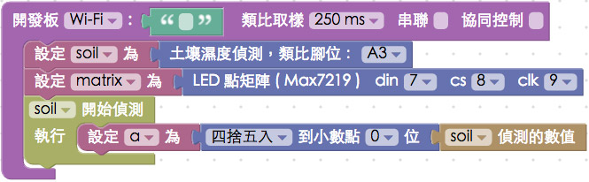

<!-- @@master  = ../../_layout.html-->

<!-- @@block  =  meta-->

<title>教學範例 31：偵測土壤濕度並由 LED 點矩陣顯示 :::: Webduino = Web × Arduino</title>

<meta name="description" content="我們可以利用土壤濕度計插入土中偵測土壤濕度，原理其實是偵測兩塊金屬片的導電度換算成濕度，在這個例子裡，我們透過 LED 點矩陣來顯示偵測到的濕度數值，當濕度高達 100 的時候就會播放動畫。 ">

<meta itemprop="description" content="我們可以利用土壤濕度計插入土中偵測土壤濕度，原理其實是偵測兩塊金屬片的導電度換算成濕度，在這個例子裡，我們透過 LED 點矩陣來顯示偵測到的濕度數值，當濕度高達 100 的時候就會播放動畫。 ">

<meta property="og:description" content="我們可以利用土壤濕度計插入土中偵測土壤濕度，原理其實是偵測兩塊金屬片的導電度換算成濕度，在這個例子裡，我們透過 LED 點矩陣來顯示偵測到的濕度數值，當濕度高達 100 的時候就會播放動畫。 ">

<link rel="canonical" href="https://tutorials.webduino.io/zh-tw/docs/basic/sensor/soil.html">

<meta property="og:title" content="教學範例 31：偵測土壤濕度並由 LED 點矩陣顯示" >

<meta property="og:url" content="https://webduino.io/tutorials/tutorial-31-soil-max7219.html">

<meta property="og:image" content="https://webduino.io/img/tutorials/tutorial-31-01s.jpg">

<meta itemprop="image" content="https://webduino.io/img/tutorials/tutorial-31-01s.jpg">

<include src="../_include-tutorials.html"></include>

<!-- @@close-->

<!-- @@block  =  preAndNext-->

<include src="../_include-tutorials-content.html"></include>

<!-- @@close-->

<!-- @@block  =  tutorials-->

# 教學範例 31：偵測土壤濕度並由 LED 點矩陣顯示

我們可以利用土壤濕度計插入土中偵測土壤濕度，原理其實是偵測兩塊金屬片的導電度換算成濕度，在這個例子裡，我們透過 LED 點矩陣來顯示偵測到的濕度數值，當濕度高達 100 的時候就會播放動畫。 

	土壤濕度偵測模組：<a href="https://webduino.io/buy/webduino-expansion-s.html" target="_blank">Webduino 擴充套件 S ( 支援馬克 1 號、Fly )</a>
	LED 點矩陣：<a href="https://webduino.io/buy/webduino-package-plus.html" target="_blank">Webduino 基本套件 Plus  ( 支援馬克 1 號、Fly )</a>
	Webduino 開發板：<a href="https://webduino.io/buy/component-webduino-v1.html" target="_blank">Webduino 馬克一號</a>、<a href="https://webduino.io/buy/component-webduino-fly.html" target="_blank">Webduino Fly</a>、<a href="https://webduino.io/buy/component-webduino-uno-fly.html" target="_blank">Webduino Fly + Arduino UNO</a>

## 範例影片展示

<iframe class="youtube" src="https://www.youtube.com/embed/ppweeGJD0nw" frameborder="0" allowfullscreen></iframe>

## 接線與實作

「土壤濕度偵測模組」有三支針腳，分別是訊號腳、GND 和 VCC，由於我們還要利用 LED 點矩陣來顯示數值，LED 點矩陣也需要用到 GND 與 VCC，所以我們利用麵包板外接出來，VCC 接在開發板的 VCC，GND 接 GND，土壤濕度偵測模組的訊號腳接在 A3，LED 點矩陣的 DIN 接 7，CS 接 8，CLK 接 9。

馬克一號接線示意圖：

Fly 接線示意圖：

實際接線照片：

	土壤濕度偵測模組：<a href="https://webduino.io/buy/webduino-expansion-s.html" target="_blank">Webduino 擴充套件 S ( 支援馬克 1 號、Fly )</a>
	LED 點矩陣：<a href="https://webduino.io/buy/webduino-package-plus.html" target="_blank">Webduino 基本套件 Plus  ( 支援馬克 1 號、Fly )</a>
	Webduino 開發板：<a href="https://webduino.io/buy/component-webduino-v1.html" target="_blank">Webduino 馬克一號</a>、<a href="https://webduino.io/buy/component-webduino-fly.html" target="_blank">Webduino Fly</a>、<a href="https://webduino.io/buy/component-webduino-uno-fly.html" target="_blank">Webduino Fly + Arduino UNO</a>

## Webduino Blockly 操作解析

打開 Webduino Blockly 編輯工具 ( [https://blockly.webduino.io](https://blockly.webduino.io) )，把開發板放到編輯畫面裡，填入對應的 Webduino 開發板名稱，然後放入土壤濕度偵測以及 LED 點矩陣的積木，並選擇對應的腳位。

放入開始偵測的積木，這裏先用一個變數來裝載偵測到的數值，同時我們也對這個數值做四捨五入到小數點零位 ( 因為待會會重複用到這個數值，用一個變數才不會修改的時候要修改太多地方，然後四捨五入是因為 LED 點矩陣待會只會顯示整數 )。

放入「顯示」的積木，讓偵測到的數值同步顯示在「網頁互動區」裡頭，接著使用「邏輯」的積木，讓小於某個數值的時候，點矩陣會顯示當前數字，大於某的數值的時候會播放動畫 ( 這裏設定為大於等於 100 的時候 )。

到這邊就已經完成了，確認開發板上線 ( 點選「[檢查連線狀態](https://webduino.io/device.html)」查詢 )，點選右上方紅色按鈕執行，裝一杯水，把土壤濕度偵測模組插到水中，就會看到數值的變化。
( 解答：[https://blockly.webduino.io/#-KKrc9v9vLO_zy7j075S](https://blockly.webduino.io/#-KKrc9v9vLO_zy7j075S) )

注意，因為不同的感測器數值會有不同，而且如果把 VCC 改接 3.3V，偵測到的最大值也會不同，如果需要進行數值尺度的轉換，可以使用「數值轉換的積木」。

##範例解析 ( [完整程式碼](https://bin.webduino.io/fijuw/edit?html,css,js,output)、[檢查連線狀態](https://webduino.io/device.html) )

HTML 的 header 引入 `webduino-all.min.js`，目的在讓瀏覽器可以支援 WebComponents 以及 Webduino 所有的元件，如果是用 Blockly 編輯工具產生的程式碼，則要額外引入 `webduino-blockly.js`。

	
	

JavaScript 裏頭上半部是 LED 點矩陣顯示圖案的程式，下半部就是偵測的程式，最主要我們使用了`on`的方法來偵測，回傳的`val`就是數值。	

	boardReady('', function (board) {
	  board.systemReset();
	  board.samplingInterval = 250;
	  soil = getSoil(board, 3);
	  matrix = getMax7219(board, 7, 8, 9);
	  soil.on(function(val){
	    soil.detectedVal = val;
	    a = Math.round(soil.detectedVal);
	    document.getElementById("demo-area-01-show").innerHTML = a;
	    if (a < 100) {
	      matrix.animateStop();
	      matrix.on("0000000000000000");
	      matrix.on((max7219_number(a)));
	    } else {
	      matrix.animateStop();
	      matrix.animate(max7219_horse("left","0c1e3e7c3e1e0c00"),100);
	    }
	  });
	});

以上就是偵測土壤濕度並由 LED 點矩陣顯示。   
完整程式碼：[https://bin.webduino.io/fijuw/edit?html,css,js,output](https://bin.webduino.io/fijuw/edit?html,css,js,output)  
解答：[https://blockly.webduino.io/#-KKrc9v9vLO_zy7j075S](https://blockly.webduino.io/#-KKrc9v9vLO_zy7j075S)

	土壤濕度偵測模組：<a href="https://webduino.io/buy/webduino-expansion-s.html" target="_blank">Webduino 擴充套件 S ( 支援馬克 1 號、Fly )</a>
	LED 點矩陣：<a href="https://webduino.io/buy/webduino-package-plus.html" target="_blank">Webduino 基本套件 Plus  ( 支援馬克 1 號、Fly )</a>
	Webduino 開發板：<a href="https://webduino.io/buy/component-webduino-v1.html" target="_blank">Webduino 馬克一號</a>、<a href="https://webduino.io/buy/component-webduino-fly.html" target="_blank">Webduino Fly</a>、<a href="https://webduino.io/buy/component-webduino-uno-fly.html" target="_blank">Webduino Fly + Arduino UNO</a>

<!-- @@close-->