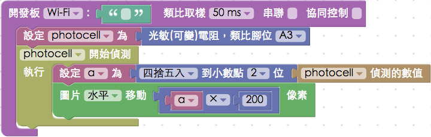

<!-- @@master  = ../../_layout.html-->

<!-- @@block  =  meta-->

<title>教學範例 34：可變電阻改變圖片位置 :::: Webduino = Web × Arduino</title>

<meta name="description" content="在「教學範例 17：光敏電阻獲取亮度數值」有介紹過光敏電阻的用法，而可變電阻的積木，也是同樣的使用方式，在這個範例當中，我們將使用可變電阻的旋鈕，透過旋轉旋鈕改變數值，就可以讓圖片的位置發生變化！">

<meta itemprop="description" content="在「教學範例 17：光敏電阻獲取亮度數值」有介紹過光敏電阻的用法，而可變電阻的積木，也是同樣的使用方式，在這個範例當中，我們將使用可變電阻的旋鈕，透過旋轉旋鈕改變數值，就可以讓圖片的位置發生變化！">

<meta property="og:description" content="在「教學範例 17：光敏電阻獲取亮度數值」有介紹過光敏電阻的用法，而可變電阻的積木，也是同樣的使用方式，在這個範例當中，我們將使用可變電阻的旋鈕，透過旋轉旋鈕改變數值，就可以讓圖片的位置發生變化！">

<link rel="canonical" href="https://tutorials.webduino.io/zh-tw/docs/basic/sensor/pot.html">

<meta property="og:title" content="教學範例 34：可變電阻改變圖片位置" >

<meta property="og:url" content="https://webduino.io/tutorials/tutorial-34-vr-image.html">

<meta property="og:image" content="https://webduino.io/img/tutorials/tutorial-34-01s.jpg">

<meta itemprop="image" content="https://webduino.io/img/tutorials/tutorial-34-01s.jpg">

<include src="../_include-tutorials.html"></include>

<!-- @@close-->

<!-- @@block  =  preAndNext-->

<include src="../_include-tutorials-content.html"></include>

<!-- @@close-->

<!-- @@block  =  tutorials-->

# 教學範例 34：可變電阻改變圖片位置

在「[教學範例 17：光敏電阻獲取亮度數值](https://webduino.io/tutorials/tutorial-17-photocell.html)」有介紹過光敏電阻的用法，而可變電阻的積木，也是同樣的使用方式，在這個範例當中，我們將使用可變電阻的旋鈕，透過旋轉旋鈕改變數值，就可以讓圖片的位置發生變化！ 

	可變電阻旋鈕：<a href="https://webduino.io/buy/webduino-expansion-m.html" target="_blank">Webduino 擴充套件 M ( 支援馬克 1 號、Fly )</a>
	Webduino 開發板：<a href="https://webduino.io/buy/component-webduino-v1.html" target="_blank">Webduino 馬克一號</a>、<a href="https://webduino.io/buy/component-webduino-fly.html" target="_blank">Webduino Fly</a>、<a href="https://webduino.io/buy/component-webduino-uno-fly.html" target="_blank">Webduino Fly + Arduino UNO</a>

## 範例影片展示

<iframe class="youtube" src="https://www.youtube.com/embed/Q5ErAOdnfCo" frameborder="0" allowfullscreen></iframe>

## 接線與實作

可變電阻有三支接腳，左右分別接 3.3V 和 GND，記得使用電阻保護，避免當可變電阻過小的時候發生短路，中間的腳位為類比訊號腳，我們接在 A3 的位置。( 如果你的 3.3V 與 GND 顛倒，會發現出來的數值和旋轉的方向相反 )

馬克一號接線示意圖：

Fly 接線示意圖：

實際接線圖：

	可變電阻旋鈕：<a href="https://webduino.io/buy/webduino-expansion-m.html" target="_blank">Webduino 擴充套件 M ( 支援馬克 1 號、Fly )</a>
	Webduino 開發板：<a href="https://webduino.io/buy/component-webduino-v1.html" target="_blank">Webduino 馬克一號</a>、<a href="https://webduino.io/buy/component-webduino-fly.html" target="_blank">Webduino Fly</a>、<a href="https://webduino.io/buy/component-webduino-uno-fly.html" target="_blank">Webduino Fly + Arduino UNO</a>

## Webduino Blockly 操作解析

打開 Webduino Blockly 編輯工具 ( [https://blockly.webduino.io](https://blockly.webduino.io) )，把開發板放到編輯畫面裡，填入對應的 Webduino 開發板名稱，然後放入可變電阻的積木，設定為 A3 腳位。

放入開始偵測的積木，一開始我們先用一個變數 a 來裝載偵測到的數值，這裡對偵測到的數值做四捨五入到小數點兩位的計算，接著把這個數值 ( 0 ~ 1 ) 乘以 200，作為圖片水平移動的數值。( 為了讓圖片移動比較明顯所以乘以兩百，也因為乘以百位數所以一開始四捨五入到小數點兩位 )

確認開發板上線 ( 點選「[檢查連線狀態](https://webduino.io/device.html)」查詢 )，點選右上方紅色按鈕執行，轉動可變電阻旋鈕，就會看到圖片的位置發生變化了。

( 解答：[http://blockly.webduino.io/#-KL_HHObSm1qXrX5vi1C](http://blockly.webduino.io/#-KL_HHObSm1qXrX5vi1C) )

如果你發現圖片移動的位置和你的旋轉方向不同，有兩個方法可以解決，第一個方法就是把 3.3v 和 GND 的電線對調，第二個方法可以從積木著手，因為可變電阻偵測到的數值是 0 ~ 1，要相反只要用 1 去減掉這個數值即可。

##範例解析 ( [完整程式碼](https://bin.webduino.io/fayu/edit?html,css,js,output)、[檢查連線狀態](https://webduino.io/device.html) )

HTML 的 header 引入 `webduino-all.min.js`，目的在讓瀏覽器可以支援 WebComponents 以及 Webduino 所有的元件，如果是用 Blockly 編輯工具產生的程式碼，則要額外引入 `webduino-blockly.js`。

	
	

HTML 的部分會放上一張圖片，如果要放自己的圖片就將網址放在 src 裡面。

	

	  
	

圖片位置會改變主要是因為我們的圖片 position 屬性是絕對的 ( absolute )，所以在這邊 CSS 要設定一下。

	#demo-area-03-container {
	  position: relative;
	  width: 150px;
	  height: 150px;
	}

	#demo-area-03-image {
	  position: absolute;
	  top: 0;
	  left: 0;
	  width: 150px;
	  height: 150px;
	  transition: .3s;
	  -webkit-transition: .3s;
	  -moz-transition: .3s;
	  transform-origin: 75px 75px;
	  -webkit-transform-origin: 75px 75px;
	  -moz-transform-origin: 75px 75px;
	}

JavaScript 基本上就是透過 on 來做接收，接收後會回傳 val 的數值。	

	var photocell;
	var a;

	boardReady('', function (board) {
	  board.systemReset();
	  board.samplingInterval = 50;
	  photocell = getPhotocell(board, 3);
	  photocell.on(function(val){
	    photocell.detectedVal = val;
	    a = (Math.round((photocell.detectedVal)*100))/100;
	    document.getElementById("demo-area-03-image").style.left = (a * 200)+"px";
	  });
	});

以上就是透過可變電阻旋鈕，改變圖片位置。   
完整程式碼：[https://bin.webduino.io/fayu/edit?html,css,js,output](https://bin.webduino.io/fayu/edit?html,css,js,output)  
解答：[http://blockly.webduino.io/#-KL_HHObSm1qXrX5vi1C](http://blockly.webduino.io/#-KL_HHObSm1qXrX5vi1C)

	可變電阻旋鈕：<a href="https://webduino.io/buy/webduino-expansion-m.html" target="_blank">Webduino 擴充套件 M ( 支援馬克 1 號、Fly )</a>
	Webduino 開發板：<a href="https://webduino.io/buy/component-webduino-v1.html" target="_blank">Webduino 馬克一號</a>、<a href="https://webduino.io/buy/component-webduino-fly.html" target="_blank">Webduino Fly</a>、<a href="https://webduino.io/buy/component-webduino-uno-fly.html" target="_blank">Webduino Fly + Arduino UNO</a>

<!-- @@close-->