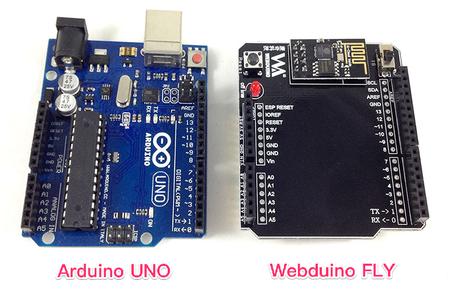
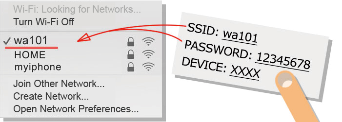
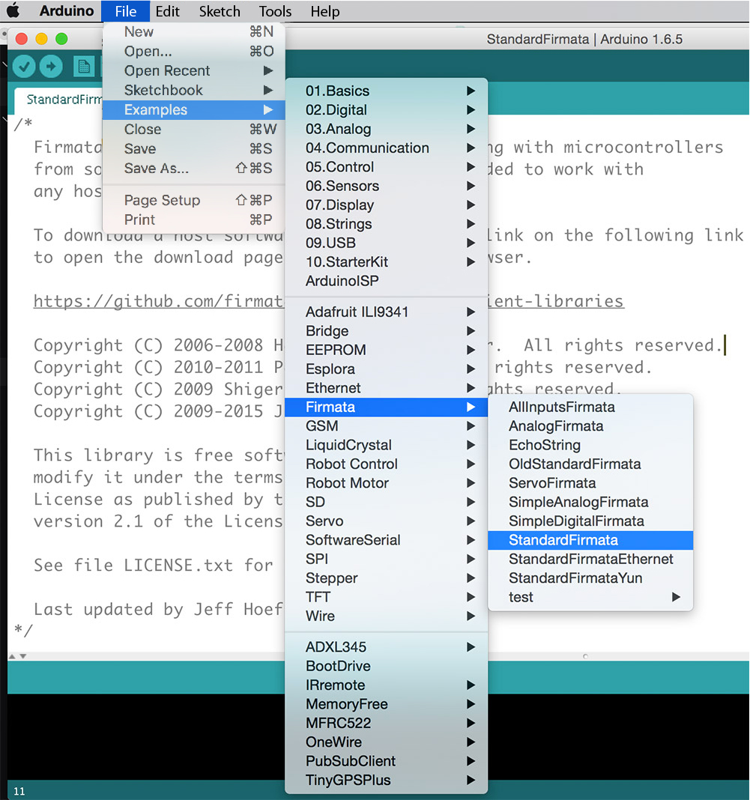

<!-- @@master  = ../../_layout.html-->

<!-- @@block  =  meta-->

<title>Webduino Fly Wi-Fi Setup :::: Webduino = Web × Arduino</title>

<meta name="description" content="Before you start using your Webduino Fly, the most critical step is setting up and configuring the Wi-Fi. The Webduino Fly is an extension board for the Arduino UNO, which equips your UNO with Wi-Fi, facilitating the complete functions of the Webduino technology. The configuration has the same logic as mobile wireless settings and each device requires a Wi-Fi setup process before connecting to the Internet.">

<meta itemprop="description" content="Before you start using your Webduino Fly, the most critical step is setting up and configuring the Wi-Fi. The Webduino Fly is an extension board for the Arduino UNO, which equips your UNO with Wi-Fi, facilitating the complete functions of the Webduino technology. The configuration has the same logic as mobile wireless settings and each device requires a Wi-Fi setup process before connecting to the Internet.">

<meta property="og:description" content="Before you start using your Webduino Fly, the most critical step is setting up and configuring the Wi-Fi. The Webduino Fly is an extension board for the Arduino UNO, which equips your UNO with Wi-Fi, facilitating the complete functions of the Webduino technology. The configuration has the same logic as mobile wireless settings and each device requires a Wi-Fi setup process before connecting to the Internet.">

<meta property="og:title" content="Webduino Fly Wi-Fi Setup" >

<meta property="og:url" content="https://webduino.io/tutorials/info-04-uno-setup.html">

<meta property="og:image" content="https://webduino.io/img/tutorials/info-04-01s.jpg">

<meta itemprop="image" content="https://webduino.io/img/tutorials/info-04-01s.jpg">

<include src="../_include-tutorials.html"></include>

<!-- @@close-->

<!-- @@block  =  preAndNext-->

<include src="../_include-tutorials-content.html"></include>

<!-- @@close-->

<!-- @@block  =  tutorials-->
# Webduino Fly Wi-Fi Setup

Before you start using your Webduino Fly, the most critical step is setting up and configuring the Wi-Fi. The Webduino Fly is an extension board for the Arduino UNO, which equips your UNO with Wi-Fi, facilitating the complete functions of the Webduino technology. The configuration has the same logic as mobile wireless settings and each device requires a Wi-Fi setup process before connecting to the Internet.

## Webduino Fly Wi-Fi Setup Step by step


- ### 1. Assemble the two boards, "Webduino Fly" and "Arduino UNO"

	Connect your "Webduino Fly" and "Arduino UNO" to create the "Webduino Fly (Extended)".

	

	

- ### 2. Wi-Fi Setup

	 On the "Webduino Fly" board, move the switch to STA mode. Then, plug in the board into a power source.

	

- ### 3. Connect your computer to the board

	Search for the SSID of the Webduino Fly on the list of available networks with your Wi-Fi capable computer or device. The default SSID is wa101. After typing in the password (the default is 12345678), your computer or mobile device will connect to the Webduino Fly. 

	

- ### 4. Fill in the Wi-Fi information

	Open "<b>http://192.168.4.1</b>" on your web browser. Type in your Wi-Fi network SSID and PASSWORD. (Note that, the SSID and PASSWORD here is referring to your AP's, **not the Webduino Fly's**. (The SSID and PASSWORD must only contain alphanumeric characters, with a maximum of 14 characters for each.)

	

- ### 5. Reboot the Webduino Fly Board

	After you type in your Wi-Fi's SSID and PASSWORD, press "submit". The Webduino will initialize and if an "OK" shows on screen it can be connected to Wi-Fi (If no "OK" shows on the screen, please go back to Step 2 and start the setup process over).

	

	When the "OK" shows on the screen, **remove the power on the Webduino Fly board and move the switch to AP**. Then connect the power and restart the Webduino Fly.

	

- ### 6. Confirm the connection

	Once you reboot the Webduino Fly use the Internet connection on your computer or mobile device to open the webpage [https://webduino.io/device.html](https://webduino.io/device.html). Then type in the SSID you used to name your Webduino Fly to check the connection. **If you see an "OK" on the screen, you can start using your Webduino Fly.** If there is no response from the Webduino board, you need to reboot the Webduino Fly. If there is still no connection restart the setup starting from step 2.

	

	**The LED light will be off when the connection is successful.** However, the LED will  blink when the connection is unsuccessful. If this is the case, please reboot the Webduino board. If there is still no connection restart the setup starting from step 2.

	

- ### 7. Connect the Webduino Board to Wi-Fi

	Now the Webduino Fly can connect to Wi-Fi and cloud servers automatically. (Check our First Tutorial: [Control single LED light](tutorial-01-led.html) )

- ### 8. Notice about Firmata

	The Webduino Fly follows the Arduino Firmata protocol, meaning that the Arduino itself **has to burn the Firmata firmware**. We recommend you to check on Arduino IDE to make sure you have the standard Firmata. (Arduino IDE > File >Examples > Firmata>StandardFirmata)

	

## Compiling Errors for the Arduino IDE 1.6.7 

Some users have met compiling errors when using Arduino IDE 1.6.7 because of incompatibilities between Firmata versions 2.4.4 and 2.5.1. If you have these versions, you can reinstall the older versions 1.6.6 or 1.6.5, (Download it here: [https://www.arduino.cc/en/Main/OldSoftwareReleases#previous](https://www.arduino.cc/en/Main/OldSoftwareReleases#previous) ) or **reinstall Firmata 2.4.4 or 2.4.3 though the following steps**.

Step 1: Open Library Manager (Sketch>Include Library>Manage Libraries)

Step 2: Search for "Firmata", check if your version is 2.5.1.

Step 3: Choose Firmata version 2.4.4 or 2.4.3, and then press "Install". Now you can reinstall the older version, and begin burning firmwares!

<!-- @@close-->