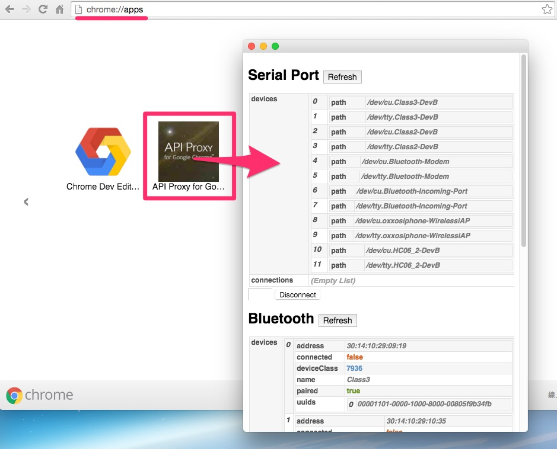
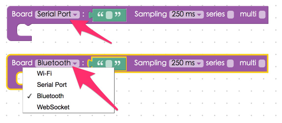

<!-- @@master  = ../../_layout.html-->

<!-- @@block  =  meta-->

<title>Chrome API Proxy Installation Guide :::: Webduino = Web × Arduino</title>

<meta name="description" content="Wi-Fi is not the only connection that can control your Arduino UNO. If you install the Chrome API Proxy released by Webduino, you can control many components and sensors and enjoy the convenience of using Webduino through a serial port or a Bluetooth connection.">

<meta itemprop="description" content="Wi-Fi is not the only connection that can control your Arduino UNO. If you install the Chrome API Proxy released by Webduino, you can control many components and sensors and enjoy the convenience of using Webduino through a serial port or a Bluetooth connection.">

<meta property="og:description" content="Wi-Fi is not the only connection that can control your Arduino UNO. If you install the Chrome API Proxy released by Webduino, you can control many components and sensors and enjoy the convenience of using Webduino through a serial port or a Bluetooth connection.">

<meta property="og:title" content="Chrome API Proxy Installation Guide" >

<meta property="og:url" content="https://webduino.io/tutorials/info-05-chrome-api-proxy.html">

<meta property="og:image" content="https://webduino.io/img/tutorials/info-05-01s.jpg">

<meta itemprop="image" content="https://webduino.io/img/tutorials/info-05-01s.jpg">

<include src="../_include-tutorials.html"></include>

<!-- @@close-->

<!-- @@block  =  preAndNext-->

<include src="../_include-tutorials-content.html"></include>

<!-- @@close-->

<!-- @@block  =  tutorials-->
# Chrome API Proxy Installation Guide

Wi-Fi is not the only connection that can control your Arduino UNO. If you install the Chrome API Proxy released by Webduino, you can control many components and sensors and enjoy the convenience of using Webduino through a serial port or a Bluetooth connection.

## Install

First, combine the Webduino Fly with the Arduino UNO.

 

In order to use Bluetooth and Serial, we developed two Chrome extensions [API Proxy for Google Chrome](https://chrome.google.com/webstore/detail/api-proxy-for-google-chro/pddlkidaibpbhpkfbhkbeolbagpmkhhn?hl=en) and [API Proxy Agent for Google Chrome](https://chrome.google.com/webstore/detail/api-proxy-agent-for-googl/kdhdgaemffmpfmceolgbfpnfiafbjdkp?hl=en).

 

## Enable the Applications

After they are both installed, you can check the extensions through the link: ( chrome://extensions/ ) Make sure you enable both of them.

 

 

Back in "Applications" in Chrome, you will find an app named "API Proxy for Google Chrome". A popup window will show up once you click it. 

 

 

## How to Use

If you are using a serial port, you will see the "Path" on the pop-up window. (In Windows, it usually includes "COM" in the path. And on a MAC, it usually includes "/dev".) If you are using Bluetooth, you have to pair your board with the computer, so you will see the Bluetooth address after you succeed in pairing your devices.

 

 

Lastly, if you are using a serial port, remember to choose "Serial port" or "Bluetooth" when using [Webduino Blockly](https://blockly.webduino.io/?lang=en).

 

 

Now, every time your press the "Run Blocks" button, the board will be re-connected. (The board will be re-connected when LED stops flashing.) Now, you can use your board with a serial port or through a Bluetooth connection!!

 

## Burn Firmware

All Webduino boards follow the Arduino Firmata protocol, so you will have to burn the standard firmware on them. We suggest you to burn the firmware on Arduino IDE. (Go to Arduino IDE > Examples > Firmata > StandardFirmata)

 

 

## Notice

- If you are not able to use the board, please restart Chrome and the API Proxy Application.
- Make sure you also restart the Arduino IDE.

## Compiling Errors for the Arduino IDE 1.6.7

Some users have met compiling errors when using Arduino IDE 1.6.7 because of incompatibilities between Firmata versions 2.4.4 and 2.5.1. If you have these versions, you can reinstall the older versions 1.6.6 or 1.6.5, 
Download it here: [https://www.arduino.cc/en/Main/OldSoftwareReleases#previous](https://www.arduino.cc/en/Main/OldSoftwareReleases#previous) or **reinstall Firmata 2.4.4 or 2.4.3 though the following steps**.

Step 1: Open Library Manager (Sketch > Include Library > Manage Libraries)

Step 2: Search for "Firmata", check if your version is 2.5.1.

Step 3: Choose Firmata version **2.4.4 or 2.4.3**, and then press "Install". Now you can reinstall the older version, and begin burning firmwares!

<!-- @@close-->