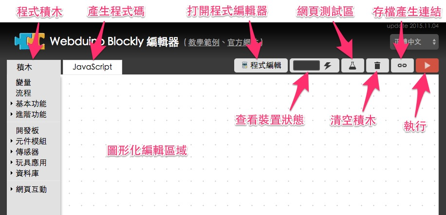
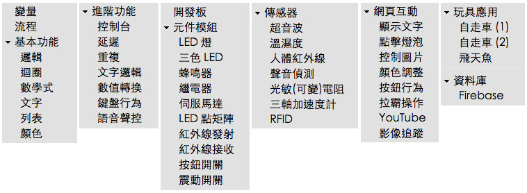
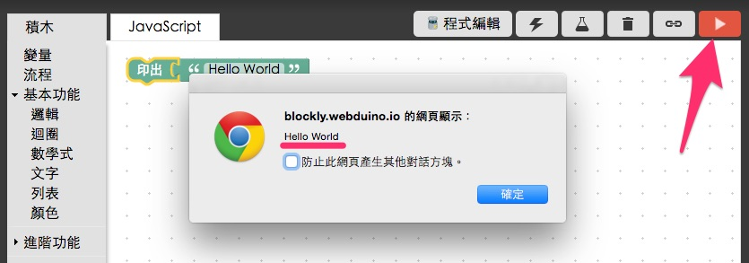
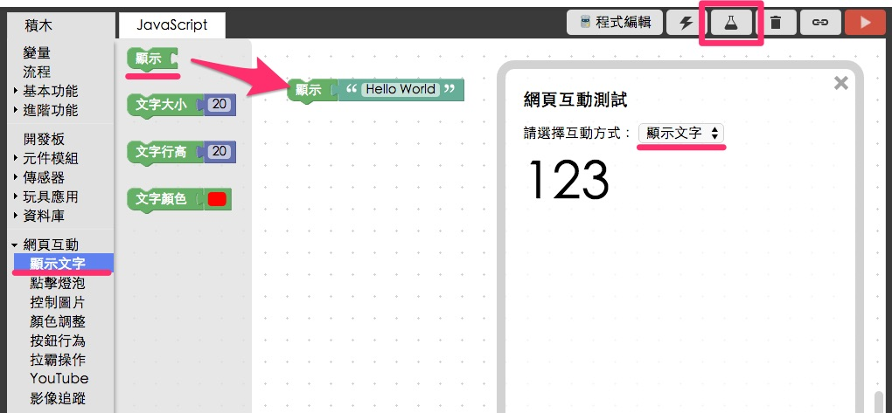
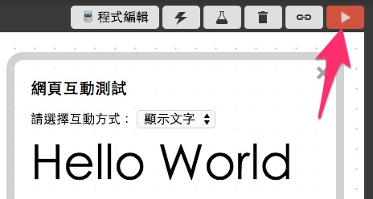
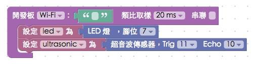

<!-- @@master  = ../../_layout.html-->

<!-- @@block  =  meta-->

<title>Webduino Blockly Basic Guide :::: Webduino = Web × Arduino</title>

<meta name="description" content="Webduino Blockly is a visual programming editor, adopting the Google Blockly system. Webduino Blockly will help developers who are not familiar with Web programming language or those who wish to realize the ideas quickly.">

<meta itemprop="description" content="Webduino Blockly is a visual programming editor, adopting the Google Blockly system. Webduino Blockly will help developers who are not familiar with Web programming language or those who wish to realize the ideas quickly.">

<meta property="og:description" content="Webduino Blockly is a visual programming editor, adopting the Google Blockly system. Webduino Blockly will help developers who are not familiar with Web programming language or those who wish to realize the ideas quickly.">

<meta property="og:title" content="Webduino Blockly Basic Guide" >

<meta property="og:url" content="https://webduino.io/tutorials/info-08-blockly-tutorial.html">

<meta property="og:image" content="https://webduino.io/img/tutorials/info-08-01s.jpg">

<meta itemprop="image" content="https://webduino.io/img/tutorials/info-08-01s.jpg">

<include src="../_include-tutorials.html"></include>

<!-- @@close-->

<!-- @@block  =  preAndNext-->

<include src="../_include-tutorials-content.html"></include>

<!-- @@close-->

<!-- @@block  =  tutorials-->
# Webduino Blockly Basic Guide

Webduino Blockly is a visual programming editor, adopting the Google Blockly system. Webduino Blockly will help developers who are not familiar with Web programming language or those who wish to realize the ideas quickly. 

The following instructions are the basic functions you need while using the Webduino, if you are familiar with the interface and features, please check our practical online tutorials, "[Webduino Blockly Project Examples](https://blockly.webduino.io/index-tutorials.html)".

## Introduction to the Interface

Webduino Blockly has 3 main parts: The Block and Javascript tabs, which includes "Blocks" and the "Code Generator". The buttons on the upper right of the workspace include the "Open Code Editor", "Check Device Status", "Web Demo Area", "Discard All Blocks", and "Run Blocks" buttons. Finally, the Side Menu consists all the "Blocks", and the white space in the middle is the "Workspace".

## Webduino Blocks

Webduino Blockly uses a variety of Blocks. All of the Blocks are located in the Side Menu on the left-hand side of the workspace. Here are the categories:

**Variables**: Variables are commonly used in programming. You can name and use the variables. 
**Functions**: A function is a group of statements that is given a name, and which can be called. 
**Standard**: Standard blocks include Logic, Loops, Math, Text, Lists, and Color blocks.  
**Advanced**: Advanced blocks include Console, Delay, Math Conversion, Repeat, Keyboard, Voice Control, Speech, and Mobile Device blocks.  
**Board**: You can use these blocks in the Webdino Private Cloud to detect the pins and status of Webduino Boards.  
**Components**: These are blocks for electronic components, e.g. LED, Buzzer, Relay, Servo Motor… and so on. 
**Sensors**: Blocks for different sensors, e.g Ultra Sonic, DHT, PIR Detection, Sound Detection, Photocells… and so on. 
**Gadgets**: Blocks for Gadgets. 
**Database**: Blocks for connecting with Firebase.
**Web Demo**: Blocks for interacting with the Web Demo Area.  

## Create a Pop-up Window on Screen 

Click "Text" under "Basic Function". Combine the "Print" and "[blank text]" blocks in the workspace. Then type in "Hello World" in the "[blank text]" block.

Press "Run Blocks" button on the upper right-hand side, and you will see a window popup showing "Hello World".

## Show Text in the Web Demo Area

Now we are going to practice how to interact with the web browser, so that you can use this function to control electronic components and sensors through a web browser in other examples. Go to "Web Demo" on the side menu, click on "Show Text", drag the "Show" block to the workspace, and then drag a "Text" block to the workspace and type in something in the block.

Open "Wed Demo Area" on the upper right-hand menu, and press "Run Blocks". Then you will see the text you entered on the “Web Demo Area”.

## Use "Click Button" is the Web Demo to Create a Pop-Up a Window

We can combine the functions mentioned above, interacting with the Web Demo Area in order to create a pop-up a window of text. First, from the "Web Demo" menu drag a "Click Button" block, a "Print" block, and a "[blank text]"" block to the workspace. Type in some text in the "[blank text]"" block and choose the button as shown in figure.

Click "Run Blocks", and a window of text will pop-up on screen.

## Control the Webduino Board

Finally, we get to use the Webduino board. Drag a "Board" block to the workspace. You can choose to connect by WiFi, serial port, or Bluetooth. Note that, if you wish to connect by serial port or Bluetooth, you must first install the Chrome Proxy API. (Check the "[Chrome API Proxy Guide](https://webduino.io/tutorials/info-05-chrome-api-proxy.html)" and "[Download & Burn Arduino Firmware](https://webduino.io/tutorials/info-07-arduino-ino.html)")

If you wish to connect to your board with WiFi. type in the name of your board then, click the tab "Check Device Status". You should only use your board when the status shows a green light.

Drag any of the Sensors or Electronic Components blocks to the workspace to combine them with the "Board" block. Now you can check out any of the other project examples using the Webduino board to learn about sensors and the electronic components and how they interact with each other. ([Tutorials](https://webduino.io/tutorials.html))

## Coder Generator

You can export all the blocks to JavaScript by clicking the "JavaScript" tab. (The output might fail, if the blocks are in the wrong order.)

Click "Copy to Clipboard", and you can use the codes in other editors.

## Open Code Editor

If you don't have a code editor, you can use the default editor. The editor button is located in the upper right-hand side of Webduino Blockly. Once clicked, you will be taken to the Webduino Bin, which is a custom, open source code editor from JSBin. 

Once you open the code editor, you would find that all the codes are imported automatically in the JavaScript tab. Now you can do all of your editing in JavaScript.  

The Webduino Bin editor offers you a convenient way to edit codes, so even the figures will be imported automatically.

## Save File

Never worry about losing your files. No matter if you are finished or not, just click the tab "Save and Link to Blocks" and then save the link to your bookmarks/favorite folder. You would see the saved page next time you open your browser. 

## Now you can start playing with your Webduino Blockly!

Practice these steps with your Webduino  and it will help you develop your knowledge of the Internet of Things!

Tutorials on Webduino’s Official Website: https://webduino.io/tutorials.html  
Project Examples for the Webduino Blockly: https://blockly.webduino.io/index-tutorials.html

<!-- @@close-->