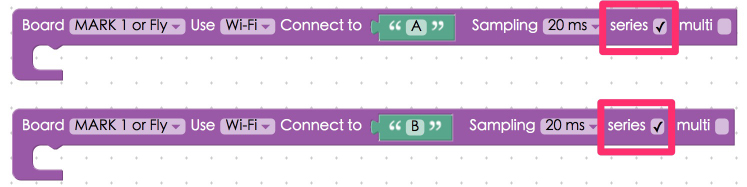
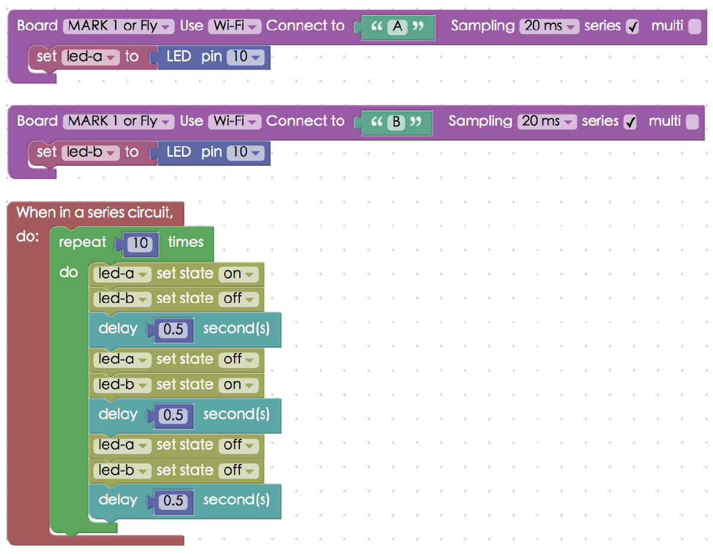
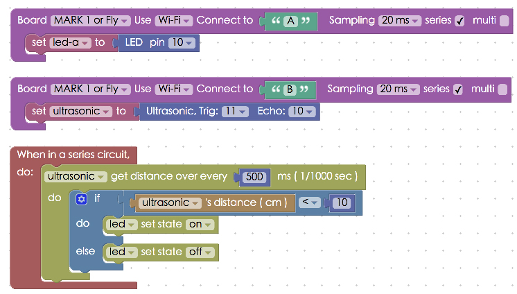

<!-- @@master  = ../../_layout.html-->

<!-- @@block  =  meta-->

<title>Interaction with Multiple Webduino Boards :::: Webduino = Web × Arduino</title>

<meta name="description" content="It is really simple to interact with multiple Webduino boards. In the Web programming logic, Webduino boards can be seen as “functions”, and the components or sensors can be seen as “variables”. So when the boards go online, all the functions will be executed,
You will need to use Webduino Blockly to do the exercises:">

<meta itemprop="description" content="It is really simple to interact with multiple Webduino boards. In the Web programming logic, Webduino boards can be seen as “functions”, and the components or sensors can be seen as “variables”. So when the boards go online, all the functions will be executed,
You will need to use Webduino Blockly to do the exercises:">

<meta property="og:description" content="It is really simple to interact with multiple Webduino boards. In the Web programming logic, Webduino boards can be seen as “functions”, and the components or sensors can be seen as “variables”. So when the boards go online, all the functions will be executed,
You will need to use Webduino Blockly to do the exercises:">

<meta property="og:title" content="Interaction with Multiple Webduino Boards" >

<meta property="og:url" content="https://webduino.io/tutorials/info-09-multi-webduino-board.html">

<meta property="og:image" content="https://webduino.io/img/tutorials/info-09-01s.jpg">

<meta itemprop="image" content="https://webduino.io/img/tutorials/info-09-01s.jpg">

<include src="../_include-tutorials.html"></include>

<!-- @@close-->

<!-- @@block  =  preAndNext-->

<include src="../_include-tutorials-content.html"></include>

<!-- @@close-->

<!-- @@block  =  tutorials-->
# Interaction with Multiple Webduino Boards

It is really simple to interact with multiple Webduino boards. In the Web programming logic, Webduino boards can be seen as "functions", and the components or sensors can be seen as "variables". So when the boards go online, all the functions will be executed,
You will need to use [Webduino Blockly Editor](https://blockly.webduino.io/?lang=en) to do the exercises.

In this tutorial, you will be using an LED and an Ultrasonic sensor. If you want to learn more about their applications, check out the tutorials:

1) [Project Example 1: Project Example 1: Control a Single LED](tutorial-01-led.html)  
2) [Project Example 5: Project Example 5: Use An Ultrasonic Sensor](tutorial-05-ultrasonic.html)

## Instructions for using the Webduino Blockly

First, place the "Board" blocks in the workspace, and mark the "**Series**" checkboxes  on the boards that you want to be connected.

Place LED blocks in each stack, and rename them. Make sure to differentiate their names, since they are different items.

Add a "**When in a series circuit, do**" block to the workspace. Place all of the events within the slot of this block. This is to make sure that all of the events execute after the boards go online.

To make the LEDs blink add "LED set state" blocks and "Delay # seconds" blocks to the stack.

When you've done all the previous steps, check if the board is online (click "[Check Device Status](https://webduino.io/device.html)") and click on the red execution button "Run Blocks". You will see the two LEDs blinking. (Check your stack setup with this example here: [https://blockly.webduino.io/?lang=en#-KZuPowxRuAFQd9EmjeR](https://blockly.webduino.io/?lang=en#-KZuPowxRuAFQd9EmjeR)).

You can also make LED interact with ultrasonic sensor, just connect one of the boards to an ultrasonic sensor. Here we connect board B to an ultrasonic sensor. The distance detected by the ultrasonic sensor on board B will control the LED on board A.

Then create an event within a "When in a series circuit, do" board. Set up a stack so that when the sensor detects a distance less than 10 centimeters the LED will turn off.

Again, check if the board is online (click "[Check Device Status](https://webduino.io/device.html)") and click on the red execution button "Run Blocks". You will see the LED light up when there is an obstacle in front of ultrasonic sensor! (Check your stack setup with this example here: [https://blockly.webduino.io/?lang=en#-KZuJMsjp5KPXiJBlG6m](https://blockly.webduino.io/?lang=en#-KZuJMsjp5KPXiJBlG6m)).

<!-- @@close-->