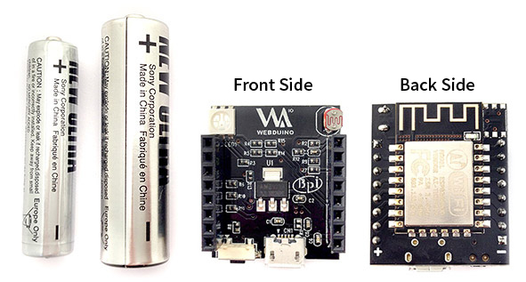
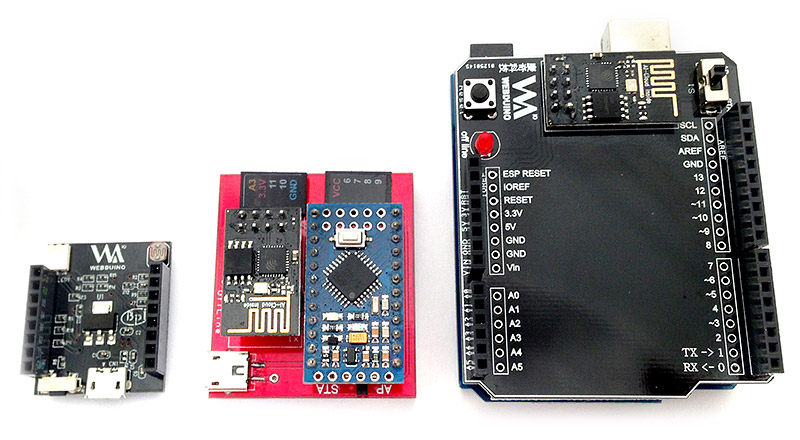

<!-- @@master  = ../../_layout.html-->

<!-- @@block  =  meta-->

<title>Introduction to Webduino Smart :::: Webduino = Web × Arduino</title>

<meta name="description" content="Webduino Smart is a ground-breaking development board. Unlike Webduino Mark 1 and Webduino Fly, which need to combine with Arduino boards, Webduino Smart can function with the Internet and WebSocket independently. It will be a path to lead an efficient and effective development of IoT.">

<meta itemprop="description" content="Webduino Smart is a ground-breaking development board. Unlike Webduino Mark 1 and Webduino Fly, which need to combine with Arduino boards, Webduino Smart can function with the Internet and WebSocket independently. It will be a path to lead an efficient and effective development of IoT.">

<meta property="og:description" content="Webduino Smart is a ground-breaking development board. Unlike Webduino Mark 1 and Webduino Fly, which need to combine with Arduino boards, Webduino Smart can function with the Internet and WebSocket independently. It will be a path to lead an efficient and effective development of IoT.">

<meta property="og:title" content="Introduction to Webduino Smart" >

<meta property="og:url" content="https://webduino.io/tutorials/smart-01-information.html">

<meta property="og:image" content="https://webduino.io/img/tutorials/smart-01-information-s.jpg">

<meta itemprop="image" content="https://webduino.io/img/tutorials/smart-01-information-s.jpg">

<include src="../_include-tutorials.html"></include>

<!-- @@close-->

<!-- @@block  =  preAndNext-->

<include src="../_include-tutorials-content.html"></include>

<!-- @@close-->

<!-- @@block  =  tutorials-->
# Introduction to Webduino Smart

Webduino Smart is a ground-breaking development board. Unlike Webduino Mark 1 and Webduino Fly, which need to combine with Arduino boards, Webduino Smart can function with the Internet and WebSocket independently. It will be a path to lead an efficient and effective development of IoT.

## On-board Components and Pins

Webduino Smart has a photocell sensor, an RGB LED, and a micro switch button onboard. The photocell is connected to the AD pin, and the RGB (Red, Geen, Blue) LED is connected to pins 15, 12, and 13 respectively **(The LED is a common cathode, whereas most of the examples on this site use common anode RGB LED.)** And the micro switch button is connected to pin 4. Please take note when you use these pins.

 

## The Appearence

Board dimensions: 3cm in length, 2.5cm in width, 1.3cm in height, and a weight of 85 grams. Digital pins: 0, 2, 4, 5, 14, and 16. 
PWM pins: 12, 13, 15. Analog Pin: AD (A0). 
Other pins: TX, RX, 3.3V, VCC, RST, and GRD.

The front and back images:

360 degree overview:

Reference with AA & AAA batteries:

 

## Replace the stickers

You can replace the original stickers on the board. Just cut the stickers that included in the package, and paste it on both sides. Please note that there are 4 stickers, **L-out(outside on the left)**, **L-in(inside on the left)**, **R-out(outside on the right)**, and **R-in(inside on the right)** each.

You could refer to the 360 degree overview for pasting them correctly.

## Webduino Series

From the left, Webduino Smart, Webduino Mark 1, and Webduino Fly.

<!-- @@close-->