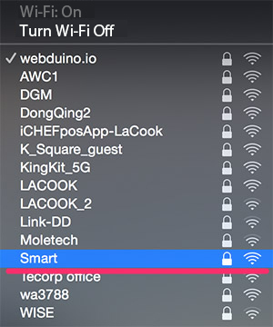
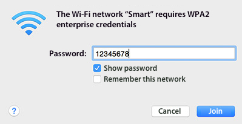
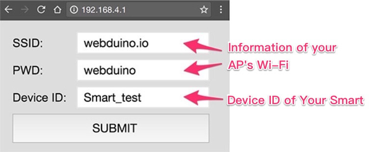
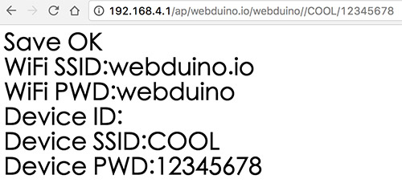
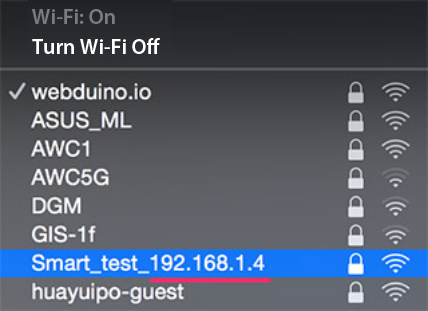
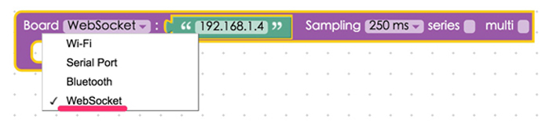
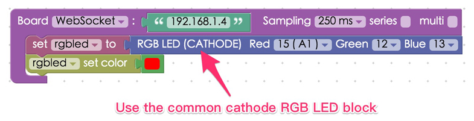
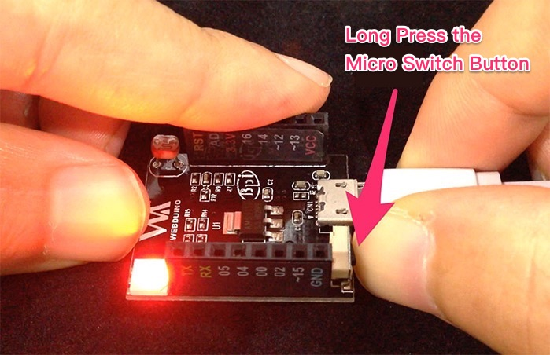
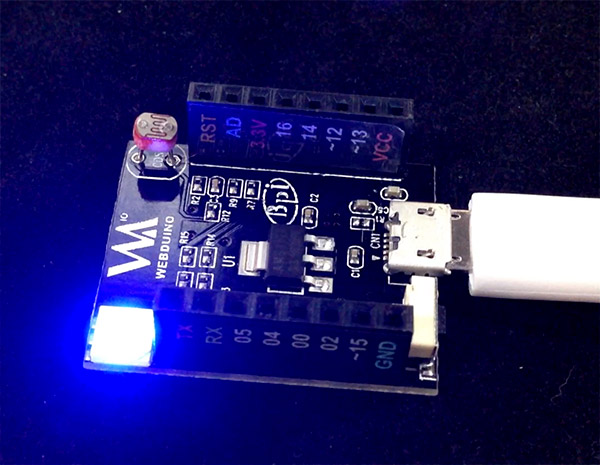

<!-- @@master  = ../../_layout.html-->

<!-- @@block  =  meta-->

<title>Webduino Smart Wi-Fi Setup :::: Webduino = Web × Arduino</title>

<meta name="description" content="Before you start using your Webduino Smart, you must set up your WiFi. The main purpose of this setup is to enable Webduino Smart to connect to the Internet or WebSocket. Using this setup, you can define the board's name and password, and update it through the Internet.">

<meta itemprop="description" content="Before you start using your Webduino Smart, you must set up your WiFi. The main purpose of this setup is to enable Webduino Smart to connect to the Internet or WebSocket. Using this setup, you can define the board's name and password, and update it through the Internet.">

<meta property="og:description" content="Before you start using your Webduino Smart, you must set up your WiFi. The main purpose of this setup is to enable Webduino Smart to connect to the Internet or WebSocket. Using this setup, you can define the board's name and password, and update it through the Internet.">

<meta property="og:title" content="Webduino Smart Wi-Fi Setup" >

<meta property="og:url" content="https://webduino.io/tutorials/smart-02-setup.html">

<meta property="og:image" content="https://webduino.io/img/tutorials/smart-02-setup-s.jpg">

<meta itemprop="image" content="https://webduino.io/img/tutorials/smart-02-setup-s.jpg">

<include src="../_include-tutorials.html"></include>

<!-- @@close-->

<!-- @@block  =  preAndNext-->

<include src="../_include-tutorials-content.html"></include>

<!-- @@close-->

<!-- @@block  =  tutorials-->
# Webduino Smart Wi-Fi Setup

Before you start using your Webduino Smart, you must set up your WiFi. The main purpose of this setup is to enable Webduino Smart to connect to the Internet or WebSocket. Using this setup, you can define the board's name and password, and update it through the Internet.

## Step 1: Plug In, and Enter the SSID & Password

Like the Webduino Mark 1 & Webduino Fly, Webduino Smart has to connect to Wi-Fi by setting up a SSID & password. However, Webduino Smart can be used in both Internet Protocol and WebSocket Protocol, which means that the devices can be used with LAN.

Provide power to your Webduino Smart so the board can be found on your PC, laptop, or mobile device. (At first the red light on the board will blink, then it will stay on once it is ready.)

Connect to "Smart" by Wi-Fi, and type in the **default password of 12345678**. Now the board will be connected. 

 

## Step 2: Set Up SSID & Password for Wi-Fi, and Device ID

Open your internet browser (we recomend you use Chrome) and **type 192.168.4.1 into the address bar**. You will be directed to the setup page for the Webduino Smart. Fill in the Wi-Fi information and router ID. **Here the SSID & PW is referring to your AP's Wi-Fi.**

Press the "Submit" button, and the setup is successful when "Save OK" is showed on the screen.

 

## Step 3: Connect to LAN

After you have a successfully competed Steps 1 & 2 and Wi-Fi is setup, remove the power to your Webduino Smart, then plug it in again. The red light on your board will not stop blinking until your board has connected to LAN. Once it connects to LAN, the green light will flash. Now you can find **Smart_your device ID_192.168.XXX.XXX** under your Wi-Fi access points. Please take note of the IP address, which is the IP you need to use WebSocket. If the red light does not stop blinking, you need to restart the setup from Step 1.

 

## Step 4: Test Webduino Blockly

Open the page [https://blockly.webduino.io/?lang=en](https://blockly.webduino.io/?lang=en) to access Webduino Blockly. Drag a board block onto the workspace, choose "WebSocket" in the drop down list, and type in your IP. WebSocket has some limitions when using "https"; therefore, **you have to link to "http" instead**. 

Next, combine a RGB LED **(CATHODE)** block, located under "Components", set the red pin to 15, the green pin to 12, and blue pin to 13. Finally, set the RGB LED color to "Red".

Press "Run Blocks" and then the LED will light on in red. 
Check your stack setup with this example here: [https://goo.gl/y3TgqI](https://goo.gl/y3TgqI)

 

## Step 5: Update Firmware Through the Internet

Once you've successfully completed Step 3, which means your Webduino Smart is able to connect to Internet, you can easily update the firmware on your Webduino Smart. While connected to power, **PRESS and HOLD the Micro Switch button until the blue light comes on.** This will update the firmware.

After finishing the update, the blue light will turn off and the red light will blink, showing that it is connecting. Finally, a burst of green light means you can start using your Webduino Smart with updated firmware.

<!-- @@close-->