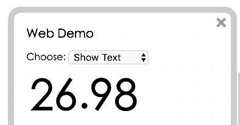
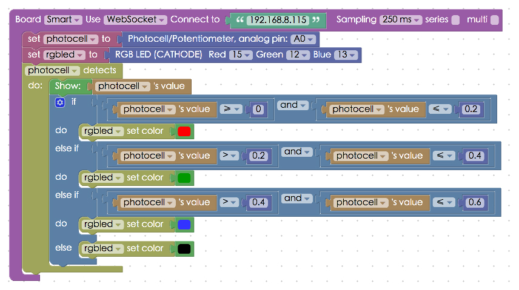

<!-- @@master  = ../../_layout.html-->

<!-- @@block  =  meta-->

<title>Photocell of the Webduino Smart :::: Webduino = Web × Arduino</title>

<meta name="description" content="The Webduino Smart has a few built-in sensors and components, and photocell is one of them. The photocell can be used to detect the light surrounding it. The photocell is connected to A0, which is the AD pin on the board. Therefore, when the photocell is in use, the AD pin is taken.">

<meta itemprop="description" content="The Webduino Smart has a few built-in sensors and components, and photocell is one of them. The photocell can be used to detect the light surrounding it. The photocell is connected to A0, which is the AD pin on the board. Therefore, when the photocell is in use, the AD pin is taken.">

<meta property="og:description" content="The Webduino Smart has a few built-in sensors and components, and photocell is one of them. The photocell can be used to detect the light surrounding it. The photocell is connected to A0, which is the AD pin on the board. Therefore, when the photocell is in use, the AD pin is taken.">

<meta property="og:title" content="Photocell of the Webduino Smart" >

<meta property="og:url" content="https://webduino.io/tutorials/smart-05-photocell.html">

<meta property="og:image" content="https://webduino.io/img/tutorials/smart-05-photocell-s.jpg">

<meta itemprop="image" content="https://webduino.io/img/tutorials/smart-05-photocell-s.jpg">

<include src="../_include-tutorials.html"></include>

<!-- @@close-->

<!-- @@block  =  preAndNext-->

<include src="../_include-tutorials-content.html"></include>

<!-- @@close-->

<!-- @@block  =  tutorials-->
# Photocell of the Webduino Smart

The Webduino Smart has a few built-in sensors and components, and photocell is one of them. The photocell can be used to detect the light surrounding it. The photocell is connected to A0, which is the AD pin on the board. Therefore, when the photocell is in use, the AD pin is taken.

<!-- 

	光敏電阻相關套件：<a href="https://webduino.io/buy/webduino-expansion-s.html" target="_blank">Webduino 擴充套件 S ( 支援馬克 1 號、Fly )</a>
	Webduino 開發板：<a href="https://webduino.io/buy/component-webduino-v1.html" target="_blank">Webduino 馬克一號</a>、<a href="https://webduino.io/buy/component-webduino-fly.html" target="_blank">Webduino Fly</a>、<a href="https://webduino.io/buy/component-webduino-uno-fly.html" target="_blank">Webduino Fly + Arduino UNO</a>

 -->

## Instructions for using Webduino Blockly

Open the [Webduino Blockly editor](https://blockly.webduino.io/index.html?lang=en), place a "Board" block onto the workspace, choose WebSocket in the drop-down list, and fill in the IP address of your board. **Remember to use the "http" protocol when you are using WebSocket, not "https".**

Add a "Photocell" block and set the pin to A0.

Connect a "Photocell detect / do" block to the stack. Use the Web Demo method to show the values that the sensor detects. Click the red "Run blocks" button to run the stack, and you will see the value in Web Demo Area.
Check your stack setup with this example here: [http://blockly.webduino.io/?lang=en#-KZsp_mWaBz_VrhJMRk4](http://blockly.webduino.io/?lang=en#-KZsp_mWaBz_VrhJMRk4)

You can convert the scale by using the "Scale conversion" block under the "Math Conversion" menu. Choose "round to decimal 2" for rounding the value to second decimal place. Fill in both the "original" and "conversion" values, so that you can convert the scale of value. 
Check your stack setup with this example here: [http://blockly.webduino.io/?lang=en#-KZsprNLjTKYohAy8M-g](http://blockly.webduino.io/?lang=en#-KZsprNLjTKYohAy8M-g)

 

We can also apply the method we introduced in the past tutorial: "[Using an RGB LED with the Webduino Smart](smart-03-rgbled.html)". By simply using logic block to define a decision-making process you can make the RGB LED shine red if the value is between 0~0.2, in green if the value is between 0.4~0.6, and in blue if the value is over 0.6. The Webduino Smart allows for multiple applications at one time. This is the great advantage of the Webduino Smart!

Click the red "Run Blocks" button when you want to run the stack. Now the board can detect the light around it and you can see the reaction on the RGB LED. (Check your stack setup with this example here: [http://blockly.webduino.io/?lang=en#-KZsqOgRlPNHzfwWfw0H](http://blockly.webduino.io/?lang=en#-KZsqOgRlPNHzfwWfw0H)

 

## Code Explanation 

Include `webduino-all.min.js` in the header of HTML. The purpose is to allow the browser to support all the components of Web Components and Webduino. If the JavaScript is created by Blockly editing tools, `webduino-blockly.js` should be included.

	
	

We use WebSocket transport:  `{transport: 'websocket', url: '192.168.8.115'}` here, with `.on()` to start detecting, and the property `.detectedVal` to get its detected value.

	var photocell;

	boardReady({transport: 'websocket', url: '192.168.8.115'}, function (board) {
	  board.systemReset();
	  board.samplingInterval = 250;
	  photocell = getPhotocell(board, 0);
	  photocell.on(function(val){
	    photocell.detectedVal = val;
	    document.getElementById("demo-area-01-show").innerHTML = photocell.detectedVal;
	  });
	});

That's it for using the photocell with the Webduino Smart.
Webduino Bin: [http://bin.webduino.io/luxu/edit?html,css,js,output](http://bin.webduino.io/luxu/edit?html,css,js,output)
Stack setup: [http://blockly.webduino.io/?lang=en#-KZsqyEhaMB-2RMNi2B2](http://blockly.webduino.io/?lang=en#-KZsqyEhaMB-2RMNi2B2)

<!-- 

	光敏電阻相關套件：<a href="https://webduino.io/buy/webduino-expansion-s.html" target="_blank">Webduino 擴充套件 S ( 支援馬克 1 號、Fly )</a>
	Webduino 開發板：<a href="https://webduino.io/buy/component-webduino-v1.html" target="_blank">Webduino 馬克一號</a>、<a href="https://webduino.io/buy/component-webduino-fly.html" target="_blank">Webduino Fly</a>、<a href="https://webduino.io/buy/component-webduino-uno-fly.html" target="_blank">Webduino Fly + Arduino UNO</a>

 -->

<!-- @@close-->