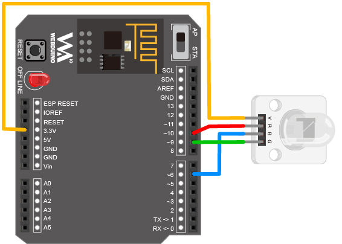
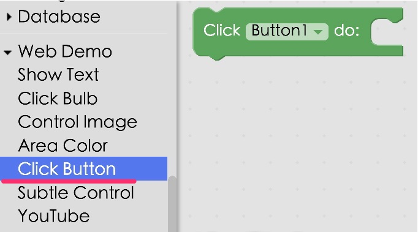
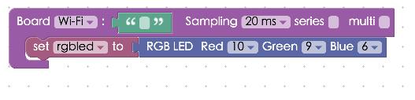
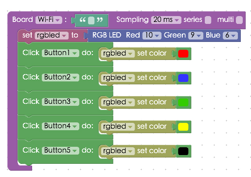

<!-- @@master  = ../../_layout.html-->

<!-- @@block  =  meta-->

<title>Project Example 3: Controlling an RGB LED :::: Webduino = Web × Arduino</title>

<meta name="description" content="RGB LEDs are made of three LEDs, one red, one green and one blue, so they can produce at least three colors. Within the three LED lights of an RGB LED, there are 4 pins; VCC, R(red), G(green), and B(blue). We can control the strength of each of these colors, allowing for a wide range of colors. This tutorial will walk you through how to set up and use a RGB LED, and the next chapter will expand on ways to use the RGB LED as a palette to create any color you wish.">

<meta itemprop="description" content="RGB LEDs are made of three LEDs, one red, one green and one blue, so they can produce at least three colors. Within the three LED lights of an RGB LED, there are 4 pins; VCC, R(red), G(green), and B(blue). We can control the strength of each of these colors, allowing for a wide range of colors. This tutorial will walk you through how to set up and use a RGB LED, and the next chapter will expand on ways to use the RGB LED as a palette to create any color you wish.">

<meta property="og:description" content="RGB LEDs are made of three LEDs, one red, one green and one blue, so they can produce at least three colors. Within the three LED lights of an RGB LED, there are 4 pins; VCC, R(red), G(green), and B(blue). We can control the strength of each of these colors, allowing for a wide range of colors. This tutorial will walk you through how to set up and use a RGB LED, and the next chapter will expand on ways to use the RGB LED as a palette to create any color you wish.">

<meta property="og:title" content="Project Example 3: Controlling an RGB LED " >

<meta property="og:url" content="https://webduino.io/tutorials/tutorial-03-rgbled.html">

<meta property="og:image" content="https://webduino.io/img/tutorials/tutorial-03-01s.jpg">

<meta itemprop="image" content="https://webduino.io/img/tutorials/tutorial-03-01s.jpg">

<include src="../_include-tutorials.html"></include>

<!-- @@close-->

<!-- @@block  =  preAndNext-->

<include src="../_include-tutorials-content.html"></include>

<!-- @@close-->

<!-- @@block  =  tutorials-->
# Project Example 3: Controlling an RGB LED 

RGB LEDs are made of three LEDs, one red, one green and one blue, so they can produce at least three colors. Within the three LED lights of an RGB LED, there are 4 pins; VCC, R(red), G(green), and B(blue). We can control the strength of each of these colors, allowing for a wide range of colors. This tutorial will walk you through how to set up and use a RGB LED, and the next chapter will expand on ways to use the RGB LED as a palette to create any color you wish.

<!-- 

	三色 LED 燈相關套件：<a href="https://webduino.io/buy/webduino-package-plus.html" target="_blank">Webduino 基本套件 Plus ( 支援馬克 1 號、Fly )</a>
	Webduino 開發板：<a href="https://webduino.io/buy/component-webduino-v1.html" target="_blank">Webduino 馬克一號</a>、<a href="https://webduino.io/buy/component-webduino-fly.html" target="_blank">Webduino Fly</a>、<a href="https://webduino.io/buy/component-webduino-uno-fly.html" target="_blank">Webduino Fly + Arduino UNO</a>

 -->

## Video Tutorial

<!-- 影片對應範例：[https://blockly.webduino.io/?page=tutorials/rgbled-2](https://blockly.webduino.io/?page=tutorials/rgbled-2)  --> 

Check the video tutorial here:
<iframe class="youtube" src="https://www.youtube.com/embed/VN4sKngbiGI" frameborder="0" allowfullscreen></iframe>

## Wiring and Practice

We use the PWM (Pulse Width Modulation) pin to control the RGB LED. This gives us analog results from digital means, thus allowing us to control the output of the signal, resulting in different color combinations. The PWM pins on the Webduino are 3, 5, 6, 9, 10, 11, but since you might be using a different development board, always remember to check first. (Most Arduino boards will have a "~" sign to show where the PWM pins are.)

We use jumper wires, or Dupont lines (male to female), to connect the LEDs, connecting V to 3.3v (thus preventing high voltage and causing the RGB LED to emit a dim light), R connects to 10, B connects to 6, and G to 9. If these pins are already in use, you can also use the other PWM pins (3, 5, 11).

Webduino Mark 1 Circuit diagram: 

Webduino Fly Circuit diagram: 

Reference image:

<!-- 

	三色 LED 燈相關套件：<a href="https://webduino.io/buy/webduino-package-plus.html" target="_blank">Webduino 基本套件 Plus ( 支援馬克 1 號、Fly )</a>
	Webduino 開發板：<a href="https://webduino.io/buy/component-webduino-v1.html" target="_blank">Webduino 馬克一號</a>、<a href="https://webduino.io/buy/component-webduino-fly.html" target="_blank">Webduino Fly</a>、<a href="https://webduino.io/buy/component-webduino-uno-fly.html" target="_blank">Webduino Fly + Arduino UNO</a>

 -->

## Instructions for using the Webduino Blockly

Begin by opening the Webduino Blockly editor. ( [https://blockly.webduino.io](https://blockly.webduino.io) ) We will be using the "Click button" for control. Click on the "Web Demo Area" button on the top right, and click the "Click Button" from the pull-down menu. You will see 5 buttons that we will be clicking to create 5 different colors.

To control these buttons, use the "Click button do" block from "Web Demo" on the left side menu.

First we place a "Board" into the workspace, choose the correct Board name, place an "RGB LED" block into the stack, set the name to rgbled, and set the Red pin to 10, Green to 9, and Blue to 6. (RGB LED blocks only allow PWM pins to be chosen)

Then you can set which color maps to which button, by adding multiple "Click button do" blocks with a "rgbled set color" block connected to each. If you set the color to "black", the RGB LED will not produce a color, basically turning it off.

After you've finished these steps, check your [device's status](https://webduino.io/device.html) to see that the board is online. To do this, you can click the "Check Device Status" button on the upper-right. When you click on the red "Run Blocks" button, you can click the different buttons on the screen and you will see the RGB LED produce different colors. You can also click on the JavaScript tab, and see the full code. Copy and paste the code to your own editor and you'll be able to control RGBLEDs!  

Check your stack setup with this example here: [https://blockly.webduino.io/?lang=en#-KYD5Dnd5-rEY7UAcvkn](https://blockly.webduino.io/?lang=en#-KYD5Dnd5-rEY7UAcvkn) 

## Code Explanation ([Check Webduino Bin](http://bin.webduino.io/hugos/edit?html,css,js,output), [Check Device Status](https://webduino.io/device.html))

Include `webduino-all.min.js` in the header of your html files in order to support all of the Webduino's components. If the codes are generated by Webduino Blockly, you also have to include `webduino-blockly.js` in your files.

	
	

There are five different buttons inside the body of the HTML file, the names of the buttons are 1 to 5, each button is set to a unique ID, allowing us to control the button class with each ID in JavaScript. If you're using the default settings, then you won't need to spend time on CSS.

	<button id="demo-area-05-btn1" class="db5">按鈕 1</button>
	<button id="demo-area-05-btn2" class="db5">按鈕 2</button>
	<button id="demo-area-05-btn3" class="db5">按鈕 3</button>
	<button id="demo-area-05-btn4" class="db5">按鈕 4</button>
	<button id="demo-area-05-btn5" class="db5">按鈕 5</button>

We use `addEventListener` in Javascript to listen (and respond) to `click`, and using `setColor` to set the RGB LED. Inside we use 16 bit color (decimals are also supported), this way we can create colors easily.

	var rgbled;

	boardReady('', function (board) {
	  board.samplingInterval = 20;
	  rgbled = getRGBLed(board, 10, 9, 6);
	  document.getElementById("demo-area-05-btn1").addEventListener("click",function(){
	    rgbled.setColor('#ff0000');
	  });
	  document.getElementById("demo-area-05-btn2").addEventListener("click",function(){
	    rgbled.setColor('#3333ff');
	  });
	  document.getElementById("demo-area-05-btn3").addEventListener("click",function(){
	    rgbled.setColor('#009900');
	  });
	  document.getElementById("demo-area-05-btn4").addEventListener("click",function(){
	    rgbled.setColor('#ffcc66');
	  });
	  document.getElementById("demo-area-05-btn5").addEventListener("click",function(){
	    rgbled.setColor('#000000');
	  });
	});

Now you know how to control a RGB LED when you click on different buttons! 
Webduino Bin: [http://bin.webduino.io/cibit/edit?html,css,js,output](http://bin.webduino.io/cibit/edit?html,css,js,output)  
Stack setup: [https://blockly.webduino.io/?lang=en#-KYD7W3h54sepEzzQUFA](https://blockly.webduino.io/?lang=en#-KYD7W3h54sepEzzQUFA)

<!-- ## 三色 LED 的延伸教學：

[Webduino Blockly 課程 2-1：三色 LED 燈](https://blockly.webduino.io/?lang=zh-hant&page=tutorials/rgbled-1#-JvMrEKwwqW2P607oFz2)  
[Webduino Blockly 課程 2-2：三色 LED 燈切換顏色](https://blockly.webduino.io/?lang=zh-hant&page=tutorials/rgbled-2#-JvMroBFx1XYaMemJmOm)

	三色 LED 燈相關套件：<a href="https://webduino.io/buy/webduino-package-plus.html" target="_blank">Webduino 基本套件 Plus ( 支援馬克 1 號、Fly )</a>
	Webduino 開發板：<a href="https://webduino.io/buy/component-webduino-v1.html" target="_blank">Webduino 馬克一號</a>、<a href="https://webduino.io/buy/component-webduino-fly.html" target="_blank">Webduino Fly</a>、<a href="https://webduino.io/buy/component-webduino-uno-fly.html" target="_blank">Webduino Fly + Arduino UNO</a>

 -->

<!-- @@close-->