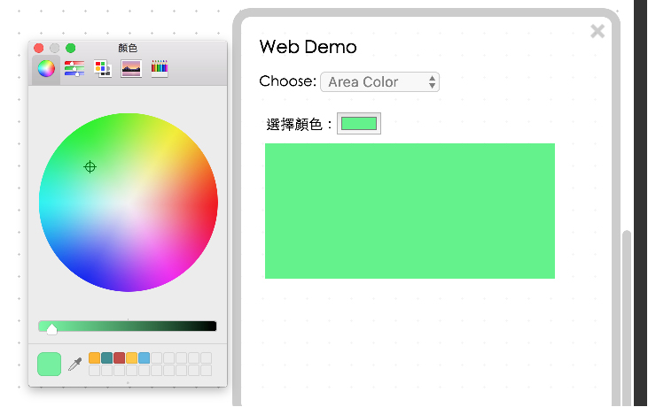

<!-- @@master  = ../../_layout.html-->

<!-- @@block  =  meta-->

<title>Project Example 4: Creating colors with an RGB LED  :::: Webduino = Web × Arduino</title>

<meta name="description" content="In our last tutorial we explained how an RGB LED works, in this tutorial we will use HTML5's new input type “color” to control the color of an RGB LED and also how to show the selected color on a device’s screen.">

<meta itemprop="description" content="In our last tutorial we explained how an RGB LED works, in this tutorial we will use HTML5's new input type “color” to control the color of an RGB LED and also how to show the selected color on a device’s screen.">

<meta property="og:description" content="In our last tutorial we explained how an RGB LED works, in this tutorial we will use HTML5's new input type “color” to control the color of an RGB LED and also how to show the selected color on a device’s screen.">

<meta property="og:title" content="Project Example 4: Creating colors with an RGB LED " >

<meta property="og:url" content="https://webduino.io/tutorials/tutorial-04-rgbled-palette.html">

<meta property="og:image" content="https://webduino.io/img/tutorials/tutorial-04-01s.jpg">

<meta itemprop="image" content="https://webduino.io/img/tutorials/tutorial-04-01s.jpg">

<include src="../_include-tutorials.html"></include>

<!-- @@close-->

<!-- @@block  =  preAndNext-->

<include src="../_include-tutorials-content.html"></include>

<!-- @@close-->

<!-- @@block  =  tutorials-->
# Project Example 4: Creating colors with an RGB LED 

In our [last tutorial](tutorial-03-rgbled.html) we explained how an RGB LED works, in this tutorial we will use HTML5's new input type "color" to control the color of an RGB LED and also how to show the selected color on a device's screen. (In the video tutorial we show how to use the "range" input.)

<!-- 

	三色 LED 燈相關套件：<a href="https://webduino.io/buy/webduino-package-plus.html" target="_blank">Webduino 基本套件 Plus ( 支援馬克 1 號、Fly )</a>
	Webduino 開發板：<a href="https://webduino.io/buy/component-webduino-v1.html" target="_blank">Webduino 馬克一號</a>、<a href="https://webduino.io/buy/component-webduino-fly.html" target="_blank">Webduino Fly</a>、<a href="https://webduino.io/buy/component-webduino-uno-fly.html" target="_blank">Webduino Fly + Arduino UNO</a>

 -->

## Video Tutorial

<!-- 影片對應範例：[https://blockly.webduino.io/?lang=en&&page=tutorials/rgbled-3#-KYDD9HAolfWTnqQGkin](https://blockly.webduino.io/?lang=en&&page=tutorials/rgbled-3#-KYDD9HAolfWTnqQGkin)  -->

Watch the video tutorial here:
<iframe class="youtube" src="https://www.youtube.com/embed/uSfBbvd4ViE" frameborder="0" allowfullscreen></iframe>

## Wiring and Practice

As in the last tutorial, we will use jumper wires (male to female) to connect the LEDs. Connect V to 3.3v (thus preventing high voltage causing the RGB LED to emit a dim light), R (red) to 10, B (blue) to 6 and G (green) to 9. If these pins are already in use, you can also use the other PWM pins 3, 5, and 11.

Webduino Mark 1 Circuit Diagram:

Webduino Fly Circuit Diagram:

Reference image:

<!-- 

	三色 LED 燈相關套件：<a href="https://webduino.io/buy/webduino-package-plus.html" target="_blank">Webduino 基本套件 Plus ( 支援馬克 1 號、Fly )</a>
	Webduino 開發板：<a href="https://webduino.io/buy/component-webduino-v1.html" target="_blank">Webduino 馬克一號</a>、<a href="https://webduino.io/buy/component-webduino-fly.html" target="_blank">Webduino Fly</a>、<a href="https://webduino.io/buy/component-webduino-uno-fly.html" target="_blank">Webduino Fly + Arduino UNO</a>

 -->

## Instructions for using the Webduino Blockly

Open the [Webduino Blockly editor](https://blockly.webduino.io/?lang=en), where we will also be using the "Area Color" to control the color. Start by clicking on the "Ｗeb Demo Area" button, then click the "Area Color" from the drop-down menu. This will show a popup window with a color picker and an area that shows the current color. When our stack is completed you will see the same color on the RGB LED that shows here.

First, place a "Board" block into the workspace, select your Board's name, and place an "RGB LED" block into the stack. Set the "RGB LED" block to rgbled, and set Red to 10, Green to 9, and Blue to 6. Next place a "Chose color, do:"" block from the "Web Demo; Area Color" menu so we can set the color of the area and the color of the RGB LED. Inside the "Choose color, do:"" block add a "Set area's color" block with a "Color" block connected to that, and also a "rgbled set color" block with another "Color" block attached.

After you've finished the previous steps, check your [device's status](https://webduino.io/device.html) to see if the board is online by clicking "Check Device Status". When you click on the red "Run Blocks" button, you can click on the different buttons on your screen and you will see the RGB LED produce different colors. 
Solution: [https://blockly.webduino.io/?lang=en#-KYDGA3tzgXHKNVDlqL-](https://blockly.webduino.io/?lang=en#-KYDGA3tzgXHKNVDlqL-)

## Code Explanation ([Check Webduino Bin](http://bin.webduino.io/vigib/edit?html,css,js,output), [Check Device Status](https://webduino.io/device.html) )

Include `webduino-all.min.js` in the header of your html files in order to support all of the Webduino's components. If the codes are generated by Webduino Blockly, you also have to include `webduino-blockly.js` in your files.

	
	

There are only two things inside the body of our HTML file. One is the input "type" set to "color", the other is a div that shows the color.

	choose color: <input id="demo-area-04-color" type="color">
	

As for JavaScript, we use "oninput" to send the color value to area color and the RGB LED.

	var rgbled;

	boardReady('', function (board) {
	  board.samplingInterval = 20;
	  rgbled = getRGBLed(board, 10, 9, 6);
	  document.getElementById("demo-area-04-color").oninput = function(_color){
	  _color = this.value;
	    document.getElementById("demo-area-04-area").style.background = _color;
	    rgbled.setColor(_color);
	  };
	});

Now you know how to create colors with an RGB LED and set a webpage to show the same color!
Webduino Bin: [http://bin.webduino.io/xajar/edit?html,css,js,output](http://bin.webduino.io/xajar/edit?html,css,js,output)  
Stack setup: [https://blockly.webduino.io/#-K4wrsITVd2C5wsXOLCn](https://blockly.webduino.io/#-K4wrsITVd2C5wsXOLCn)

<!-- ## 三色 LED 的延伸教學：

[Webduino Blockly 課程 2-3：三色 LED 燈調色盤](https://blockly.webduino.io/?lang=zh-hant&page=tutorials/rgbled-3#-JvMsJupKMuIUdAJs_RK)  
[Webduino Blockly 課程 2-4：轉吧七彩霓虹燈](https://blockly.webduino.io/?lang=zh-hant&page=tutorials/rgbled-4#-JvMswgK2Q1h4GjAPx7u)

	三色 LED 燈相關套件：<a href="https://webduino.io/buy/webduino-package-plus.html" target="_blank">Webduino 基本套件 Plus ( 支援馬克 1 號、Fly )</a>
	Webduino 開發板：<a href="https://webduino.io/buy/component-webduino-v1.html" target="_blank">Webduino 馬克一號</a>、<a href="https://webduino.io/buy/component-webduino-fly.html" target="_blank">Webduino Fly</a>、<a href="https://webduino.io/buy/component-webduino-uno-fly.html" target="_blank">Webduino Fly + Arduino UNO</a>

 -->

<!-- @@close-->