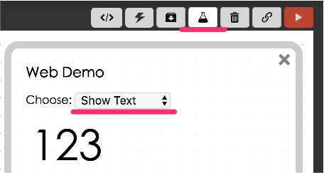
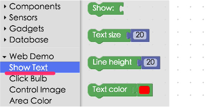
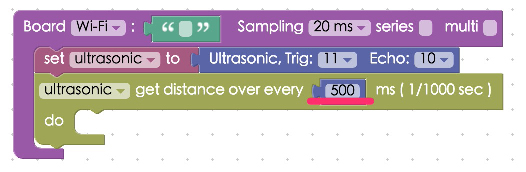
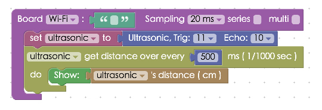
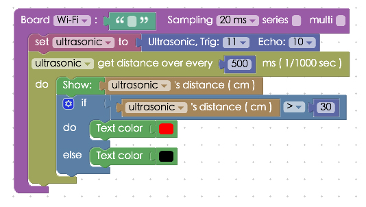

<!-- @@master  = ../../_layout.html-->

<!-- @@block  =  meta-->

<title>Project Example 5: Use An Ultrasonic Sensor :::: Webduino = Web × Arduino</title>

<meta name="description" content="In this example, we will use a HC-SR04 ultrasonic sensor. A HC-SR04 sensor emits an ultrasonic sound that travels through the air and  will bounce off the nearest object and travel back to the module. If you calculate the travel time and the speed of the sound you can calculate the distance of the object. HC-SR04 has 4 pins, GND, VCC, Trig, and Echo. Using the Tirg pin will send out a sonic burst which will then be received by the Echo pin. The Echo pin will output a value in centimeters for the distance of the object. There is a possibility of some inaccuracy, which occurs if the sound is bounced in other directions or it is partially absorbed by the object.">

<meta itemprop="description" content="In this example, we will use a HC-SR04 ultrasonic sensor. A HC-SR04 sensor emits an ultrasonic sound that travels through the air and  will bounce off the nearest object and travel back to the module. If you calculate the travel time and the speed of the sound you can calculate the distance of the object. HC-SR04 has 4 pins, GND, VCC, Trig, and Echo. Using the Tirg pin will send out a sonic burst which will then be received by the Echo pin. The Echo pin will output a value in centimeters for the distance of the object. There is a possibility of some inaccuracy, which occurs if the sound is bounced in other directions or it is partially absorbed by the object.">

<meta property="og:description" content="In this example, we will use a HC-SR04 ultrasonic sensor. A HC-SR04 sensor emits an ultrasonic sound that travels through the air and  will bounce off the nearest object and travel back to the module. If you calculate the travel time and the speed of the sound you can calculate the distance of the object. HC-SR04 has 4 pins, GND, VCC, Trig, and Echo. Using the Tirg pin will send out a sonic burst which will then be received by the Echo pin. The Echo pin will output a value in centimeters for the distance of the object. There is a possibility of some inaccuracy, which occurs if the sound is bounced in other directions or it is partially absorbed by the object.">

<meta property="og:title" content="Project Example 5: Use An Ultrasonic Sensor" >

<meta property="og:url" content="https://webduino.io/tutorials/tutorial-05-ultrasonic.html">

<meta property="og:image" content="https://webduino.io/img/tutorials/tutorial-05-01s.jpg">

<meta itemprop="image" content="https://webduino.io/img/tutorials/tutorial-05-01s.jpg">

<include src="../_include-tutorials.html"></include>

<!-- @@close-->

<!-- @@block  =  preAndNext-->

<include src="../_include-tutorials-content.html"></include>

<!-- @@close-->

<!-- @@block  =  tutorials-->
# Project Example 5: Use An Ultrasonic Sensor

In this example, we will use a HC-SR04 ultrasonic sensor. A HC-SR04 sensor emits an ultrasonic sound that travels through the air and  will bounce off the nearest object and travel back to the module. If you calculate the travel time and the speed of the sound you can calculate the distance of the object. HC-SR04 has 4 pins, GND, VCC, Trig, and Echo. Using the Tirg pin will send out a sonic burst which will then be received by the Echo pin. The Echo pin will output a value in centimeters for the distance of the object. There is a possibility of some inaccuracy, which occurs if the  sound is bounced in other directions or it is partially absorbed by the object. 

<!-- 

	超音波傳感器相關套件：<a href="https://webduino.io/buy/webduino-package-plus.html" target="_blank">Webduino 基本套件 Plus ( 支援馬克 1 號、Fly )</a>
	Webduino 開發板：<a href="https://webduino.io/buy/component-webduino-v1.html" target="_blank">Webduino 馬克一號</a>、<a href="https://webduino.io/buy/component-webduino-fly.html" target="_blank">Webduino Fly</a>、<a href="https://webduino.io/buy/component-webduino-uno-fly.html" target="_blank">Webduino Fly + Arduino UNO</a>

 -->

## Video Tutorial

You can watch the video tutorial for more information. Next will give you step by step instructions for setting up and using the HC-SR04.
<!-- Open the Webduino Blockly for exclusive use of Project Example Use An Ultrasonic Sensor [Webduino Blockly Chapter 3-1: UltraSonic](https://blockly.webduino.io/?lang=en&page=tutorials/ultrasonic-1#-KTO8RBnea4ru18uOmVD)   -->

Watch the video tutorial here:
<iframe class="youtube" src="https://www.youtube.com/embed/e6gbwMUzSZ8" frameborder="0" allowfullscreen></iframe>

## The Circuit 

The HC-SR04 Ultrasonic Module has 4 pins, GND, VCC, Trig and Echo. The VCC pin needs to be connected to the 3.3v or VCC pins on the Webduino board.The GND pin needs to be connected to its corresponding postition. The Tri and Echo pins can be connected to any I/O on the Webduino board. (Here we connect Trig and Echo pins to 11 and 10 respectively.)

Webduino Mark 1 Circuit diagram:

Webduino Fly Circuit diagram:

Reference image:

<!-- 

	超音波傳感器相關套件：<a href="https://webduino.io/buy/webduino-package-plus.html" target="_blank">Webduino 基本套件 Plus ( 支援馬克 1 號、Fly )</a>
	Webduino 開發板：<a href="https://webduino.io/buy/component-webduino-v1.html" target="_blank">Webduino 馬克一號</a>、<a href="https://webduino.io/buy/component-webduino-fly.html" target="_blank">Webduino Fly</a>、<a href="https://webduino.io/buy/component-webduino-uno-fly.html" target="_blank">Webduino Fly + Arduino UNO</a>

 -->

## Instructions for using the Webduino Blockly

Open the Webduino Blockly page by typing the address: [https://blockly.webduino.io/?lang=en](https://blockly.webduino.io/?lang=en) into your web browser. First, you will need to use the "Web Demo Area" to show the distance of the object. So click "Web Demo Area" and choose "Show Text" in the drop-down list.

You can also drag the blocks from the side menu, to adjust the text size, line height, and color in the web demo area.

Next, drag a "Board" block to the workspace and type in the name of your Webduino board. Click "Sensors" and combine the first two blocks from the Ultrasonic list. Make sure it is set to "ultrasonic", Trig to "11", Echo to "10", and get distance every "500" ms (1/1000s). We suggest you set detect distance at least over 200 ms (1/1000s).

Finally, add the last block by connecting the "Show" block from the "Web Demo" drop-down menu and the distance mesurment block from "Ultra Sonic" menu. Once you run the clocks, you will see the value of result show on web demo area.

Of course you can make the setup more complex. Using the "If/Do" logic block you can make the results to show in red if the ultra sonic burst bounces off and object from a distance further than 30 centimeters away. To do this, you can create the stack as seen below.

After you finish creating the block stack, check your "[device's status](https://webduino.io/device.html)" before you "Run" all the blocks. Then you can start checking the results of your ultrasonic sensor on web demo area!
Check your stack setup with this example here: [https://blockly.webduino.io/?lang=en#-KTOCRJoAlOAcckHodj1](https://blockly.webduino.io/?lang=en#-KTOCRJoAlOAcckHodj1)

## Code Explanation ([Check Webduino Bin](http://bin.webduino.io/xinax/edit?html,css,js,output), [Check Device Status](https://webduino.io/device.html))

Include `webduino-all.min.js` in the header ofyour html files in order to support all of the Webduino's components. If the codes are generated by Webduino Blockly, you also have to include `webduino-blockly.js` in your files.

	
	

We simply use a span tag to display the sensing result in text.

	distance to display

Here we use the JavaScript method `ping()`. Ping() takes one parameter, which points to the callback function that will be called when sensing the distance. (The result will also be stored in the `.distance` property.) Then we use an **if else** statement to display text in different colors, at different levels of distance.

	var ultrasonic;

	boardReady('Webduino Board Name', function (board) {
	  board.samplingInterval = 20;
	  ultrasonic = getUltrasonic(board, 11, 10);
	  ultrasonic.ping(function(cm){
	    console.log(ultrasonic.distance);
	    document.getElementById("demo-area-01-show").innerHTML = ultrasonic.distance;
	    if (ultrasonic.distance > 30) {
	      document.getElementById("demo-area-01-show").style.color = '#ff0000';
	    } else {
	      document.getElementById("demo-area-01-show").style.color = '#000000';
	    }
	  }, 500);
	});

There are some codes that overlap Google Blockly. Therefore, we could use variables to do code cleanups. Check the following figure:

	var ultrasonic;
	var show;

	boardReady('Webduino Board Name', function (board) {
	  board.samplingInterval = 20;
	  ultrasonic = getUltrasonic(board, 11, 10);
	  show = document.getElementById("demo-area-01-show");
	  ultrasonic.ping(function(cm){
	    console.log(ultrasonic.distance);
	    show.innerHTML = ultrasonic.distance;
	    if (ultrasonic.distance > 30) {
	      show.style.color = '#ff0000';
	    } else {
	      show.style.color = '#000000';
	    }
	  }, 500);
	});

This was the example of how to use an ultrasonic sensor to detect the distance of objects, we hope you enjoyed it!  
Webduino Bin: [http://bin.webduino.io/xinax/edit?html,css,js,output](http://bin.webduino.io/xinax/edit?html,css,js,output)  
Stack setup: [https://blockly.webduino.io/?lang=en#-KTOOaAzodA1tSGy0riB](https://blockly.webduino.io/?lang=en#-KTOOaAzodA1tSGy0riB)

<!-- ## Tutorial Extension of Ultrasonic Sensor:

[Webduino Blockly Chapter 3-1: UltraSonic](https://blockly.webduino.io/?lang=en&page=tutorials/ultrasonic-1#-KTOH8GVCpXt1STgTB2h) --> 

<!-- 

	超音波傳感器相關套件：<a href="https://webduino.io/buy/webduino-package-plus.html" target="_blank">Webduino 基本套件 Plus ( 支援馬克 1 號、Fly )</a>
	Webduino 開發板：<a href="https://webduino.io/buy/component-webduino-v1.html" target="_blank">Webduino 馬克一號</a>、<a href="https://webduino.io/buy/component-webduino-fly.html" target="_blank">Webduino Fly</a>、<a href="https://webduino.io/buy/component-webduino-uno-fly.html" target="_blank">Webduino Fly + Arduino UNO</a>

 -->

<!-- @@close-->