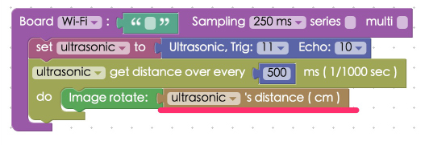
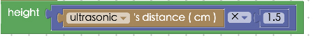

<!-- @@master  = ../../_layout.html-->

<!-- @@block  =  meta-->

<title>Project Example 6: Manipulating image size with an Ultrasonic sensor :::: Webduino = Web × Arduino</title>

<meta name="description" content="By sending a distance value from an sensor and mapping it to the width of an image on a webpage, we can easily control the size of an image with an Ultrasonic sensor.">

<meta itemprop="description" content="By sending a distance value from an sensor and mapping it to the width of an image on a webpage, we can easily control the size of an image with an Ultrasonic sensor.">

<meta property="og:description" content="By sending a distance value from an sensor and mapping it to the width of an image on a webpage, we can easily control the size of an image with an Ultrasonic sensor.">

<meta property="og:title" content="Project Example 6: Manipulating image size with an Ultrasonic sensor" >

<meta property="og:url" content="https://webduino.io/tutorials/tutorial-06-ultrasonic-imagesize.html">

<meta property="og:image" content="https://webduino.io/img/tutorials/tutorial-06-01s.jpg">

<meta itemprop="image" content="https://webduino.io/img/tutorials/tutorial-06-01s.jpg">

<include src="../_include-tutorials.html"></include>

<!-- @@close-->

<!-- @@block  =  preAndNext-->

<include src="../_include-tutorials-content.html"></include>

<!-- @@close-->

<!-- @@block  =  tutorials-->
# Project Example 6: Manipulating image size with an Ultrasonic sensor

In our [last tutorial](tutorial-05-ultrasonic.html) ,we learned how an Ultrasonic sensor works, now we will be able to apply that knowledge in this tutorial. By sending a distance value from an sensor and mapping it to the width of an image on a webpage, we can easily control the size of an image with an Ultrasonic sensor.

<!-- 

	超音波傳感器相關套件：<a href="https://webduino.io/buy/webduino-package-plus.html" target="_blank">Webduino 基本套件 Plus ( 支援馬克 1 號、Fly )</a>
	Webduino 開發板：<a href="https://webduino.io/buy/component-webduino-v1.html" target="_blank">Webduino 馬克一號</a>、<a href="https://webduino.io/buy/component-webduino-fly.html" target="_blank">Webduino Fly</a>、<a href="https://webduino.io/buy/component-webduino-uno-fly.html" target="_blank">Webduino Fly + Arduino UNO</a>

 -->

## Video Tutorial

<!-- 影片對應範例：[https://blockly.webduino.io/?page=tutorials/ultrasonic-2](https://blockly.webduino.io/?page=tutorials/ultrasonic-2)  --> 

Watch the video tutorial here:
<iframe class="youtube" src="https://www.youtube.com/embed/NXJ3xmqHm8o" frameborder="0" allowfullscreen></iframe>

## Wiring and Practice

Just as we did in the last tutorial, connect the VCC pin on your board to 3.3v, Trig to 11, Echo to 10, and GND to GND. You can connect the Ultrasonic sensor directly to the Webduino board or use a breadboard to connect them with jumper wires.

Webduino Mark 1 Circuit diagram:

Webduino Fly Circuit diagram:

Reference image:

<!-- 

	超音波傳感器相關套件：<a href="https://webduino.io/buy/webduino-package-plus.html" target="_blank">Webduino 基本套件 Plus ( 支援馬克 1 號、Fly )</a>
	Webduino 開發板：<a href="https://webduino.io/buy/component-webduino-v1.html" target="_blank">Webduino 馬克一號</a>、<a href="https://webduino.io/buy/component-webduino-fly.html" target="_blank">Webduino Fly</a>、<a href="https://webduino.io/buy/component-webduino-uno-fly.html" target="_blank">Webduino Fly + Arduino UNO</a>

 -->

## Instructions for using the Webduino Blockly

Open the [Webduino Blockly editor](https://blockly.webduino.io/index.html?lang=en) and click on the "Web Demo Area" button. Click on "control image" from the drop down menu, and you will see an image. We will control the image's size using the values that are measured by the Ultrasonic sensor.

Place a "Board" block into the workspace, select your board's name. Place a "Set Ultrasonic" block in the stack, set name to ultrasonic, set Trig to 11, and Echo to 10. Then place a "Get distance" block under that and set it to sense every 500 ms (milliseconds). Place an "Image Rotate" block from "Web Demo" menu, which will control the angle of the image using the distance measured by the sensor. Make sure to replace the original "0 value" block with a "Distance" measure block.

You can also control the width of the image with the distance measured from the Ultrasonic sensor by adding an "Image width / height" block into the "Ultrasonic distance" block. Replace the two number value block with "Ultrasonic's Distance" blocks.

If you don't want a 1:1 ratio, create your own set of rules to map a relationship between the distance measured and the image. To make this change, add a function block found in the "Math" menu, adding an "Ultrasonic's distance" block and multiplying it by a certain number.

After you're done with the previous steps, make sure the board is online by clicking "[Check Device Status](https://webduino.io/device.html)". Then click on the red "Run Blocks" button, wave your hands in front of the Ultrasonic sensor and you'll see the image to start to rotate or change in size!
( Solution：[https://blockly.webduino.io/?lang=en#-KYIEc-U7nGdDGduUMgj](https://blockly.webduino.io/?lang=en#-KYIEc-U7nGdDGduUMgj) )

## Code Explanation ([Check Webduino Bin](http://bin.webduino.io/zuxof/edit?html,css,js,output), [Check Device Status](https://webduino.io/device.html))

Include `webduino-all.min.js` in the header of your html files in order to support all of the Webduino's components. If the codes are generated by Webduino Blockly, you also have to include `webduino-blockly.js` in your files.

	
	

We have an image inside a div of the HTML file, both the image and the div have ids, allowing us to control with CSS or JavaScript.

	

	  
	

With CSS we define the width and length with the div. Do take note when we set `position: relative;` and the image inside is set to `position: absolute`, we can use `top` and `left` to set the image position from the location of the div. We also use `transform-origin` to define the center of the image, and we use `transition` to set how the image changes, in this case, we've set it to 0.3 seconds.

	#demo-area-03-container {
	  position: relative;
	  width: 150px;
	  height: 150px;
	}

	#demo-area-03-image {
	  position: absolute;
	  top: 0;
	  left: 0;
	  width: 150px;
	  height: 150px;
	  transition: .3s;
	  -webkit-transition: .3s;
	  -moz-transition: .3s;
	  transform-origin: 75px 75px;
	  -webkit-transform-origin: 75px 75px;
	  -moz-transform-origin: 75px 75px;
	}

As for JavaScript, all we've done is take the value from `ping` (measured in cm) and maped it to the size of the image, just simple calculations.

	var ultrasonic;

	boardReady('', function (board) {
	  board.samplingInterval = 20;
	  ultrasonic = getUltrasonic(board, 11, 10);
	  ultrasonic.ping(function(cm){
	    console.log(ultrasonic.distance);
	    var imageWidth = ultrasonic.distance;
	    var imageHeight = (ultrasonic.distance * 1.5);
	    document.getElementById("demo-area-03-image").style.width = imageWidth+"px";
	    document.getElementById("demo-area-03-image").style.height = imageHeight+"px";
	  }, 500);
	});

Now you've learned how to use an Ultrasonic sensor to sense distances and change the size or angle of an image from that data!  
Webduino Bin: [http://bin.webduino.io/xoco/edit?html,css,js,output](http://bin.webduino.io/xoco/edit?html,css,js,output)  
Stack setup: [https://blockly.webduino.io/?lang=en#-KYIBv4DWz3PaefLCJU4](https://blockly.webduino.io/?lang=en#-KYIBv4DWz3PaefLCJU4)

<!-- ## 超音波傳感器的延伸教學：

[Webduino Blockly 課程 3-2：超音波傳感器改變圖片大小](https://blockly.webduino.io/?lang=zh-hant&page=tutorials/ultrasonic-2#-JvS-qZVOxcFtjlMhYlP)  
[Webduino Blockly 課程 3-3：超音波傳感器改變音量大小](https://blockly.webduino.io/?lang=zh-hant&page=tutorials/ultrasonic-3#-JvS09LhPCGEY4M1-juO)  -->

<!-- 

	超音波傳感器相關套件：<a href="https://webduino.io/buy/webduino-package-plus.html" target="_blank">Webduino 基本套件 Plus ( 支援馬克 1 號、Fly )</a>
	Webduino 開發板：<a href="https://webduino.io/buy/component-webduino-v1.html" target="_blank">Webduino 馬克一號</a>、<a href="https://webduino.io/buy/component-webduino-fly.html" target="_blank">Webduino Fly</a>、<a href="https://webduino.io/buy/component-webduino-uno-fly.html" target="_blank">Webduino Fly + Arduino UNO</a>

 -->

<!-- @@close-->