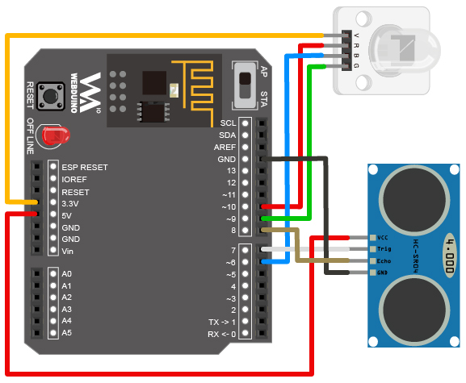

<!-- @@master  = ../../_layout.html-->

<!-- @@block  =  meta-->

<title>Project Example 8: Controlling RGB LEDs with an Ultrasonic Sensor :::: Webduino = Web × Arduino</title>

<meta name="description" content="This project example should be a piece of cake after we learned how to control an LED with an Ultrasonic sensor in project example #7. This project uses an RGB LED to show different colors to represent the distance measured by the Ultrasonic sensor.">

<meta itemprop="description" content="This project example should be a piece of cake after we learned how to control an LED with an Ultrasonic sensor in project example #7. This project uses an RGB LED to show different colors to represent the distance measured by the Ultrasonic sensor.">

<meta property="og:description" content="This project example should be a piece of cake after we learned how to control an LED with an Ultrasonic sensor in project example #7. This project uses an RGB LED to show different colors to represent the distance measured by the Ultrasonic sensor.">

<meta property="og:title" content="Project Example 8: Controlling RGB LEDs with an Ultrasonic Sensor" >

<meta property="og:url" content="https://webduino.io/tutorials/tutorial-08-ultrasonic-rgbled.html">

<meta property="og:image" content="https://webduino.io/img/tutorials/tutorial-08-01s.jpg">

<meta itemprop="image" content="https://webduino.io/img/tutorials/tutorial-08-01s.jpg">

<include src="../_include-tutorials.html"></include>

<!-- @@close-->

<!-- @@block  =  preAndNext-->

<include src="../_include-tutorials-content.html"></include>

<!-- @@close-->

<!-- @@block  =  tutorials-->
# Project Example 8: Controlling RGB LEDs with an Ultrasonic Sensor

This project example should be a piece of cake after we learned how to control an LED with an Ultrasonic sensor in project example #7. This project uses an RGB LED to show different colors to represent the distance measured by the Ultrasonic sensor.

<!-- 

	超音波傳感器與三色 LED 燈相關套件：<a href="https://webduino.io/buy/webduino-package-plus.html" target="_blank">Webduino 基本套件 Plus ( 支援馬克 1 號、Fly )</a>
	Webduino 開發板：<a href="https://webduino.io/buy/component-webduino-v1.html" target="_blank">Webduino 馬克一號</a>、<a href="https://webduino.io/buy/component-webduino-fly.html" target="_blank">Webduino Fly</a>、<a href="https://webduino.io/buy/component-webduino-uno-fly.html" target="_blank">Webduino Fly + Arduino UNO</a>

 -->

## Video Tutorial

<!-- 影片對應範例：[https://blockly.webduino.io/?page=tutorials/ultrasonic-4](https://blockly.webduino.io/?page=tutorials/ultrasonic-4)  -->
Check the video tutorial here:
<iframe class="youtube" src="https://www.youtube.com/embed/8lDL6_2io1Y" frameborder="0" allowfullscreen></iframe>

## Wiring and Practice

It seems as if we could plug the Ultrasonic sensor and RGB LED directly into the Webduino board, but the RGB LED needs to use the PWM pin, so it cannot connect to pin 7 or 8. Therefore, we will use a breadboard and jumper wires to connect our components. Connect the VCC pin on the Ultrasonic sensor to VCC, Trig to pin 7, Echo to pin8, and GND to GND. As for the RGB LED, connect the VCC to 3.3v, R(red) to pin 10, B(blue) to pin 6, and G(green) to pin 9.

Webduino Mark 1 Circuit diagram:

Webduino Fly Circuit diagram:

Reference image:

<!-- 

	超音波傳感器與三色 LED 燈相關套件：<a href="https://webduino.io/buy/webduino-package-plus.html" target="_blank">Webduino 基本套件 Plus ( 支援馬克 1 號、Fly )</a>
	Webduino 開發板：<a href="https://webduino.io/buy/component-webduino-v1.html" target="_blank">Webduino 馬克一號</a>、<a href="https://webduino.io/buy/component-webduino-fly.html" target="_blank">Webduino Fly</a>、<a href="https://webduino.io/buy/component-webduino-uno-fly.html" target="_blank">Webduino Fly + Arduino UNO</a>

 -->

## Instructions for using the Webduino Blockly

Open the [Webduino Blockly editor](https://blockly.webduino.io/?lang=en). Click on "Web Demo Area" on the upper right hand corner and click "Area Color" from the drop-down menu. So later, when the Ultrasonic sensor measures different distances a color will show on screen and the RGB LED will also show the same color.

Place the "Board" block inside the editor and fill in the name of your Webduino board. Place an "UltraSonic" board in the stack and set the name to "ultrasonic", set the Trig pin to 7, and Echo to 8. Then place an "RGB LED" block in the stack and set the name to rgbled, red to 10, green to 9 and blue to 6.

Place a "get distance over every / do" block in the stack and set to take measurements every 500 milliseconds, and place an "if/do" block from the "Logic" menu inside that. Since we will have many conditional statements when different distances are measured, place a couple of "else if" and "else" blocks inside that stack.

We will use another 2 "logic" blocks, the "and" block, which will only run when both conditions are met.

This way we can make four different combinations of ranges; "0 to 10", "10 to 20", "20 to 30", and "greater than 30".

After you are done setting up the stack, check if the board is online (click "[Check Device Status](https://webduino.io/device.html)"), then click on the red execute button "Run Blocks", wave your hand in front of the Ultrasonic sensor and you'll see the the Web Demo area and the RGB LED show different colors that correspond with the different distances of your hand! (Solution: [https://blockly.webduino.io/?lang=en#-KZuAa5uJJaJa6y_0rrD](https://blockly.webduino.io/?lang=en#-KZuAa5uJJaJa6y_0rrD))

## Code Explanation ([Check Webduino Bin](http://bin.webduino.io/noje/edit?html,css,js,output), [Check Device Status](https://webduino.io/device.html) )

Include `webduino-all.min.js` in the header of your html files in order to support all of the Webduino's components. If the codes are generated by Webduino Blockly, you also have to include `webduino-blockly.js` in your files.

	
	

The div inside of the HTML file displays the color on screen.

	

The CSS code controls the size and default color of the div.

	#demo-area-04-area {
	  width: 90%;
	  height: 150px;
	  background: #ccc;
	}

Our JavaScript code uses a lot of `if`, `elseif`, and `else`, with "and" represented as `&&`. Using these conditional statements we show different colors at different distances.

	var ultrasonic;
	var rgbled;

	boardReady('', function (board) {
	  board.samplingInterval = 20;
	  ultrasonic = getUltrasonic(board, 7, 8);
	  rgbled = getRGBLed(board, 10, 9, 6);
	  ultrasonic.ping(function(cm){
	    console.log(ultrasonic.distance);
	    if (ultrasonic.distance > 0 && ultrasonic.distance <= 10) {
	      rgbled.setColor('#ff0000');
	      document.getElementById("demo-area-04-area").style.background = '#ff0000';
	    } else if (ultrasonic.distance > 10 && ultrasonic.distance <= 20) {
	      rgbled.setColor('#3333ff');
	      document.getElementById("demo-area-04-area").style.background = '#3333ff';
	    } else if (ultrasonic.distance > 20 && ultrasonic.distance <= 30) {
	      rgbled.setColor('#ffcc33');
	      document.getElementById("demo-area-04-area").style.background = '#ffcc33';
	    } else {
	      rgbled.setColor('#000000');
	      document.getElementById("demo-area-04-area").style.background = '#000000';
	    }
	  }, 500);
	});

Now you've learned how to use an Ultrasonic sensor to measure the distance and to display a color on your screen and with an RGB LED.  
Webduino Bin: [http://bin.webduino.io/noje/edit?html,css,js,output](http://bin.webduino.io/noje/edit?html,css,js,output)  
Stack setup: [https://blockly.webduino.io/?lang=en#-KZuAa5uJJaJa6y_0rrD](https://blockly.webduino.io/?lang=en#-KZuAa5uJJaJa6y_0rrD)

<!-- ## 超音波傳感器的延伸教學：

[Webduino Blockly 課程 3-4：超音波傳感器控制三色 LED 燈顏色](https://blockly.webduino.io/?lang=zh-hant&page=tutorials/ultrasonic-4#-JvS1HjBSLU7wbtmLxKB)  
[Webduino Blockly 課程 3-6：超音波傳感器控制 Youtube 播放速度](https://blockly.webduino.io/?lang=zh-hant&page=tutorials/ultrasonic-6#-JxEs_Z0dmBi0nu3Pylw)  
[Webduino Blockly 課程 3-5：超音波傳感器控制 youtube 的音量](https://blockly.webduino.io/?lang=zh-hant&page=tutorials/ultrasonic-5#-JwgqGd0PtGFPC8GNcfY) 

	超音波傳感器與三色 LED 燈相關套件：<a href="https://webduino.io/buy/webduino-package-plus.html" target="_blank">Webduino 基本套件 Plus ( 支援馬克 1 號、Fly )</a>
	Webduino 開發板：<a href="https://webduino.io/buy/component-webduino-v1.html" target="_blank">Webduino 馬克一號</a>、<a href="https://webduino.io/buy/component-webduino-fly.html" target="_blank">Webduino Fly</a>、<a href="https://webduino.io/buy/component-webduino-uno-fly.html" target="_blank">Webduino Fly + Arduino UNO</a>

 -->

<!-- @@close-->