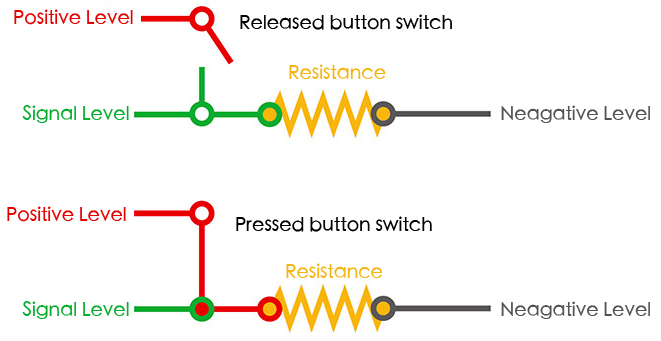
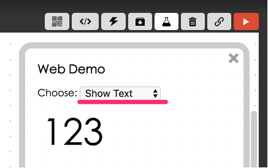
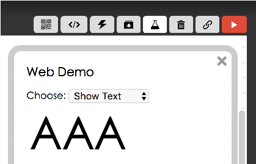

<!-- @@master  = ../../_layout.html-->

<!-- @@block  =  meta-->

<title>Project Example 9: Button Switch :::: Webduino = Web × Arduino</title>

<meta name="description" content="Switches are common electronic components in our daily life. Using an on / off signal, we control different house appliances. This project example will show how to read the signal from a button switch and control an image on screen or turn on/off an LED.">

<meta itemprop="description" content="Switches are common electronic components in our daily life. Using an on / off signal, we control different house appliances. This project example will show how to read the signal from a button switch and control an image on screen or turn on/off an LED.">

<meta property="og:description" content="Switches are common electronic components in our daily life. Using an on / off signal, we control different house appliances. This project example will show how to read the signal from a button switch and control an image on screen or turn on/off an LED.">

<meta property="og:title" content="Project Example 9: Button Switch" >

<meta property="og:url" content="https://webduino.io/tutorials/tutorial-09-button-led.html">

<meta property="og:image" content="https://webduino.io/img/tutorials/tutorial-09-01s.jpg">

<meta itemprop="image" content="https://webduino.io/img/tutorials/tutorial-09-01s.jpg">

<include src="../_include-tutorials.html"></include>

<!-- @@close-->

<!-- @@block  =  preAndNext-->

<include src="../_include-tutorials-content.html"></include>

<!-- @@close-->

<!-- @@block  =  tutorials-->
# Project Example 9: Button Switch

Switches are common electronic components in our daily life. Using an on / off signal, we control different house appliances. This project example will show how to read the signal from a button switch and control an image on screen or turn on/off an LED.

<!-- 

	按鈕開關相關套件：<a href="https://webduino.io/buy/webduino-package-plus.html" target="_blank">Webduino 基本套件 Plus ( 支援馬克 1 號、Fly )</a>
	Webduino 開發板：<a href="https://webduino.io/buy/component-webduino-v1.html" target="_blank">Webduino 馬克一號</a>、<a href="https://webduino.io/buy/component-webduino-fly.html" target="_blank">Webduino Fly</a>、<a href="https://webduino.io/buy/component-webduino-uno-fly.html" target="_blank">Webduino Fly + Arduino UNO</a>

 -->

## Video Tutorial

<!-- 影片對應範例：[https://blockly.webduino.io/?page=tutorials/button-1](https://blockly.webduino.io/?page=tutorials/button-1)  -->
Check the video tutorial here:
<iframe class="youtube" src="https://www.youtube.com/embed/Y2I42DsAov8" frameborder="0" allowfullscreen></iframe>

## Wiring and Practice

The Button Switch is a common component. When we press it, all 4 legs connect on the switch. To prevent shorting the circuit, connect a resistor to the circuit. Below we have a simple diagram showing how a button switch works.

We can use the middle of a breadboard to connect our button switch. Place two legs on each side of the bread board. Then, connect a resistor on the side that connects to GND. This setup is called a pull-down resistor. If it is connected on the other side it’s a pull-up resistor.

Webduino Mark 1 Circuit diagram:

Webduino Fly Circuit diagram:

Reference image:

<!-- 

	按鈕開關相關套件：<a href="https://webduino.io/buy/webduino-package-plus.html" target="_blank">Webduino 基本套件 Plus ( 支援馬克 1 號、Fly )</a>
	Webduino 開發板：<a href="https://webduino.io/buy/component-webduino-v1.html" target="_blank">Webduino 馬克一號</a>、<a href="https://webduino.io/buy/component-webduino-fly.html" target="_blank">Webduino Fly</a>、<a href="https://webduino.io/buy/component-webduino-uno-fly.html" target="_blank">Webduino Fly + Arduino UNO</a>

 -->

## Instructions for using the Webduino Blockly

Open the [Webduino Blockly editor](https://blockly.webduino.io/?lang=en). We will use "Show Text" to display text when the switch button is on and off. So, click on "Web Demo Area" and choose "Show Text" from the drop-down menu.

Place a "Board" block onto the workspace and fill in the name of your Webduino board. Place a "Button Switch" block in the stack, set name to button, and the pin to 11. Then place three "When Button Is Pressed" blocks inside that. Set one to "Pressed", another to "Released", and the last one to "Long Pressed", this allows different actions to show different text.

After you are done setting up the stack, check if the board is online (click "[Check Device Status](https://webduino.io/device.html)") and click on the red execution button "Run Blocks" and see the text on the screen change! (Solution: [https://blockly.webduino.io/?lang=en#-KZttZvcooB45E405Uyy](https://blockly.webduino.io/?lang=en#-KZttZvcooB45E405Uyy))

## Code Explanation ([Check Webduino Bin](http://bin.webduino.io/gujoy/edit?html,css,js,output), [Check Device Status](https://webduino.io/device.html))

Include `webduino-all.min.js` in the header of your html files in order to support all of the Webduino's components. If the codes are generated by Webduino Blockly, you also have to include `webduino-blockly.js` in your files.

	
	

In our HTML file the span controls the display of text.

	123

In our JavaScript code we can see an "on" event for "button". The first parameter is the action of a button, pressed, released and long pressed. The second parameter is a call function, write the actions you wish to perform inside this.

	var button;

	boardReady('', function (board) {
	  board.samplingInterval = 20;
	  button = getButton(board, 11);
	  button.on("pressed",function(){
	    console.log("pressed");
	      window.alert('AAA');
	  });
	  button.on("released",function(){
	    console.log("released");
	      window.alert('BBB');
	  });
	  button.on("longPress",function(){
	    console.log("longPress");
	      window.alert('CCC');
	  });
	});

Now, this is how you change the text on screen by pressing, releasing, and long pressing a switch button.  
Webduino Bin: [http://bin.webduino.io/gujoy/edit?html,css,js,output](http://bin.webduino.io/gujoy/edit?html,css,js,output)  
Stack setup: [https://blockly.webduino.io/?lang=en#-KZtu6biVaOMkVAXRzTt](https://blockly.webduino.io/?lang=en#-KZtu6biVaOMkVAXRzTt)

<!-- ## 按鈕開關的延伸教學：

[Webduino Blockly 課程 4-2：點擊按鈕開關增加數字](https://blockly.webduino.io/?lang=zh-hant&page=tutorials/button-2#-JvWu7mS_OoeRvE-m6mD)  
[Webduino Blockly 課程 4-3：點擊按鈕開關改變圖片位置](https://blockly.webduino.io/?lang=zh-hant&page=tutorials/button-3#-JvWuaeLK-rrGi66lVIM)  
[Webduino Blockly 課程 4-4：點擊按鈕開關玩賽跑小遊戲](https://blockly.webduino.io/?lang=zh-hant&page=tutorials/button-4#-JvY90I0qUoJR2yi34lj)  
[Webduino Blockly 課程 4-4：點擊按鈕開關玩賽跑小遊戲](https://blockly.webduino.io/?lang=zh-hant&page=tutorials/button-4#-JvY90I0qUoJR2yi34lj) 
[Webduino Blockly 課程 4-5：點擊按鈕開關控制 Youtube](https://blockly.webduino.io/?lang=zh-hant&page=tutorials/button-5#-JxJpqetsCxULbi4Iier) 

	按鈕開關相關套件：<a href="https://webduino.io/buy/webduino-package-plus.html" target="_blank">Webduino 基本套件 Plus ( 支援馬克 1 號、Fly )</a>
	Webduino 開發板：<a href="https://webduino.io/buy/component-webduino-v1.html" target="_blank">Webduino 馬克一號</a>、<a href="https://webduino.io/buy/component-webduino-fly.html" target="_blank">Webduino Fly</a>、<a href="https://webduino.io/buy/component-webduino-uno-fly.html" target="_blank">Webduino Fly + Arduino UNO</a>

 -->

<!-- @@close-->