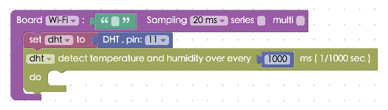
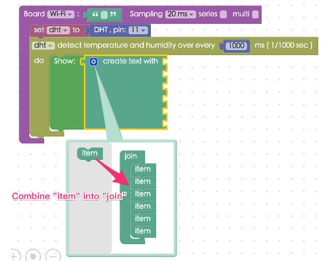
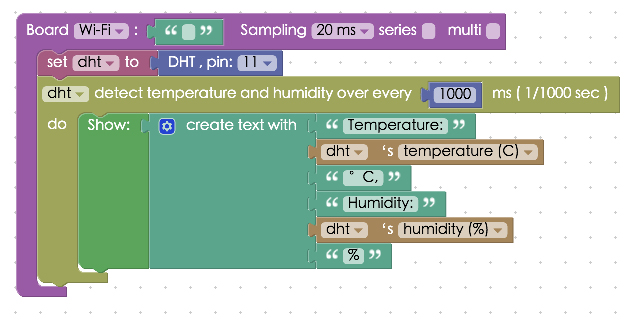
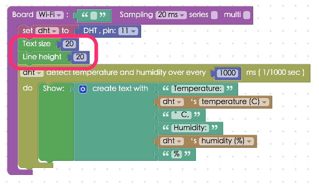
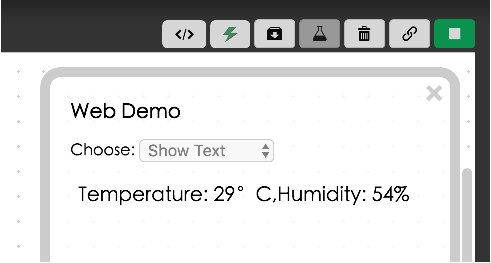

<!-- @@master  = ../../_layout.html-->

<!-- @@block  =  meta-->

<title>Project Example 10: DHT Sensor :::: Webduino = Web × Arduino</title>

<meta name="description" content="The DHT sensor is a basic digital temperature and humidity sensor. It uses a capacitive humidity sensor and a thermistor to measure the surrounding air, and generates a digital signal. The signal can be converted for practical and useful real-time analysis when connected to CSS, D3.js, Google Chart, or a databse. Let's see how it works!">

<meta itemprop="description" content="The DHT sensor is a basic digital temperature and humidity sensor. It uses a capacitive humidity sensor and a thermistor to measure the surrounding air, and generates a digital signal. The signal can be converted for practical and useful real-time analysis when connected to CSS, D3.js, Google Chart, or a databse. Let's see how it works!">

<meta property="og:description" content="The DHT sensor is a basic digital temperature and humidity sensor. It uses a capacitive humidity sensor and a thermistor to measure the surrounding air, and generates a digital signal. The signal can be converted for practical and useful real-time analysis when connected to CSS, D3.js, Google Chart, or a databse. Let's see how it works!">

<meta property="og:title" content="Project Example 10: DHT Sensor" >

<meta property="og:url" content="https://webduino.io/tutorials/tutorial-10-temperature-humidity-sensor.html">

<meta property="og:image" content="https://webduino.io/img/tutorials/tutorial-10-01s.jpg">

<meta itemprop="image" content="https://webduino.io/img/tutorials/tutorial-10-01s.jpg">

<include src="../_include-tutorials.html"></include>

<!-- @@close-->

<!-- @@block  =  preAndNext-->

<include src="../_include-tutorials-content.html"></include>

<!-- @@close-->

<!-- @@block  =  tutorials-->
# Project Example 10: DHT Sensor

The DHT sensor is a basic digital temperature and humidity sensor. It uses a capacitive humidity sensor and a thermistor to measure the surrounding air, and generates a digital signal. The signal can be converted for practical and useful real-time analysis when connected to CSS, D3.js, Google Chart, or a databse. Let's see how it works!

<!-- 

	溫濕度傳感器相關套件：<a href="https://webduino.io/buy/webduino-expansion-s.html" target="_blank">Webduino 擴充套件 S ( 支援馬克 1 號、Fly )</a>
	Webduino 開發板：<a href="https://webduino.io/buy/component-webduino-v1.html" target="_blank">Webduino 馬克一號</a>、<a href="https://webduino.io/buy/component-webduino-fly.html" target="_blank">Webduino Fly</a>、<a href="https://webduino.io/buy/component-webduino-uno-fly.html" target="_blank">Webduino Fly + Arduino UNO</a>

 -->

## Video Tutorial

<!-- Open the Webduino Blockly for exclusive use of Project Example [Webduino Blockly Chapter 5-1: DHT](https://blockly.webduino.io/?lang=en&page=tutorials/dht-1#-KTOEE2WAS9owD92je8e) --> 

Check the video tutorial here:
<iframe class="youtube" src="https://www.youtube.com/embed/T8sZL-UaUP0" frameborder="0" allowfullscreen></iframe>

## The Circuit 

The DHT sensor has 4 pins, and the connections are simple. Connect the first pin to  the 3.3V power, the second pin to the IO 11 data input pin, and the right most pin to ground. Note that the third pin is N/C.

You can connect the DHT sensor to either the Webduino Mark 1 or to a breadboard.

Reference image:

<!-- 

	溫濕度傳感器相關套件：<a href="https://webduino.io/buy/webduino-expansion-s.html" target="_blank">Webduino 擴充套件 S ( 支援馬克 1 號、Fly )</a>
	Webduino 開發板：<a href="https://webduino.io/buy/component-webduino-v1.html" target="_blank">Webduino 馬克一號</a>、<a href="https://webduino.io/buy/component-webduino-fly.html" target="_blank">Webduino Fly</a>、<a href="https://webduino.io/buy/component-webduino-uno-fly.html" target="_blank">Webduino Fly + Arduino UNO</a>

 -->

## Instruction of Webduino Blockly 

Open the page: [https://blockly.webduino.io/?lang=en](https://blockly.webduino.io/?lang=en) to acces Webduino Blockly. First, you will need to use the "Web Demo Area" to demonstrate the value of temperature or humidity. So click "Web Demo Area" and choose "Show Text" in the drop-down list.

Drag a "board" block into the workspace, and type in the name of your Webduino board. Combine a "DHT sensor" block, set the name as DHT, and set the "pin" to 11. Finally, set the DHT to detect temperature and humidity evey 1000ms.  

Each "Show Text" block has only one blank connection point; however, you need to create more blank connectors if you want to show both humidity and temperature values at the same time. Find the "Create Text With" block in the "Standard" drop down menu under "Text", click the blue gear, and select the amount of blank connectors you'll need.

Key in all the boxes as shown below.

You can also adjust the text size and line height by using blocks. Here we set both values to 20.

After you finish creating the block stack, check your "[device's status](https://webduino.io/device.html)" before you "Run" all of the blocks. Then you can start checking the results of your DHT sensor in the web demo area!
Check your stack setup with this example here: [https://blockly.webduino.io/?lang=en#-KTO4n5BTnHAOczEhG5Z](https://blockly.webduino.io/?lang=en#-KTO4n5BTnHAOczEhG5Z) 

## Code Explanation ([Check Webduino Bin](http://bin.webduino.io/coca/edit?html,css,js,output), [Check Device Status](https://webduino.io/device.html))

Include `webduino-all.min.js` in the header of your html files in order to support all the Webduino's components. If the codes are generated by Webduino Blockly, you also have to include `webduino-blockly.js` in your files.

	
	

In HTML, we use a span tag for showing the results.

	123

Then we use the JavaScript method `read()` for measuring temperature and humidity. The first parameter of `read()` points to the callback function. The second parameter represents the time interval, which is 1000 ms, in this case. Finally we use innerHTML to display the text and `style` to change the line height and font size.  

	var dht;

	boardReady('', function (board) {
	  board.samplingInterval = 20;
	  dht = getDht(board, 11);
	  document.getElementById("demo-area-01-show").style.fontSize = 20+"px";
	  document.getElementById("demo-area-01-show").style.lineHeight = 20+"px";
	  dht.read(function(evt){
	    document.getElementById("demo-area-01-show").innerHTML = (['temperature: ',dht.temperature,'degrees, ','humidity: ',dht.humidity,'%'].join(''));
	  }, 1000);
	});

This was the example of how to use an DHT sensor to detect the humidity and temperature, we hope you enjoyed it!  
Webduino Bin: [http://bin.webduino.io/coca/edit?html,css,js,output](http://bin.webduino.io/coca/edit?html,css,js,output)  
Stack setup: [https://blockly.webduino.io/?lang=en#-KTOOlF32GTHkBEdDp3q](https://blockly.webduino.io/?lang=en#-KTOOlF32GTHkBEdDp3q)

<!-- ## Tutorial Extension of DHT Sensor:

[Webduino Blockly Chapter 5-2: Draw Area Chart](https://blockly.webduino.io/?lang=en&page=tutorials/dht-2#-KTOGoy4nuojm8tss-B5)  
[Webduino Blockly Chapter 5-3: Use Firebase to Read and write dht data](https://blockly.webduino.io/?lang=en&page=tutorials/dht-3#-KTOGkah404mi0_Jower) -->

<!-- 

	溫濕度傳感器相關套件：<a href="https://webduino.io/buy/webduino-expansion-s.html" target="_blank">Webduino 擴充套件 S ( 支援馬克 1 號、Fly )</a>
	Webduino 開發板：<a href="https://webduino.io/buy/component-webduino-v1.html" target="_blank">Webduino 馬克一號</a>、<a href="https://webduino.io/buy/component-webduino-fly.html" target="_blank">Webduino Fly</a>、<a href="https://webduino.io/buy/component-webduino-uno-fly.html" target="_blank">Webduino Fly + Arduino UNO</a>

 -->

<!-- @@close-->