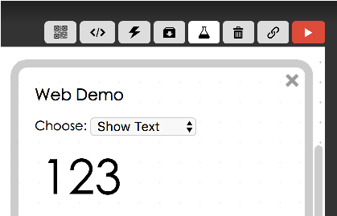
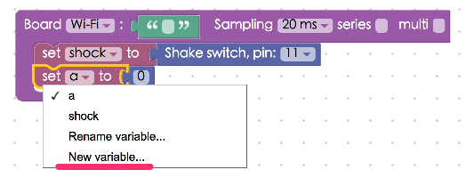
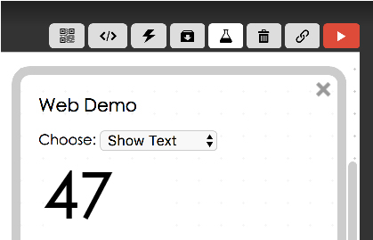

<!-- @@master  = ../../_layout.html-->

<!-- @@block  =  meta-->

<title>Project Example 11: Using a Shake Switch to change values :::: Webduino = Web × Arduino</title>

<meta name="description" content="The components of a Shake Switch, shown below, are a metal conductive spring, a metal conductive leg, and the outer case. The spring is a thin metal wire extending outside of the case, so when you shake it the insides short-circuit and it works like a button switch. Only the Shake Switch closes its circuit through movement.">

<meta itemprop="description" content="The components of a Shake Switch, shown below, are a metal conductive spring, a metal conductive leg, and the outer case. The spring is a thin metal wire extending outside of the case, so when you shake it the insides short-circuit and it works like a button switch. Only the Shake Switch closes its circuit through movement.">

<meta property="og:description" content="The components of a Shake Switch, shown below, are a metal conductive spring, a metal conductive leg, and the outer case. The spring is a thin metal wire extending outside of the case, so when you shake it the insides short-circuit and it works like a button switch. Only the Shake Switch closes its circuit through movement.">

<meta property="og:title" content="Project Example 11: Using a Shake Switch to change values" >

<meta property="og:url" content="https://webduino.io/tutorials/ttutorial-11-shock-button.html">

<meta property="og:image" content="https://webduino.io/img/tutorials/tutorial-11-01s.jpg">

<meta itemprop="image" content="https://webduino.io/img/tutorials/tutorial-11-01s.jpg">

<include src="../_include-tutorials.html"></include>

<!-- @@close-->

<!-- @@block  =  preAndNext-->

<include src="../_include-tutorials-content.html"></include>

<!-- @@close-->

<!-- @@block  =  tutorials-->
# Project Example 11: Using a Shake Switch to change values

The components of a Shake Switch, shown below, are a metal conductive spring, a metal conductive leg, and the outer case. The spring is a thin metal wire extending outside of the case, so when you shake it the insides short-circuit and it works like a button switch. Only the Shake Switch closes its circuit through movement.

<!-- 

	震動開關相關套件：<a href="https://webduino.io/buy/webduino-package-plus.html" target="_blank">Webduino 基本套件 Plus ( 支援馬克 1 號、Fly )</a>
	Webduino 開發板：<a href="https://webduino.io/buy/component-webduino-v1.html" target="_blank">Webduino 馬克一號</a>、<a href="https://webduino.io/buy/component-webduino-fly.html" target="_blank">Webduino Fly</a>、<a href="https://webduino.io/buy/component-webduino-uno-fly.html" target="_blank">Webduino Fly + Arduino UNO</a>

 -->

## Video Tutorial

<!-- 影片對應範例：[https://blockly.webduino.io/?page=tutorials/shock-1](https://blockly.webduino.io/?page=tutorials/shock-1)  -->
Check the video tutorial here: 
<iframe class="youtube" src="https://www.youtube.com/embed/Xv85frAw4uI" frameborder="0" allowfullscreen></iframe>

## Wiring and Practice

The Shake Switch has a thick leg and a thin leg. Connect the thick leg to pin 11 and the thin leg to 3.3V. As always, to prevent a short circuit, add a resistor to the circuit, following the image below make the connection to GND. When the Shake Switch is connected to a breadboard you might worry that the thin leg isn't properly connected, simply place the switch's legs into the breadboard and it will connect.

Webduino Mark 1 Circuit diagram:

Webduino Fly Circuit diagram:

Reference image:

<!-- 

	震動開關相關套件：<a href="https://webduino.io/buy/webduino-package-plus.html" target="_blank">Webduino 基本套件 Plus ( 支援馬克 1 號、Fly )</a>
	Webduino 開發板：<a href="https://webduino.io/buy/component-webduino-v1.html" target="_blank">Webduino 馬克一號</a>、<a href="https://webduino.io/buy/component-webduino-fly.html" target="_blank">Webduino Fly</a>、<a href="https://webduino.io/buy/component-webduino-uno-fly.html" target="_blank">Webduino Fly + Arduino UNO</a>

 -->

## Instructions for using the Webduino Blockly

Open the [Webduino Blocky editor](https://blockly.webduino.io/?lang=en). This project example will use "Show Text" to show a value when the Shake Switch is moved and the values will continue to display while the switch is activated. Click on the "Web Demo Area" on the upper right hand corner and choose "Show Text" from the drop down menu.

Place the board inside the editor, fill in the name of the Webduino board you are using, place a "Shake Switch" block inside the workspace. Set name to "shock" and set the pin to 11.

Place a "Variables" block into the stack, select "New Variable" to set a new variable, and set it to 0 by adding a "Math" block.

Place a "When status is / do" block from "Shake Switch" menu and place a math formula "a = a+1" into that stack. This means that every time the Shake Switch is activated, 1 will be added to the current value of A. The  value of A will be shown on screen if a "Show" block is added to the stack.

Once you're done, check if the board is online (click "[Check Device Status](https://webduino.io/device.html)"") and click on the red execution button "Run Blocks", shake the "Shake Switch" and you will see the value go up on screen. (Solution: [https://blockly.webduino.io/?lang=en#-KZZJZL2sUmk0rfVbuXK](https://blockly.webduino.io/?lang=en#-KZZJZL2sUmk0rfVbuXK))

## Code Explanation ([Check Webduino Bin](http://bin.webduino.io/pozik/edit?html,css,js,output), [Check Device Status](https://webduino.io/device.html))

Include `webduino-all.min.js` in the header of your html files in order to support all of the Webduino's components. If the codes are generated by Webduino Blockly, you also have to include `webduino-blockly.js` in your files.

	
	

The span inside the HTML file prints the text on screen.

	123

JavaScript is similar to what we saw in the Button Switch example, they all use `on`, but when it shows `high` the switch is on and `low` the switch is off. When the switch is on, a = a+1 and is displayed by `innerHTML`.

	var shock;
	var a;

	boardReady('', function (board) {
	  board.samplingInterval = 20;
	  shock = getShock(board, 11);
	  a = 0;
	  document.getElementById("demo-area-01-show").innerHTML = a;
	  shock.on("high",function(){
	    console.log("high");
	      a = a + 1;
	    document.getElementById("demo-area-01-show").innerHTML = a;

	  });
	});

This is how you use a Shake Switch to show how many times it is activated on screen.
Webduino Bin: [http://bin.webduino.io/pozik/edit?html,css,js,output](http://bin.webduino.io/pozik/edit?html,css,js,output)  
Stack setup: [https://blockly.webduino.io/?lang=en#-KZZKNQYFJuPT4Q8IxTF](https://blockly.webduino.io/?lang=en#-KZZKNQYFJuPT4Q8IxTF)

<!-- ## 震動開關的延伸教學：

[Webduino Blockly 課程 10-2：震動按鈕開關改變圖片位置](https://blockly.webduino.io/?lang=zh-hant&page=tutorials/shock-2#-Jw1KUKUyvZIS_b4pQJ9)

	震動開關相關套件：<a href="https://webduino.io/buy/webduino-package-plus.html" target="_blank">Webduino 基本套件 Plus ( 支援馬克 1 號、Fly )</a>
	Webduino 開發板：<a href="https://webduino.io/buy/component-webduino-v1.html" target="_blank">Webduino 馬克一號</a>、<a href="https://webduino.io/buy/component-webduino-fly.html" target="_blank">Webduino Fly</a>、<a href="https://webduino.io/buy/component-webduino-uno-fly.html" target="_blank">Webduino Fly + Arduino UNO</a>

 -->

<!-- @@close-->