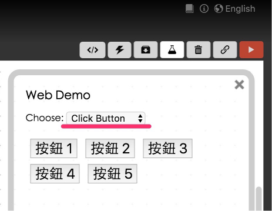
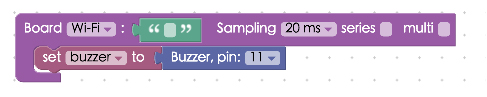
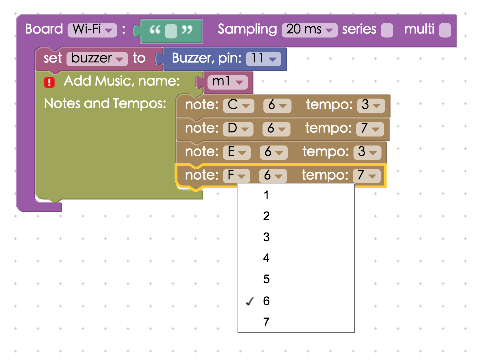
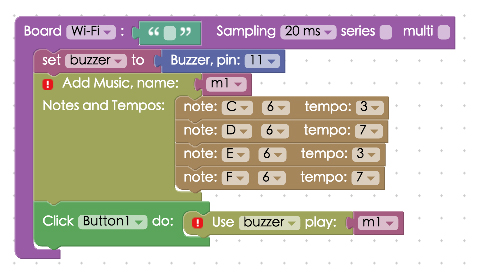
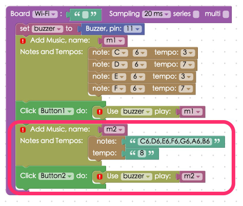
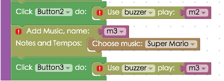
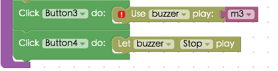
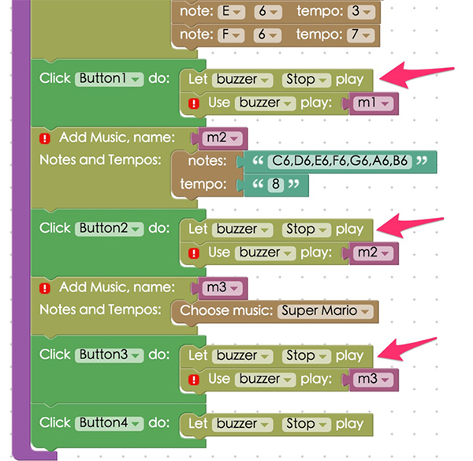

<!-- @@master  = ../../_layout.html-->

<!-- @@block  =  meta-->

<title>Project Example 13: 蜂鳴器播放自製音樂 :::: Webduino = Web × Arduino</title>

<meta name="description" content="蜂鳴器是一個可以產生聲音信號的裝置，使用直流電供電，接通訊號源之後，音訊信號電流通過電磁線圈，使電磁線圈產生磁場，造成 振動膜片週期性地振動發聲，而 Webduino 更可以藉由 HTML5 Attribute 來填入音符代碼，每個代碼都會對應到一個數值，這個數值相對應蜂鳴器聲音的頻率，因此藉由純粹的 HTML5 或 javascript 就可以編輯音樂，透過蜂鳴器發聲。">

<meta itemprop="description" content="蜂鳴器是一個可以產生聲音信號的裝置，使用直流電供電，接通訊號源之後，音訊信號電流通過電磁線圈，使電磁線圈產生磁場，造成 振動膜片週期性地振動發聲，而 Webduino 更可以藉由 HTML5 Attribute 來填入音符代碼，每個代碼都會對應到一個數值，這個數值相對應蜂鳴器聲音的頻率，因此藉由純粹的 HTML5 或 javascript 就可以編輯音樂，透過蜂鳴器發聲。">

<meta property="og:description" content="蜂鳴器是一個可以產生聲音信號的裝置，使用直流電供電，接通訊號源之後，音訊信號電流通過電磁線圈，使電磁線圈產生磁場，造成 振動膜片週期性地振動發聲，而 Webduino 更可以藉由 HTML5 Attribute 來填入音符代碼，每個代碼都會對應到一個數值，這個數值相對應蜂鳴器聲音的頻率，因此藉由純粹的 HTML5 或 javascript 就可以編輯音樂，透過蜂鳴器發聲。">

<meta property="og:title" content="Project Example 13: 蜂鳴器播放自製音樂" >

<meta property="og:url" content="https://webduino.io/tutorials/tutorial-13-buzzer.html">

<meta property="og:image" content="https://webduino.io/img/tutorials/tutorial-13-01s.jpg">

<meta itemprop="image" content="https://webduino.io/img/tutorials/tutorial-13-01s.jpg">

<include src="../_include-tutorials.html"></include>

<!-- @@close-->

<!-- @@block  =  preAndNext-->

<include src="../_include-tutorials-content.html"></include>

<!-- @@close-->

<!-- @@block  =  tutorials-->

# Project Example 13: 蜂鳴器播放自製音樂

蜂鳴器是一個可以產生聲音信號的裝置，使用直流電供電，接通訊號源之後，音訊信號電流通過電磁線圈，使電磁線圈產生磁場，造成 振動膜片週期性地振動發聲，而 Webduino 更可以藉由 HTML5 Attribute 來填入音符代碼，每個代碼都會對應到一個數值，這個數值相對應蜂鳴器聲音的頻率，因此藉由純粹的 HTML5 或 javascript 就可以編輯音樂，透過蜂鳴器發聲。

<!-- 

	蜂鳴器相關套件：<a href="https://webduino.io/buy/webduino-package-plus.html" target="_blank">Webduino 基本套件 Plus ( 支援馬克 1 號、Fly )</a>
	Webduino 開發板：<a href="https://webduino.io/buy/component-webduino-v1.html" target="_blank">Webduino 馬克一號</a>、<a href="https://webduino.io/buy/component-webduino-fly.html" target="_blank">Webduino Fly</a>、<a href="https://webduino.io/buy/component-webduino-uno-fly.html" target="_blank">Webduino Fly + Arduino UNO</a>

 -->
 
## Video Tutorial:

<!-- Open the Webduino Blockly for exclusive use of Project Example "[Webduino Blockly Chapter 9-1: Buzzer](https://blockly.webduino.io/?lang=en&page=tutorials/buzzer-1#-KTOKUPXLe_nXqsOgWs-)" -->

Check the video tutorial here:
<iframe class="youtube" src="https://www.youtube.com/embed/StNG2NHS240" frameborder="0" allowfullscreen></iframe>

## The Circuit 

蜂鳴器在電路板的附近，有標示「+」和「-」的符號，「-」接在開發板的 GND，「+」接在 11 的腳位 ( 其實接反也沒關係 )，可以用杜邦線接出來，如果是馬克 1 號，也可以直接安插在上面。

Reference image:

<!-- 

	蜂鳴器相關套件：<a href="https://webduino.io/buy/webduino-package-plus.html" target="_blank">Webduino 基本套件 Plus ( 支援馬克 1 號、Fly )</a>
	Webduino 開發板：<a href="https://webduino.io/buy/component-webduino-v1.html" target="_blank">Webduino 馬克一號</a>、<a href="https://webduino.io/buy/component-webduino-fly.html" target="_blank">Webduino Fly</a>、<a href="https://webduino.io/buy/component-webduino-uno-fly.html" target="_blank">Webduino Fly + Arduino UNO</a>

 -->

## Instruction of Webduino Blockly 

Open the page: [https://blockly.webduino.io/?lang=en](https://blockly.webduino.io/?lang=en)，因為這個範例會用網頁「網頁按鈕」來點選不同按鈕播放不同音樂，所以要先點選右上方「網頁互動測試」的按鈕，打開內嵌測試的網頁，用下拉選單選擇「按鈕行為」，這邊的按鈕跟實體的按鈕開關是不一樣的，這邊的按鈕指的是網頁上面的按鈕。

把開發板放到編輯畫面裡，填入對應的 Webduino 開發板名稱，開發板內放入蜂鳴器積木，名稱設定為 buzzer，腳位設定為 11。

再來建立我們的第一首音樂，放入「建立音樂」的積木，名稱命名為 m1，裏頭擺入音符與節奏，「音符」第一個下拉選單有「無聲、C、CS、D、DS、E、F、FS、G、GS、A、AS、B」，可以想像成鋼琴的黑鍵與白鍵，有 S 的就是黑鍵，第二個下拉選單就是有幾個八度音，這裏可以設定七個八度音，數字越大聲越高，「節奏」就是幾分之一秒，最少可以到 1/10 秒。

建立了音樂，接著就設定按下按鈕 1 的事件，當按下按鈕 1，就用 buzzer 播放 m1。

除了一個個放入音符和節奏外，也可以直接用輸入的方式，這裏就只是把剛剛的音符與節奏，合併成兩個欄位，如果節奏沒有按照音符數量填寫 ( 如果節奏比較少 )，則多出來的音符就會用最後一個節奏的時間去播放，用這種方式做的第二首音樂 m2，點選按鈕 2 來播放。

接著按下按鈕 3 的事件，這裏就用同樣做音樂的方法作首 m3 的音樂，內容就直接選一首資料庫的音樂放入。

按鈕 4 綁定停止播放的行為。

到這邊大致上已經完成了一個點選按鈕控制播放的蜂鳴器程式積木，但最後一步我們要在按鈕 1 到 3 多加一段停止播放的行為，避免按下按鈕的時候，如果前一首還沒播完，就會重疊在一起播放。

After you finish creating the block stack, check your "[device's status](https://webduino.io/device.html)" before you "Run" all of the blocks. 就會聽到蜂鳴器播放出不同的音樂。 
Check your stack setup with this example here: [https://blockly.webduino.io/#-KDEaW-S-kRRaEkkyRGH](https://blockly.webduino.io/?lang=en#-KTOLSVERLP8SHXKg4Gh)

## Code Explanation ([Check Webduino Bin](https://bin.webduino.io/lihov/edit?html,css,js,output), [Check Device Status](https://webduino.io/device.html))

Include `webduino-all.min.js` in the header of your html files in order to support all the Webduino's components. If the codes are generated by Webduino Blockly, you also have to include `webduino-blockly.js` in your files.

	
	

HTML 裡有五個按鈕，分別有各自的 id，屆時就可以由 id 來判斷按下哪顆按鈕。

	<button id="demo-area-05-btn1" class="db5">按鈕 1</button>
	<button id="demo-area-05-btn2" class="db5">按鈕 2</button>
	<button id="demo-area-05-btn3" class="db5">按鈕 3</button>
	<button id="demo-area-05-btn4" class="db5">按鈕 4</button>
	<button id="demo-area-05-btn5" class="db5">按鈕 5</button>

JavaScript 看起來很多，但實際上很單純，先看到 m1 這首歌，其實就是建立兩個陣列 ( notes 和 tempos )，然後把音符和節奏分別拋到這兩個陣列裡，一開始的程式就是音樂播放的主程式，可以清楚地看到裡面放入了兩個物件，分別是 notes 和 tempos，而這兩個物件內容都是陣列。

	var buzzer;
	var m1;
	var m2;
	var m3;

	function buzzer_music(m) {
	  var musicNotes = {};
	  musicNotes.notes = [];
	  musicNotes.tempos = [];
	  if(m.length>1){
	    for(var i=0; i<m.length; i++){
	      if(Array.isArray(m[i].notes)){
	        var cn = musicNotes.notes.concat(m[i].notes);
	        musicNotes.notes = cn;
	      }else{
	        musicNotes.notes.push(m[i].notes);
	      }
	      if(Array.isArray(m[i].tempos)){
	        var ct = musicNotes.tempos.concat(m[i].tempos);
	        musicNotes.tempos = ct;
	      }else{
	        musicNotes.tempos.push(m[i].tempos);
	      }
	    }
	  }else{
	    musicNotes.notes = [m[0].notes];
	    musicNotes.tempos = [m[0].tempos];
	  }
	  return musicNotes;
	}

接著看到開發板的程式，可以看到我們建立的音樂，就是把一串陣列丟給這首音樂的 notes 和 tempos 物件，如此一來蜂鳴器就會按照這些音符節奏播放。

	boardReady('', function (board) {
	  board.samplingInterval = 20;
	  buzzer = getBuzzer(board, 11);
	  m1 = buzzer_music([  {notes:"C6",tempos:"3"},{notes:"D6",tempos:"7"},{notes:"E6",tempos:"3"},{notes:"F6",tempos:"7"}]);
	  document.getElementById("demo-area-05-btn1").addEventListener("click",function(){
	    buzzer.stop();
	    buzzer.play(m1.notes, m1.tempos);
	  });
	  m2 = buzzer_music([  {notes : ["C6","D6","E6","F6","G6","A6","B6"] , tempos : ["8","8","8","8","8","8","8"] }]);
	  document.getElementById("demo-area-05-btn2").addEventListener("click",function(){
	    buzzer.stop();
	    buzzer.play(m2.notes, m2.tempos);
	  });
	  m3 = buzzer_music([  {notes:["E7","E7","0","E7","0","C7","E7","0","G7","0","0","0","G6","0","0","0","C7","0","0","G6","0","0","E6","0","0","A6","0","B6","0","AS6","A6","0","G6","E7","0","G7","A7","0","F7","G7","0","E7","0","C7","D7","B6","0","0","C7","0","0","G6","0","0","E6","0","0","A6","0","B6","0","AS6","A6","0","G6","E7","0","G7","A7","0","F7","G7","0","E7","0","C7","D7","B6","0","0"] , tempos:["8", "8", "8", "8", "8", "8", "8", "8", "8", "8", "8", "8", "8", "8", "8", "8", "8", "8", "8", "8", "8", "8", "8", "8", "8", "8", "8", "8", "8", "8", "8", "8", "8", "8", "8", "8", "8", "8", "8", "8", "8", "8", "8", "8", "8", "8", "8", "8", "8", "8", "8", "8", "8", "8", "8", "8", "8", "8", "8", "8", "8", "8", "8", "8", "8", "8", "8", "8", "8", "8", "8", "8", "8", "8", "8", "8", "8", "8", "8", "8"]}]);
	  document.getElementById("demo-area-05-btn3").addEventListener("click",function(){
	    buzzer.stop();
	    buzzer.play(m3.notes, m3.tempos);
	  });
	  document.getElementById("demo-area-05-btn4").addEventListener("click",function(){
	    buzzer.stop();
	  });
	});

以上就是利用蜂鳴器和網頁的按鈕，來製作與播放音樂。  
Webduino Bin: [https://bin.webduino.io/lihov/edit?html,css,js,output](https://bin.webduino.io/lihov/edit?html,css,js,output)  
Stack setup: [https://blockly.webduino.io/?lang=en#-KTOK67llD96tMoi2Qmz](https://blockly.webduino.io/?lang=en#-KTOK67llD96tMoi2Qmz)

<!-- ## Tutorial Extension of Buzzer:

[Webduino Blockly Chapter 9-2: Buzzer](http://blockly.webduino.io/?lang=en&page=tutorials/buzzer-2#-KTOJaNA6gOTn6N3nkKj)  
[Webduino Blockly Chapter 9-3: Buzzer and Change music](http://blockly.webduino.io/?lang=en&page=tutorials/buzzer-3#-KTOJh9f4A3KN-x9WTOH)  
[Webduino Blockly Chapter 9-4: Buzzer (Play, Stop and Pause)](http://blockly.webduino.io/?lang=en&page=tutorials/buzzer-4#-KTOJtTg3RxufMb6r-GK) -->

<!-- 

	蜂鳴器相關套件：<a href="https://webduino.io/buy/webduino-package-plus.html" target="_blank">Webduino 基本套件 Plus ( 支援馬克 1 號、Fly )</a>
	Webduino 開發板：<a href="https://webduino.io/buy/component-webduino-v1.html" target="_blank">Webduino 馬克一號</a>、<a href="https://webduino.io/buy/component-webduino-fly.html" target="_blank">Webduino Fly</a>、<a href="https://webduino.io/buy/component-webduino-uno-fly.html" target="_blank">Webduino Fly + Arduino UNO</a>

 -->

<!-- @@close-->