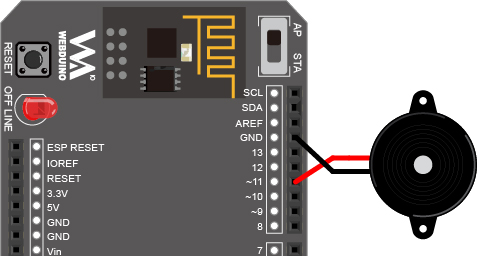

<!-- @@master  = ../../_layout.html-->

<!-- @@block  =  meta-->

<title>Project Example 13: Make Music with a Buzzer :::: Webduino = Web × Arduino</title>

<meta name="description" content="The buzzer is an audio singalling device that can be applied to many fields. It works based on the principle of electromechanical theory. When a DC voltage is applied, the audio signal current goes through a solenoid coil, creating a magnetic field and then causes the vibration of a diaphragm that in turn generates sounds. You can only use HTML attributes to make a piece of music on the Webduino Blockly to make the buzzer play music for you.">

<meta itemprop="description" content="The buzzer is an audio singalling device that can be applied to many fields. It works based on the principle of electromechanical theory. When a DC voltage is applied, the audio signal current goes through a solenoid coil, creating a magnetic field and then causes the vibration of a diaphragm that in turn generates sounds. You can only use HTML attributes to make a piece of music on the Webduino Blockly to make the buzzer play music for you.">

<meta property="og:description" content="The buzzer is an audio singalling device that can be applied to many fields. It works based on the principle of electromechanical theory. When a DC voltage is applied, the audio signal current goes through a solenoid coil, creating a magnetic field and then causes the vibration of a diaphragm that in turn generates sounds. You can only use HTML attributes to make a piece of music on the Webduino Blockly to make the buzzer play music for you.">

<meta property="og:title" content="Project Example 13: Make Music with a Buzzer" >

<meta property="og:url" content="https://webduino.io/tutorials/tutorial-13-buzzer.html">

<meta property="og:image" content="https://webduino.io/img/tutorials/tutorial-13-01s.jpg">

<meta itemprop="image" content="https://webduino.io/img/tutorials/tutorial-13-01s.jpg">

<include src="../_include-tutorials.html"></include>

<!-- @@close-->

<!-- @@block  =  preAndNext-->

<include src="../_include-tutorials-content.html"></include>

<!-- @@close-->

<!-- @@block  =  tutorials-->

# Project Example 13: Make Music with a Buzzer

The buzzer is an audio singalling device that can be applied to many fields. It works based on the principle of electromechanical theory. When a DC voltage is applied, the audio signal current goes through a solenoid coil, creating a magnetic field and then causes the vibration of a diaphragm that in turn generates sounds. 
You can only use HTML attributes to make a piece of music on the Webduino Blockly to make the buzzer play music for you.

<!-- 

	蜂鳴器相關套件：<a href="https://webduino.io/buy/webduino-package-plus.html" target="_blank">Webduino 基本套件 Plus ( 支援馬克 1 號、Fly )</a>
	Webduino 開發板：<a href="https://webduino.io/buy/component-webduino-v1.html" target="_blank">Webduino 馬克一號</a>、<a href="https://webduino.io/buy/component-webduino-fly.html" target="_blank">Webduino Fly</a>、<a href="https://webduino.io/buy/component-webduino-uno-fly.html" target="_blank">Webduino Fly + Arduino UNO</a>

 -->
 
## Video Tutorial:

<!-- Open the Webduino Blockly for exclusive use of Project Example "[Webduino Blockly Chapter 9-1: Buzzer](https://blockly.webduino.io/?lang=en&page=tutorials/buzzer-1#-KTOKUPXLe_nXqsOgWs-)" -->

Check the video tutorial here:
<iframe class="youtube" src="https://www.youtube.com/embed/StNG2NHS240" frameborder="0" allowfullscreen></iframe>

## The Circuit 

There are negative [-] and positive [+] connectors on the buzzer. You have to connect the negative line to GND on the board, and positive line to 1 on board.

Webduino Mark 1 Circuit diagram:

Webduino Fly Circuit diagram:

Reference image:

<!-- 

	蜂鳴器相關套件：<a href="https://webduino.io/buy/webduino-package-plus.html" target="_blank">Webduino 基本套件 Plus ( 支援馬克 1 號、Fly )</a>
	Webduino 開發板：<a href="https://webduino.io/buy/component-webduino-v1.html" target="_blank">Webduino 馬克一號</a>、<a href="https://webduino.io/buy/component-webduino-fly.html" target="_blank">Webduino Fly</a>、<a href="https://webduino.io/buy/component-webduino-uno-fly.html" target="_blank">Webduino Fly + Arduino UNO</a>

 -->

## Instruction of Webduino Blockly 

Open the page: [https://blockly.webduino.io/?lang=en](https://blockly.webduino.io/?lang=en) to acces Webduino Blockly. First, you will need to use the "Web Demo Area" to click buttons to play music. Click "Web Demo Area" and choose "Click Button" in the drop-down list. Note that, the button here is referring to the virtual button on "Web Demo Area", not the real button switch.

Drag a "board" block into the workspace, and type in the name of your Webduino board. Combine a "Buzzer" block, from the "Buzzer" list located under the "Components" dropdown menu. Set the name as buzzer, and set the "pin" to 11. 

Add an "Add music" block from under "Buzzer" to the stack, name this piece of music "M1". Now connect the "Note & Tempo" block to that. The musical scale of notes are C, CS(C sharp), D, DS(D sharp), E, ES(E sharp), F, FS(F sharp), G, GS(G sharp), A, AS(A sharp), and B. The numbers after the notes represent the octaves. The tempos are represented by a specified fraction of second. For example, setting 3 means that the amount of time between successive beats is ⅓ second.

After setting the notes and tempos, drag a block from the "Web Demo" menu under "Click Button" to the workspace. When clicked the button, run music "M1" with the buzzer.

You can also compose in the same tempo with the similar steps mentioned above. Drag another "Add music" block to the stack and name this piece of music "M2". Then add another "Notes & Tempo" block to the stack, add the notes and tempo. Finally, use "Button 2" from the "Web Demo Area" to play this piece of music.

The buzzer can also play selected music. Just replace the "Notes & Tempo" block with a "Choose Music" block, and selecting a song from the database. If you want to stop music with a button, combine a "Let Buzzer Stop..." block with the "Click Button, Do" block.

By repeating the last step, you can make a button play and pause every piece of music.

After you finish creating the block stack, check your "[device's status](https://webduino.io/device.html)" before you "Run" all of the blocks. Then you can hear the buzzer play music for you! 
Check your stack setup with this example here: [https://blockly.webduino.io/#-KDEaW-S-kRRaEkkyRGH](https://blockly.webduino.io/?lang=en#-KTOLSVERLP8SHXKg4Gh)

## Code Explanation ([Check Webduino Bin](https://bin.webduino.io/lihov/edit?html,css,js,output), [Check Device Status](https://webduino.io/device.html))

Include `webduino-all.min.js` in the header of your html files in order to support all the Webduino's components. If the codes are generated by Webduino Blockly, you also have to include `webduino-blockly.js` in your files.

	
	

There are five buttons in the html with their repective IDs, by which we can determine which one is pressed.

	<button id="demo-area-05-btn1" class="db5">按鈕 1</button>
	<button id="demo-area-05-btn2" class="db5">按鈕 2</button>
	<button id="demo-area-05-btn3" class="db5">按鈕 3</button>
	<button id="demo-area-05-btn4" class="db5">按鈕 4</button>
	<button id="demo-area-05-btn5" class="db5">按鈕 5</button>

The code looks lengthy but simple. The main function "buzzer_music" is used to create the music. First we create an object "musicNotes" to represent the whole melody. Then we create two arrays, "notes" and "tempos", for storing the notes and tempos.

	var buzzer;
	var m1;
	var m2;
	var m3;

	function buzzer_music(m) {
	  var musicNotes = {};
	  musicNotes.notes = [];
	  musicNotes.tempos = [];
	  if(m.length>1){
	    for(var i=0; i<m.length; i++){
	      if(Array.isArray(m[i].notes)){
	        var cn = musicNotes.notes.concat(m[i].notes);
	        musicNotes.notes = cn;
	      }else{
	        musicNotes.notes.push(m[i].notes);
	      }
	      if(Array.isArray(m[i].tempos)){
	        var ct = musicNotes.tempos.concat(m[i].tempos);
	        musicNotes.tempos = ct;
	      }else{
	        musicNotes.tempos.push(m[i].tempos);
	      }
	    }
	  }else{
	    musicNotes.notes = [m[0].notes];
	    musicNotes.tempos = [m[0].tempos];
	  }
	  return musicNotes;
	}

Finally, we use play() to play the notes we have created. With this, the buzzer will play the melody accordingly.

	boardReady('', function (board) {
	  board.samplingInterval = 20;
	  buzzer = getBuzzer(board, 11);
	  m1 = buzzer_music([  {notes:"C6",tempos:"3"},{notes:"D6",tempos:"7"},{notes:"E6",tempos:"3"},{notes:"F6",tempos:"7"}]);
	  document.getElementById("demo-area-05-btn1").addEventListener("click",function(){
	    buzzer.stop();
	    buzzer.play(m1.notes, m1.tempos);
	  });
	  m2 = buzzer_music([  {notes : ["C6","D6","E6","F6","G6","A6","B6"] , tempos : ["8","8","8","8","8","8","8"] }]);
	  document.getElementById("demo-area-05-btn2").addEventListener("click",function(){
	    buzzer.stop();
	    buzzer.play(m2.notes, m2.tempos);
	  });
	  m3 = buzzer_music([  {notes:["E7","E7","0","E7","0","C7","E7","0","G7","0","0","0","G6","0","0","0","C7","0","0","G6","0","0","E6","0","0","A6","0","B6","0","AS6","A6","0","G6","E7","0","G7","A7","0","F7","G7","0","E7","0","C7","D7","B6","0","0","C7","0","0","G6","0","0","E6","0","0","A6","0","B6","0","AS6","A6","0","G6","E7","0","G7","A7","0","F7","G7","0","E7","0","C7","D7","B6","0","0"] , tempos:["8", "8", "8", "8", "8", "8", "8", "8", "8", "8", "8", "8", "8", "8", "8", "8", "8", "8", "8", "8", "8", "8", "8", "8", "8", "8", "8", "8", "8", "8", "8", "8", "8", "8", "8", "8", "8", "8", "8", "8", "8", "8", "8", "8", "8", "8", "8", "8", "8", "8", "8", "8", "8", "8", "8", "8", "8", "8", "8", "8", "8", "8", "8", "8", "8", "8", "8", "8", "8", "8", "8", "8", "8", "8", "8", "8", "8", "8", "8", "8"]}]);
	  document.getElementById("demo-area-05-btn3").addEventListener("click",function(){
	    buzzer.stop();
	    buzzer.play(m3.notes, m3.tempos);
	  });
	  document.getElementById("demo-area-05-btn4").addEventListener("click",function(){
	    buzzer.stop();
	  });
	});

This was the example of how to use a buzzer to make a piece of music, we hope you enjoyed it! 
Webduino Bin: [https://bin.webduino.io/lihov/edit?html,css,js,output](https://bin.webduino.io/lihov/edit?html,css,js,output)  
Stack setup: [https://blockly.webduino.io/?lang=en#-KTOK67llD96tMoi2Qmz](https://blockly.webduino.io/?lang=en#-KTOK67llD96tMoi2Qmz)

<!-- ## Tutorial Extension of Buzzer:

[Webduino Blockly Chapter 9-2: Buzzer](http://blockly.webduino.io/?lang=en&page=tutorials/buzzer-2#-KTOJaNA6gOTn6N3nkKj)  
[Webduino Blockly Chapter 9-3: Buzzer and Change music](http://blockly.webduino.io/?lang=en&page=tutorials/buzzer-3#-KTOJh9f4A3KN-x9WTOH)  
[Webduino Blockly Chapter 9-4: Buzzer (Play, Stop and Pause)](http://blockly.webduino.io/?lang=en&page=tutorials/buzzer-4#-KTOJtTg3RxufMb6r-GK) -->

<!-- 

	蜂鳴器相關套件：<a href="https://webduino.io/buy/webduino-package-plus.html" target="_blank">Webduino 基本套件 Plus ( 支援馬克 1 號、Fly )</a>
	Webduino 開發板：<a href="https://webduino.io/buy/component-webduino-v1.html" target="_blank">Webduino 馬克一號</a>、<a href="https://webduino.io/buy/component-webduino-fly.html" target="_blank">Webduino Fly</a>、<a href="https://webduino.io/buy/component-webduino-uno-fly.html" target="_blank">Webduino Fly + Arduino UNO</a>

 -->

<!-- @@close-->