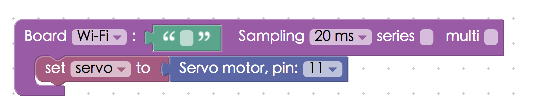
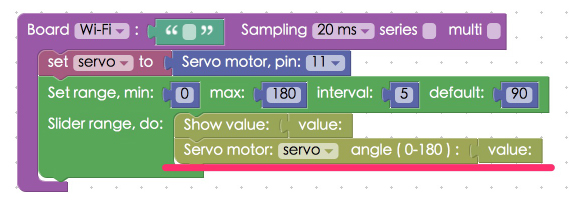

<!-- @@master  = ../../_layout.html-->

<!-- @@block  =  meta-->

<title>Project Example 16: Setting the angle of a servo shaft :::: Webduino = Web × Arduino</title>

<meta name="description" content="A servo or servo motor is an actuator that allows precise control of angular or linear position, velocity, and acceleration. It can be controlled by a program you are running. In this example we will use the Blockly Editor, HTML, and JavaScript to control a servo with a maximum of 180 degrees. It will not be extremely accurate, however, and 1 to 180 degrees might be -2 to 177 degrees. This will not affect our example, though.">

<meta itemprop="description" content="A servo or servo motor is an actuator that allows precise control of angular or linear position, velocity, and acceleration. It can be controlled by a program you are running. In this example we will use the Blockly Editor, HTML, and JavaScript to control a servo with a maximum of 180 degrees. It will not be extremely accurate, however, and 1 to 180 degrees might be -2 to 177 degrees. This will not affect our example, though.">

<meta property="og:description" content="A servo or servo motor is an actuator that allows precise control of angular or linear position, velocity, and acceleration. It can be controlled by a program you are running. In this example we will use the Blockly Editor, HTML, and JavaScript to control a servo with a maximum of 180 degrees. It will not be extremely accurate, however, and 1 to 180 degrees might be -2 to 177 degrees. This will not affect our example, though.">

<meta property="og:title" content="Project Example 16: Setting the angle of a servo shaft" >

<meta property="og:url" content="https://webduino.io/tutorials/tutorial-16-servo.html">

<meta property="og:image" content="https://webduino.io/img/tutorials/tutorial-16-01s.jpg">

<meta itemprop="image" content="https://webduino.io/img/tutorials/tutorial-16-01s.jpg">

<include src="../_include-tutorials.html"></include>

<!-- @@close-->

<!-- @@block  =  preAndNext-->

<include src="../_include-tutorials-content.html"></include>

<!-- @@close-->

<!-- @@block  =  tutorials-->

# Project Example 16: Setting the angle of a servo shaft

A servo or servo motor is an actuator that allows precise control of angular or linear position, velocity, and acceleration. It can be controlled by a program you are running. In this example we will use the Blockly Editor, HTML, and JavaScript to control a servo with a maximum of 180 degrees. It will not be extremely accurate, however, and 1 to 180 degrees might be -2 to 177 degrees. This will not affect our example, though.

<!-- 

	伺服馬達相關套件：<a href="https://webduino.io/buy/webduino-package-plus.html" target="_blank">Webduino 基本套件 Plus ( 支援馬克 1 號、Fly )</a>
	Webduino 開發板：<a href="https://webduino.io/buy/component-webduino-v1.html" target="_blank">Webduino 馬克一號</a>、<a href="https://webduino.io/buy/component-webduino-fly.html" target="_blank">Webduino Fly</a>、<a href="https://webduino.io/buy/component-webduino-uno-fly.html" target="_blank">Webduino Fly + Arduino UNO</a>

 -->

## Video Tutorial

<!-- 影片對應範例：[https://blockly.webduino.io/?page=tutorials/servo-1](https://blockly.webduino.io/?page=tutorials/servo-1) 
 -->
Check the video tutorial here: 
<iframe class="youtube" src="https://www.youtube.com/embed/Dar2pSWCSL8" frameborder="0" allowfullscreen></iframe>

## Wiring and Practice

A Servo requires a higher current so we will connect an independent power source to it. (We could also use a transistor to amplify the current, but it's a lot easier to just connect another power source.) The servo has three wires, the red one is for Power, the brown one connects to GND, and the orange one is the Signal. We can use a breadboard to connect an independent power source, the Webduino board, and the servo all to one GND. Also connect the orange line of the servo to pin 11.

Webduino Mark 1 Circuit diagram:

Webduino Fly Circuit diagram:

Reference image:

<!-- 

	伺服馬達相關套件：<a href="https://webduino.io/buy/webduino-package-plus.html" target="_blank">Webduino 基本套件 Plus ( 支援馬克 1 號、Fly )</a>
	Webduino 開發板：<a href="https://webduino.io/buy/component-webduino-v1.html" target="_blank">Webduino 馬克一號</a>、<a href="https://webduino.io/buy/component-webduino-fly.html" target="_blank">Webduino Fly</a>、<a href="https://webduino.io/buy/component-webduino-uno-fly.html" target="_blank">Webduino Fly + Arduino UNO</a>

 -->
## Instructions for using the Webduino Blockly

Open the [Webduino Blocky editor](https://blockly.webduino.io/?lang=en), this example will use the "Slider" to control the angle of the servo. Click on the "Web Demo Area" button and select "Slider" from the dropdown menu.

Place a "Board" block onto the workspace, fill in the name of your Webduino board. Place a "Servo Motor" block inside the stack and set name to servo, and the pin to 11.

Place a "Slider range, do" block into the stack, we can set the min, max, interval and default values. Since the servo won't go over 180 degrees the max and min will be set to 180 and 0. Last, place a "Show" block and "Servo motor / angle" block into the range block.

After all this is done, check if the board is online (click "[Check Device Status](https://webduino.io/device.html)") and click on the red execution button "Run Blocks", move the slider on the screen and you will see the servo move! 
Solution: [https://blockly.webduino.io/?lang=en#-KZehy3_2Ka0Zpre6jpA](https://blockly.webduino.io/?lang=en#-KZehy3_2Ka0Zpre6jpA)

##Code Explanation ([Check Webduino Bin](http://bin.webduino.io/tipiv/edit?html,css,js,output), [Check Device Status](https://webduino.io/device.html))

HInclude `webduino-all.min.js` in the header of your html files in order to support all of the Webduino's components. If the codes are generated by Webduino Blockly, you also have to include `webduino-blockly.js` in your files.

	
	

We have a span in the HTML file to show the current angle. Also an "input" with type as "range", this is our slider. We can set max, min, step, and value.

	數值：90 
	拉霸：<input type="range" min="0" max="180" step="5" value="90" id="demo-area-06-input">

JavaScript uses `oninput` to send the value change from the slider to servo "n" to change the "angle", so whenever you change the slider, the angle on the servo will change.

	var servo;

	boardReady('', function (board) {
	  board.samplingInterval = 20;
	  servo = getServo(board, 11);
	  document.getElementById("demo-area-06-input").setAttribute("min",0);
	  document.getElementById("demo-area-06-input").setAttribute("max",180);
	  document.getElementById("demo-area-06-input").setAttribute("step",5);
	  document.getElementById("demo-area-06-input").setAttribute("value",90);
	  document.getElementById("demo-area-06-input").oninput = function(_value){
	    _value = this.value;
	    document.getElementById("demo-area-06-input-value").innerHTML = _value;
	    servo.angle = _value;
	  };
	});

Now you've learned the basics of setting the angle of a servo shaft.   
Webduino Bin: [http://bin.webduino.io/tipiv/edit?html,css,js,output](http://bin.webduino.io/tipiv/edit?html,css,js,output)  
Stack setup: [https://blockly.webduino.io/?lang=en#-KZehy3_2Ka0Zpre6jpA](https://blockly.webduino.io/?lang=en#-KZehy3_2Ka0Zpre6jpA)

<!-- ## 人體紅外線偵測傳感器的延伸教學：

[Webduino Blockly 課程 8-2：使用按鈕開關控制伺服馬達](https://blockly.webduino.io/?lang=zh-hant&page=tutorials/servo-2#-Jw01xYLefgu_1IvUaVM)

	伺服馬達相關套件：<a href="https://webduino.io/buy/webduino-package-plus.html" target="_blank">Webduino 基本套件 Plus ( 支援馬克 1 號、Fly )</a>
	Webduino 開發板：<a href="https://webduino.io/buy/component-webduino-v1.html" target="_blank">Webduino 馬克一號</a>、<a href="https://webduino.io/buy/component-webduino-fly.html" target="_blank">Webduino Fly</a>、<a href="https://webduino.io/buy/component-webduino-uno-fly.html" target="_blank">Webduino Fly + Arduino UNO</a>

   -->

<!-- @@close-->