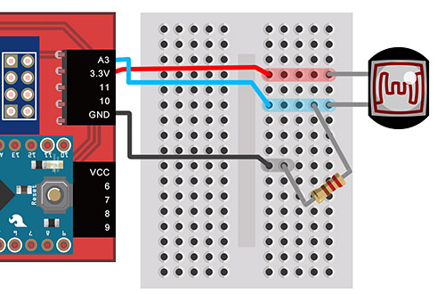
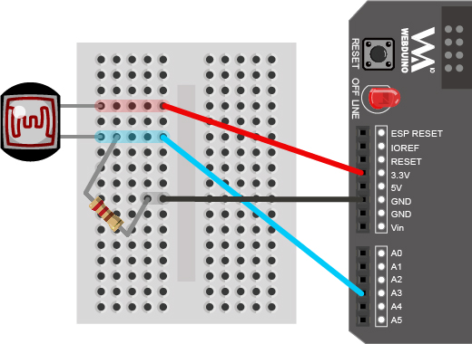
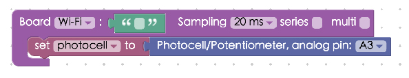
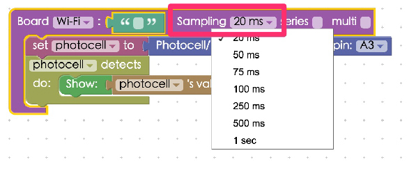
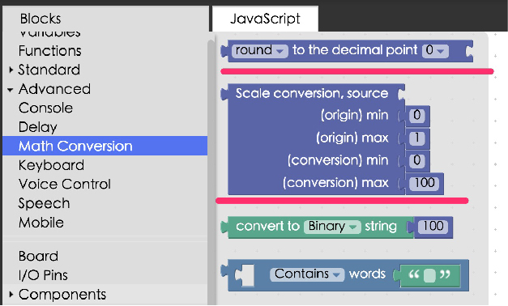

<!-- @@master  = ../../_layout.html-->

<!-- @@block  =  meta-->

<title>Project Example 17: Determine light levels with a photocell :::: Webduino = Web × Arduino</title>

<meta name="description" content="Photocells can be found inside of automatic night lights. This special conductor uses a phenomenon called photoconductivity. When light is absorbed by the conductor the electrons of the semiconductor are delocalized, becoming free electrons. So when the light is stronger there are more free electrons, creating lower resistance. Using this changing value we can then show the strength of the signal.">

<meta itemprop="description" content="Photocells can be found inside of automatic night lights. This special conductor uses a phenomenon called photoconductivity. When light is absorbed by the conductor the electrons of the semiconductor are delocalized, becoming free electrons. So when the light is stronger there are more free electrons, creating lower resistance. Using this changing value we can then show the strength of the signal.">

<meta property="og:description" content="Photocells can be found inside of automatic night lights. This special conductor uses a phenomenon called photoconductivity. When light is absorbed by the conductor the electrons of the semiconductor are delocalized, becoming free electrons. So when the light is stronger there are more free electrons, creating lower resistance. Using this changing value we can then show the strength of the signal.">

<meta property="og:title" content="Project Example 17: Determine light levels with a photocell" >

<meta property="og:url" content="https://webduino.io/tutorials/tutorial-17-photocell.html">

<meta property="og:image" content="https://webduino.io/img/tutorials/tutorial-17-01s.jpg">

<meta itemprop="image" content="https://webduino.io/img/tutorials/tutorial-17-01s.jpg">

<include src="../_include-tutorials.html"></include>

<!-- @@close-->

<!-- @@block  =  preAndNext-->

<include src="../_include-tutorials-content.html"></include>

<!-- @@close-->

<!-- @@block  =  tutorials-->

# Project Example 17: Determine light levels with a photocell

Photocells can be found inside of automatic night lights. This special conductor uses a phenomenon called photoconductivity. When light is absorbed by the conductor the electrons of the semiconductor are delocalized, becoming free electrons. So when the light is stronger there are more free electrons, creating lower resistance. Using this changing value we can then show the strength of the signal.

<!-- 

	光敏電阻相關套件：<a href="https://webduino.io/buy/webduino-expansion-s.html" target="_blank">Webduino 擴充套件 S ( 支援馬克 1 號、Fly )</a>
	Webduino 開發板：<a href="https://webduino.io/buy/component-webduino-v1.html" target="_blank">Webduino 馬克一號</a>、<a href="https://webduino.io/buy/component-webduino-fly.html" target="_blank">Webduino Fly</a>、<a href="https://webduino.io/buy/component-webduino-uno-fly.html" target="_blank">Webduino Fly + Arduino UNO</a>

 -->

## Video Tutorial

Check the video tutorial here:
<iframe class="youtube" src="https://www.youtube.com/embed/jSarWRDj7Gk" frameborder="0" allowfullscreen></iframe>

## Wiring and Practice

Each photocell has a different range of resistance, some may be close to zero. So when wiring a photocell, we will need a simple resistor to prevent shorting the circuit. The photocell will be connected to an analog pin (any pin that starts with A), here we connect it to A3. Either leg on the photocell can be used as a signal pin and the other leg will be connect to VCC or GND. Here we connect the other leg to 3.3V (VCC) with the signal leg also connected to a resistor and then to GND. You can swap VCC and GND, but the readings will be reversed.

Webduino Mark 1 Circuit diagram:

Webduino Fly Circuit diagram:

Reference image:

<!-- 

	光敏電阻相關套件：<a href="https://webduino.io/buy/webduino-expansion-s.html" target="_blank">Webduino 擴充套件 S ( 支援馬克 1 號、Fly )</a>
	Webduino 開發板：<a href="https://webduino.io/buy/component-webduino-v1.html" target="_blank">Webduino 馬克一號</a>、<a href="https://webduino.io/buy/component-webduino-fly.html" target="_blank">Webduino Fly</a>、<a href="https://webduino.io/buy/component-webduino-uno-fly.html" target="_blank">Webduino Fly + Arduino UNO</a>

 -->

## Instructions for using the Webduino Blockly

Open the [Webduino Blockly editor](https://blockly.webduino.io/?lang=en). We will be using "Show Text" to show the values of our photocell, so click on "Web Demo Area" on the upper right of the screen and choose "Show Text" from the drop down menu.

Place a "Board" block onto the workspace and fill in the name of your Webduino board. Place a "photocell" block in the stack and set the name to photocell and the pin to A3.

Next place a "photocell detects / do" block in the stack, so when we start to measure light, the values will be shown.

The speed of measurement is limited by the board's analog sampling rate (each board has only one analog sampling rate), we can choose this in the settings and set it to 100 milliseconds (0.1 seconds)

We've finished most of the hard work. Check if the board is online (click "[Check Device Status](https://webduino.io/device.html)") and click on the red execution button "Run Blocks". You will see the light levels are shown as numbers and the numbers will change when you move your hand over the photocell. 
Solution: [https://blockly.webduino.io/?lang=en#-KZKhagMppXlpckd-uUB](https://blockly.webduino.io/?lang=en#-KZKhagMppXlpckd-uUB)

Pure analog readings will show you numbers with multiple digits after the decimal point. The range might not be what we want (for instance, we might want numbers ranging from 0 to 100). We can use a "Math Conversion" block from the "Advanced" menu. Using these blocks we can round up numbers and perform scale conversion.

Find the readings from the photocell, when it senses light and when it does not, and fill in the blocks with these minimum and maximum numbers, rounding up.

Once you've done this, check if the board is online (click "[Check Device Status](https://webduino.io/device.html)") and click on the red execution button "Run Blocks". You'll see the numbers are rounded to the second decimal point and the scale is converted to a number between 0 and 100. 
Solution: [https://blockly.webduino.io/?lang=en#-KZKkEa6rLBTfhZBaTPi](https://blockly.webduino.io/?lang=en#-KZKkEa6rLBTfhZBaTPi)

##Code Explanation ([Check Webduino Bin](http://bin.webduino.io/bupak/edit?html,css,js,output), [Check Device Status](https://webduino.io/device.html))

Include `webduino-all.min.js` in the header of your html files in order to support all of the Webduino's components. If the codes are generated by Webduino Blockly, you also have to include `webduino-blockly.js`.

	
	

We will only need a span inside our HTML file to show the light values measured by the photocell.

	123

JYou can see inside the JavaScript area, the photocell has a `on` method, which represents the starting point of detection, after that when we function call for a "val", that represents the value the photocell is receiving and we show it with `innerHTML`.

	var photocell;

	boardReady('', function (board) {
	  board.samplingInterval = 500;
	  photocell = getPhotocell(board, 3);
	  photocell.on(function(val){
	    photocell.detectedVal = val;
	    document.getElementById("demo-area-01-show").innerHTML = photocell.detectedVal;
	  });
	});

If you use a block from advanced, there you will find a bunch of mathematical functions, helping us to perform math conversions.

	var photocell;

	boardReady('', function (board) {
	  board.samplingInterval = 500;
	  photocell = getPhotocell(board, 3);
	  photocell.on(function(val){
	    photocell.detectedVal = val;
	    document.getElementById("demo-area-01-show").innerHTML = Math.round(((photocell.detectedVal - (0.007)) * (1/((0.1407)-(0.007)))) * ((100)-(0)) + (0));
	  });
	});

Now you know how to determine light levels with a photocell.
Webduino Bin: [http://bin.webduino.io/bupak/edit?html,css,js,output](http://bin.webduino.io/bupak/edit?html,css,js,output)  
Stack setup: [https://blockly.webduino.io/?lang=en#-KZKmHxSxWG2XYxym7GG](https://blockly.webduino.io/?lang=en#-KZKmHxSxWG2XYxym7GG)

<!-- ## 光敏電阻的延伸教學：

[Webduino Blockly 課程 12-1：控制光敏電阻](https://blockly.webduino.io/?lang=zh-hant&page=tutorials/photocell-1#-K0oVQzwFXfXTj5xmlrU)  
[Webduino Blockly 課程 12-2：使用光敏電阻點亮 LED 燈](https://blockly.webduino.io/?lang=zh-hant&page=tutorials/photocell-2#-K0objWF2mEVwsHYux8W)  
[Webduino Blockly 課程 12-3：轉換光敏 ( 可變 ) 電阻數值](https://blockly.webduino.io/?lang=zh-hant&page=tutorials/photocell-3#-K2kvxmwFHNiGl0P-_7S)  

	光敏電阻相關套件：<a href="https://webduino.io/buy/webduino-expansion-s.html" target="_blank">Webduino 擴充套件 S ( 支援馬克 1 號、Fly )</a>
	Webduino 開發板：<a href="https://webduino.io/buy/component-webduino-v1.html" target="_blank">Webduino 馬克一號</a>、<a href="https://webduino.io/buy/component-webduino-fly.html" target="_blank">Webduino Fly</a>、<a href="https://webduino.io/buy/component-webduino-uno-fly.html" target="_blank">Webduino Fly + Arduino UNO</a>

 -->

<!-- @@close-->