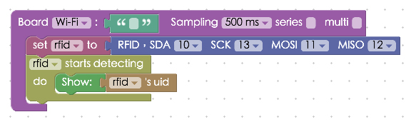
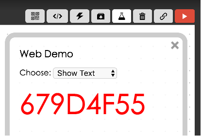

<!-- @@master  = ../../_layout.html-->

<!-- @@block  =  meta-->

<title>Project Example 19: RFID :::: Webduino = Web × Arduino</title>

<meta name="description" content="RFID stands for Radio Frequency Identification,and is a commonly used wireless communication technology. A magnetic field from an RFID reader allows the “tag” to be activated and transmitted. RFID is present in warehouses for asset and personnel tracking and management, it is even used in anti-forgery and livestock handling.">

<meta itemprop="description" content="RFID stands for Radio Frequency Identification,and is a commonly used wireless communication technology. A magnetic field from an RFID reader allows the “tag” to be activated and transmitted. RFID is present in warehouses for asset and personnel tracking and management, it is even used in anti-forgery and livestock handling.">

<meta property="og:description" content="RFID stands for Radio Frequency Identification,and is a commonly used wireless communication technology. A magnetic field from an RFID reader allows the “tag” to be activated and transmitted. RFID is present in warehouses for asset and personnel tracking and management, it is even used in anti-forgery and livestock handling.">

<meta property="og:title" content="Project Example 19: RFID" >

<meta property="og:url" content="https://webduino.io/tutorials/tutorial-19-rfid.html">

<meta property="og:image" content="https://webduino.io/img/tutorials/tutorial-19-01s.jpg">

<meta itemprop="image" content="https://webduino.io/img/tutorials/tutorial-19-01s.jpg">

<include src="../_include-tutorials.html"></include>

<!-- @@close-->

<!-- @@block  =  preAndNext-->

<include src="../_include-tutorials-content.html"></include>

<!-- @@close-->

<!-- @@block  =  tutorials-->

# Project Example 19: RFID

RFID stands for Radio Frequency Identification,and is a commonly used wireless communication technology. A magnetic field from an RFID reader allows the "tag" to be activated and transmitted. RFID is present in warehouses for asset and personnel tracking and management, it is even used in anti-forgery and livestock handling.

<!-- 

	RFID 相關套件：<a href="https://webduino.io/buy/webduino-expansion-p.html" target="_blank">Webduino 擴充套件 P ( 支援 Fly )</a>
	Webduino 開發板：<a href="https://webduino.io/buy/component-webduino-fly.html" target="_blank">Webduino Fly</a>、<a href="https://webduino.io/buy/component-webduino-uno-fly.html" target="_blank">Webduino Fly + Arduino UNO</a>

 -->

## Video Tutorial

Check the video tutorial here:
<iframe class="youtube" src="https://www.youtube.com/embed/RrCAOgtPHdo" frameborder="0" allowfullscreen></iframe>

## Wiring and Practice

We will be using the RC522 RFID reader in this tutorial. The RC522 runs on a 13.56MHZ radio frequency, it works on 3.3V with 8 different pins, SDA, SCK, MOSI, MISO, IRQ, GND, RST, and VCC. We will be using SDA, SCK, MOSI and MISO for signal I/O.

The Arduino UNO has different functions for each digital pin. 13 goes to Serial Clock (SCL), 12 to Master-in slave-out (MISO), 11 to Master-out slave-in (MOSI), and 10 for Slave Select (SS). So, we will be using SDA to connect to 10, SCK to 13, MOSI to 11, and MISO to 12.

IRQ is the interrupt pin and RST is the reset pin, we won't be using either of them in this tutorial so don't connect them to anything. GND goes to GND and VCC is connected to 3.3V. Since there are a limited amount of ports on the Arduino, we will be using the **Arduino UNO and Webduino Fly Wi-Fi extension board** in this tutorial.

Reference image:

<!-- 

	RFID 相關套件：<a href="https://webduino.io/buy/webduino-expansion-p.html" target="_blank">Webduino 擴充套件 P ( 支援 Fly )</a>
	Webduino 開發板：<a href="https://webduino.io/buy/component-webduino-fly.html" target="_blank">Webduino Fly</a>、<a href="https://webduino.io/buy/component-webduino-uno-fly.html" target="_blank">Webduino Fly + Arduino UNO</a>

 -->

## Instructions for using the Webduino Blockly

Open the [Webduino Blockly editor](https://blockly.webduino.io/?lang=en), click on the "Web Demo Area" on the upper-right hand side, and click on "Select text" from the drop-down menu. Also, don't forget to burn the RFID firmware before you continue. (Check out the tutorial: [Arduino Firmware Download / burn](https://webduino.io/tutorials/info-07-arduino-ino.html) and choose the firmware with MFRC522 in the file name.)

Place a "Board" block onto the workspace, fill in the name of your Webduino board, and place a "Set RFID to" block into the stack. Set the name to rfid. Since the legs are pre-set, the drop-down menu won’t be able to change the pins.

Place an "Rfid starts detecting / do" block into the stack and a "Show" block with an "Rfid's uid" block connected to it. This makes it so when we place our RFID card in front of the RFID reader, the screen will show the matching ID.

When you've done all the previous steps, check if the board is online (click "[Check Device Status](https://webduino.io/device.html)") and click on the red execution button "Run Blocks". When you use a different RFID card with the RFID reader, a code will appear. If you find some can't be read, it’s possible that the cards don't have the same frequency as the RC522. (Solution: [https://blockly.webduino.io/?lang=en#-KZU2zAVtTYT9ELVvs9b](https://blockly.webduino.io/?lang=en#-KZU2zAVtTYT9ELVvs9b)

If this seems a little dull, we could add a few more things to make it easier to see the readout. To change the word color if a different RFID card is used, add a "Text Color" block. Then  add a "If / do" block, so when the right ID card is used, the word color changes to red.

Using this same method we could even change the word color to blue when another card is being read.

Once you've done this, check if the board is online (click "[Check Device Status](https://webduino.io/device.html)") and click on the red execution button "Run Blocks". Now you will see the words change color when different RFID cards are read.
Solution: [https://blockly.webduino.io/?lang=en#-KZU3d3JVP5RhwcW4Rc6](https://blockly.webduino.io/?lang=en#-KZU3d3JVP5RhwcW4Rc6)

##Code Explanation ([Check Webduino Bin](https://bin.webduino.io/yevog/1/edit?html,css,js,output), [Check Device Status](https://webduino.io/device.html))

Include `webduino-all.min.js` in the header of your html files in order to support all of the Webduino's components. If the codes are generated by Webduino Blockly, you also have to include `webduino-blockly.js` in your files.

	
	

There is only a span inside the HTML to show the ID of the RFID card.

	123

JavaScript used `on`, when the function is called, there is a variable that returns the ID of the RFID. Inside are codes that verifies if the action is correct and we use `innerHTML` to show different RFID cards and`style` to change color.

	var rfid;

	boardReady('', function (board) {
	  board.samplingInterval = 500;
	  rfid = getRFID(board);
	  rfid.read();
	  rfid.on("enter",function(_uid){
	    rfid._uid = _uid;
	    document.getElementById("demo-area-01-show").style.color = '#000000';
	    document.getElementById("demo-area-01-show").innerHTML = rfid._uid;
	    if(rfid._uid == '679D4F55'){
	      document.getElementById("demo-area-01-show").style.color = '#ff0000';
	    }
	    if(rfid._uid == 'B4AE2E00'){
	      document.getElementById("demo-area-01-show").style.color = '#3333ff';
	    }
	  });
	});

Now you've learned how to use the RFID-RC522 to read different RFID cards and how to change the color of the text to show their ID on the screen.  
Webduino Bin: [https://bin.webduino.io/yevog/1/edit?html,css,js,output](https://bin.webduino.io/yevog/1/edit?html,css,js,output)  
Stack setup: [https://blockly.webduino.io/?lang=en#-KZU4bZZmmNetUTcefTT](https://blockly.webduino.io/?lang=en#-KZU4bZZmmNetUTcefTT)

<!-- ## RFID 的延伸教學：

[Webduino Blockly 課程 16-1：偵測 RFID](https://blockly.webduino.io/?lang=zh-hant&page=tutorials/rfid-1#-K45oDB4TmzOFSNMPGGG)  
[Webduino Blockly 課程 16-2：RFID 紅綠燈](https://blockly.webduino.io/?lang=zh-hant&page=tutorials/rfid-2#-K45qdjcmCYGz9YaNcUp)  
[Webduino Blockly 課程 16-3：RFID 控制 Youtube](https://blockly.webduino.io/?lang=zh-hant&page=tutorials/rfid-3#-K462IpY3cfK91yLDK3M) 

	RFID 相關套件：<a href="https://webduino.io/buy/webduino-expansion-p.html" target="_blank">Webduino 擴充套件 P ( 支援 Fly )</a>
	Webduino 開發板：<a href="https://webduino.io/buy/component-webduino-fly.html" target="_blank">Webduino Fly</a>、<a href="https://webduino.io/buy/component-webduino-uno-fly.html" target="_blank">Webduino Fly + Arduino UNO</a>

    --> 

<!-- @@close-->