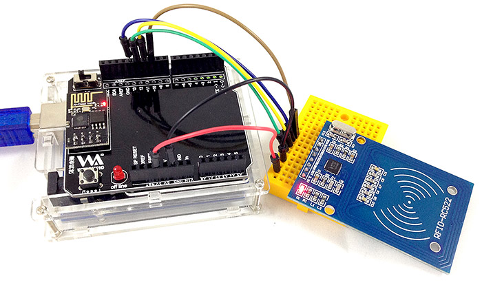
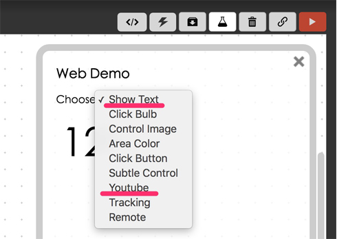
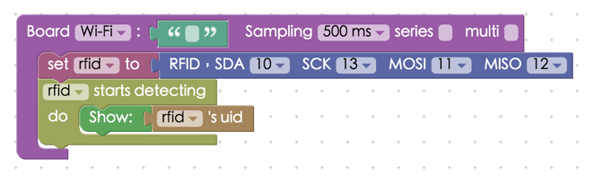
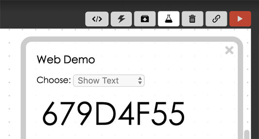
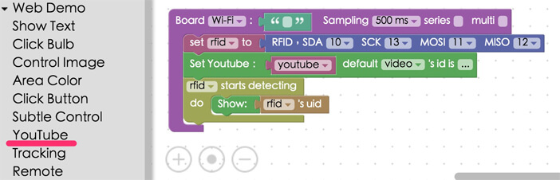
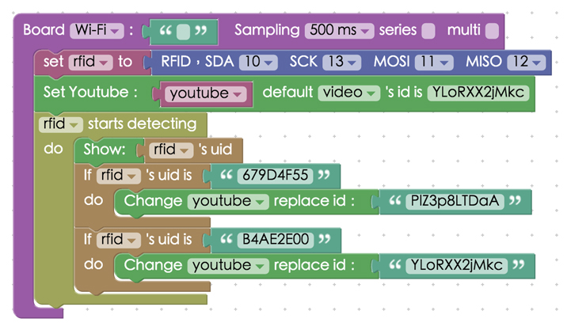
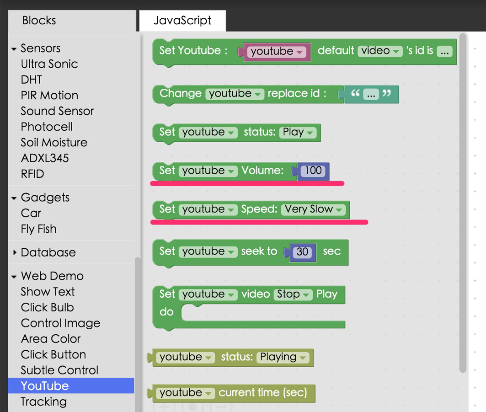
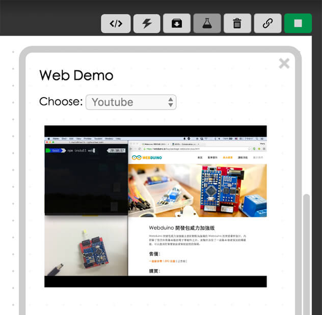

<!-- @@master  = ../../_layout.html-->

<!-- @@block  =  meta-->

<title>Project Example 20: Switch Youtube Videos with RFID Keys :::: Webduino = Web × Arduino</title>

<meta name="description" content="In the previous project tutorial, we introduced the basic theory of RFIDs. In this tutorial, we will demonstrate an advaced use for the RFID sensor - switching Youtube videos with RFID keys.">

<meta itemprop="description" content="In the previous project tutorial, we introduced the basic theory of RFIDs. In this tutorial, we will demonstrate an advaced use for the RFID sensor - switching Youtube videos with RFID keys.">

<meta property="og:description" content="In the previous project tutorial, we introduced the basic theory of RFIDs. In this tutorial, we will demonstrate an advaced use for the RFID sensor - switching Youtube videos with RFID keys.">

<meta property="og:title" content="Project Example 20: Switch Youtube Videos with RFID Keys" >

<meta property="og:url" content="https://webduino.io/tutorials/tutorial-20-rfid-youtube.html">

<meta property="og:image" content="https://webduino.io/img/tutorials/tutorial-20-01s.jpg">

<meta itemprop="image" content="https://webduino.io/img/tutorials/tutorial-20-01s.jpg">

<include src="../_include-tutorials.html"></include>

<!-- @@close-->

<!-- @@block  =  preAndNext-->

<include src="../_include-tutorials-content.html"></include>

<!-- @@close-->

<!-- @@block  =  tutorials-->

# Project Example 20: Switch Youtube Videos with RFID Keys

In the previous project tutorial, we introduced the basic theory of RFIDs. In this tutorial, we will demonstrate an advaced use for the RFID sensor - switching Youtube videos with RFID keys.

<!-- 

	RFID 相關套件：<a href="https://webduino.io/buy/webduino-expansion-p.html" target="_blank">Webduino 擴充套件 P ( 支援 Fly )</a>
	Webduino 開發板：<a href="https://webduino.io/buy/component-webduino-fly.html" target="_blank">Webduino Fly</a>、<a href="https://webduino.io/buy/component-webduino-uno-fly.html" target="_blank">Webduino Fly + Arduino UNO</a>

 -->

## Video Tutorial:

Check the video tutorial here:
<iframe class="youtube" src="https://www.youtube.com/embed/RrCAOgtPHdo" frameborder="0" allowfullscreen></iframe>

## The Circuit

The circuit is exactly the same as in previous project tutorial. Connect SDA to 10, SCK to 13, MOSI to 11, MISO to 12, GND to GND, and VCC to 3.3V. Due to the limitation of pins, **you will have to use the Arduino UNO along with the Webduino Fly in this exercise**.

Circuit diagram:

Reference image:

<!-- 

	RFID 相關套件：<a href="https://webduino.io/buy/webduino-expansion-p.html" target="_blank">Webduino 擴充套件 P ( 支援 Fly )</a>
	Webduino 開發板：<a href="https://webduino.io/buy/component-webduino-fly.html" target="_blank">Webduino Fly</a>、<a href="https://webduino.io/buy/component-webduino-uno-fly.html" target="_blank">Webduino Fly + Arduino UNO</a>

 -->

## Instructions for using the Webduino Blockly

Open Webduino Blockly by typing the address: [https://blockly.webduino.io/?lang=en](https://blockly.webduino.io/?lang=en) into your browser. You will need to use "Show Text" in the Web Demo Area to show the UIDs of RFID keys, and will need to use "Youtube" afterwards.

Drag a "Board" block in the workspace, and fill in the name of your Webduino board. Add an "RFID" block, which is under "Sensors", and set the name "RFID", SDA to 10, SCK to 13, MOSI to 11, and MISO to 12. Note that all of the pins are set to their default values, which are not able to be changed. Finally, add an "RFID starts detecting..." block, and combine a "Show Text" block and an "RFID's UID" block to place inside.

Once you've finished, check your [device's status](https://webduino.io/device.html) and press "Run Blocks". When you bring your RFID key in front of the sensor, a UID will generate. Note down all the UIDs. You will use them in the following steps. 

Find the "Set Youtube" block in the drop-down menu under "Youtube" and drag it to the workspace. **Never place this block in the blank connection of the RFID detetion block.** Otherwise, there will be an error every time the RFID starts detecting. 

Open a video on Youtube, and copy the video ID in the address bar. Then, input the ID into the "Set Youtube" block.

If you wish to switch between multiple videos, you have to add a "If RFID's UID is..." block with a "Change Youtube replace ID:" block connected to the setup to determine the next video. Then key in the video's ID as well.

You can control the volume and speed of the videos by combining blocks, as well.

After you finish creating the block stack, check your [device's status](https://webduino.io/device.html) before you run all the blocks. Then you can switch Youtube videos with RFID keys! Check your stack setup with this example here: [https://blockly.webduino.io/?lang=en#-KTNvQXw5Q_x2YVR35Re](https://blockly.webduino.io/?lang=en#-KTNvQXw5Q_x2YVR35Re)

##Code Explanation ([Check Webduino Bin](http://bin.webduino.io/yusuv/edit?html,js,output), [Check Device Status](https://webduino.io/device.html))

Include `webduino-all.min.js` in the header of your html files in order to support all of the Webduino's components. If the codes are generated by Webduino Blockly, you also have to include `webduino-blockly.js` in your files. However, you have to include `iframe_api` in this project to access Youtube.

	
	
	

There is a div tag in the html, where we will show our YouTube video in.

	

The lengthy parts are JavaScript code to embed a YouTube video in html. We suggest you read this document: [https://www.youtube.com/yt/dev/zh-TW/api-resources.html](https://www.youtube.com/yt/dev/zh-TW/api-resources.html) to have full control of the video. We use the method `on()` to start reading RFID tags. After we get the tag ID, we call the YouTube function that is mentioned above in accordance with this ID.

	var rfid;
	var youtube;

	boardReady('', function (board) {
	  board.samplingInterval = 500;
	  rfid = getRFID(board);
	  var checkYoutubeLoad=0;
	  onYouTubeIframeAPIReady();
	  function onYouTubeIframeAPIReady() {
	    youtube = new YT.Player("player", {
	      height: "240",
	      width: "96%",
	      videoId: "YLoRXX2jMkc",
	      playerVars: {
	        "autoplay": 1,
	        "controls": 1},
	      events: {
	        "onReady": onPlayerReady,
	        "onStateChange": onPlayerStateChange
	      }
	    });
	  }
	  function onPlayerReady(event) {
	    event.target.playVideo();
	    checkYoutubeLoad=1;
	  }
	  var done = false;
	  function onPlayerStateChange(event) {
	    if (event.data == YT.PlayerState.PLAYING && !done) {
	      done = true;
	    }
	  }
	  function stopVideo() {
	    youtube.stopVideo();
	  }
	  rfid.read();
	  rfid.on("enter",function(_uid){
	    rfid._uid = _uid;
	    document.getElementById("demo-area-01-show").innerHTML = rfid._uid;
	    if(rfid._uid == '679D4F55'){
	      youtube.loadVideoById('PIZ3p8LTDaA');
	    }
	    if(rfid._uid == 'B4AE2E00'){
	      youtube.loadVideoById('YLoRXX2jMkc');
	    }
	  });
	});

This was an example of how to use RFID-RC522 to read RFID keys and to control Youtube videos. We hope you enjoyed it!   
Webduino Bin: [http://bin.webduino.io/yusuv/edit?html,js,output](http://bin.webduino.io/yusuv/edit?html,js,output)  
Stack setup: [https://blockly.webduino.io/?lang=en#-KTqoMm2WLMDB-5QwRpk](https://blockly.webduino.io/?lang=en#-KTqoMm2WLMDB-5QwRpk)

<!-- ## TuTorial Extension of RFID:

[Webduino Blockly Chapter 16-1: RFID](https://blockly.webduino.io/?lang=en&page=tutorials/rfid-1#-KTOFSXys4BxAwvxrcpr)  
[Webduino Blockly Chapter 16-2: RFID and RGB LED](https://blockly.webduino.io/?lang=en&page=tutorials/rfid-2#-KTOFyGDNYv1SWMpMKLN)  
[Webduino Blockly Chapter 16-3: RFID and Youtube](https://blockly.webduino.io/?lang=en&page=tutorials/rfid-3#-KTOG5IsDTu4uuCyigqn)   -->

<!-- 

	RFID 相關套件：<a href="https://webduino.io/buy/webduino-expansion-p.html" target="_blank">Webduino 擴充套件 P ( 支援 Fly )</a>
	Webduino 開發板：<a href="https://webduino.io/buy/component-webduino-fly.html" target="_blank">Webduino Fly</a>、<a href="https://webduino.io/buy/component-webduino-uno-fly.html" target="_blank">Webduino Fly + Arduino UNO</a>

  -->  

<!-- @@close-->