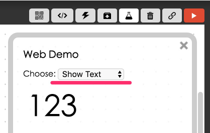
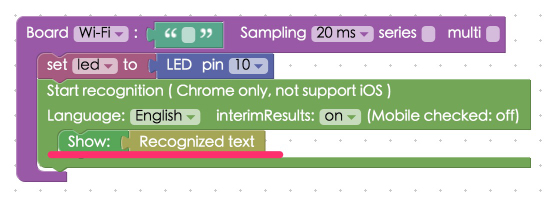
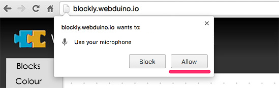

<!-- @@master  = ../../_layout.html-->

<!-- @@block  =  meta-->

<title>Project Example 22: Voice Activated LEDs :::: Webduino = Web × Arduino</title>

<meta name="description" content="Webduino uses the Chrome internet browser to control all sorts of electronic components, so we should be able to use all other functions that Chrome has to offer. In this project example we will use Chrome's Speech API. Using Google's voice recognition, we can easily control an LED light. The same method could be used with a relay, allowing us to control a light bulb, door lock, or house appliances.">

<meta itemprop="description" content="Webduino uses the Chrome internet browser to control all sorts of electronic components, so we should be able to use all other functions that Chrome has to offer. In this project example we will use Chrome's Speech API. Using Google's voice recognition, we can easily control an LED light. The same method could be used with a relay, allowing us to control a light bulb, door lock, or house appliances.">

<meta property="og:description" content="Webduino uses the Chrome internet browser to control all sorts of electronic components, so we should be able to use all other functions that Chrome has to offer. In this project example we will use Chrome's Speech API. Using Google's voice recognition, we can easily control an LED light. The same method could be used with a relay, allowing us to control a light bulb, door lock, or house appliances.">

<meta property="og:title" content="Project Example 22: Voice Activated LEDs" >

<meta property="og:url" content="https://webduino.io/tutorials/tutorial-22-speech-led.html">

<meta property="og:image" content="https://webduino.io/img/tutorials/tutorial-22-01s.jpg">

<meta itemprop="image" content="https://webduino.io/img/tutorials/tutorial-22-01s.jpg">

<include src="../_include-tutorials.html"></include>

<!-- @@close-->

<!-- @@block  =  preAndNext-->

<include src="../_include-tutorials-content.html"></include>

<!-- @@close-->

<!-- @@block  =  tutorials-->

# Project Example 22: Voice Activated LEDs

Webduino uses the Chrome internet browser to control all sorts of electronic components, so we should be able to use all other functions that Chrome has to offer. In this project example we will use Chrome's Speech API. Using Google's voice recognition, we can easily control an LED light. The same method could be used with a relay, allowing us to control a light bulb, door lock, or house appliances.

<!-- 

	LED 相關套件：<a href="https://webduino.io/buy/webduino-package-plus.html" target="_blank">Webduino 基本套件 Plus ( 支援馬克 1 號、Fly )</a>
	Webduino 開發板：<a href="https://webduino.io/buy/component-webduino-v1.html" target="_blank">Webduino 馬克 1 號</a>、<a href="https://webduino.io/buy/component-webduino-fly.html" target="_blank">Webduino Fly</a>、<a href="https://webduino.io/buy/component-webduino-uno-fly.html" target="_blank">Webduino Fly + Arduino UNO</a>

 -->

## Video Tutorial

Check the video tutorial here: 
<iframe class="youtube" src="https://www.youtube.com/embed/FXoe5k6_iQo" frameborder="0" allowfullscreen></iframe>

## Wiring and Practice

This tutorial only uses one LED. Remember that LEDs have a longer leg and a shorter leg. The longer leg goes to high potential (pins that have a number) and the shorter leg goes to low potential (GND). So, plug the LED into the correct pins directly on your board or use a breadboard and jumper wires. For this tutorial, **connect the longer leg to 10 and the shorter leg to GND**.

Webduino Mark 1 Circuit diagram:

Webduino Fly Circuit diagram:

Reference image:

<!-- 

	LED 相關套件：<a href="https://webduino.io/buy/webduino-package-plus.html" target="_blank">Webduino 基本套件 Plus ( 支援馬克 1 號、Fly )</a>
	Webduino 開發板：<a href="https://webduino.io/buy/component-webduino-v1.html" target="_blank">Webduino 馬克 1 號</a>、<a href="https://webduino.io/buy/component-webduino-fly.html" target="_blank">Webduino Fly</a>、<a href="https://webduino.io/buy/component-webduino-uno-fly.html" target="_blank">Webduino Fly + Arduino UNO</a>

 -->

## Instructions for using the Webduino Blockly

Open the [Webduino Blocky Editor](https://blockly.webduino.io/?lang=en), and click on the "Web Demo Area" button, click on the drop down menu and choose "Show Text".

Place a "Board" into the workspace, fill in the name of your Webduino board, and place an "LED" block into the stack. Set the name to led and pin to 10.

Click on "Voice control" under the "Advanced" menu to find the blocks we need for this example.

Place the "Start Recognition" block into the stack. Voice recognition can only work with one language at a time (here we can choose Mandarin or English).

The "interimResults" on the "Voice control" block is used to control how we want the voice recognition to read our speech. If it is set to "on" it will recognize every word spoken, and if it is set to "off" it will recognize pauses creating sentences. If you are using a browser on a computer, we recommend setting it to "on", so you will receive better results. **If you are using a mobile phone, set it to "off". The speech recognition will only work for phones that run on Android.**

Next, place a "Show Text" block in the stack with an "Recognized text" block attached, so that the words understood by the voice recognition are shown on the screen.

Then place an "if word include / do" block inside the "Recognition" block to program an action. In the example, we make an LED turn on and off when we say "turn on the lights" and "turn off the lights". Or, if we say "blink" the LED will flash.

If you need to create multiple commands, use a "List" block to place commands inside of one action.

Check if the board is online (click "[Check Device Status](https://webduino.io/device.html)") and click on the red execution button "Run Blocks". A popup window will ask if you will allow the microphone to be used, click "Allow".

Then you can start talking and controlling an LED using voice recognition. (Solution: [https://blockly.webduino.io/?lang=en#-KZUKrlUTBEA4YgkibSj](https://blockly.webduino.io/?lang=en#-KZUKrlUTBEA4YgkibSj))

##Code Explanation ([Check Webduino Bin](http://bin.webduino.io/tazaq/edit?html,js,output), [Check Device Status](https://webduino.io/device.html))

Include `webduino-all.min.js` in the header of your html files in order to support all of the Webduino's components. If the codes are generated by Webduino Blockly, you also have to include `webduino-blockly.js` in your files.

	
	

There is only a span inside the HTML file used to show the recognized text.

	123

JavaScript mainly uses `webkitSpeechRecognition()`, a built-in voice recognition object in Chrome. Depending on different attributes, such as `continuous`, `interimResults` and `lang` we could set up the voice recognition. Voice recognition will return a `onresult` attribute with the text recognized inside. We can write a piece of code that will perform certain actions when we are saying the correct commands.

	var led;

	boardReady('', function (board) {
	  board.samplingInterval = 20;
	  led = getLed(board, 10);
	  function speechRecognition(){
	    if (!("webkitSpeechRecognition" in window)) {
	      alert("This browser doesn't support speech recognition. Please switch to google chrome. (You must use Chrome browser version 25 or later.)");
	    } else{
	      window._recognition = new webkitSpeechRecognition();
	      window._recognition.continuous = true;
	      window._recognition.interimResults = true;
	      window._recognition.lang = "cmn-Hant-TW";

	      window._recognition.onstart = function() {
	        console.log("Start recognize...");
	      };

	      window._recognition.onend = function() {
	        console.log("Stop recognize");
	      };

	      window._recognition.onresult = function(event,result) {
	        result = {};
	        result.resultLength = event.results.length-1;
	        result.resultTranscript = event.results[result.resultLength][0].transcript;
	        if(event.results[result.resultLength].isFinal===false){
	          console.log(result.resultTranscript);
	            document.getElementById("demo-area-01-show").innerHTML = result.resultTranscript;
	    if(result.resultTranscript.indexOf("turn on the lights")!==-1){
	              led.on();
	          }
	    if(result.resultTranscript.indexOf("turn off the lights")!==-1){
	              led.off();
	          }
	    if(result.resultTranscript.indexOf("blink")!==-1){
	              led.blink(0.5*1000);
	          }
	                }else if(event.results[result.resultLength].isFinal===true){
	          console.log("final");
	        }
	      };
	      window._recognition.start();
	    }
	  }
	  speechRecognition();
	});

Here we have a simple intro to voice recognition and Blockly! 
Webduino Bin: [http://bin.webduino.io/tazaq/edit?html,js,output](http://bin.webduino.io/tazaq/edit?html,js,output)  
Stack setup: [https://blockly.webduino.io/?lang=en#-KZUKrlUTBEA4YgkibSj](https://blockly.webduino.io/?lang=en#-KZUKrlUTBEA4YgkibSj)

<!-- 

	LED 相關套件：<a href="https://webduino.io/buy/webduino-package-plus.html" target="_blank">Webduino 基本套件 Plus ( 支援馬克 1 號、Fly )</a>
	Webduino 開發板：<a href="https://webduino.io/buy/component-webduino-v1.html" target="_blank">Webduino 馬克 1 號</a>、<a href="https://webduino.io/buy/component-webduino-fly.html" target="_blank">Webduino Fly</a>、<a href="https://webduino.io/buy/component-webduino-uno-fly.html" target="_blank">Webduino Fly + Arduino UNO</a>

 -->

<!-- @@close-->