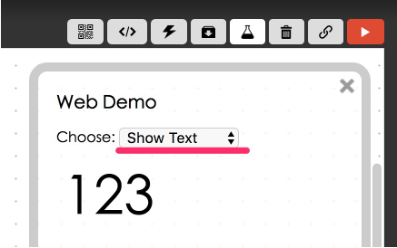
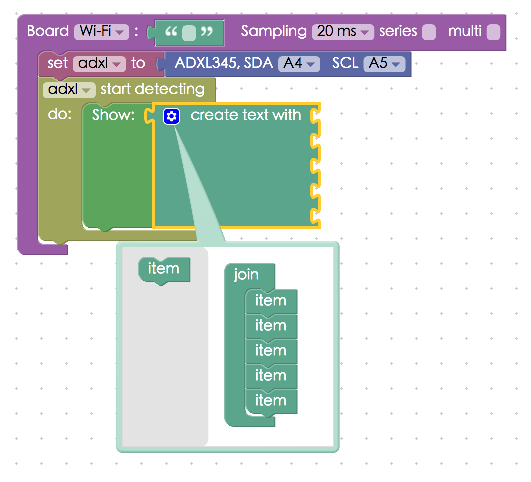
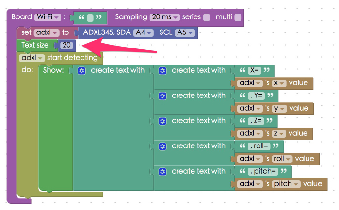

<!-- @@master  = ../../_layout.html-->

<!-- @@block  =  meta-->

<title>Project Example 23: ADXL345 – 3-axis accelerometer :::: Webduino = Web × Arduino</title>

<meta name="description" content="An accelerometer uses the acceleration of the three axes to determine its angle of rotation. In this project example we will be using a Webduino to control an ADXL345, a 3 axis accelerometer. We can choose to use the I2C or SPI protocol for data transfer, as the Arduino analog uses I2C. For this tutorial we will be using GND, VCC, CS, SDA and SCL.">

<meta itemprop="description" content="An accelerometer uses the acceleration of the three axes to determine its angle of rotation. In this project example we will be using a Webduino to control an ADXL345, a 3 axis accelerometer. We can choose to use the I2C or SPI protocol for data transfer, as the Arduino analog uses I2C. For this tutorial we will be using GND, VCC, CS, SDA and SCL.">

<meta property="og:description" content="An accelerometer uses the acceleration of the three axes to determine its angle of rotation. In this project example we will be using a Webduino to control an ADXL345, a 3 axis accelerometer. We can choose to use the I2C or SPI protocol for data transfer, as the Arduino analog uses I2C. For this tutorial we will be using GND, VCC, CS, SDA and SCL.">

<meta property="og:title" content="Project Example 23: ADXL345 – 3-axis accelerometer" >

<meta property="og:url" content="https://webduino.io/tutorials/tutorial-23-adxl345.html">

<meta property="og:image" content="https://webduino.io/img/tutorials/tutorial-23-01s.jpg">

<meta itemprop="image" content="https://webduino.io/img/tutorials/tutorial-23-01s.jpg">

<include src="../_include-tutorials.html"></include>

<!-- @@close-->

<!-- @@block  =  preAndNext-->

<include src="../_include-tutorials-content.html"></include>

<!-- @@close-->

<!-- @@block  =  tutorials-->

# Project Example 23: ADXL345 – 3-axis accelerometer 

An accelerometer uses the acceleration of the three axes to determine its angle of rotation. In this project example we will be using a Webduino to control an ADXL345, a 3 axis accelerometer. We can choose to use the I2C or SPI protocol for data transfer, as the Arduino analog uses I2C. For this tutorial we will be using GND, VCC, CS, SDA and SCL.

<!-- 

	三軸加速度計相關套件：<a href="https://webduino.io/buy/webduino-expansion-p.html" target="_blank">Webduino 擴充套件 P ( 支援 Fly )</a>
	Webduino 開發板：<a href="https://webduino.io/buy/component-webduino-fly.html" target="_blank">Webduino Fly</a>、<a href="https://webduino.io/buy/component-webduino-uno-fly.html" target="_blank">Webduino Fly + Arduino UNO</a>

 -->

## Video Tutorial

<!-- 影片對應範例：[https://blockly.webduino.io/?&page=tutorials/adxl345-1](https://blockly.webduino.io/?&page=tutorials/adxl345-1)   -->
Check the video tutorial here: 
<iframe class="youtube" src="https://www.youtube.com/embed/SH4-Z7E1DZc" frameborder="0" allowfullscreen></iframe>

## Wiring and Practice

Connect VCC to 3.3V (careful, if the voltage is higher than 3.6V it will fry the chip), GND to GND, CS is also connected to VCC so the electric potential is the same for CS and VCC. This is to tell the chip to follow the I2C protocol. 

IN1 and IN2 are in charge of controlling the two output pins, and SDO is used with the SPI protocol. So we won't be using them in this example.

Since we are using the I2C protocol we will need to add a pull-up resistor on the signal side. We add two 10k resistors here (on the Arduino’s official site it is recommended to use a 10k resistor as pull-up/pull-down resistors).

Circuit diagram:

Reference image:

<!-- 

	三軸加速度計相關套件：<a href="https://webduino.io/buy/webduino-expansion-p.html" target="_blank">Webduino 擴充套件 P ( 支援 Fly )</a>
	Webduino 開發板：<a href="https://webduino.io/buy/component-webduino-fly.html" target="_blank">Webduino Fly</a>、<a href="https://webduino.io/buy/component-webduino-uno-fly.html" target="_blank">Webduino Fly + Arduino UNO</a>

 -->

## Instructions for using the Webduino Blockly

Open the [Webduino Blocky editor](https://blockly.webduino.io/?lang=en), click on the "Web Demo Area" on the upper right hand side and click on "Show Text" from the dropdown menu. (Remember, you need to burn the firmware for the 3 axis accelerometer. Check out the tutorial: [Arduino Firmware Download / burn](info-07-arduino-ino.html), choose GY291 or ADXL in the file name)

Place a "Board" block inside the workspace, fill in the name of your Webduino board, and place an "ADXL345" block inside the stack. Set the name to asxl345, the SDA pin to A4, and the SCL to A5.

Place a "Start detecting" in the stack and a "Show" block inside that, to show the value of what is being detected on the screen.

Because the 3 axis accelerometer will return 5 values (X, Y, Z, Roll, and Pitch), **we must use a "Create List" block to show all of the values**. Click on the blue gear to add 5 spaces, so 5 values can be shown at the same time.

Not only will we be showing the numbers, we also need to show what they mean! So, create a second level with a second set of "Create List" blocks. Place blocks to show the value names and the values detected by the accelerometer into these list blocks. In the "Value" block's drop-down menu you can decide what kind of values you want to use.

To prevent the text from being too big we use the "Text Size" block set to 20.

Check if the board is online (click "[Check Device Status](https://webduino.io/device.html)") and click on the red execution button "Run Blocks". When turn the 3 axis accelerometer you can see the values showing on the Web Demo Area! (Solution: [https://blockly.webduino.io/?lang=en#-KZdlc75acEollCJOVNl](https://blockly.webduino.io/?lang=en#-KZdlc75acEollCJOVNl) )

##Code Explanation ([Check Webduino Bin](http://bin.webduino.io/lizuv/edit?html,css,js,output), [Check Device Status](https://webduino.io/device.html))

Include `webduino-all.min.js` in the header of your html files in order to support all of the Webduino's components. If the codes are generated by Webduino Blockly, you also have to include `webduino-blockly.js` in your files.

	
	

There is only a span inside the HTML used to show the values of the 3-axis accelerometer. Because we only have one span, we needed the "Create List" block. (If you are familiar with HTML, we could also have 5 spans here.)

	123

JavaScript uses the `on` method, inside there is a function with 5 parameters, these 5 parameters are the 5 values of the 3 axis accelerometer. Using `innerHTML` to add the strings together, we can use these 5 values to show them in the span.

	var adxl;

	boardReady('', function (board) {
	  board.samplingInterval = 20;
	  adxl = getADXL345(board);
	  document.getElementById("demo-area-01-show").style.fontSize = 20+"px";
	  adxl.setSensitivity = 0;
	  adxl.setBaseAxis = "x";
	  adxl.on(function(_x,_y,_z,_r,_p){
	    adxl._x = _x;
	    adxl._y = _y;
	    adxl._z = _z;
	    adxl._r = _r;
	    adxl._p = _p;
	    document.getElementById("demo-area-01-show").innerHTML = ([String('X=') + String(adxl._x),String(', Y=') + String(adxl._y),String(', Z=') + String(adxl._z),String(', roll=') + String(adxl._r),String(', pitch=') + String(adxl._p)].join(''));
	  });
	});

Here's how to control a 3 axis accelerometer – ADXL345 and an intro to it's code.   
Webduino Bin: [http://bin.webduino.io/lizuv/edit?html,css,js,output](http://bin.webduino.io/lizuv/edit?html,css,js,output)  
Stack setup: [https://blockly.webduino.io/?lang=en#-KZdmvtd1QQFmPZRorSu](https://blockly.webduino.io/?lang=en#-KZdmvtd1QQFmPZRorSu)

<!-- ## 三軸加速度計的延伸教學：

[Webduino Blockly 課程 14-1：控制三軸加速度計](https://blockly.webduino.io/?lang=zh-hant&page=tutorials/adxl345-1#-K0pl9rB2TohBuBnorit)  
[Webduino Blockly 課程 14-2：旋轉角度旋轉圖片](https://blockly.webduino.io/?lang=zh-hant&page=tutorials/adxl345-2#-K0q9iZQIPc-9eLg9k2f)  
[Webduino Blockly 課程 14-3：旋轉角度點亮 LED 燈](https://blockly.webduino.io/?lang=zh-hant&page=tutorials/adxl345-3#-K0qEX3wukvZgtnn817T)  
[Webduino Blockly 課程 14-4：旋轉角度改變點矩陣圖形](https://blockly.webduino.io/?lang=zh-hant&page=tutorials/adxl345-4#-K0qKebEHBdfd19FzAvZ)

	三軸加速度計相關套件：<a href="https://webduino.io/buy/webduino-expansion-p.html" target="_blank">Webduino 擴充套件 P ( 支援 Fly )</a>
	Webduino 開發板：<a href="https://webduino.io/buy/component-webduino-fly.html" target="_blank">Webduino Fly</a>、<a href="https://webduino.io/buy/component-webduino-uno-fly.html" target="_blank">Webduino Fly + Arduino UNO</a>

 -->

<!-- @@close-->