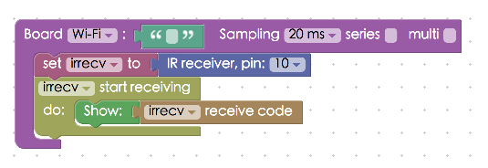
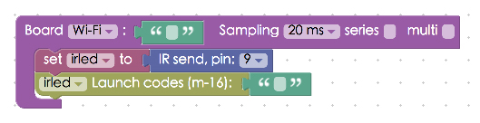

<!-- @@master  = ../../_layout.html-->

<!-- @@block  =  meta-->

<title>Project Example 24: Sending and receiving signals with an infrared sensor :::: Webduino = Web × Arduino</title>

<meta name="description" content="We can find infrared sensors in the many electrical appliances in our daily life, such as TVs, air conditioners, remote controlled fans, toys… etc. Anything that is remote controlled, there's a pretty good chance that it is sending and receiving signals with an infrared sensor. This project example will show how to use the Webduino to send and receive information with an infrared sensor.">

<meta itemprop="description" content="We can find infrared sensors in the many electrical appliances in our daily life, such as TVs, air conditioners, remote controlled fans, toys… etc. Anything that is remote controlled, there's a pretty good chance that it is sending and receiving signals with an infrared sensor. This project example will show how to use the Webduino to send and receive information with an infrared sensor.">

<meta property="og:description" content="We can find infrared sensors in the many electrical appliances in our daily life, such as TVs, air conditioners, remote controlled fans, toys… etc. Anything that is remote controlled, there's a pretty good chance that it is sending and receiving signals with an infrared sensor. This project example will show how to use the Webduino to send and receive information with an infrared sensor.">

<meta property="og:title" content="Project Example 24: Sending and receiving signals with an infrared sensor" >

<meta property="og:url" content="https://webduino.io/tutorials/tutorial-24-ir.html">

<meta property="og:image" content="https://webduino.io/img/tutorials/tutorial-24-01s.jpg">

<meta itemprop="image" content="https://webduino.io/img/tutorials/tutorial-24-01s.jpg">

<include src="../_include-tutorials.html"></include>

<!-- @@close-->

<!-- @@block  =  preAndNext-->

<include src="../_include-tutorials-content.html"></include>

<!-- @@close-->

<!-- @@block  =  tutorials-->

# Project Example 24: Sending and receiving signals with an infrared sensor

We can find infrared sensors in the many electrical appliances in our daily life, such as TVs, air conditioners, remote controlled fans, toys… etc. Anything that is remote controlled, there's a pretty good chance that it is sending and receiving signals with an infrared sensor. This project example will show how to use the Webduino to send and receive information with an infrared sensor.

<!-- 

	紅外線發射與接收相關套件：<a href="https://webduino.io/buy/webduino-expansion-p.html" target="_blank">Webduino 擴充套件 P ( 支援 Fly )</a>
	Webduino 開發板：<a href="https://webduino.io/buy/component-webduino-fly.html" target="_blank">Webduino Fly</a>、<a href="https://webduino.io/buy/component-webduino-uno-fly.html" target="_blank">Webduino Fly + Arduino UNO</a>

 
 -->
## Video Tutorial

<!-- 影片對應範例：[https://blockly.webduino.io/?&page=tutorials/irrecv-1](https://blockly.webduino.io/?&page=tutorials/irrecv-1) -->  
Check the video tutorial here: 
<iframe class="youtube" src="https://www.youtube.com/embed/lfN0D4198CM" frameborder="0" allowfullscreen></iframe>

## Wiring and Practice	

Connect the leg nearest to the "-"" on the infrared sensor to GND, the middle leg to 3.3V, and the leg closest to S connects to pin 10. Since we only have one oscillator on the Arduino, **we cannot simultaneously send and receive an infrared signal on the same board**. If we need to test sending a signal we could use an infrared receiver to receive a signal from a TV remote control and then use the infrared transmitter to send a signal to the TV.

infrared receive sensor Circuit diagram:

infrared receive sensor Reference image:

The infrared transmitter looks like a large LED, if you're not paying attention you might even connect to the wrong pins. **We have to use pin number 9, which accesses to the oscillator, to send a square wave with the infrared transmitter**. So connecting the infrared transmitter to other pins will not work. Here we connect the longer leg to pin 9 and the shorter one to GND.

infrared transmitter Circuit diagram:

<!-- 

	紅外線發射與接收相關套件：<a href="https://webduino.io/buy/webduino-expansion-p.html" target="_blank">Webduino 擴充套件 P ( 支援 Fly )</a>
	Webduino 開發板：<a href="https://webduino.io/buy/component-webduino-fly.html" target="_blank">Webduino Fly</a>、<a href="https://webduino.io/buy/component-webduino-uno-fly.html" target="_blank">Webduino Fly + Arduino UNO</a>

  -->

## Instructions for using the Webduino Blockly

Open the [Webduino Blocky editor](https://blockly.webduino.io/?lang=en), click on the "Web Demo Area" on the upper right hand side, and click on "Show Text" in the drop down menu. Don't forget, you need to burn the firmware for the infrared transmitter before you can proceed. (Check out the tutorial: [Ardiuno Firmware Download / Burn](info-07-arduino-ino.html) and choose the file name with IR)

First, place a "Board" block into the workspace, fill in the name of your Webduino board, and place an "IR" block inside the stack. Then set the name to "irrecv" and the pin to 10.

Place a "start receiving / do", a "show", and a "receive code" block, so we can show the values on screen.

If we are sending an infrared signal, use the "IR send" block, set to "irled", and the pin to 9.

We can also use different buttons on screen to send different infrared signals. Using this method we could potentially create a webpage that works as a virtual remote control.

Check if the board is online (click "[Check Device Status](https://webduino.io/device.html)") and click on the red execution button "Run Blocks". Then you can start to receive or send infrared signals! (Solution: [https://blockly.webduino.io/?lang=en#-KZdeUiX6sp1qxVxHt4V](https://blockly.webduino.io/?lang=en#-KZdeUiX6sp1qxVxHt4V))

##Code Explanation ([Check Webduino Bin](http://bin.webduino.io/jiguh/edit?html,css,js,output), [Check Device Status](https://webduino.io/device.html))

Include `webduino-all.min.js` in the header of your html files in order to support all of the Webduino's components. If the codes are generated by Webduino Blockly, you also have to include `webduino-blockly.js` in your files.

	
	

If we are using an infrared transmitter, there will only be a span inside the HTML code, to show the 3-axis accelerometer, and only because there is a span, we will need to use "Create List" block. (If you know how to write code, you could easily use 5 spans instead)

	123

If you're using an infrared transmitter, HTML will just be the buttons.

	<button id="demo-area-05-btn1" class="db5">按鈕 1</button>
	<button id="demo-area-05-btn2" class="db5">按鈕 2</button>
	<button id="demo-area-05-btn3" class="db5">按鈕 3</button>
	<button id="demo-area-05-btn4" class="db5">按鈕 4</button>
	<button id="demo-area-05-btn5" class="db5">按鈕 5</button>

The IR Recv used `on` in JavaScript, there's a function with a parameter, used to receive the signal value and by using `innerHTML` to sum with strings, we can use this value to display inside the span.

	var irrecv;

	boardReady('', function (board) {
	  board.samplingInterval = 20;
	  irrecv = getIRRecv(board, 10);
	  irrecv.on(function(val){
	    irrecv.onVal = val;
	    document.getElementById("demo-area-01-show").innerHTML = irrecv.onVal;
	  },function(){});
	});

As for the IR Send, it uses `send` to send signals, type in the message behind this and you can send them out.

	var irled;

	boardReady('', function (board) {
	  board.samplingInterval = 20;
	  irled = getIRLed(board, "ffffffff");
	  document.getElementById("demo-area-05-btn1").addEventListener("click",function(){
	    irled.send("ffffffff");
	  });
	  document.getElementById("demo-area-05-btn2").addEventListener("click",function(){
	    irled.send("ffffffff");
	  });
	  document.getElementById("demo-area-05-btn3").addEventListener("click",function(){
	    irled.send("ffffffff");
	  });
	  document.getElementById("demo-area-05-btn4").addEventListener("click",function(){
	    irled.send("ffffffff");
	  });
	  document.getElementById("demo-area-05-btn5").addEventListener("click",function(){
	    irled.send("ffffffff");
	  });
	});

This is how we control an infrared sensor to send and receive information.   
Webduino Bin: [http://bin.webduino.io/jiguh/edit?html,css,js,output](http://bin.webduino.io/jiguh/edit?html,css,js,output)  
Stack setup: [https://blockly.webduino.io/?lang=en#-KZdfQS23mis7qSo0vzQ](https://blockly.webduino.io/?lang=en#-KZdfQS23mis7qSo0vzQ)

<!-- ## 紅外線發射與接收的延伸教學：

[Webduino Blockly 課程 15-1：接收紅外線訊號](https://blockly.webduino.io/?lang=zh-hant&page=tutorials/irrecv-1#-K0qf8JH7bENOyJgc25r)  
[Webduino Blockly 課程 15-2：接收紅外線訊號改變區域顏色](https://blockly.webduino.io/?lang=zh-hant&page=tutorials/irrecv-2#-K0qhamTHkjMc9nZg4rc)  
[Webduino Blockly 課程 15-3：紅外線遙控 youtube 播放](https://blockly.webduino.io/?lang=zh-hant&page=tutorials/irrecv-3#-K0qllY_jNznqTDWliZ4) 

	紅外線發射與接收相關套件：<a href="https://webduino.io/buy/webduino-expansion-p.html" target="_blank">Webduino 擴充套件 P ( 支援 Fly )</a>
	Webduino 開發板：<a href="https://webduino.io/buy/component-webduino-fly.html" target="_blank">Webduino Fly</a>、<a href="https://webduino.io/buy/component-webduino-uno-fly.html" target="_blank">Webduino Fly + Arduino UNO</a>

  -->

<!-- @@close-->