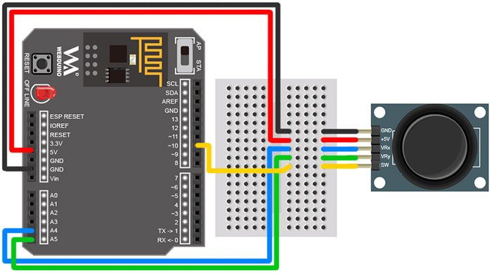
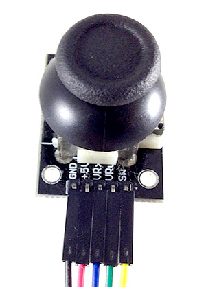
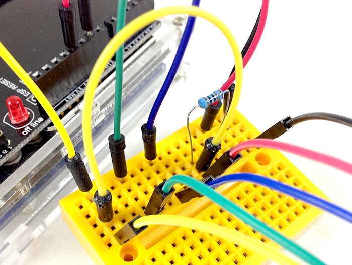
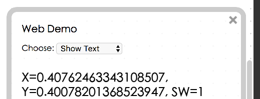

<!-- @@master  = ../../_layout.html-->

<!-- @@block  =  meta-->

<title>Project Example 25: Detecting a joystick :::: Webduino = Web × Arduino</title>

<meta name="description" content="A joystick is an integral part of many video games. It sends three signals, left / right, front / back, and when it is pressed. We can use the Webduino to detect signals coming from a joystick and use it to control cars, robots, or other devices, creating many interesting applications.">

<meta itemprop="description" content="A joystick is an integral part of many video games. It sends three signals, left / right, front / back, and when it is pressed. We can use the Webduino to detect signals coming from a joystick and use it to control cars, robots, or other devices, creating many interesting applications.">

<meta property="og:description" content="A joystick is an integral part of many video games. It sends three signals, left / right, front / back, and when it is pressed. We can use the Webduino to detect signals coming from a joystick and use it to control cars, robots, or other devices, creating many interesting applications.">

<meta property="og:title" content="Project Example 25: Detecting a joystick" >

<meta property="og:url" content="https://webduino.io/tutorials/tutorial-25-joypad.html">

<meta property="og:image" content="https://webduino.io/img/tutorials/tutorial-25-01s.jpg">

<meta itemprop="image" content="https://webduino.io/img/tutorials/tutorial-25-01s.jpg">

<include src="../_include-tutorials.html"></include>

<!-- @@close-->

<!-- @@block  =  preAndNext-->

<include src="../_include-tutorials-content.html"></include>

<!-- @@close-->

<!-- @@block  =  tutorials-->

# Project Example 25: Detecting a joystick

A joystick is an integral part of many video games. It sends three signals, left / right, front / back, and when it is pressed. We can use the Webduino to detect signals coming from a joystick and use it to control cars, robots, or other devices, creating many interesting applications.

<!-- 

	搖桿相關套件：<a href="https://webduino.io/buy/webduino-expansion-p.html" target="_blank">Webduino 擴充套件 P ( 支援 Fly )</a>
	Webduino 開發板：<a href="https://webduino.io/buy/component-webduino-fly.html" target="_blank">Webduino Fly</a>、<a href="https://webduino.io/buy/component-webduino-uno-fly.html" target="_blank">Webduino Fly + Arduino UNO</a>

 -->

## Video Tutorial

Check the video tutorial here:
<iframe class="youtube" src="https://www.youtube.com/embed/CwWwQmuvL28" frameborder="0" allowfullscreen></iframe>

## Wiring and Practice

A joystick has 5 pins, GND, 5V, VRx, VRy, and SW. VRx and VRy are analog pins, connect them to A4 and A5. Think of SW as a button. So, when it's connected to GND and 5V it will need a resistor to prevent shorting the circuit when the joystick is pressed. We are restricted to the circuit design of the joystick itself, so we need to use a pull-up resistor. Connect both the resistor and the signal source to 5V.

Circuit diagram:

Reference image:

<!-- 

	搖桿相關套件：<a href="https://webduino.io/buy/webduino-expansion-p.html" target="_blank">Webduino 擴充套件 P ( 支援 Fly )</a>
	Webduino 開發板：<a href="https://webduino.io/buy/component-webduino-fly.html" target="_blank">Webduino Fly</a>、<a href="https://webduino.io/buy/component-webduino-uno-fly.html" target="_blank">Webduino Fly + Arduino UNO</a>

 -->

## Instructions for using the Webduino Blockly

Open the [Webduino Blockly editor](https://blockly.webduino.io/index.html?lang=en), click on "Web Demo Area" button on the upper-right hand side, and choose "Show Text" from the drop-down menu. Don’t forget to burn the firmware for the joystick first! ( Check out the tutorial: [Arduino Firmware Download / Burn](info-07-arduino-ino.html) and choose the file with "joypad" )

Place a "Board" inside the workspace and fill in the name of your Webduino board. Place a "Set Joystick to" block inside the stack and set the name to joystick, pin X to A4, Y to A5, and SW to 10.

Place "Start detecting" and "Show" blocks in the stack, so when we are using the joystick, the values will show in the window.

Because the joystick returns 3 values (X, Y, SW) but there is only one slot for "Show", **use a "Create List" block**. Click on the blue gear icon and create 3 slots, so we can show all 3 values at once.

We also need to show what the values mean, so create a second level of "Create List" blocks set into the first. Add the names of the Joystick values, and choose what values will be received from the drop-down menu.You can also set the text size by adding "Text Size", we will set it to 20 in this example.

After you are done setting up the stack, check if the board is online (click "[Check Device Status](https://webduino.io/device.html)") and click on the red execution button "Run Blocks", move or press the joystick and you will see the values change.
(Solution: [https://blockly.webduino.io/#-KB6z6vqt9sXTYqd7CN8](https://blockly.webduino.io/#-KB6z6vqt9sXTYqd7CN8) )

If you don't like having a lot of numbers after the decimal point, we can also use the "Math Conversion" block in "Advanced" menu, so the numbers will round up to the first decimal point.

After you are done setting up the stack, check if the board is online (click "[Check Device Status](https://webduino.io/device.html)") and also click on "Run Blocks", turn or press the joystick and you will see the values change. (Solution: [https://blockly.webduino.io/?lang=en#-KZu4LTKyfrsNVBeMwsG](https://blockly.webduino.io/?lang=en#-KZu4LTKyfrsNVBeMwsG))

##Code Explanation ([Check Webduino Bin](http://bin.webduino.io/wifak/edit?html,css,js,output), [Check Device Status](https://webduino.io/device.html))

Include `webduino-all.min.js` in the header of your html files in order to support all of the Webduino's components. If the codes are generated by Webduino Blockly, you also have to include `webduino-blockly.js` in your files.

	
	

We use a span to display the values returned from the joystick.

	123

The Joystick in JavaScript uses `on` where there is a function with three parameters, these three parameters are the joystick’s X, Y and SW values, using `innerHTML` to add with the strings, we can use these values to display inside the span.

	var joystick;

	boardReady('', function (board) {
	  board.samplingInterval = 20;
	  joystick = getJoystick(board, 4, 5, 10);
	  document.getElementById("demo-area-01-show").style.fontSize = 20+"px";
	  joystick.on("message",_read_);
	  function _read_(_x, _y, _z){
	    joystick._x = _x;
	    joystick._y = _y;
	    joystick._z = _z;
	    document.getElementById("demo-area-01-show").innerHTML = ([String('X=') + String((Math.round((joystick._x)*10))/10),String(', Y=') + String((Math.round((joystick._y)*10))/10),String(', SW=') + String((Math.round((joystick._z)*10))/10)].join(''));
	  }
	});

Now you know how to detecting a joystick!   
Webduino Bin: [http://bin.webduino.io/wifak/edit?html,css,js,output](http://bin.webduino.io/wifak/edit?html,css,js,output)  
Stack setup: [https://blockly.webduino.io/?lang=en#-KZu4LTKyfrsNVBeMwsG](https://blockly.webduino.io/?lang=en#-KZu4LTKyfrsNVBeMwsG)

<!-- 

	搖桿相關套件：<a href="https://webduino.io/buy/webduino-expansion-p.html" target="_blank">Webduino 擴充套件 P ( 支援 Fly )</a>
	Webduino 開發板：<a href="https://webduino.io/buy/component-webduino-fly.html" target="_blank">Webduino Fly</a>、<a href="https://webduino.io/buy/component-webduino-uno-fly.html" target="_blank">Webduino Fly + Arduino UNO</a>

 -->

<!-- @@close-->