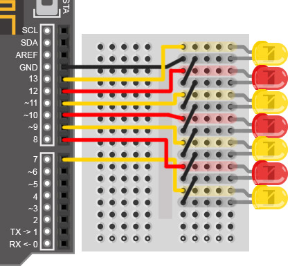
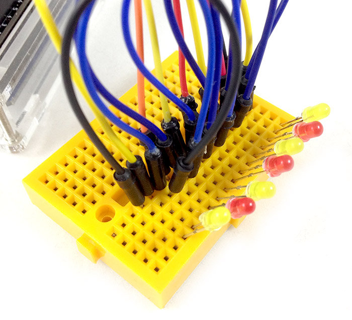
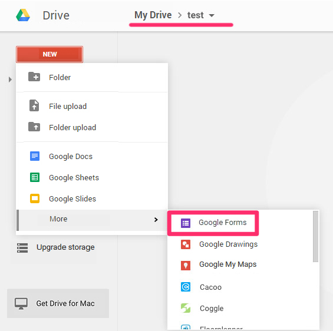
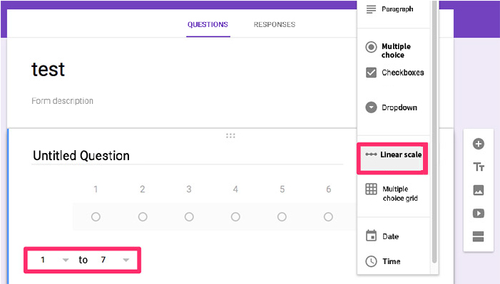
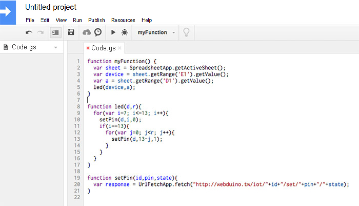
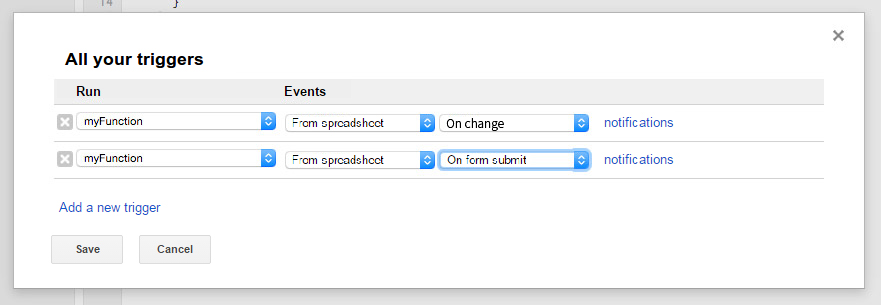

<!-- @@master  = ../../_layout.html-->

<!-- @@block  =  meta-->

<title>Project Example 26: Controlling an LED with Google Sheets :::: Webduino = Web × Arduino</title>

<meta name="description" content="Google Sheets is a commonly used online service from Google, offering full spreadsheet capabilities. It can be used with Google Forms, acting as a database for your survey answers. In this tutorial, we will fill a Google Form, average and round off the results, then show the information through a number of LEDs.">

<meta itemprop="description" content="Google Sheets is a commonly used online service from Google, offering full spreadsheet capabilities. It can be used with Google Forms, acting as a database for your survey answers. In this tutorial, we will fill a Google Form, average and round off the results, then show the information through a number of LEDs.">

<meta property="og:description" content="Google Sheets is a commonly used online service from Google, offering full spreadsheet capabilities. It can be used with Google Forms, acting as a database for your survey answers. In this tutorial, we will fill a Google Form, average and round off the results, then show the information through a number of LEDs.">

<meta property="og:title" content="Project Example 26: Controlling an LED with Google Sheets" >

<meta property="og:url" content="https://webduino.io/tutorials/tutorial-26-google-sheet.html">

<meta property="og:image" content="https://webduino.io/img/tutorials/tutorial-26-01s.jpg">

<meta itemprop="image" content="https://webduino.io/img/tutorials/tutorial-26-01s.jpg">

<include src="../_include-tutorials.html"></include>

<!-- @@close-->

<!-- @@block  =  preAndNext-->

<include src="../_include-tutorials-content.html"></include>

<!-- @@close-->

<!-- @@block  =  tutorials-->

# Project Example 26: Controlling an LED with Google Sheets

Google Sheets is a commonly used online service from Google, offering full spreadsheet capabilities. It can be used with Google Forms, acting as a database for your survey answers. In this tutorial, we will fill a Google Form, average and round off the results, then show the information through a number of LEDs.

<!-- 

	LED 相關套件：<a href="https://webduino.io/buy/webduino-package-plus.html" target="_blank">Webduino 基本套件 Plus ( 支援馬克 1 號、Fly )</a>
	Webduino 開發板：<a href="https://webduino.io/buy/component-webduino-fly.html" target="_blank">Webduino Fly</a>、<a href="https://webduino.io/buy/component-webduino-uno-fly.html" target="_blank">Webduino Fly + Arduino UNO</a>

 -->

## Video Tutorial

Check the video tutorial here: 
<iframe class="youtube" src="https://www.youtube.com/embed/mpwSAFwlL_0" frameborder="0" allowfullscreen></iframe>

## Wiring and Practice

We will only be using 7 LEDs for this tutorial, one LED each for a score of 1 - 7. Connect the LEDs with solid wire and a breadboard, connecting the longer legs to pin 7, 8, 9, 10, 11, 12, 13 and the shorter legs to GND.

Circuit diagram:

Reference image:

<!-- 

	LED 相關套件：<a href="https://webduino.io/buy/webduino-package-plus.html" target="_blank">Webduino 基本套件 Plus ( 支援馬克 1 號、Fly )</a>
	Webduino 開發板：<a href="https://webduino.io/buy/component-webduino-fly.html" target="_blank">Webduino Fly</a>、<a href="https://webduino.io/buy/component-webduino-uno-fly.html" target="_blank">Webduino Fly + Arduino UNO</a>

 -->

## Instructions

Since we will be using Google Forms, you will need to have a Google Drive account. Start by selecting "NEW" to open a new Folder or directly open a new Google Form file. In this tutorial we've created a Folder named "test" to keep all of our forms and sheets.

Open the Form, type in a name for the Form (later on, an automatically generated spreadsheet will share the same name), click on the "Responses" tab and click on "Create Spreadsheet" to create a spreadsheet that is linked to this Form.

Now, click on the "Questions" tab, here we can add a few questions for our survey. Let's create a "Linear Scale" question, set 1 to 7, so when a user chooses a number, Google Sheets will record the selection.

Click on the "eye" icon on the upper-right hand side to preview, select 7 and click "submit".

Once you've done that, return to Google Drive, find the matching Google Sheet and open it.

The first column records the "timestamp", indicating when the answer was recorded and the second column shows the number recorded.

To calculate the average, type "Average" in C1 and then type the formula from the picture below into D1.

Use the formula below for calculations

	=IF(TYPE(ROUND(AVERAGE(B:B)))=16,0,ROUND(AVERAGE(B:B)))

Then type in the Device name of the board we are using in cell E1.

Now for **the most important** part; select "Tools" > "Script Editor" which will open a new page with the developer tools for this spreadsheet, then type in the code provided below. This piece of code will control the LEDs to light up according to the average scores from the spreadsheet.

	function myFunction() {
	  var sheet = SpreadsheetApp.getActiveSheet();
	  var device = sheet.getRange('E1').getValue();
	  var a = sheet.getRange('D1').getValue();
	  led(device,a);
	}

	function led(d,r){
	  for(var i=7; i<=13; i++){
	    setPin(d,i,0);
	    if(i==13){
	      for(var j=0; j<r; j++){
	        setPin(d,13-j,1);
	      }
	    }
	  }
	}

	function setPin(id,pin,state){
	   var response = UrlFetchApp.fetch("http://webduino.tw/iot/"+id+"/set/"+pin+"/"+state);
	}

After you've typed in all of the code correctly, click "Resources" > "All your triggers", enter a new project name when prompted and press "ok". If you are asked to "authorize" following actions, click ok. Then click "No triggers set up, click here to add one now".

To "Run" your piece of code when the spreadsheet has changes, you have to create two triggers. For the first trigger set "Events" to "From spreadsheet" and "On change" and for the second set "Events" to "From spreadsheet" and "On form submit". So then, when an user fills out the spreadsheet and submits it, your code will run.

Now for the very last step, fill in the "Device" name of your board on cell E1, check if your board is online (you can check here: https://webduino.io/device.html ), fill in the Form and submit it. You will see the number of LEDs light up correspond with the numbers that are filled in.

<!-- 

	LED 相關套件：<a href="https://webduino.io/buy/webduino-package-plus.html" target="_blank">Webduino 基本套件 Plus ( 支援馬克 1 號、Fly )</a>
	Webduino 開發板：<a href="https://webduino.io/buy/component-webduino-fly.html" target="_blank">Webduino Fly</a>、<a href="https://webduino.io/buy/component-webduino-uno-fly.html" target="_blank">Webduino Fly + Arduino UNO</a>

 -->

<!-- @@close-->