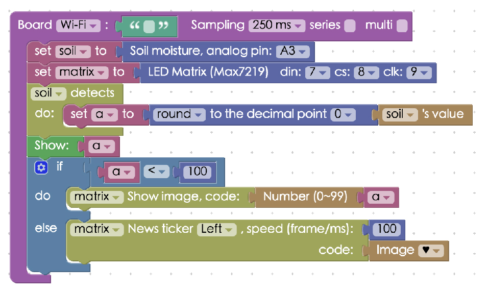
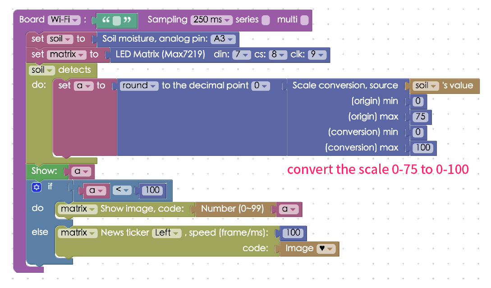

<!-- @@master  = ../../_layout.html-->

<!-- @@block  =  meta-->

<title>Project Example 31: Visualizing soil moisture with an LED matrix :::: Webduino = Web × Arduino</title>

<meta name="description" content="Using the electric conductivity between two metal pieces, we can use a soil moisture sensor to measure the approximate dampness of soil. In this example, we will be making a visualization of the water measured and when the moisture levels are higher than 100 it will automatically play an animated image.">

<meta itemprop="description" content="Using the electric conductivity between two metal pieces, we can use a soil moisture sensor to measure the approximate dampness of soil. In this example, we will be making a visualization of the water measured and when the moisture levels are higher than 100 it will automatically play an animated image.">

<meta property="og:description" content="Using the electric conductivity between two metal pieces, we can use a soil moisture sensor to measure the approximate dampness of soil. In this example, we will be making a visualization of the water measured and when the moisture levels are higher than 100 it will automatically play an animated image.">

<meta property="og:title" content="Project Example 31: Visualizing soil moisture with an LED matrix" >

<meta property="og:url" content="https://webduino.io/tutorials/tutorial-31-soil-max7219.html">

<meta property="og:image" content="https://webduino.io/img/tutorials/tutorial-31-01s.jpg">

<meta itemprop="image" content="https://webduino.io/img/tutorials/tutorial-31-01s.jpg">

<include src="../_include-tutorials.html"></include>

<!-- @@close-->

<!-- @@block  =  preAndNext-->

<include src="../_include-tutorials-content.html"></include>

<!-- @@close-->

<!-- @@block  =  tutorials-->

# Project Example 31: Visualizing soil moisture with an LED matrix

Using the electric conductivity between two metal pieces, we can use a soil moisture sensor to measure the approximate dampness of soil. In this example, we will be making a visualization of the water measured and when the moisture levels are higher than 100 it will automatically play an animated image. 

<!-- 

	土壤濕度偵測模組：<a href="https://webduino.io/buy/webduino-expansion-s.html" target="_blank">Webduino 擴充套件 S ( 支援馬克 1 號、Fly )</a>
	LED 點矩陣：<a href="https://webduino.io/buy/webduino-package-plus.html" target="_blank">Webduino 基本套件 Plus  ( 支援馬克 1 號、Fly )</a>
	Webduino 開發板：<a href="https://webduino.io/buy/component-webduino-v1.html" target="_blank">Webduino 馬克一號</a>、<a href="https://webduino.io/buy/component-webduino-fly.html" target="_blank">Webduino Fly</a>、<a href="https://webduino.io/buy/component-webduino-uno-fly.html" target="_blank">Webduino Fly + Arduino UNO</a>

 -->

## Video Tutorial

Watch the video tutorial here: 
<iframe class="youtube" src="https://www.youtube.com/embed/ppweeGJD0nw" frameborder="0" allowfullscreen></iframe>

## Wiring and Practice

The Soil Moisture Sensor has 3 pins, SIG, GND and VCC. Since we will be using an LED matrix to show the values, the LED matrix will also be using the GND and VCC. So, we will need to use a breadboard to make everything fit. Connect VCC to VCC, GND to GND, SIG from the soil moisture sensor to A3. For the LED matrix, connect DIN to 7, CS to 8, and CLK to 9.

Webduino Mark 1 Circuit Diagram:

Webduino Fly Circuit Diagram:

Reference image:

<!-- 

	土壤濕度偵測模組：<a href="https://webduino.io/buy/webduino-expansion-s.html" target="_blank">Webduino 擴充套件 S ( 支援馬克 1 號、Fly )</a>
	LED 點矩陣：<a href="https://webduino.io/buy/webduino-package-plus.html" target="_blank">Webduino 基本套件 Plus  ( 支援馬克 1 號、Fly )</a>
	Webduino 開發板：<a href="https://webduino.io/buy/component-webduino-v1.html" target="_blank">Webduino 馬克一號</a>、<a href="https://webduino.io/buy/component-webduino-fly.html" target="_blank">Webduino Fly</a>、<a href="https://webduino.io/buy/component-webduino-uno-fly.html" target="_blank">Webduino Fly + Arduino UNO</a>

 -->

## Instructions for using the Webduino Blockly

Open the [Webduino Blockly Editor](https://blockly.webduino.io/?lang=en), place a "Board" block into the workspace and fill in the name of the  Webduino board you are using. Then place the "Soil Moisture" block from "Sensors" and the "LED Matrix" from "Components" inside and assign the correct pins to each of them.

Place a "Soil Detects" block into the stack using a variable representing the value currently measured, we also round this value to a whole number. We will be using this value repeatedly, so using the same variable allows us to change less code. We must round to a whole number because the LED matrix can only shows integers.

Then place a "Show" block from "Show Text" into the stack, so the measured value will simultaneously show on the "Web Demo Area" as well. Then add an "If, do, else" "Logic" block and connect the necessary "Logic", "Variable", "LED Matrix", and "Math" blocks to the stack. When the values are less than 100, it will show the number on the LED matrix and when it is greater than or equal to 100, an animated image will play.

We've finished most of the hard work, check if the board is online (click [Check Device Status](https://webduino.io/device.html)) and click on the red execution button "Run Blocks". If you take a glass of water and place the soil moisture sensor inside the water, you will see the values change. 
Solution: [https://blockly.webduino.io/?lang=en#-KYlgaaXx61FlgO19A9h](https://blockly.webduino.io/?lang=en#-KYlgaaXx61FlgO19A9h)

Be aware that different sensors will have different readings. Also if we connect VCC to 3.3V, the MAX value will also be different. If the values need to be converted, the "Scale conversion" block can be used as seen in these images.

##Code Explanation ([Check Webduino Bin](https://bin.webduino.io/fijuw/edit?html,css,js,output), [Check Device Status](https://webduino.io/device.html))

Include `webduino-all.min.js` in the header of your html files in order to support all of the Webduino's components. If the codes are generated by Webduino Blockly, you also have to include `webduino-blockly.js` in your files.

	
	

The first half of the code inside JavaScript are for the LED matrix to show images, the second half is for detection and measuring, we mainly use `on` to measure and it returns `val`.

	boardReady('', function (board) {
	  board.systemReset();
	  board.samplingInterval = 250;
	  soil = getSoil(board, 3);
	  matrix = getMax7219(board, 7, 8, 9);
	  soil.on(function(val){
	    soil.detectedVal = val;
	    a = Math.round(soil.detectedVal);
	    document.getElementById("demo-area-01-show").innerHTML = a;
	    if (a < 100) {
	      matrix.animateStop();
	      matrix.on("0000000000000000");
	      matrix.on((max7219_number(a)));
	    } else {
	      matrix.animateStop();
	      matrix.animate(max7219_horse("left","0c1e3e7c3e1e0c00"),100);
	    }
	  });
	});

This is how you can visualize soil moisture with an LED matrix!  
Webduino Bin: [https://bin.webduino.io/fijuw/edit?html,css,js,output](https://bin.webduino.io/fijuw/edit?html,css,js,output)  
Stack setup: [https://blockly.webduino.io/?lang=en#-KYlgkLyhokqWK8p5WQh](https://blockly.webduino.io/?lang=en#-KYlgkLyhokqWK8p5WQh)

<!-- 

	土壤濕度偵測模組：<a href="https://webduino.io/buy/webduino-expansion-s.html" target="_blank">Webduino 擴充套件 S ( 支援馬克 1 號、Fly )</a>
	LED 點矩陣：<a href="https://webduino.io/buy/webduino-package-plus.html" target="_blank">Webduino 基本套件 Plus  ( 支援馬克 1 號、Fly )</a>
	Webduino 開發板：<a href="https://webduino.io/buy/component-webduino-v1.html" target="_blank">Webduino 馬克一號</a>、<a href="https://webduino.io/buy/component-webduino-fly.html" target="_blank">Webduino Fly</a>、<a href="https://webduino.io/buy/component-webduino-uno-fly.html" target="_blank">Webduino Fly + Arduino UNO</a>

 -->

<!-- @@close-->