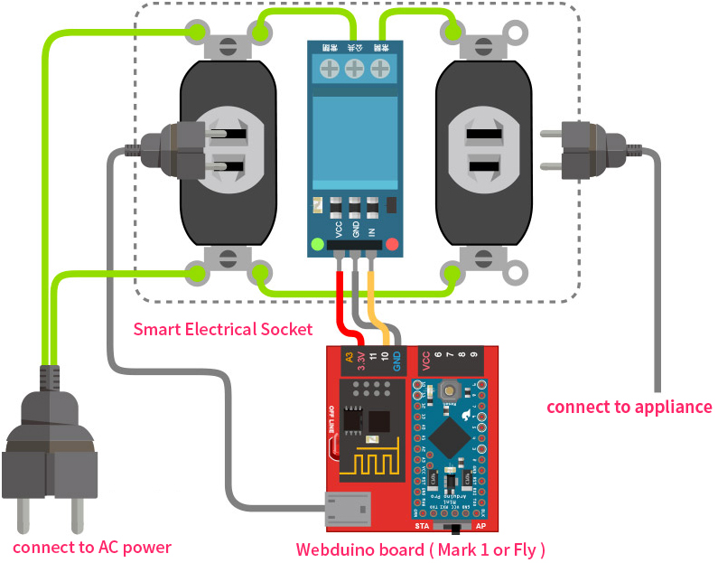
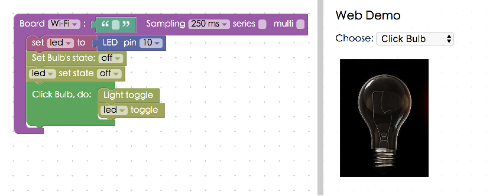
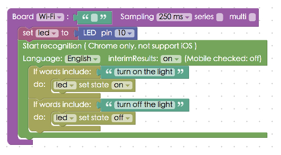

<!-- @@master  = ../../_layout.html-->

<!-- @@block  =  meta-->

<title>Project Example 32: DIY Smart Electrical Socket :::: Webduino = Web × Arduino</title>

<meta name="description" content="We've talked about some applications for relays in the Project Example 14, if we take that and combine it with a simple electrical socket, we can control it over Wi-Fi. Or even transform it into a smart, light and voice sensing, remote controlled electrical socket!
">

<meta itemprop="description" content="We've talked about some applications for relays in the Project Example 14, if we take that and combine it with a simple electrical socket, we can control it over Wi-Fi. Or even transform it into a smart, light and voice sensing, remote controlled electrical socket!">

<meta property="og:description" content="We've talked about some applications for relays in the Project Example 14, if we take that and combine it with a simple electrical socket, we can control it over Wi-Fi. Or even transform it into a smart, light and voice sensing, remote controlled electrical socket!">

<meta property="og:title" content="Project Example 32: DIY Smart Electrical Socket" >

<meta property="og:url" content="https://webduino.io/tutorials/tutorial-32-smart-socket.html">

<meta property="og:image" content="https://webduino.io/img/tutorials/tutorial-32-01s.jpg">

<meta itemprop="image" content="https://webduino.io/img/tutorials/tutorial-32-01s.jpg">

<include src="../_include-tutorials.html"></include>

<!-- @@close-->

<!-- @@block  =  preAndNext-->

<include src="../_include-tutorials-content.html"></include>

<!-- @@close-->

<!-- @@block  =  tutorials-->

# Project Example 32: DIY Smart Electrical Socket

We've talked about some applications for relays in the [Project Example 14](tutorial-14-relay.html), if we take that and combine it with a simple electrical socket, we can control it over Wi-Fi. Or even transform it into a smart, light and voice sensing, remote controlled electrical socket! 

<!-- 

	智慧插座套件：<a href="https://webduino.io/buy/webduino-package-socket.html" target="_blank">Webduino 智慧插座套件 ( 電子材料包 )</a>
	Webduino 開發板：<a href="https://webduino.io/buy/component-webduino-v1.html" target="_blank">Webduino 馬克一號</a>、<a href="https://webduino.io/buy/component-webduino-fly.html" target="_blank">Webduino Fly</a>、<a href="https://webduino.io/buy/component-webduino-uno-fly.html" target="_blank">Webduino Fly + Arduino UNO</a>

 -->

## Video Tutorial

Check the video tutorial here:
<iframe class="youtube" src="https://www.youtube.com/embed/nFEY_k_2zxQ" frameborder="0" allowfullscreen></iframe>

## Wiring and Practice

The electrical sockets we use in this demo have two sockets, one is connected to AC power, which will also provide power for the Webduino board. The current of the other socket is controlled through a relay. We will be using solid wires to connect the socket to COM (Common Connection) and NO (Normally Open) of the relay. Then connect the VCC from the relay to the 5V or 3.3V on the board, GND to GND and Vin from to 2 to 13.

List of components:

We start by combining the electrical socket and the socket backplane, they should fit together easily.

The space between the two sockets is just big enough to place the relay, you can slide it in or fix it in place with a hot glue gun. Then insert 5 solid wires directly into the holes on the backs of the sockets. They should just stay in place once they are in the holes.

Connect the electric wires to the plug by removing the top of the wire coating and screwing them directly onto the plugs.

Use wire splicers to connect the solid wires to the electric wires. Then connect solid wires to the relay **(both COM and NO)**.

Connect the other side of the Relay with jumper wires.

Connect the outlet to it's outer shell.

Screw on the plate cover. If the screws are too small, use washers and nuts.

All that's left is to connect the socket to the Webduino board and you're all set! There are two sockets on the module, one acts as the power supply for your board to control the other through Wi-Fi.

<!-- 

	智慧插座套件：<a href="https://webduino.io/buy/webduino-package-socket.html" target="_blank">Webduino 智慧插座套件 ( 電子材料包 )</a>
	Webduino 開發板：<a href="https://webduino.io/buy/component-webduino-v1.html" target="_blank">Webduino 馬克一號</a>、<a href="https://webduino.io/buy/component-webduino-fly.html" target="_blank">Webduino Fly</a>、<a href="https://webduino.io/buy/component-webduino-uno-fly.html" target="_blank">Webduino Fly + Arduino UNO</a>

 -->

## Instruction of Webduino Blockly

Open the [Webduino Blockly Editor](https://blockly.webduino.io/?lang=en). Place a "Board" block onto the workspace and fill in the name of your Webduino board. Place a "set LED to" block into the stack. Using the circuit diagram, set the pin to 10.

We use blocks from "Click Bulb" in "Web Demo Area" and other "LED" blocks to control the outlet. Start by adding "LED set state" and "Set bulb's state" blocks to the stack. Set both to "on", Then place a "Click Bulb, do" block next in the stack and place "Light toggle" and "LED toggle" blocks inside. So the outlet will switch between off and on with every click.

Check to see if your board is online (click "[Check Device Status](https://webduino.io/device.html)") and click on the red execution button "Run Blocks" Plug a light bulb or electric fan to the smart socket, making sure that it is switched on. There shouldn't be any power at this point. Now click on the light bulb image in the web demo area and you will see that you have control of the socket through WiFi! (Solution: [https://blockly.webduino.io/?lang=en#-KZ_N6wBL8hccd55f6DA](https://blockly.webduino.io/?lang=en#-KZ_N6wBL8hccd55f6DA))

We've just shown that we can use Wi-Fi to control a power outlet. You can also make it voice controlled by using "Voice Control" blocks, then you would have a voice controlled DIY smart electrical socket!

##Code Explanation ([Check Webduino Bin](https://bin.webduino.io/basop/edit?html,css,js,output), [Check Device Status](https://webduino.io/device.html))

Include `webduino-all.min.js` in the header of your html files in order to support all of the Webduino's components. If the codes are generated by Webduino Blockly, you also have to include `webduino-blockly.js` in your files.

	
	

JavaScript is mostly for LED control, if you want to learn more, click here: [Project Example 1: Control a Single LED](tutorial-01-led.html).

	var led;

	boardReady('', function (board) {
	  board.systemReset();
	  board.samplingInterval = 250;
	  led = getLed(board, 10);
	  document.getElementById("demo-area-02-light").className = "off";
	  led.off();
	  document.getElementById("demo-area-02-light").addEventListener("click", function(){
	    if (document.getElementById("demo-area-02-light").className == "on") {
	       document.getElementById("demo-area-02-light").className = "off";
	    } else {
	      document.getElementById("demo-area-02-light").className = "on";
	    }
	    led.toggle();
	  });
	});

That's how you build a DIY Smart Electrical Socket!   
Webduino Bin: [https://bin.webduino.io/basop/edit?html,css,js,output](https://bin.webduino.io/basop/edit?html,css,js,output)  
Stack setup: [https://blockly.webduino.io/?lang=en#-KZ_VTN7SWdw8Z39q5aX](https://blockly.webduino.io/?lang=en#-KZ_VTN7SWdw8Z39q5aX)

<!-- 

	智慧插座套件：<a href="https://webduino.io/buy/webduino-package-socket.html" target="_blank">Webduino 智慧插座套件 ( 電子材料包 )</a>
	Webduino 開發板：<a href="https://webduino.io/buy/component-webduino-v1.html" target="_blank">Webduino 馬克一號</a>、<a href="https://webduino.io/buy/component-webduino-fly.html" target="_blank">Webduino Fly</a>、<a href="https://webduino.io/buy/component-webduino-uno-fly.html" target="_blank">Webduino Fly + Arduino UNO</a>

 -->

<!-- @@close-->