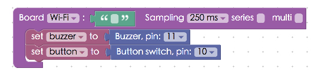
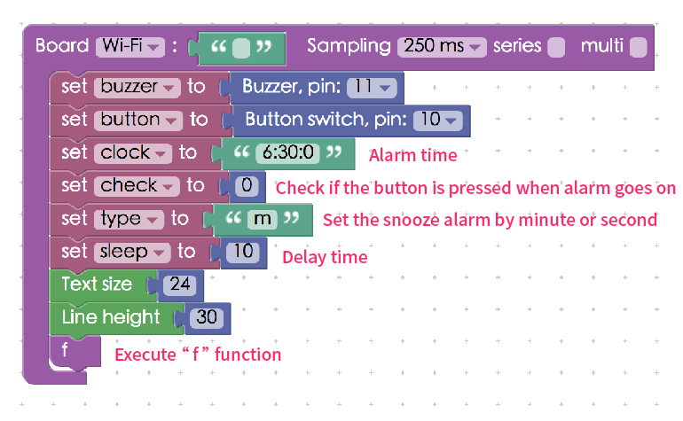
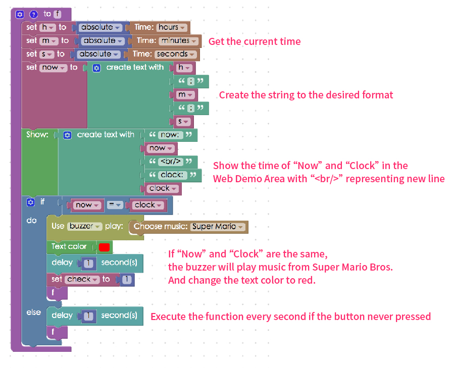

<!-- @@master  = ../../_layout.html-->

<!-- @@block  =  meta-->

<title>Project Example 33: Talking Alarm Clock (With Snooze Button and Buzzer) :::: Webduino = Web × Arduino</title>

<meta name="description" content="In project examples 9 & 13, we learned how to interact with a button switch and how to use a buzzer to create interesting projects. In this example, we will be joining the two together to create an alarm clock with a snooze button. When you press the button switch your computer will tell you the time and the buzzer will sound after a few minutes to make sure you’re awake!">

<meta itemprop="description" content="In project examples 9 & 13, we learned how to interact with a button switch and how to use a buzzer to create interesting projects. In this example, we will be joining the two together to create an alarm clock with a snooze button. When you press the button switch your computer will tell you the time and the buzzer will sound after a few minutes to make sure you’re awake!">

<meta property="og:description" content="In project examples 9 & 13, we learned how to interact with a button switch and how to use a buzzer to create interesting projects. In this example, we will be joining the two together to create an alarm clock with a snooze button. When you press the button switch your computer will tell you the time and the buzzer will sound after a few minutes to make sure you’re awake!">

<meta property="og:title" content="Project Example 33: Talking Alarm Clock (With Snooze Button and Buzzer)" >

<meta property="og:url" content="https://webduino.io/tutorials/tutorial-33-clock.html">

<meta property="og:image" content="https://webduino.io/img/tutorials/tutorial-33-01s.jpg">

<meta itemprop="image" content="https://webduino.io/img/tutorials/tutorial-33-01s.jpg">

<include src="../_include-tutorials.html"></include>

<!-- @@close-->

<!-- @@block  =  preAndNext-->

<include src="../_include-tutorials-content.html"></include>

<!-- @@close-->

<!-- @@block  =  tutorials-->

# Project Example 33: Talking Alarm Clock (With Snooze Button and Buzzer)

In "[project examples 9](tutorial-09-button-led.html)" and "[project examples 13](tutorial-13-buzzer.html)", we learned how to interact with a button switch and how to use a buzzer to create interesting projects. In this example, we will be joining the two together to create an alarm clock with a snooze button. When you press the button switch your computer will tell you the time and the buzzer will sound after a few minutes to make sure you're awake! 

<!-- 

	蜂鳴器、按鈕：<a href="https://webduino.io/buy/webduino-package-plus.html" target="_blank">Webduino 基本套件 Plus ( 支援馬克 1 號、Fly )</a>
	Webduino 開發板：<a href="https://webduino.io/buy/component-webduino-v1.html" target="_blank">Webduino 馬克一號</a>、<a href="https://webduino.io/buy/component-webduino-fly.html" target="_blank">Webduino Fly</a>、<a href="https://webduino.io/buy/component-webduino-uno-fly.html" target="_blank">Webduino Fly + Arduino UNO</a>

 -->

## Video Tutorial

Check the video tutorial here: 
<iframe class="youtube" src="https://www.youtube.com/embed/BEDgC5iAnCo" frameborder="0" allowfullscreen></iframe>

## Wiring and Practice

If you're using the Mark 1, which has only one GND available, we'll need a breadboard to connect the GNDs together. If you're using the Fly, then you can just plug the button switch and the buzzer into GND. Connect the button switch signal to 10 and the buzzer to 11.

Webduino Mark 1 Circuit diagram:

Webduino Fly Circuit diagram:

Reference image:

<!-- 

	蜂鳴器、按鈕：<a href="https://webduino.io/buy/webduino-package-plus.html" target="_blank">Webduino 基本套件 Plus ( 支援馬克 1 號、Fly )</a>
	Webduino 開發板：<a href="https://webduino.io/buy/component-webduino-v1.html" target="_blank">Webduino 馬克一號</a>、<a href="https://webduino.io/buy/component-webduino-fly.html" target="_blank">Webduino Fly</a>、<a href="https://webduino.io/buy/component-webduino-uno-fly.html" target="_blank">Webduino Fly + Arduino UNO</a>

 -->

## Instructions for using the Webduino Blockly

Open the [Webduino Blockly Editor](https://blockly.webduino.io/?lang=en), place a "Board" block onto the workspace, and fill in the name of your Webduino board. Then, from the "Buzzer" and "Button switch" menus under "Components" place "Set Buzzer to" and "Set Button to" blocks into the stack, set the buzzer to 11 and the button to 10.

Add four "Variable" blocks and set them to "Clock", "Check", "Type", and "Sleep". **Add a text block to "Clock" and "Type" set to the time you want the alarm to go off, and "M" for minutes. Add number blocks to "Check" and "Sleep". Set "Clock" to your alarm time and "Check" to 0 to see if the switch button has been pressed. Then set "Type" to the unit of delay time for the alarm and type number you wish to be the delay time in "Sleep" block.** To show the time on screen, use the "Text size" and "Line height" blocks to set the text size. Now the flow of the alarm clock is set. (Do take note, if the time is a single digit, do not add zeros in front e.g. type 1 and not 01, 0 and not 00)
You will have to set up this process by creating a "function" block, define this process as "f". 

Now check the content for the alarm process "f", first start with three variables: h, m, and s to stand for hours, minutes, and seconds. Then we concat them into a string of our desiring format and assign it to a variable "now". Next, check if "Now" and "Clock" are the same. If they are, the buzzer will play music from Super Mario Bros. and change the text color that appears to red.

We will also use the "Show" block to show the current and alarm time in the "Web Demo Area" (` ` starts a new line), and at the end of the process we use "Delay" to execute the process every second, so in the "Web Demo Area" we will see the time change one second at a time.

Within the "Board" stack place two more "When button is pressed, do" blocks under the "f" block. The stack in the first "Button" block makes it so when the button is "Pressed" the buzzer will stop and the word color is changed to black, and the snooze alarm is triggered. However, if it is "Long Pressed" then the alarm will turn off. (This is why "check = 1" is important. **Alarm only goes on when check equals 1**, so it prevents the snooze button from working when the alarm is off.)

Now set another process for snooze alarm, using three variables; h1, m,1 and s1 to represent hour, minute and, second. Use the "Speed Setting" block from the "Speech" menu under "Advanced" to read out the current time and trigger a new alarm. This is really a "snooze alarm", meaning that when the button switch is pressed a new alarm time is created, which will go off again.

The "newClock" flow has three conditions, this is because when time is calculated, no matter hours, minutes, or seconds, there is a chance of the numbers carrying. We have to make three conditions sequentially, so that seconds affect minutes and minutes affect hours. The order has to be seconds to minutes and minutes to hours. And lastly the new time needs to be calculated back to the variable "clock".

Now most of the hard work is finished, check if the board is online (click "[Check Device Status](https://webduino.io/device.html)") and click on the red execution button "Run Blocks". When the alarm goes off the buzzer will play music from "Super Mario", a voice will read the time, and the text color becomes red. If the button switch is "Pressed" during this time a new alarm time is produced and if it is "Long Pressed" the alarm will be disabled.
(Solution: [https://blockly.webduino.io/?lang=en#-KZ_mm_f3vO3CPk_VSdM](https://blockly.webduino.io/?lang=en#-KZ_mm_f3vO3CPk_VSdM))

<!-- 

	蜂鳴器、按鈕：<a href="https://webduino.io/buy/webduino-package-plus.html" target="_blank">Webduino 基本套件 Plus ( 支援馬克 1 號、Fly )</a>
	Webduino 開發板：<a href="https://webduino.io/buy/component-webduino-v1.html" target="_blank">Webduino 馬克一號</a>、<a href="https://webduino.io/buy/component-webduino-fly.html" target="_blank">Webduino Fly</a>、<a href="https://webduino.io/buy/component-webduino-uno-fly.html" target="_blank">Webduino Fly + Arduino UNO</a>

 -->

<!-- @@close-->