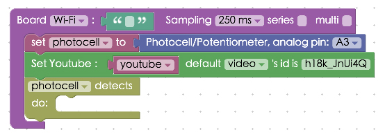
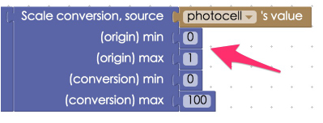

<!-- @@master  = ../../_layout.html-->

<!-- @@block  =  meta-->

<title>Project Example 35: Controlling YouTube volume with a Potentiometer :::: Webduino = Web × Arduino</title>

<meta name="description" content="In our last tutorial “Project Example 34: Changing image position with a Potentiometer” we showed you how to use a Potentiometer to move an image on your screen. In this tutorial, we will learn how to use a Potentiometer to control the volume of a YouTube video, in the same way that you would use the volume control on a physical stereo speaker.">

<meta itemprop="description" content="In our last tutorial “Project Example 34: Changing image position with a Potentiometer” we showed you how to use a Potentiometer to move an image on your screen. In this tutorial, we will learn how to use a Potentiometer to control the volume of a YouTube video, in the same way that you would use the volume control on a physical stereo speaker.">

<meta property="og:description" content="In our last tutorial “Project Example 34: Changing image position with a Potentiometer” we showed you how to use a Potentiometer to move an image on your screen. In this tutorial, we will learn how to use a Potentiometer to control the volume of a YouTube video, in the same way that you would use the volume control on a physical stereo speaker.">

<meta property="og:title" content="Project Example 35: Controlling YouTube volume with a Potentiometer" >

<meta property="og:url" content="https://webduino.io/tutorials/tutorial-35-vr-youtube.html">

<meta property="og:image" content="https://webduino.io/img/tutorials/tutorial-35-01s.jpg">

<meta itemprop="image" content="https://webduino.io/img/tutorials/tutorial-35-01s.jpg">

<include src="../_include-tutorials.html"></include>

<!-- @@close-->

<!-- @@block  =  preAndNext-->

<include src="../_include-tutorials-content.html"></include>

<!-- @@close-->

<!-- @@block  =  tutorials-->

# Project Example 35: Controlling YouTube volume with a Potentiometer

In our last tutorial "[Project Example 34: Changing image position with a Potentiometer](tutorial-34-vr-image.html)" we showed you how to use a Potentiometer to move an image on your screen. In this tutorial, we will learn how to use a Potentiometer to control the volume of a YouTube video, in the same way that you would use the volume control on a physical stereo speaker.

<!-- 

	可變電阻旋鈕：<a href="https://webduino.io/buy/webduino-expansion-m.html" target="_blank">Webduino 擴充套件 M ( 支援馬克 1 號、Fly )</a>
	Webduino 開發板：<a href="https://webduino.io/buy/component-webduino-v1.html" target="_blank">Webduino 馬克一號</a>、<a href="https://webduino.io/buy/component-webduino-fly.html" target="_blank">Webduino Fly</a>、<a href="https://webduino.io/buy/component-webduino-uno-fly.html" target="_blank">Webduino Fly + Arduino UNO</a>

 -->

## Video tutorial

Check the video tutorial here:
<iframe class="youtube" src="https://www.youtube.com/embed/hA0rx5uK_qw" frameborder="0" allowfullscreen></iframe>

## Wiring and Practice

A Potentiometer has three pins. The left pin should be connected to 3.3V and the right pin connected to GND. Remember to use a resistor in your GND connection to prevent a short circuit, which happens when you have very low resistance. For more information on this google Ohm's law. The middle pin is an analog signal pin，which should be connected to A3. If your 3.3V and GND are connected in reverse, the values produced will also be reversed when you turn the knob on the Potentiometer.

Webduino Mark 1 Circuit diagram:

Webduino Fly Circuit diagram:

Reference image:

<!-- 

	可變電阻旋鈕：<a href="https://webduino.io/buy/webduino-expansion-m.html" target="_blank">Webduino 擴充套件 M ( 支援馬克 1 號、Fly )</a>
	Webduino 開發板：<a href="https://webduino.io/buy/component-webduino-v1.html" target="_blank">Webduino 馬克一號</a>、<a href="https://webduino.io/buy/component-webduino-fly.html" target="_blank">Webduino Fly</a>、<a href="https://webduino.io/buy/component-webduino-uno-fly.html" target="_blank">Webduino Fly + Arduino UNO</a>

 -->

## Instructions for using the Webduino Blockly

Begin by opening the [Webduino Blockly](https://blockly.webduino.io/?lang=en), and placing a "Board" block inside the workspace. Select your Webduino board's name, place a "Photocell / Potentiometer" block in the stack, and set the pin to A3.

Place a "YouTube" block (located in the "Web Demo" menu) and a "detects / do" block (under the "photocell / potentiometer" menu) into the stack. Then fill in the YouTube ID number for the video you want to control.

To find the YouTube ID, go to the video page you want to use.  Everything after `v=` of the web address is the ID.

To detect the input of the sensor, we must add a "Set item to" block from under the "Variable" menu. (Since we will use this multiple times, it will reduce the work needed to be done by setting it once) Because the Potentiometer has a floating point number of 0 to 1, and YouTube has the volume integers of 0 to 100, we will need to round the numbers using the "round to decimal point" and "scale conversion" blocks found under the "Advanced" / "Math Conversion" menu.

At the very bottom of the stack add a "Console" block from under the "Advanced" menu along with a "Youtube volume" block. Connect "Variable" "Item" blocks to each of these and set them to "a".

Then we can use the console in Chrome's developer tools to receive values. To do this just right click on the webpage in Chrome and choose "Inspect", other browsers have similar tools.

Confirm the board is online, by clicking [Check Device Status](https://webduino.io/device.html). Open your Youtube video and click on the top right red button "Run Blocks" to execute the stack. Then try turning the Potentiometer knob and you'll see the volume change.

Solution: [http://blockly.webduino.io/?lang=en#-KYM6mGIrb1A4NStOp4R](http://blockly.webduino.io/?lang=en#-KYM6mGIrb1A4NStOp4R) 

If you'd like the volume to change in reverse (originally turning the volume up by turning the Potentiometer clock-wise but you’d like to turn the volume up by turning the Potentiometer counterclockwise), all you have to do is change the values in the "Scale conversion" block, change 0 to 1 and 1 to 0. Or if you prefer to play with hardware, you could change the 3.3V pin to GND and GND to 3.3V, the values should change as well.

##Code Explanation ([Check Webduino Bin](https://bin.webduino.io/qazu/edit?html,css,js,output), [Check Device Status](https://webduino.io/device.html))

Include `webduino-all.min.js` in the header of your html files in order to support all of the Webduino's components. If the codes are generated by Webduino Blockly, you also have to include `webduino-blockly.js` in your files.

	
	

We will place an YouTube video inside a div in the HTML file.

	

The image changes because we set the position for our image to "absolute" in our CSS file. 

	#demo-area-03-container {
	  position: relative;
	  width: 150px;
	  height: 150px;
	}

	#demo-area-03-image {
	  position: absolute;
	  top: 0;
	  left: 0;
	  width: 150px;
	  height: 150px;
	  transition: .3s;
	  -webkit-transition: .3s;
	  -moz-transition: .3s;
	  transform-origin: 75px 75px;
	  -webkit-transform-origin: 75px 75px;
	  -moz-transform-origin: 75px 75px;
	}

The main program starts by importing a YouTube module, then using the `on` from the Potentiometer to receive signals. The value will be returned to val, and we will use round and "Scale conversion" to acquire the correct values. When we send the values to YouTube volume, to prevent an error of setting the volume higher than 100, we have a function to limit the volume to 100.	

	var photocell;
	var youtube;
	var a;

	boardReady('', async function (board) {
	  board.systemReset();
	  board.samplingInterval = 250;
	  photocell = getPhotocell(board, 3);
	  await new Promise(function (resolve) {
	    var tag = document.createElement("script");
	    tag.src = "https://www.youtube.com/iframe_api";
	    var scptTag = document.getElementsByTagName("script")[0];
	    scptTag.parentNode.insertBefore(tag, scptTag);
	    window.onYouTubeIframeAPIReady = function () {
	      youtube = new YT.Player("player", {
	        height: "240",
	        width: "96%",
	        videoId: "h18K_JnUi4Q",
	        playerVars: {
	          autoplay: 1,
	          controls: 1
	        },
	        events: {
	          onReady: function (evt) {
	            resolve();
	          }
	        }
	      });
	    };
	  });
	  photocell.on(async function(val){
	    photocell.detectedVal = val;
	    a = Math.round(((photocell.detectedVal - (0)) * (1/((1)-(0)))) * ((100)-(0)) + (0));
	    console.log(a);
	    var varA = a;
	    if (varA >= 100) {
	      varA = 100;
	    }
	    youtube.setVolume(varA);
	  });
	});

Now, you can change the volume of any YouTube video with a Potentiometer! 
Webduino Bin: [https://bin.webduino.io/qazu/edit?html,css,js,output](https://bin.webduino.io/qazu/edit?html,css,js,output)  
Stack setup: [http://blockly.webduino.io/?lang=en#-KYM6xamvdA--Km37Li4](http://blockly.webduino.io/?lang=en#-KYM6xamvdA--Km37Li4)

<!-- 

	可變電阻旋鈕：<a href="https://webduino.io/buy/webduino-expansion-m.html" target="_blank">Webduino 擴充套件 M ( 支援馬克 1 號、Fly )</a>
	Webduino 開發板：<a href="https://webduino.io/buy/component-webduino-v1.html" target="_blank">Webduino 馬克一號</a>、<a href="https://webduino.io/buy/component-webduino-fly.html" target="_blank">Webduino Fly</a>、<a href="https://webduino.io/buy/component-webduino-uno-fly.html" target="_blank">Webduino Fly + Arduino UNO</a>

 -->

<!-- @@close-->